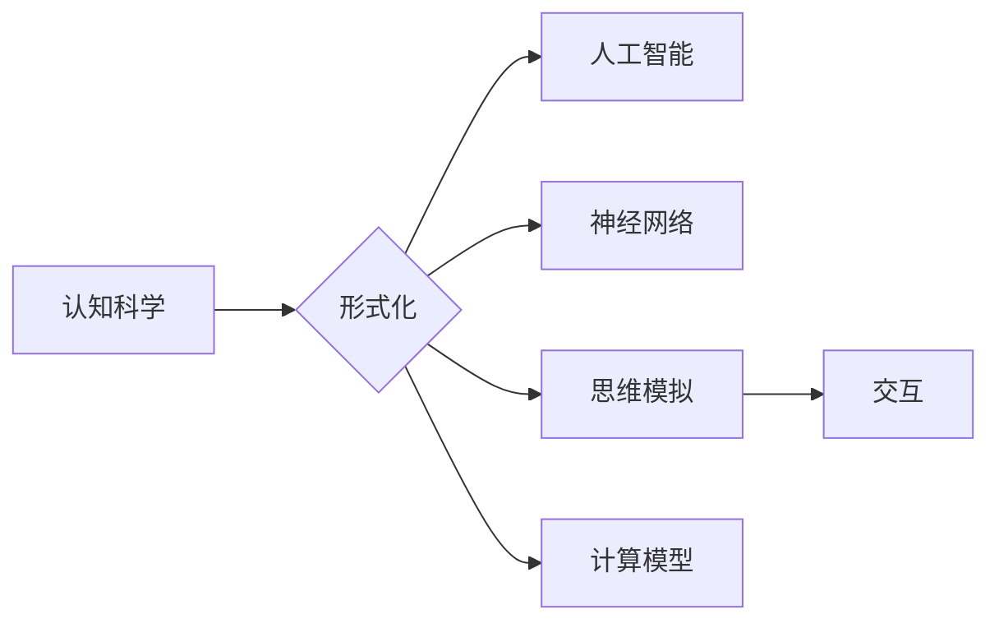

# 认知的形式化：时钟不停，与外界交互不息，思维和认知不止

> 关键词：认知科学，形式化，人工智能，神经网络，思维模拟，交互，计算模型

## 1. 背景介绍

人类认知是一个复杂而神秘的过程，它涉及到感知、记忆、思考、决策等多个方面。随着人工智能技术的飞速发展，将认知过程形式化，并构建能够模拟人类思维的计算机模型，成为了计算机科学和认知科学领域的前沿课题。本文旨在探讨认知的形式化，分析其核心概念与联系，并探讨相关算法原理、应用场景及未来发展趋势。

## 2. 核心概念与联系

### 2.1 认知科学

认知科学是一门跨学科的研究领域，旨在理解人类大脑如何进行思考、学习、感知和行动。它涉及到心理学、神经科学、语言学、哲学等多个学科，旨在揭示人类认知的本质。

### 2.2 形式化

形式化是一种将认知过程转化为数学模型或计算机程序的方法，以便于分析和计算。在认知科学中，形式化有助于理解认知过程的内在机制，并构建能够模拟人类思维的计算机模型。

### 2.3 人工智能

人工智能是计算机科学的一个分支，旨在创建能够模拟人类智能的机器。形式化认知科学的研究成果为人工智能领域提供了新的思路和方法。

### 2.4 神经网络

神经网络是一种模仿人脑神经元连接结构的计算模型，被广泛应用于图像识别、语音识别、自然语言处理等人工智能领域。

### 2.5 思维模拟

思维模拟是指使用计算机模型模拟人类思维过程的方法。通过思维模拟，我们可以更好地理解人类认知的机制，并开发出更智能的人工智能系统。

### 2.6 交互

交互是指认知主体与外部环境之间的相互作用。在认知科学中，交互是认知过程的重要组成部分。

### 2.7 计算模型

计算模型是指用于模拟认知过程的数学模型或计算机程序。计算模型是形式化认知科学的核心。

### 2.8 Mermaid 流程图

以下是一个简化的Mermaid流程图，展示了认知形式化的核心概念之间的联系：



## 3. 核心算法原理 & 具体操作步骤

### 3.1 算法原理概述

认知的形式化主要涉及到以下几个方面：

- **认知建模**：将认知过程转化为数学模型或计算机程序。
- **神经网络建模**：使用神经网络模拟人脑神经元连接结构。
- **交互建模**：模拟认知主体与外部环境之间的相互作用。
- **计算模型评估**：评估计算模型在模拟认知过程方面的性能。

### 3.2 算法步骤详解

1. **认知建模**：分析认知过程的各个方面，如感知、记忆、思考、决策等，并将其转化为数学模型或计算机程序。
2. **神经网络建模**：选择合适的神经网络架构，如卷积神经网络、循环神经网络等，并将其应用于认知建模。
3. **交互建模**：模拟认知主体与外部环境之间的信息交换过程。
4. **计算模型评估**：使用实验数据评估计算模型在模拟认知过程方面的性能，并根据评估结果调整模型参数。

### 3.3 算法优缺点

**优点**：

- **可解释性**：形式化认知模型可以提供对认知过程的深入理解。
- **可扩展性**：形式化认知模型可以方便地扩展到新的认知任务。
- **可验证性**：形式化认知模型可以接受实验数据的验证。

**缺点**：

- **复杂性**：认知过程非常复杂，形式化建模可能会非常困难。
- **计算开销**：形式化认知模型的计算开销可能非常大。
- **缺乏认知机制**：形式化认知模型可能无法完全模拟人类的所有认知机制。

### 3.4 算法应用领域

认知的形式化在以下领域有着广泛的应用：

- **人工智能**：构建能够模拟人类智能的计算机模型。
- **神经科学**：理解人脑的认知机制。
- **心理学**：研究人类认知过程。
- **教育**：开发智能教育系统。
- **人机交互**：设计更自然、更高效的交互界面。

## 4. 数学模型和公式 & 详细讲解 & 举例说明

### 4.1 数学模型构建

认知的形式化通常涉及到以下数学模型：

- **概率模型**：描述认知过程中不确定性。
- **统计模型**：描述认知过程中的统计规律。
- **图模型**：描述认知过程中的连接关系。

### 4.2 公式推导过程

以下是一个简化的例子，展示了如何使用概率模型描述认知过程：

$$
P(A|B) = \frac{P(B|A)P(A)}{P(B)}
$$

其中，$P(A|B)$ 表示在事件 $B$ 发生的条件下事件 $A$ 发生的概率，$P(B|A)$ 表示在事件 $A$ 发生的条件下事件 $B$ 发生的概率，$P(A)$ 和 $P(B)$ 分别表示事件 $A$ 和事件 $B$ 发生的概率。

### 4.3 案例分析与讲解

以下是一个使用神经网络模拟人脑视觉感知过程的例子：

- **输入**：图像数据
- **神经网络**：卷积神经网络
- **输出**：图像中的物体类别

在这个例子中，卷积神经网络通过学习图像数据中的特征，能够识别图像中的物体类别。

## 5. 项目实践：代码实例和详细解释说明

### 5.1 开发环境搭建

为了进行认知的形式化研究，我们需要搭建以下开发环境：

- **编程语言**：Python
- **深度学习框架**：TensorFlow或PyTorch
- **其他库**：NumPy、Pandas、Matplotlib等

### 5.2 源代码详细实现

以下是一个使用PyTorch构建简单神经网络模型的例子：

```python
import torch
import torch.nn as nn

class SimpleNN(nn.Module):
    def __init__(self):
        super(SimpleNN, self).__init__()
        self.fc1 = nn.Linear(784, 128)
        self.fc2 = nn.Linear(128, 10)

    def forward(self, x):
        x = torch.relu(self.fc1(x))
        x = self.fc2(x)
        return x

model = SimpleNN()
```

### 5.3 代码解读与分析

在这个例子中，我们定义了一个简单的神经网络模型，它包含两个全连接层。输入层接收784个输入（一个28x28像素的图像），第一个全连接层有128个神经元，使用ReLU激活函数，第二个全连接层有10个神经元，表示10个类别（例如，数字0到9）。

### 5.4 运行结果展示

为了展示模型的性能，我们可以使用交叉熵损失函数和Adam优化器进行训练，并使用测试集评估模型的准确率。

```python
criterion = nn.CrossEntropyLoss()
optimizer = torch.optim.Adam(model.parameters(), lr=0.001)

# 训练过程...
```

## 6. 实际应用场景

认知的形式化在以下实际应用场景中具有重要作用：

- **智能医疗**：使用认知模型辅助医生进行诊断和治疗。
- **智能教育**：开发个性化学习系统，根据学生的学习进度和风格提供定制化的教学内容。
- **人机交互**：设计更自然、更直观的用户界面。

## 7. 工具和资源推荐

### 7.1 学习资源推荐

- **《认知心理学与认知神经科学》**：探讨人类认知过程的各个方面。
- **《神经网络与深度学习》**：介绍神经网络和深度学习的基本概念和技术。
- **《认知计算》**：探讨认知计算的理论和应用。

### 7.2 开发工具推荐

- **TensorFlow**：一个开源的深度学习框架。
- **PyTorch**：一个开源的深度学习框架。
- **Scikit-learn**：一个开源的机器学习库。

### 7.3 相关论文推荐

- **“Deep Learning in Human-Level Vision: A Review”**：介绍深度学习在视觉领域的应用。
- **“Neural Networks for Pattern Recognition”**：介绍神经网络的基本概念和应用。
- **“A Modern History of Deep Learning”**：介绍深度学习的发展历程。

## 8. 总结：未来发展趋势与挑战

### 8.1 研究成果总结

认知的形式化是认知科学和人工智能领域的前沿课题，它为理解人类认知机制和构建智能系统提供了新的思路和方法。

### 8.2 未来发展趋势

- **跨学科研究**：认知形式化将与其他学科（如神经科学、心理学）进行更深入的交叉研究。
- **更强大的模型**：开发更强大的认知模型，以更好地模拟人类认知。
- **更高效的方法**：开发更高效的形式化方法，以降低计算开销。

### 8.3 面临的挑战

- **认知复杂度**：认知过程的复杂度给形式化建模带来了挑战。
- **计算资源**：形式化建模需要大量的计算资源。
- **理论框架**：需要建立更完善的认知科学理论框架。

### 8.4 研究展望

认知的形式化研究将不断推动人工智能和认知科学的发展，为构建更智能、更自然的人工智能系统奠定基础。

## 9. 附录：常见问题与解答

**Q1：什么是认知的形式化？**

A：认知的形式化是将认知过程转化为数学模型或计算机程序的方法，以便于分析和计算。

**Q2：认知的形式化有什么作用？**

A：认知的形式化有助于理解人类认知的机制，并构建能够模拟人类思维的计算机模型。

**Q3：认知的形式化有哪些应用？**

A：认知的形式化在人工智能、神经科学、心理学、教育、人机交互等领域有着广泛的应用。

**Q4：如何进行认知的形式化建模？**

A：进行认知的形式化建模需要分析认知过程的各个方面，并将其转化为数学模型或计算机程序。

**Q5：认知的形式化有哪些挑战？**

A：认知过程的复杂度、计算资源的需求以及理论框架的建立是认知的形式化面临的挑战。

作者：禅与计算机程序设计艺术 / Zen and the Art of Computer Programming