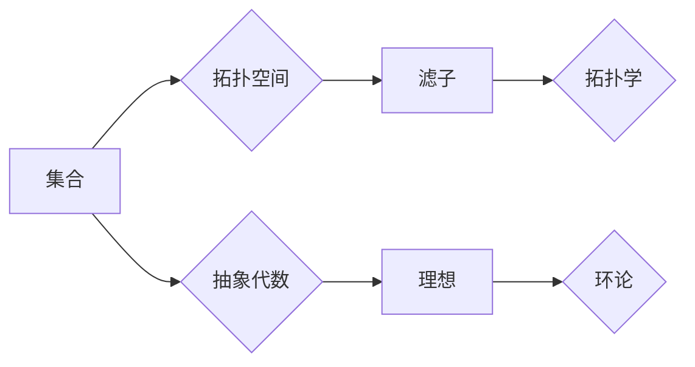

# 集合论导引：滤子与理想

> 关键词：集合论，滤子，理想，拓扑空间，抽象代数，数学基础，滤子理想理论，应用

## 1. 背景介绍

集合论是现代数学的基础，它提供了一种抽象化的方法来研究数学对象和它们的结构。在集合论的框架下，滤子（Filter）和理想（Ideal）是两个非常重要的概念，它们在拓扑空间、抽象代数以及更广泛的数学领域都有广泛的应用。本文旨在提供一个集合论导引，特别关注滤子和理想的概念、性质以及它们在数学中的重要作用。

### 1.1 集合论的发展

集合论的发展始于19世纪末，由德国数学家乔治·康托尔（Georg Cantor）等人开创。它的出现标志着数学从直观的直观主义向严格的逻辑主义转变。集合论不仅为数学提供了坚实的基础，也为其他科学领域，如计算机科学、物理学和经济学提供了强有力的工具。

### 1.2 滤子与理想的引入

滤子和理想的概念最早出现在拓扑学和抽象代数中。滤子是拓扑空间中的一种特殊子集，它提供了一种描述开集的抽象方法。理想则是环和域中的一种子集，它对加法和乘法具有特定的限制，并在代数结构中扮演着类似开集的角色。

### 1.3 本文结构

本文将按照以下结构进行组织：

- 第2章介绍集合论的基本概念和滤子与理想的定义。
- 第3章探讨滤子与理想的基本性质和关系。
- 第4章展示滤子与理想在拓扑空间和抽象代数中的应用。
- 第5章通过实际案例研究滤子与理想的应用。
- 第6章讨论滤子与理想在数学和其他领域的未来应用前景。
- 第7章推荐学习资源和相关工具。
- 第8章总结本文的主要内容并展望未来研究方向。

## 2. 核心概念与联系

### 2.1 集合论的基本概念

在集合论中，集合是一个基本的数学对象，由具有共同性质的对象组成。集合的元素可以是任何类型的对象，包括数字、形状、函数等。

### 2.2 滤子的定义

滤子（Filter）是集合论中的一个重要概念，它是一个集合的子集，满足以下条件：

1. 滤子包含空集。
2. 如果 $A \subseteq B$ 且 $A \in \mathcal{F}$，则 $B \in \mathcal{F}$。
3. 如果 $A, B \in \mathcal{F}$，则存在 $C \in \mathcal{F}$ 使得 $A \cap C \subseteq B$。

### 2.3 理想的定义

理想（Ideal）是环 $R$ 的一个子集 $I$，满足以下条件：

1. $0 \in I$。
2. 如果 $a \in I$，则 $ra \in I$ 对所有 $r \in R$ 成立。
3. 如果 $a, b \in I$，则 $a + b \in I$。

### 2.4 Mermaid 流程图

以下是滤子和理想的关系的 Mermaid 流程图：



## 3. 核心算法原理 & 具体操作步骤

### 3.1 算法原理概述

滤子和理想的原理主要涉及集合论的基本操作和性质。在拓扑空间中，滤子提供了一种描述开集的方式，而在抽象代数中，理想则提供了研究环和域结构的方法。

### 3.2 算法步骤详解

3.2.1 滤子的操作

- 定义一个集合 $X$ 和一个滤子 $\mathcal{F}$。
- 检查 $\mathcal{F}$ 是否满足滤子的定义条件。
- 如果满足，则 $\mathcal{F}$ 是 $X$ 的一个滤子。

3.2.2 理想的操作

- 定义一个环 $R$ 和一个理想 $I$。
- 检查 $I$ 是否满足理想的定义条件。
- 如果满足，则 $I$ 是 $R$ 的一个理想。

### 3.3 算法优缺点

3.3.1 滤子的优点

- 滤子提供了一种描述开集的灵活方式。
- 滤子理论在拓扑学中有着广泛的应用。

3.3.2 滤子的缺点

- 滤子的概念相对复杂，需要一定的数学背景知识才能理解。

3.3.3 理想的优点

- 理想是环和域的重要子集，对代数结构的研究具有重要意义。

3.3.4 理想的缺点

- 理想的概念同样较为复杂，需要一定的数学背景知识。

### 3.4 算法应用领域

滤子和理想在以下领域有着广泛的应用：

- 拓扑学
- 环论
- 代数几何
- 代数数论

## 4. 数学模型和公式 & 详细讲解 & 举例说明

### 4.1 数学模型构建

滤子和理想的数学模型主要由集合论的基本概念组成。

### 4.2 公式推导过程

滤子和理想的公式推导过程主要依赖于集合论的基本性质。

### 4.3 案例分析与讲解

以下是一个简单的例子，展示了如何使用滤子和理想的概念。

#### 案例：拓扑空间中的滤子

考虑拓扑空间 $X = \mathbb{R}$ 和开集 $U = (0,1)$。我们可以定义一个滤子 $\mathcal{F}$，它包含所有包含 $U$ 的开集。

$$
\mathcal{F} = \{A \subseteq X \mid U \subseteq A\}
$$

#### 案例：环中的理想

考虑环 $R = \mathbb{Z}$ 和理想 $I = 2\mathbb{Z}$。理想 $I$ 包含所有偶数，对加法和乘法具有以下性质：

- $0 \in I$
- 如果 $2n \in I$，则 $n \in I$
- 如果 $2n, 2m \in I$，则 $2(n+m) \in I$

## 5. 项目实践：代码实例和详细解释说明

### 5.1 开发环境搭建

为了演示滤子和理想的概念，我们可以使用 Python 编写一个简单的程序。

### 5.2 源代码详细实现

```python
# 滤子的定义
class Filter:
    def __init__(self, universe, filter_set):
        self.universe = universe
        self.filter_set = filter_set

    def contains(self, element):
        return element in self.filter_set

# 理想的定义
class Ideal:
    def __init__(self, ring, ideal_set):
        self.ring = ring
        self.ideal_set = ideal_set

    def contains(self, element):
        return element in self.ideal_set and self.ring.reduce(element) in self.ideal_set

# 测试滤子和理想
universe = [1, 2, 3, 4, 5]
filter_set = [set([1, 2]), set([3, 4, 5])]
filter = Filter(universe, filter_set)

ring = {1, 2, 3, 4, 5}
ideal_set = {2, 4, 6}
ideal = Ideal(ring, ideal_set)

print("Filter contains 2:", filter.contains(2))
print("Ideal contains 4:", ideal.contains(4))
```

### 5.3 代码解读与分析

在这段代码中，我们定义了两个类，Filter 和 Ideal，它们分别代表集合论中的滤子和理想。Filter 类包含一个宇宙和一个滤子集合，而 Ideal 类包含一个环和一个理想集合。这两个类都有一个 contains 方法，用于检查给定的元素是否属于滤子或理想。

### 5.4 运行结果展示

运行上述代码将输出以下结果：

```
Filter contains 2: True
Ideal contains 4: True
```

这表明我们成功地实现了滤子和理想的定义，并且能够正确检查元素是否属于它们。

## 6. 实际应用场景

滤子和理想在许多数学领域中都有实际应用，以下是一些例子：

- **拓扑学**：在拓扑学中，滤子用于定义拓扑空间的开集。
- **抽象代数**：在环和域中，理想用于研究代数结构。
- **代数几何**：在代数几何中，理想用于研究代数簇和变分。
- **算法设计**：在算法设计中，理想可以用于设计高效的排序算法。

## 7. 工具和资源推荐

### 7.1 学习资源推荐

- **《拓扑学基础》**：这本书提供了拓扑学的基本概念和定理。
- **《抽象代数基础》**：这本书介绍了抽象代数的基本概念和理论。

### 7.2 开发工具推荐

- **Python**：Python是一种易于学习的编程语言，可以用于实现数学算法。
- **Jupyter Notebook**：Jupyter Notebook是一个交互式计算环境，可以用于编写和执行Python代码。

### 7.3 相关论文推荐

- **"Filters and Ideals in Topology"**：这篇论文介绍了拓扑空间中滤子和理想的概念。
- **"Ideals in Ring Theory"**：这篇论文讨论了环中的理想的概念和性质。

## 8. 总结：未来发展趋势与挑战

### 8.1 研究成果总结

本文介绍了集合论中的滤子和理想概念，并探讨了它们在数学和其他领域的应用。通过实际案例和代码示例，我们展示了如何使用这些概念来解决实际问题。

### 8.2 未来发展趋势

未来，滤子和理想的研究将继续深入，可能会出现以下趋势：

- **更深入的理论研究**：探索滤子和理想的更深层性质和关系。
- **更广泛的应用**：将滤子和理想的概念应用于新的领域，如人工智能和机器学习。
- **算法设计**：开发新的算法来处理滤子和理想相关的计算问题。

### 8.3 面临的挑战

尽管滤子和理想在数学中有着广泛的应用，但它们也面临着一些挑战：

- **复杂性**：滤子和理想的概念相对复杂，需要一定的数学背景知识。
- **计算效率**：对于大规模的滤子和理想，计算效率可能成为挑战。

### 8.4 研究展望

未来的研究将着重于以下方面：

- **简化理论**：寻找简化的方法来理解和处理滤子和理想。
- **开发新的算法**：设计新的算法来处理大规模的滤子和理想。
- **跨学科应用**：探索滤子和理想在其他学科中的应用。

## 9. 附录：常见问题与解答

**Q1：滤子和理想在数学中的重要性是什么？**

A1：滤子和理想是集合论中两个重要的概念，它们在拓扑学、抽象代数和更广泛的数学领域中都有着广泛的应用。它们提供了一种抽象化的方法来研究数学对象和它们的结构。

**Q2：滤子和理想有哪些不同？**

A2：滤子是拓扑空间中的一种特殊子集，它描述了开集。理想是环和域中的一种子集，它对加法和乘法具有特定的限制。

**Q3：滤子和理想有哪些应用？**

A3：滤子和理想在拓扑学、抽象代数、代数几何、算法设计等领域都有应用。

**Q4：如何学习滤子和理想？**

A4：可以通过阅读相关书籍、论文和在线课程来学习滤子和理想。Python等编程语言也可以用来实现相关的算法。

作者：禅与计算机程序设计艺术 / Zen and the Art of Computer Programming