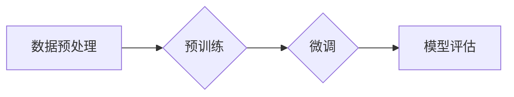

> 预训练，微调，迁移学习，深度学习，神经网络，自然语言处理，计算机视觉

# 预训练与微调：提升AI模型性能

在人工智能领域，预训练和微调是两个极为重要的概念。它们是深度学习模型性能提升的关键因素，尤其在自然语言处理和计算机视觉等应用中发挥着至关重要的作用。本文将深入探讨预训练与微调的原理、技术、实践和未来趋势，帮助读者全面理解这两个概念，并掌握如何将它们应用于实际项目中。

## 1. 背景介绍

### 1.1 预训练的兴起

随着深度学习技术的快速发展，传统的有监督学习在数据处理、特征工程等方面面临着巨大的挑战。为了解决这个问题，研究者们提出了预训练的概念。预训练是指在大规模无标签数据上训练模型，使其学习到通用的特征表示。这种方法可以显著提高模型在下游任务上的性能。

### 1.2 微调的必要性

尽管预训练模型在无标签数据上表现出色，但它们在特定任务上的表现往往有限。为了解决这一问题，研究者们提出了微调的概念。微调是指在预训练模型的基础上，使用少量有标签数据进行进一步训练，以适应特定任务的需求。

## 2. 核心概念与联系

### 2.1 预训练

预训练是指在大规模无标签数据上训练模型，使其学习到通用的特征表示。这种表示可以用于各种下游任务，如文本分类、情感分析、机器翻译等。

### 2.2 微调

微调是指在预训练模型的基础上，使用少量有标签数据进行进一步训练，以适应特定任务的需求。微调通常只需要调整模型的一小部分参数，从而避免了从头开始训练的巨大计算成本。

### 2.3 Mermaid 流程图

以下是一个描述预训练和微调流程的 Mermaid 流程图：



### 2.4 预训练与微调的联系

预训练和微调是相辅相成的两个过程。预训练为微调提供了强大的特征表示，而微调则使预训练模型能够适应特定任务的需求。

## 3. 核心算法原理 & 具体操作步骤

### 3.1 算法原理概述

预训练和微调的原理基于迁移学习。迁移学习是指将一个领域学习到的知识迁移到另一个领域。在预训练和微调中，预训练模型在无标签数据上学习到的通用特征表示可以被迁移到特定任务上，从而提高模型的性能。

### 3.2 算法步骤详解

#### 3.2.1 预训练步骤

1. 选择一个合适的预训练模型。
2. 收集大规模无标签数据。
3. 使用无标签数据进行预训练，学习通用特征表示。

#### 3.2.2 微调步骤

1. 选择一个预训练模型。
2. 收集少量有标签数据。
3. 在有标签数据上对预训练模型进行微调。
4. 使用微调后的模型进行模型评估。

### 3.3 算法优缺点

#### 3.3.1 优点

1. 提高模型在下游任务上的性能。
2. 降低对标注数据的依赖。
3. 缩短训练时间。

#### 3.3.2 缺点

1. 预训练模型可能包含噪声和偏差。
2. 微调过程中可能存在过拟合风险。

### 3.4 算法应用领域

预训练和微调在以下领域得到广泛应用：

1. 自然语言处理
2. 计算机视觉
3. 语音识别
4. 机器翻译

## 4. 数学模型和公式 & 详细讲解 & 举例说明

### 4.1 数学模型构建

预训练和微调的数学模型通常基于深度学习框架，如 TensorFlow 或 PyTorch。

### 4.2 公式推导过程

以下是一个简单的预训练和微调的数学模型示例：

$$
\theta_{pre} = \mathop{\arg\min}_{\theta} \sum_{i=1}^{N} L(y_i, M(x_i; \theta_{pre}))
$$

$$
\theta_{finetune} = \mathop{\arg\min}_{\theta} \sum_{i=1}^{N} L(y_i, M(x_i; \theta_{pre}, \theta_{finetune}))
$$

其中，$\theta_{pre}$ 是预训练模型的参数，$\theta_{finetune}$ 是微调模型的参数，$L$ 是损失函数，$y_i$ 是标签，$x_i$ 是输入数据。

### 4.3 案例分析与讲解

以自然语言处理中的文本分类任务为例，我们可以使用预训练的 BERT 模型进行微调。

```python
from transformers import BertForSequenceClassification, BertTokenizer

# 加载预训练模型和分词器
model = BertForSequenceClassification.from_pretrained('bert-base-uncased')
tokenizer = BertTokenizer.from_pretrained('bert-base-uncased')

# 加载数据
train_texts = [...]
train_labels = [...]

# 编码数据
train_encodings = tokenizer(train_texts, truncation=True, padding=True)

# 训练模型
model.train()
for epoch in range(num_epochs):
    for batch in range(len(train_encodings) // batch_size):
        input_ids = train_encodings['input_ids'][batch * batch_size: (batch + 1) * batch_size]
        attention_mask = train_encodings['attention_mask'][batch * batch_size: (batch + 1) * batch_size]
        labels = train_labels[batch * batch_size: (batch + 1) * batch_size]
        outputs = model(input_ids, attention_mask=attention_mask, labels=labels)
        loss = outputs.loss
        loss.backward()
        optimizer.step()
        optimizer.zero_grad()
```

## 5. 项目实践：代码实例和详细解释说明

### 5.1 开发环境搭建

为了进行预训练和微调的实践，我们需要以下开发环境：

1. Python 3.7+
2. TensorFlow 或 PyTorch
3. transformers 库

### 5.2 源代码详细实现

以下是一个使用 PyTorch 进行预训练和微调的代码示例：

```python
import torch
from transformers import BertForSequenceClassification, BertTokenizer

# 加载预训练模型和分词器
model = BertForSequenceClassification.from_pretrained('bert-base-uncased')
tokenizer = BertTokenizer.from_pretrained('bert-base-uncased')

# 加载数据
train_texts = [...]
train_labels = [...]

# 编码数据
train_encodings = tokenizer(train_texts, truncation=True, padding=True)

# 训练模型
model.train()
for epoch in range(num_epochs):
    for batch in range(len(train_encodings) // batch_size):
        input_ids = train_encodings['input_ids'][batch * batch_size: (batch + 1) * batch_size]
        attention_mask = train_encodings['attention_mask'][batch * batch_size: (batch + 1) * batch_size]
        labels = train_labels[batch * batch_size: (batch + 1) * batch_size]
        outputs = model(input_ids, attention_mask=attention_mask, labels=labels)
        loss = outputs.loss
        loss.backward()
        optimizer.step()
        optimizer.zero_grad()
```

### 5.3 代码解读与分析

这段代码首先加载了预训练的 BERT 模型和分词器。然后，它加载数据并对数据进行编码。接下来，它使用训练循环对模型进行训练。在每个训练步骤中，它都会计算损失、反向传播梯度和更新模型参数。

### 5.4 运行结果展示

在完成训练后，我们可以使用测试集来评估模型的性能。以下是一个评估模型性能的示例：

```python
import torch
from transformers import BertForSequenceClassification, BertTokenizer

# 加载预训练模型和分词器
model = BertForSequenceClassification.from_pretrained('bert-base-uncased')
tokenizer = BertTokenizer.from_pretrained('bert-base-uncased')

# 加载数据
test_texts = [...]
test_labels = [...]

# 编码数据
test_encodings = tokenizer(test_texts, truncation=True, padding=True)

# 评估模型
model.eval()
correct = 0
total = 0
with torch.no_grad():
    for batch in range(len(test_encodings) // batch_size):
        input_ids = test_encodings['input_ids'][batch * batch_size: (batch + 1) * batch_size]
        attention_mask = test_encodings['attention_mask'][batch * batch_size: (batch + 1) * batch_size]
        labels = test_labels[batch * batch_size: (batch + 1) * batch_size]
        outputs = model(input_ids, attention_mask=attention_mask, labels=labels)
        _, predicted = torch.max(outputs.logits, 1)
        total += labels.size(0)
        correct += (predicted == labels).sum().item()

print(f'Accuracy of the model on the test images: {100 * correct / total}%')
```

这段代码首先加载了预训练的 BERT 模型和分词器。然后，它加载数据并对数据进行编码。接下来，它使用评估循环来评估模型的性能。在每个评估步骤中，它都会计算预测结果和标签之间的准确率。

## 6. 实际应用场景

预训练和微调在以下实际应用场景中发挥着重要作用：

### 6.1 自然语言处理

- 文本分类
- 情感分析
- 机器翻译
- 问答系统

### 6.2 计算机视觉

- 图像分类
- 目标检测
- 图像分割
- 语义分割

### 6.3 语音识别

- 语音识别
- 语音合成
- 语音翻译

### 6.4 语音合成

- 语音合成
- 语音转换
- 语音增强

## 7. 工具和资源推荐

### 7.1 学习资源推荐

- 《深度学习》
- 《Python深度学习》
- 《自然语言处理综论》
- 《计算机视觉基础》

### 7.2 开发工具推荐

- TensorFlow
- PyTorch
- Hugging Face Transformers
- OpenCV

### 7.3 相关论文推荐

- BERT: Pre-training of Deep Bidirectional Transformers for Language Understanding
- Vision Transformer
- Deep Learning for Natural Language Understanding
- Deep Learning for Computer Vision

## 8. 总结：未来发展趋势与挑战

### 8.1 研究成果总结

预训练和微调是深度学习模型性能提升的关键因素。通过在大规模无标签数据上预训练模型，并使用少量有标签数据进行微调，我们可以显著提高模型在下游任务上的性能。

### 8.2 未来发展趋势

未来，预训练和微调技术将朝着以下方向发展：

- 模型规模将越来越大
- 训练效率将越来越高
- 应用领域将更加广泛

### 8.3 面临的挑战

预训练和微调技术也面临着以下挑战：

- 计算资源需求量大
- 标注数据成本高
- 模型可解释性不足

### 8.4 研究展望

未来，预训练和微调技术的研究将聚焦于以下方面：

- 降低计算资源需求
- 降低标注数据成本
- 提高模型可解释性
- 提高模型鲁棒性

## 9. 附录：常见问题与解答

**Q1：预训练和微调的区别是什么？**

A：预训练是指在无标签数据上训练模型，微调是指在预训练模型的基础上，使用少量有标签数据进行进一步训练。

**Q2：预训练和微调的应用场景有哪些？**

A：预训练和微调可以应用于各种深度学习任务，如自然语言处理、计算机视觉、语音识别等。

**Q3：预训练和微调的主要挑战是什么？**

A：预训练和微调的主要挑战包括计算资源需求量大、标注数据成本高、模型可解释性不足等。

**Q4：如何选择合适的预训练模型？**

A：选择合适的预训练模型需要考虑任务类型、数据集大小、计算资源等因素。

**Q5：如何进行微调？**

A：进行微调需要选择预训练模型、准备有标签数据、选择合适的优化器等。

作者：禅与计算机程序设计艺术 / Zen and the Art of Computer Programming