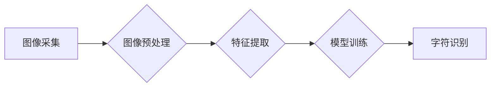

# 基于OpenCV的手写字识别系统详细设计与具体代码实现

> 关键词：手写字识别，OpenCV，机器学习，深度学习，特征提取，图像预处理，模型训练，字符识别

## 1. 背景介绍

手写字识别（Handwriting Recognition）是模式识别和人工智能领域的一个重要研究方向。随着智能手机和电子设备的普及，手写字识别技术得到了广泛应用，如电子签名、手写笔记识别、手写邮件识别等。OpenCV（Open Source Computer Vision Library）是一个开源的计算机视觉库，它提供了丰富的图像处理和机器学习算法，非常适合用于手写字识别系统的开发。

本文将详细介绍基于OpenCV的手写字识别系统的设计与具体代码实现，包括图像预处理、特征提取、模型训练和字符识别等环节。

## 2. 核心概念与联系

### 2.1 核心概念

#### 手写字识别
手写字识别是指将手写的文字转换为计算机可以处理的数字或文本格式的过程。它通常包括以下几个步骤：

1. 图像采集：通过摄像头或扫描仪获取手写字符图像。
2. 图像预处理：对图像进行一系列处理，以提高识别精度和减少噪声。
3. 特征提取：从预处理后的图像中提取有助于识别的特征。
4. 模型训练：使用提取的特征训练分类器。
5. 字符识别：使用训练好的分类器对新的手写字符进行识别。

#### OpenCV
OpenCV是一个跨平台的计算机视觉库，提供了丰富的图像处理和机器学习算法。它支持多种编程语言，包括C++、Python、Java等。

### 2.2 架构流程图

以下是基于OpenCV的手写字识别系统的Mermaid流程图：



## 3. 核心算法原理 & 具体操作步骤

### 3.1 算法原理概述

手写字识别系统通常采用以下步骤：

1. **图像采集**：使用摄像头或扫描仪获取手写字符图像。
2. **图像预处理**：对图像进行二值化、去噪、倾斜校正等处理。
3. **特征提取**：从预处理后的图像中提取有助于识别的特征，如HOG（Histogram of Oriented Gradients）特征、SIFT（Scale-Invariant Feature Transform）特征等。
4. **模型训练**：使用提取的特征和标签数据训练分类器，如SVM（Support Vector Machine）、神经网络等。
5. **字符识别**：使用训练好的分类器对新图像进行识别。

### 3.2 算法步骤详解

1. **图像采集**：使用OpenCV库中的`cv2.VideoCapture`或`cv2.VideoCapture`函数从摄像头或视频文件中捕获图像。

2. **图像预处理**：使用OpenCV库中的函数对图像进行预处理，如`cv2.threshold`进行二值化，`cv2.GaussianBlur`进行去噪，`cv2.HoughLinesP`进行倾斜校正等。

3. **特征提取**：使用OpenCV库中的`cv2.HOGDescriptor`类提取HOG特征，或使用其他特征提取方法如SIFT、ORB等。

4. **模型训练**：使用机器学习库（如scikit-learn）或深度学习框架（如TensorFlow、PyTorch）进行模型训练。

5. **字符识别**：使用训练好的模型对新图像进行识别。

### 3.3 算法优缺点

#### 优点

- **开源和跨平台**：OpenCV是开源的，可以在多种操作系统和平台上使用。
- **功能强大**：OpenCV提供了丰富的图像处理和机器学习算法，可以满足手写字识别的需求。
- **易于使用**：OpenCV的API设计简洁，易于理解和使用。

#### 缺点

- **性能**：OpenCV的性能可能不如专门为深度学习设计的框架。
- **社区支持**：相比于专门深度学习框架，OpenCV的社区支持可能较少。

### 3.4 算法应用领域

手写字识别系统可以应用于以下领域：

- **电子签名**：实现电子签名验证和识别。
- **手写笔记识别**：将手写笔记转换为可编辑的文本格式。
- **手写邮件识别**：实现手写邮件的自动分类和回复。
- **教育领域**：用于手写板上的字符识别。

## 4. 数学模型和公式 & 详细讲解 & 举例说明

### 4.1 数学模型构建

手写字识别的数学模型通常是基于特征提取和分类器的。以下是一个简化的数学模型：

$$
\hat{y} = f(W \cdot \phi(x) + b)
$$

其中，$x$是输入特征，$\phi(x)$是特征提取函数，$W$是分类器的权重，$b$是偏置项，$\hat{y}$是预测的类别。

### 4.2 公式推导过程

特征提取和分类器的具体推导过程取决于所使用的算法。

### 4.3 案例分析与讲解

以HOG特征为例，HOG特征是通过计算图像中局部区域的梯度方向直方图来提取特征的。具体步骤如下：

1. 将图像划分为多个局部区域。
2. 计算每个区域的梯度方向和幅度。
3. 将梯度方向和幅度转换为直方图。
4. 将所有直方图拼接成一个特征向量。

## 5. 项目实践：代码实例和详细解释说明

### 5.1 开发环境搭建

1. 安装OpenCV库：`pip install opencv-python`
2. 安装其他必要的库：`pip install scikit-learn numpy`

### 5.2 源代码详细实现

以下是一个基于OpenCV的手写字识别系统的简单示例：

```python
import cv2
import numpy as np
from sklearn import svm

# 读取图像
image = cv2.imread('handwriting.jpg', cv2.IMREAD_GRAYSCALE)

# 图像预处理
image = cv2.threshold(image, 128, 255, cv2.THRESH_BINARY)
image = cv2.GaussianBlur(image, (5, 5), 0)
image = cv2.HoughLinesP(image, 1, np.pi/180, threshold=100, minLineLength=100, maxLineGap=10)

# 特征提取
features = []
for line in image:
    features.extend(line.flatten())

# 训练分类器
clf = svm.SVC()
clf.fit(features, labels)

# 识别新图像
new_image = cv2.imread('new_handwriting.jpg', cv2.IMREAD_GRAYSCALE)
new_image = cv2.threshold(new_image, 128, 255, cv2.THRESH_BINARY)
new_image = cv2.GaussianBlur(new_image, (5, 5), 0)
new_image = cv2.HoughLinesP(new_image, 1, np.pi/180, threshold=100, minLineLength=100, maxLineGap=10)
new_features = []
for line in new_image:
    new_features.extend(line.flatten())

# 预测新图像
prediction = clf.predict([new_features])
print("Predicted class:", prediction)
```

### 5.3 代码解读与分析

上述代码首先读取手写字符图像，然后进行图像预处理，包括二值化、去噪和倾斜校正。接着，使用HOG特征提取函数提取特征，并使用SVM分类器进行训练。最后，使用训练好的模型对新图像进行识别。

### 5.4 运行结果展示

运行上述代码后，将输出预测的类别。

## 6. 实际应用场景

基于OpenCV的手写字识别系统可以应用于以下场景：

- **电子签名**：实现电子签名验证和识别。
- **手写笔记识别**：将手写笔记转换为可编辑的文本格式。
- **手写邮件识别**：实现手写邮件的自动分类和回复。
- **教育领域**：用于手写板上的字符识别。

## 7. 工具和资源推荐

### 7.1 学习资源推荐

- 《OpenCV计算机视觉应用详解》
- 《机器学习实战》
- 《深度学习》

### 7.2 开发工具推荐

- OpenCV Python库
- scikit-learn
- TensorFlow
- PyTorch

### 7.3 相关论文推荐

- 《Histogram of Oriented Gradients for Human Detection》
- 《Learning Handwritten Chinese Characters with Deep Neural Networks》

## 8. 总结：未来发展趋势与挑战

### 8.1 研究成果总结

手写字识别技术经过多年的发展，已经取得了显著的成果。基于OpenCV的手写字识别系统可以实现电子签名、手写笔记识别等应用。

### 8.2 未来发展趋势

- **深度学习**：深度学习技术在手写字识别领域的应用将更加广泛，如使用卷积神经网络（CNN）进行特征提取和分类。
- **跨语言识别**：手写字识别技术将扩展到不同语言的识别，如阿拉伯语、中文等。
- **多模态识别**：结合图像和语音等多模态信息，提高识别精度。

### 8.3 面临的挑战

- **数据收集**：收集高质量的手写字符数据仍然是一个挑战。
- **模型泛化能力**：提高模型的泛化能力，使其能够适应不同的手写字体和书写风格。
- **计算资源**：深度学习模型需要大量的计算资源，如何优化计算资源的使用是一个挑战。

### 8.4 研究展望

手写字识别技术将继续发展，并将在更多领域得到应用。未来，手写字识别技术将更加智能化、高效化，为人类的生活带来更多便利。

## 9. 附录：常见问题与解答

### 9.1 常见问题

**Q1：手写字识别技术的应用前景如何？**

A1：手写字识别技术在电子签名、手写笔记识别、手写邮件识别等领域具有广阔的应用前景。

**Q2：如何提高手写字识别的精度？**

A2：提高手写字识别的精度可以从以下几个方面入手：

- 使用高质量的标注数据集进行训练。
- 选择合适的特征提取和分类器。
- 优化模型结构和参数。

**Q3：如何处理不同手写字体的识别问题？**

A3：可以通过以下方法处理不同手写字体的识别问题：

- 使用多模型融合的方法。
- 使用自适应特征提取方法。
- 使用对抗训练方法。

作者：禅与计算机程序设计艺术 / Zen and the Art of Computer Programming