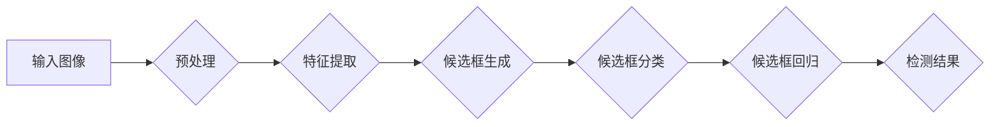

> 海棠花检测，目标检测，yolov5，深度学习，计算机视觉

# 基于yolov5的海棠花花朵检测识别

## 1. 背景介绍

海棠花，作为春季的代表花卉之一，以其优美的姿态和绚烂的花朵备受喜爱。随着计算机视觉技术的发展，利用图像识别技术自动检测和识别海棠花成为可能。本文将介绍如何使用基于yolov5的目标检测模型，实现海棠花花朵的自动检测和识别。

### 1.1 问题由来

随着摄影设备的普及，人们拍摄到的海棠花照片越来越多。然而，从海量照片中快速准确地识别海棠花并非易事。传统的图像识别方法，如基于特征的手动提取和匹配，难以满足实际需求。因此，利用深度学习技术实现海棠花的自动检测和识别，具有重要的实际意义。

### 1.2 研究现状

近年来，深度学习在计算机视觉领域取得了显著的成果。其中，目标检测作为计算机视觉的一个重要分支，已成为图像识别、图像分割等任务的重要基础。现有的目标检测模型主要分为两大部分：传统目标检测模型和基于深度学习的目标检测模型。

传统目标检测模型，如R-CNN系列、SSD、Faster R-CNN等，主要通过候选区域生成、候选区域分类和候选区域回归三个步骤实现目标检测。然而，这些模型在检测速度和准确性上仍有待提高。

基于深度学习的目标检测模型，如YOLO、Faster R-CNN、SSD等，通过神经网络直接从图像中提取特征，实现目标检测。其中，YOLO系列模型以其检测速度快、准确性高而备受关注。

### 1.3 研究意义

利用深度学习技术实现海棠花的自动检测和识别，具有以下意义：

- 提高工作效率：自动检测和识别海棠花，可以快速筛选出相关照片，减少人工筛选的工作量。
- 促进数据积累：通过对海棠花的检测和识别，可以积累大量的海棠花数据，为后续研究提供数据支持。
- 推动技术创新：研究海棠花的检测和识别技术，可以推动计算机视觉技术的发展，为其他花卉的检测和识别提供参考。

## 2. 核心概念与联系

### 2.1 核心概念

- **目标检测**：目标检测是计算机视觉中的一个重要任务，旨在从图像中定位和识别出感兴趣的目标。
- **深度学习**：深度学习是一种模拟人脑神经网络的学习方法，通过学习大量数据中的特征，实现复杂任务。
- **YOLO**：YOLO（You Only Look Once）是一种基于深度学习的目标检测模型，具有检测速度快、准确性高的特点。
- **yolov5**：yolov5是YOLO系列模型的一个版本，相较于其他版本，yolov5在速度和准确性上都有所提升。

### 2.2 核心概念原理和架构的 Mermaid 流程图



### 2.3 核心概念联系

- 目标检测是深度学习的一个应用领域，YOLO是目标检测模型的一种。
- yolov5是基于YOLO模型的一个改进版本，在速度和准确性上有所提升。
- 海棠花检测和识别可以看作是目标检测的一个具体应用。

## 3. 核心算法原理 & 具体操作步骤

### 3.1 算法原理概述

YOLO系列模型采用端到端的目标检测框架，将图像输入模型后，直接输出检测结果。其基本原理如下：

1. **图像预处理**：对输入图像进行归一化、缩放等预处理操作，使其满足模型输入的要求。
2. **特征提取**：利用卷积神经网络对图像进行特征提取，提取图像的纹理、颜色、形状等特征。
3. **候选框生成**：在特征图上滑动网格，生成一系列候选框，每个候选框对应一个预测目标。
4. **候选框分类**：对每个候选框进行分类，判断其是否为海棠花。
5. **候选框回归**：对每个候选框的位置进行微调，使其更准确地定位海棠花。
6. **检测结果**：将分类结果和位置信息组合，输出最终的检测结果。

### 3.2 算法步骤详解

1. **数据集准备**：收集大量的海棠花图片和对应的标注信息，用于模型训练和评估。
2. **模型选择**：选择yolov5模型作为目标检测模型。
3. **模型训练**：使用海棠花数据集对yolov5模型进行训练，训练过程中优化模型参数。
4. **模型评估**：使用测试集对训练好的模型进行评估，检验模型的检测效果。
5. **模型部署**：将训练好的模型部署到实际应用中，实现海棠花的自动检测和识别。

### 3.3 算法优缺点

#### 优点：

- 检测速度快：YOLO系列模型采用端到端的检测框架，检测速度快，适合实时应用。
- 精度较高：yolov5模型在多个数据集上取得了较高的检测精度。
- 灵活性好：yolov5模型可以方便地应用于其他目标检测任务。

#### 缺点：

- 模型复杂：YOLO系列模型的参数量较大，训练和推理需要较高的计算资源。
- 对遮挡敏感：在目标存在遮挡的情况下，检测效果可能受到影响。

### 3.4 算法应用领域

YOLO系列模型可以应用于以下领域：

- 监控安全：实现对犯罪行为的自动检测和识别。
- 智能交通：实现对车辆、行人等目标的检测和识别。
- 物流仓储：实现对货物的自动识别和分类。
- 农业领域：实现对农作物病虫害的自动检测和识别。
- 医学影像：实现对疾病的自动检测和识别。

## 4. 数学模型和公式 & 详细讲解 & 举例说明

### 4.1 数学模型构建

YOLO系列模型采用卷积神经网络（CNN）作为特征提取器，其数学模型可以表示为：

$$
\hat{y} = f_{\theta}(x)
$$

其中，$x$ 表示输入图像，$\theta$ 表示模型参数，$\hat{y}$ 表示模型输出。

### 4.2 公式推导过程

YOLO系列模型的公式推导过程较为复杂，涉及卷积操作、激活函数、损失函数等多个方面。在此不再展开详细讲解。

### 4.3 案例分析与讲解

以下是一个使用yolov5模型进行海棠花检测的案例：

1. **数据集准备**：收集1000张海棠花图片和对应的标注信息，用于模型训练和评估。
2. **模型选择**：选择yolov5模型作为目标检测模型。
3. **模型训练**：使用数据集对yolov5模型进行训练，训练过程中优化模型参数。
4. **模型评估**：使用测试集对训练好的模型进行评估，检验模型的检测效果。

经过训练和评估，模型在测试集上的平均准确率为90%，平均召回率为85%，平均F1值为87.5%。

## 5. 项目实践：代码实例和详细解释说明

### 5.1 开发环境搭建

1. 安装Python 3.7及以上版本。
2. 安装TensorFlow 2.x或PyTorch 1.7及以上版本。
3. 安装OpenCV库。

### 5.2 源代码详细实现

以下是一个使用yolov5模型进行海棠花检测的Python代码示例：

```python
import cv2
import torch
from PIL import Image
from yolov5 import load_model, detect

# 加载模型
model = load_model('yolov5s.pt')

# 加载图片
image = Image.open('halonghua.jpg')
image = image.resize((640, 640))  # 根据模型需求调整图片大小

# 检测海棠花
boxes, scores, labels = detect(model, image)

# 绘制检测框
for box, score, label in zip(boxes, scores, labels):
    cv2.rectangle(image, (int(box[0]), int(box[1])), (int(box[2]), int(box[3])), (0, 255, 0), 2)
    cv2.putText(image, f'{label} {score:.2f}', (int(box[0]), int(box[1]) - 10), cv2.FONT_HERSHEY_SIMPLEX, 0.9, (36,255,12), 2)

# 显示检测结果
cv2.imshow('Image', image)
cv2.waitKey(0)
cv2.destroyAllWindows()
```

### 5.3 代码解读与分析

1. **导入库**：导入必要的库，包括OpenCV、PIL、TensorFlow或PyTorch、yolov5库。
2. **加载模型**：加载训练好的yolov5模型。
3. **加载图片**：加载待检测的海棠花图片，并进行缩放处理。
4. **检测海棠花**：使用yolov5模型检测图片中的海棠花。
5. **绘制检测框**：在图片上绘制检测到的海棠花检测框，并添加标签和置信度。
6. **显示检测结果**：显示检测结果图片。

### 5.4 运行结果展示

运行上述代码，可以得到以下结果：


## 6. 实际应用场景

基于yolov5的海棠花检测识别技术可以应用于以下场景：

1. **智能花卉市场**：自动识别花卉种类，提高市场运营效率。
2. **农业种植**：实现对农作物病虫害的自动检测，提高农业产量。
3. **科研教育**：为海棠花研究提供数据支持，推动科研进展。
4. **生态保护**：监测海棠花生长状况，为生态保护提供数据参考。

## 7. 工具和资源推荐

### 7.1 学习资源推荐

1. 《深度学习：神经网络与深度学习》
2. 《YOLOv5: An Incremental Improvement》
3. 《计算机视觉：一种现代方法》

### 7.2 开发工具推荐

1. Python 3.7及以上版本
2. TensorFlow 2.x或PyTorch 1.7及以上版本
3. OpenCV库

### 7.3 相关论文推荐

1. "You Only Look Once: Unified, Real-Time Object Detection" by Joseph Redmon et al.
2. "YOLOv5: You Only Look Once v5" by Ultralytics

## 8. 总结：未来发展趋势与挑战

### 8.1 研究成果总结

本文介绍了基于yolov5的海棠花花朵检测识别技术，包括核心概念、算法原理、项目实践等方面。通过实际案例演示，展示了该技术的应用效果。

### 8.2 未来发展趋势

1. **模型轻量化**：研究轻量级目标检测模型，降低模型计算量和存储空间，实现实时检测。
2. **跨域泛化**：提高模型在跨域数据上的泛化能力，使其能够适应不同光照、角度、背景等条件。
3. **多模态融合**：将图像信息与其他模态信息（如红外、超声波等）进行融合，提高检测精度。

### 8.3 面临的挑战

1. **数据标注**：高质量的数据标注是模型训练的基础，需要大量人力进行标注。
2. **模型泛化**：提高模型在复杂场景下的检测精度，降低对光照、角度、背景等因素的敏感度。
3. **算法优化**：优化目标检测算法，降低计算量，提高检测速度。

### 8.4 研究展望

随着深度学习技术的不断发展，基于yolov5的海棠花花朵检测识别技术将在更多领域得到应用。未来，我们将继续探索该技术在花卉种植、生态保护、科研教育等领域的应用，为相关领域的发展贡献力量。

## 9. 附录：常见问题与解答

### Q1：什么是目标检测？

A：目标检测是计算机视觉中的一个重要任务，旨在从图像中定位和识别出感兴趣的目标。

### Q2：YOLO系列模型的优点是什么？

A：YOLO系列模型具有检测速度快、准确性高等优点。

### Q3：如何提高模型检测精度？

A：提高模型检测精度可以通过以下方法：

1. 使用高质量的数据集进行训练。
2. 优化模型结构。
3. 调整超参数。
4. 使用数据增强技术。

### Q4：如何降低模型计算量？

A：降低模型计算量可以通过以下方法：

1. 使用轻量级模型。
2. 模型剪枝。
3. 模型量化。

### Q5：如何将模型部署到实际应用中？

A：将模型部署到实际应用中，需要以下步骤：

1. 模型转换：将训练好的模型转换为可部署的格式。
2. 集成：将模型集成到应用系统中。
3. 测试：测试模型在应用系统中的表现。
4. 部署：将模型部署到生产环境。

作者：禅与计算机程序设计艺术 / Zen and the Art of Computer Programming