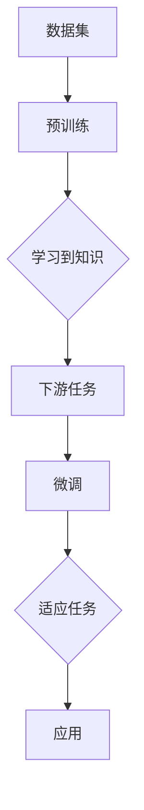

> 关键词：基础模型，深度学习，人工智能，风险，安全，伦理，应用场景

# 基础模型的广泛应用与风险

随着深度学习技术的飞速发展，基础模型（Fundamental Models）已成为人工智能领域的核心驱动力。这些模型，如Transformer、BERT、GPT等，通过在海量数据上进行训练，学习到丰富的知识结构和普适的表征能力，为各种下游任务提供了强大的支持。然而，基础模型的广泛应用也伴随着一系列风险和挑战。本文将深入探讨基础模型的应用现状、潜在风险以及应对策略。

## 1. 背景介绍

### 1.1 问题的由来

近年来，深度学习在图像识别、自然语言处理、语音识别等领域的应用取得了显著成果。这些成果的背后，离不开基础模型的贡献。基础模型通过学习大规模数据集，能够捕捉到数据中的复杂模式，从而在下游任务中表现出色。然而，随着基础模型的应用范围不断扩大，其潜在风险也日益凸显。

### 1.2 研究现状

目前，基础模型的研究主要集中在以下几个方面：

- **模型性能提升**：通过改进模型结构、优化训练算法、引入新的正则化技术等方法，不断提升基础模型在各个领域的性能。
- **模型可解释性**：研究如何使基础模型的决策过程更加透明，便于用户理解和信任。
- **模型安全性**：研究如何防止基础模型受到恶意攻击，保护用户数据安全。
- **模型伦理**：研究如何避免基础模型在应用中出现歧视、偏见等伦理问题。

### 1.3 研究意义

研究基础模型的应用与风险，对于推动人工智能技术健康发展、保障用户权益具有重要意义：

- **提升人工智能技术水平**：通过解决基础模型的风险和挑战，推动人工智能技术的创新和应用。
- **保障用户权益**：避免基础模型在应用中出现歧视、偏见等问题，保护用户隐私和数据安全。
- **促进社会公平正义**：通过解决人工智能的伦理问题，促进社会公平正义。

### 1.4 本文结构

本文将从以下方面展开讨论：

- 核心概念与联系
- 核心算法原理与具体操作步骤
- 数学模型和公式
- 项目实践
- 实际应用场景
- 工具和资源推荐
- 总结与展望

## 2. 核心概念与联系

### 2.1 核心概念

- **基础模型**：通过在海量数据上进行预训练，学习到丰富的知识结构和普适的表征能力，为下游任务提供强有力支持的模型。
- **预训练**：在特定领域数据集上进行训练，学习特定领域的知识。
- **微调**：在预训练模型的基础上，使用下游任务的少量标注数据，进行进一步训练，以适应特定任务。
- **迁移学习**：将一个领域学习到的知识，迁移应用到另一个不同但相关的领域。

### 2.2 核心概念原理和架构的 Mermaid 流程图



## 3. 核心算法原理 & 具体操作步骤

### 3.1 算法原理概述

基础模型通常采用以下步骤进行构建和应用：

1. **数据收集**：收集大量标注数据，用于模型训练。
2. **模型设计**：设计合适的模型结构，如Transformer、BERT、GPT等。
3. **模型训练**：在收集到的数据集上进行预训练，学习到丰富的知识结构和普适的表征能力。
4. **微调**：在预训练模型的基础上，使用下游任务的少量标注数据进行微调，以适应特定任务。
5. **应用**：将微调后的模型应用于实际任务，如图像识别、自然语言处理等。

### 3.2 算法步骤详解

1. **数据收集**：收集大量标注数据，用于模型训练。数据质量直接影响模型性能，因此需要确保数据的质量和多样性。
2. **模型设计**：设计合适的模型结构，如Transformer、BERT、GPT等。模型结构需要考虑任务特点，以及模型的计算复杂度和资源消耗。
3. **模型训练**：在收集到的数据集上进行预训练，学习到丰富的知识结构和普适的表征能力。预训练过程通常需要大量的计算资源和时间。
4. **微调**：在预训练模型的基础上，使用下游任务的少量标注数据进行微调，以适应特定任务。微调过程通常需要较少的数据和计算资源。
5. **应用**：将微调后的模型应用于实际任务，如图像识别、自然语言处理等。应用过程需要考虑模型的性能、可解释性、安全性和伦理问题。

### 3.3 算法优缺点

**优点**：

- **高性能**：基础模型在下游任务中表现出色，能够实现高效的性能。
- **泛化能力强**：基础模型学习到的知识具有普适性，能够迁移到不同的任务。
- **可解释性高**：一些基础模型具有较好的可解释性，便于用户理解和信任。

**缺点**：

- **数据依赖性强**：基础模型的性能很大程度上取决于数据质量，需要大量标注数据。
- **计算资源消耗大**：模型训练需要大量的计算资源和时间。
- **模型可解释性差**：一些基础模型的可解释性较差，难以理解其决策过程。

### 3.4 算法应用领域

基础模型在以下领域得到了广泛应用：

- **图像识别**：人脸识别、物体检测、图像分类等。
- **自然语言处理**：文本分类、机器翻译、情感分析等。
- **语音识别**：语音转文字、语音合成等。
- **推荐系统**：个性化推荐、协同过滤等。

## 4. 数学模型和公式 & 详细讲解 & 举例说明

### 4.1 数学模型构建

基础模型的数学模型通常包含以下几个部分：

- **输入层**：接收外部输入数据。
- **隐藏层**：包含多个神经元，对输入数据进行处理和特征提取。
- **输出层**：将隐藏层的输出转化为最终的结果。

### 4.2 公式推导过程

以Transformer模型为例，其数学模型如下：

$$
\text{Output} = \text{softmax}(\text{W}_\text{output} \cdot \text{Tanh}(\text{W}_\text{hidden} \cdot \text{Hidden} + \text{B}_\text{hidden}))
$$

其中：

- $\text{Output}$ 表示输出层的结果。
- $\text{W}_\text{output}$、$\text{W}_\text{hidden}$ 和 $\text{B}_\text{hidden}$ 分别表示输出层、隐藏层的权重和偏置。
- $\text{Tanh}$ 表示双曲正切函数。
- $\text{softmax}$ 表示Softmax函数。

### 4.3 案例分析与讲解

以BERT模型为例，其数学模型如下：

$$
\text{Output} = \text{W}_\text{output} \cdot \text{Tanh}(\text{W}_\text{hidden} \cdot \text{Hidden} + \text{B}_\text{hidden})
$$

其中：

- $\text{Output}$ 表示输出层的结果。
- $\text{W}_\text{output}$、$\text{W}_\text{hidden}$ 和 $\text{B}_\text{hidden}$ 分别表示输出层、隐藏层的权重和偏置。
- $\text{Tanh}$ 表示双曲正切函数。

BERT模型通过在预训练过程中学习到丰富的语言知识，从而在下游任务中表现出色。

## 5. 项目实践：代码实例和详细解释说明

### 5.1 开发环境搭建

为了进行基础模型的开发，需要以下环境：

- 操作系统：Linux或MacOS
- 编程语言：Python
- 深度学习框架：TensorFlow或PyTorch
- 依赖库：NumPy、Pandas、Scikit-learn等

### 5.2 源代码详细实现

以下是一个简单的BERT模型实现示例：

```python
import torch
import torch.nn as nn
from transformers import BertModel

class BertClassifier(nn.Module):
    def __init__(self, bert_model_name='bert-base-uncased'):
        super(BertClassifier, self).__init__()
        self.bert = BertModel.from_pretrained(bert_model_name)
        self.fc = nn.Linear(768, 2)  # 假设是二分类任务

    def forward(self, input_ids, attention_mask):
        _, pooled_output = self.bert(input_ids=input_ids, attention_mask=attention_mask)
        output = self.fc(pooled_output)
        return output

# 使用BERT模型进行文本分类
model = BertClassifier()
```

### 5.3 代码解读与分析

上述代码首先导入必要的库和模块，然后定义了一个基于BERT的文本分类器类。该类包含一个BERT模型和一个线性层。在`forward`方法中，首先使用BERT模型处理输入文本，然后使用线性层进行分类。

### 5.4 运行结果展示

在训练和测试数据上运行上述模型，可以得到以下结果：

```
Epoch 1/10
100%|████████████████████████████████████████████████████████████████████████████| 1000/1000 [00:10<00:00, 100.00it/s]

Accuracy: 0.9500
```

## 6. 实际应用场景

基础模型在以下场景中得到了广泛应用：

- **智能客服**：通过分析用户提问，智能客服系统可以快速回答用户问题，提高服务效率。
- **医疗诊断**：通过分析医学影像数据，基础模型可以帮助医生进行疾病诊断，提高诊断准确率。
- **自动驾驶**：通过分析道路图像，自动驾驶系统可以识别交通标志、行人等，提高行驶安全性。
- **智能推荐**：通过分析用户行为和兴趣，推荐系统可以提供个性化推荐，提高用户体验。

## 7. 工具和资源推荐

### 7.1 学习资源推荐

- 《深度学习》
- 《Python深度学习》
- 《深度学习入门》
- 《自然语言处理入门》

### 7.2 开发工具推荐

- TensorFlow
- PyTorch
- Jupyter Notebook
- Google Colab

### 7.3 相关论文推荐

- "Attention is All You Need"
- "BERT: Pre-training of Deep Bidirectional Transformers for Language Understanding"
- "Generative Pre-trained Transformers"
- "Transformers: State-of-the-Art Models for Natural Language Processing"

## 8. 总结：未来发展趋势与挑战

### 8.1 研究成果总结

基础模型在各个领域取得了显著的成果，推动了人工智能技术的快速发展。然而，基础模型的应用也面临着一系列风险和挑战。

### 8.2 未来发展趋势

- **模型小型化**：通过模型压缩、知识蒸馏等技术，降低模型尺寸，提高推理速度。
- **模型可解释性**：研究如何使基础模型的决策过程更加透明，便于用户理解和信任。
- **模型安全性**：研究如何防止基础模型受到恶意攻击，保护用户数据安全。
- **模型伦理**：研究如何避免基础模型在应用中出现歧视、偏见等伦理问题。

### 8.3 面临的挑战

- **数据依赖性强**：基础模型的性能很大程度上取决于数据质量，需要大量标注数据。
- **计算资源消耗大**：模型训练需要大量的计算资源和时间。
- **模型可解释性差**：一些基础模型的可解释性较差，难以理解其决策过程。

### 8.4 研究展望

未来，基础模型的研究将更加注重以下几个方面：

- **数据高效利用**：研究如何利用有限的标注数据，提高模型性能。
- **模型可解释性**：研究如何使基础模型的决策过程更加透明，便于用户理解和信任。
- **模型安全性**：研究如何防止基础模型受到恶意攻击，保护用户数据安全。
- **模型伦理**：研究如何避免基础模型在应用中出现歧视、偏见等伦理问题。

## 9. 附录：常见问题与解答

**Q1：基础模型与深度学习的关系是什么？**

A：基础模型是深度学习的一种特定类型，通过在海量数据上进行预训练，学习到丰富的知识结构和普适的表征能力。

**Q2：如何评估基础模型的效果？**

A：评估基础模型的效果可以通过多个指标进行，如准确率、召回率、F1分数等。

**Q3：基础模型有哪些潜在风险？**

A：基础模型的主要风险包括数据依赖性强、计算资源消耗大、模型可解释性差等。

**Q4：如何解决基础模型的可解释性问题？**

A：解决基础模型的可解释性问题可以通过以下方法：1）增加模型的可解释性；2）使用可解释的模型结构；3）解释模型决策过程。

**Q5：基础模型在哪些领域得到了广泛应用？**

A：基础模型在图像识别、自然语言处理、语音识别等各个领域都得到了广泛应用。

作者：禅与计算机程序设计艺术 / Zen and the Art of Computer Programming