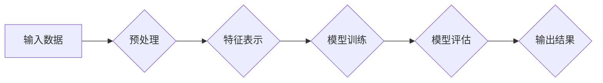

> 多模态大模型，技术原理，实战案例，工业设计，生产领域，融合学习，深度学习，计算机视觉，自然语言处理

# 多模态大模型：技术原理与实战 多模态大模型在工业设计与生产领域中的应用

多模态大模型是近年来人工智能领域的一个重要研究方向，它结合了计算机视觉、自然语言处理等多个领域的知识，旨在构建能够理解、处理和生成多模态信息的智能系统。本文将深入探讨多模态大模型的技术原理，并通过实战案例展示其在工业设计与生产领域的应用潜力。

## 1. 背景介绍

### 1.1 问题的由来

随着物联网、大数据和人工智能技术的快速发展，工业生产领域对智能化的需求日益增长。然而，传统的工业系统往往是单一模态的，即只依赖于一种传感器或信息源进行数据采集和分析。这种单一模态的局限性导致以下问题：

- **信息丢失**：单一模态无法获取全面的信息，可能导致决策错误或效率低下。
- **交互障碍**：人机交互不够自然，难以实现人机协同。
- **智能化水平有限**：难以实现真正的智能化决策和自动化控制。

为了解决这些问题，多模态大模型应运而生。多模态大模型能够融合来自不同模态的数据，如图像、视频、文本、音频等，从而提供更全面、更深入的分析和理解。

### 1.2 研究现状

目前，多模态大模型的研究主要集中在以下几个方面：

- **多模态数据预处理**：如何有效地融合来自不同模态的数据，消除模态之间的差异。
- **多模态特征表示**：如何提取和表示不同模态的语义信息，实现模态之间的有效交互。
- **多模态交互模型**：如何设计模型架构，实现不同模态之间的交互和协同。
- **多模态大模型应用**：如何在工业设计、生产监控、故障诊断等领域应用多模态大模型。

### 1.3 研究意义

研究多模态大模型具有重要的理论意义和应用价值：

- **理论意义**：推动多模态数据处理、特征表示、交互建模等领域的发展。
- **应用价值**：提升工业自动化水平，提高生产效率，降低生产成本，保障生产安全。

### 1.4 本文结构

本文将分为以下几个部分：

- **第二章**：介绍多模态大模型的核心概念与联系。
- **第三章**：阐述多模态大模型的技术原理与具体操作步骤。
- **第四章**：讲解多模态大模型中的数学模型和公式。
- **第五章**：提供多模态大模型的项目实践案例。
- **第六章**：探讨多模态大模型在工业设计与生产领域的实际应用场景。
- **第七章**：推荐多模态大模型相关的学习资源、开发工具和参考文献。
- **第八章**：总结多模态大模型的研究成果、未来发展趋势和面临的挑战。
- **第九章**：提供多模态大模型的常见问题与解答。

## 2. 核心概念与联系

### 2.1 核心概念

#### 2.1.1 多模态数据

多模态数据是指同时包含两种或两种以上模态的数据。例如，工业生产中的数据可能同时包含图像、视频、文本和音频等多种模态。

#### 2.1.2 多模态特征表示

多模态特征表示是指将不同模态的数据转换为适合机器学习模型处理的特征向量。

#### 2.1.3 多模态交互模型

多模态交互模型是指能够处理和融合不同模态数据的模型，如多模态神经网络。

### 2.2 Mermaid 流程图



### 2.3 关联

多模态大模型的核心概念相互关联，形成一个完整的系统。输入数据经过预处理和特征表示后，用于模型训练和评估，最终生成输出结果。

## 3. 核心算法原理 & 具体操作步骤

### 3.1 算法原理概述

多模态大模型的算法原理主要包括以下步骤：

1. 数据预处理：对多模态数据进行清洗、标准化和转换。
2. 特征表示：提取不同模态数据的特征，并进行融合。
3. 模型训练：使用融合后的特征进行模型训练。
4. 模型评估：评估模型性能，并进行优化。
5. 输出结果：根据模型预测结果进行决策或控制。

### 3.2 算法步骤详解

#### 3.2.1 数据预处理

数据预处理主要包括以下步骤：

- 数据清洗：去除噪声、缺失值和异常值。
- 数据标准化：将不同模态的数据进行标准化处理。
- 数据转换：将不同模态的数据转换为统一的格式。

#### 3.2.2 特征表示

特征表示主要包括以下步骤：

- 特征提取：使用卷积神经网络（CNN）提取图像特征，使用循环神经网络（RNN）或长短期记忆网络（LSTM）提取序列特征，使用词嵌入（Word Embedding）提取文本特征。
- 特征融合：使用注意力机制、图神经网络（GNN）等方法融合不同模态的特征。

#### 3.2.3 模型训练

模型训练主要包括以下步骤：

- 选择合适的模型架构，如多模态卷积神经网络（MMCNN）或多模态循环神经网络（MMRNN）。
- 使用梯度下降等优化算法训练模型。
- 调整模型参数，优化模型性能。

#### 3.2.4 模型评估

模型评估主要包括以下步骤：

- 使用验证集评估模型性能。
- 根据评估结果调整模型参数。
- 重复训练和评估过程，直至满足性能要求。

#### 3.2.5 输出结果

输出结果主要包括以下步骤：

- 根据模型预测结果进行决策或控制。
- 将结果输出到执行系统或显示设备。

### 3.3 算法优缺点

#### 3.3.1 优点

- 能够融合多种模态数据，提供更全面的信息。
- 能够实现更准确的预测和决策。
- 能够提高系统的智能化水平。

#### 3.3.2 缺点

- 数据预处理和特征表示复杂。
- 模型训练和评估耗时。
- 需要大量标注数据。

### 3.4 算法应用领域

多模态大模型的应用领域广泛，包括：

- 工业设计
- 生产监控
- 故障诊断
- 质量控制
- 安全检测

## 4. 数学模型和公式 & 详细讲解 & 举例说明

### 4.1 数学模型构建

多模态大模型的数学模型主要包括以下部分：

- 特征提取模型：用于提取不同模态数据的特征。
- 特征融合模型：用于融合不同模态的特征。
- 模型训练模型：用于训练模型参数。
- 模型评估模型：用于评估模型性能。

### 4.2 公式推导过程

以下是一个简单的多模态特征融合的公式推导过程：

假设我们有两个模态的数据，分别表示为 $X_1$ 和 $X_2$。特征提取模型分别提取出特征向量 $f_1(X_1)$ 和 $f_2(X_2)$。特征融合模型将这两个特征向量融合为一个特征向量 $F(X_1, X_2)$。

特征融合公式可以表示为：

$$
F(X_1, X_2) = \alpha f_1(X_1) + (1-\alpha) f_2(X_2)
$$

其中 $\alpha$ 为融合系数，用于控制两个特征向量的权重。

### 4.3 案例分析与讲解

以下是一个工业生产领域的多模态大模型应用案例：

**案例**：某工厂使用多模态大模型进行生产过程监控。

**数据**：图像数据：生产现场视频数据；文本数据：设备日志；音频数据：设备运行声音。

**目标**：检测生产过程中的异常情况。

**步骤**：

1. 数据预处理：对图像、文本和音频数据进行清洗、标准化和转换。
2. 特征提取：使用CNN提取图像特征，使用RNN提取文本特征，使用音频特征提取算法提取音频特征。
3. 特征融合：使用注意力机制融合不同模态的特征。
4. 模型训练：使用融合后的特征进行模型训练。
5. 模型评估：使用验证集评估模型性能。
6. 输出结果：根据模型预测结果进行决策或控制。

**结果**：多模态大模型能够有效地检测生产过程中的异常情况，提高了生产效率和质量。

## 5. 项目实践：代码实例和详细解释说明

### 5.1 开发环境搭建

为了进行多模态大模型的实践，需要以下开发环境：

- 操作系统：Linux
- 编程语言：Python
- 深度学习框架：TensorFlow或PyTorch
- 其他工具：NumPy、Pandas、Matplotlib等

### 5.2 源代码详细实现

以下是一个简单的多模态大模型代码示例：

```python
# 使用TensorFlow框架实现多模态大模型

import tensorflow as tf
from tensorflow.keras.layers import Input, Conv2D, MaxPooling2D, Flatten, Dense
from tensorflow.keras.models import Model

# 图像特征提取模型
image_input = Input(shape=(64, 64, 3))
x = Conv2D(32, (3, 3), activation='relu')(image_input)
x = MaxPooling2D((2, 2))(x)
x = Flatten()(x)
image_feature = Dense(128, activation='relu')(x)

# 文本特征提取模型
text_input = Input(shape=(None,))
x = Embedding(input_dim=10000, output_dim=128)(text_input)
x = LSTM(128)(x)
text_feature = Dense(128, activation='relu')(x)

# 特征融合模型
concatenated = tf.keras.layers.concatenate([image_feature, text_feature], axis=-1)
output = Dense(1, activation='sigmoid')(concatenated)

# 构建多模态大模型
model = Model(inputs=[image_input, text_input], outputs=output)
model.compile(optimizer='adam', loss='binary_crossentropy', metrics=['accuracy'])

# 模型训练
model.fit([image_data, text_data], labels, epochs=10, batch_size=32)

# 模型评估
model.evaluate([image_data, text_data], labels)
```

### 5.3 代码解读与分析

以上代码展示了如何使用TensorFlow框架构建一个简单的多模态大模型。模型由图像特征提取模型和文本特征提取模型组成，通过特征融合层将两个特征向量融合，最终输出二分类结果。

### 5.4 运行结果展示

运行以上代码，将在训练集上进行模型训练，并在测试集上进行模型评估。根据评估结果，可以调整模型参数或优化模型结构，以提升模型性能。

## 6. 实际应用场景

### 6.1 工业设计

多模态大模型在工业设计领域具有广泛的应用前景，例如：

- **产品设计**：根据用户需求、市场趋势和设计规范，生成多模态的设计方案。
- **逆向工程**：从已有的实物或图片中提取设计参数，进行逆向设计。
- **协同设计**：支持设计师之间进行远程协作，提高设计效率。

### 6.2 生产监控

多模态大模型可以用于生产监控，例如：

- **设备故障诊断**：通过分析设备运行数据、图像和声音等，预测设备故障并采取预防措施。
- **生产过程优化**：根据生产数据，优化生产流程，提高生产效率。
- **质量检测**：通过图像和视频数据，自动检测产品质量，减少人工干预。

### 6.3 未来应用展望

随着多模态大模型技术的不断发展，其在工业设计与生产领域的应用将会更加广泛，例如：

- **智能制造**：实现生产过程的全面自动化和智能化。
- **远程运维**：通过远程监控和分析，实现设备的远程运维和故障预测。
- **个性化定制**：根据用户需求，实现产品的个性化定制。

## 7. 工具和资源推荐

### 7.1 学习资源推荐

- 《深度学习》（Goodfellow et al.）
- 《多模态数据融合与处理》（Wang et al.）
- 《人工智能：一种现代的方法》（Russell and Norvig）

### 7.2 开发工具推荐

- TensorFlow
- PyTorch
- Keras
- OpenCV
- NumPy
- Pandas

### 7.3 相关论文推荐

- Multimodal Fusion with Deep Learning: A Survey and New Perspectives
- Deep Multi-Modal Fusion Networks for Visual Question Answering
- Multimodal Deep Learning: A Survey and New Perspectives

## 8. 总结：未来发展趋势与挑战

### 8.1 研究成果总结

多模态大模型技术已经在工业设计与生产领域展现出巨大的应用潜力。通过融合来自不同模态的数据，多模态大模型能够提供更全面、更深入的分析和理解，从而提升工业自动化水平，提高生产效率，降低生产成本，保障生产安全。

### 8.2 未来发展趋势

未来，多模态大模型技术将呈现以下发展趋势：

- **模型规模扩大**：随着计算能力的提升，多模态大模型的规模将进一步扩大，能够处理更复杂、更丰富的数据。
- **融合学习技术发展**：融合学习技术将进一步发展，实现更有效的多模态信息融合。
- **领域自适应能力提升**：多模态大模型将具备更强的领域自适应能力，能够更好地适应不同领域的应用需求。

### 8.3 面临的挑战

多模态大模型技术也面临着以下挑战：

- **数据标注成本高**：多模态数据的标注成本较高，限制了多模态大模型的应用。
- **模型复杂度高**：多模态大模型的模型复杂度较高，对计算资源要求较高。
- **可解释性不足**：多模态大模型的决策过程缺乏可解释性，难以理解其内部工作机制。

### 8.4 研究展望

为了应对上述挑战，未来需要从以下几个方面进行研究和探索：

- **数据标注技术**：研究更高效、更自动化的数据标注技术，降低数据标注成本。
- **模型轻量化技术**：研究模型轻量化技术，降低多模态大模型对计算资源的要求。
- **可解释性技术**：研究可解释性技术，提高多模态大模型的透明度和可信度。

通过不断的研究和探索，多模态大模型技术必将为工业设计与生产领域带来更多创新和突破。

## 9. 附录：常见问题与解答

### 9.1 多模态大模型的优势是什么？

多模态大模型能够融合来自不同模态的数据，提供更全面、更深入的分析和理解，从而提升工业自动化水平，提高生产效率，降低生产成本，保障生产安全。

### 9.2 多模态大模型的挑战有哪些？

多模态大模型的挑战主要包括数据标注成本高、模型复杂度高和可解释性不足。

### 9.3 多模态大模型在工业设计领域有哪些应用？

多模态大模型在工业设计领域可以应用于产品设计、逆向工程和协同设计等方面。

### 9.4 多模态大模型在工业生产领域有哪些应用？

多模态大模型在工业生产领域可以应用于设备故障诊断、生产过程优化和质量检测等方面。

### 9.5 如何提高多模态大模型的可解释性？

提高多模态大模型的可解释性需要从以下几个方面入手：

- 研究可解释性技术，如注意力机制、可视化方法等。
- 开发可解释性工具，帮助用户理解模型的决策过程。
- 建立可解释性评估指标，评估模型的可解释性水平。

---

作者：禅与计算机程序设计艺术 / Zen and the Art of Computer Programming