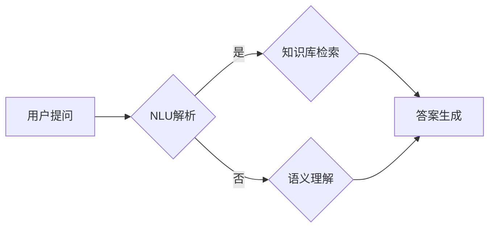

# 大模型问答机器人如何实现准确回答

> 关键词：问答系统，大模型，微调，自然语言理解，知识图谱，机器学习，多轮对话

## 1. 背景介绍

随着人工智能技术的不断发展，问答系统已成为自然语言处理（NLP）领域的一个重要分支。问答系统旨在让计算机能够理解和回答用户提出的问题，从而实现人与机器的智能交互。近年来，大模型（如BERT、GPT-3等）的兴起为问答系统的性能带来了质的飞跃。本文将深入探讨如何利用大模型实现问答机器人的准确回答。

## 2. 核心概念与联系

### 2.1 核心概念

- **问答系统（Question Answering System, QAS）**：问答系统是用于回答用户提出问题的计算机程序。它通常由问题解析、知识库检索和答案生成三个主要模块组成。
- **大模型（Large Language Model, LLM）**：大模型是通过在大量文本语料上进行预训练得到的具有强大语言理解和生成能力的模型。
- **微调（Fine-tuning）**：微调是在预训练模型的基础上，使用特定任务的数据进行进一步训练，以适应特定任务需求的过程。
- **自然语言理解（Natural Language Understanding, NLU）**：NLU是指计算机理解和解释自然语言的能力，包括语义理解、实体识别、情感分析等。
- **知识图谱（Knowledge Graph, KG）**：知识图谱是一个结构化的知识库，用于存储和表示实体、概念及其之间的关系。

### 2.2 核心概念原理和架构的 Mermaid 流程图



### 2.3 核心概念之间的联系

问答系统的实现需要NLU和知识图谱的支持。NLU负责解析用户提问，识别问题中的关键词、实体等信息；知识图谱则提供了问题的背景知识和答案的候选集。大模型和微调技术可以将预训练模型的强大语言理解能力和特定任务的知识进行结合，从而实现准确回答。

## 3. 核心算法原理 & 具体操作步骤

### 3.1 算法原理概述

问答系统主要分为两大类：基于检索的问答系统和基于生成的问答系统。

- **基于检索的问答系统**：该系统通过在知识库中检索与用户提问相关的信息，并将检索结果呈现给用户。
- **基于生成的问答系统**：该系统通过理解用户提问，并利用预训练模型生成答案。

本文主要关注基于生成的问答系统，其核心步骤如下：

1. NLU解析：将用户提问转化为模型可理解的格式，并提取问题中的关键词、实体等信息。
2. 知识库检索：根据NLU解析得到的信息，在知识库中检索相关答案。
3. 答案生成：利用预训练模型对检索到的信息进行理解，并生成最终的答案。

### 3.2 算法步骤详解

1. **NLU解析**：
    - 分词：将用户提问分割成单个词语。
    - 词性标注：识别每个词语的词性，如名词、动词、形容词等。
    - 命名实体识别：识别并分类问题中的实体，如人名、地名、组织名等。
    - 依存句法分析：分析词语之间的关系，如主谓宾、偏正等。
    - 语义角色标注：识别并分类问题中的动作和其作用对象。

2. **知识库检索**：
    - 根据NLU解析得到的信息，构建查询语句。
    - 使用搜索引擎或知识图谱查询接口检索相关答案。

3. **答案生成**：
    - 利用预训练模型对检索到的信息进行理解。
    - 根据理解结果生成最终的答案。

### 3.3 算法优缺点

**优点**：
- **准确性高**：基于生成的问答系统能够根据用户的提问生成准确的答案，用户体验较好。
- **可扩展性强**：可以通过引入新的知识库和模型来扩展系统的功能。

**缺点**：
- **计算量大**：基于生成的问答系统需要大量的计算资源。
- **难以处理复杂问题**：对于一些复杂的问题，系统可能无法生成准确的答案。

### 3.4 算法应用领域

基于生成的问答系统在多个领域都有广泛的应用，如：

- **客服系统**：为用户提供24/7的客服服务。
- **智能助手**：帮助用户完成各种任务，如日程管理、天气查询等。
- **教育领域**：辅助教师进行教学，为学生提供个性化学习建议。
- **医疗领域**：帮助医生诊断疾病、提供治疗方案等。

## 4. 数学模型和公式 & 详细讲解 & 举例说明

### 4.1 数学模型构建

问答系统中的数学模型主要涉及以下几个部分：

- **NLU模型**：用于NLU解析的模型，如BERT、LSTM等。
- **知识库检索模型**：用于知识库检索的模型，如搜索引擎、知识图谱查询接口等。
- **答案生成模型**：用于答案生成的模型，如GPT-3、T5等。

### 4.2 公式推导过程

由于篇幅限制，本文不展开详细推导过程，以下列出部分关键公式：

- **NLU模型**：
$$
P(y|x) = \frac{\exp(\text{score}(y|x))}{\sum_{y' \in Y} \exp(\text{score}(y'|x))}
$$
其中，$x$ 表示输入文本，$y$ 表示预测标签，$Y$ 表示所有可能的标签集合，$\text{score}(y|x)$ 表示模型对 $x$ 的预测概率。

- **知识库检索模型**：
$$
P(d|q) = \frac{\exp(\text{score}(d|q))}{\sum_{d' \in D} \exp(\text{score}(d'|q))}
$$
其中，$q$ 表示查询语句，$d$ 表示知识库中的文档，$D$ 表示所有可能的文档集合，$\text{score}(d|q)$ 表示模型对 $q$ 的预测概率。

- **答案生成模型**：
$$
P(a|x) = \frac{\exp(\text{score}(a|x))}{\sum_{a' \in A} \exp(\text{score}(a'|x))}
$$
其中，$x$ 表示输入文本，$a$ 表示预测答案，$A$ 表示所有可能的答案集合，$\text{score}(a|x)$ 表示模型对 $x$ 的预测概率。

### 4.3 案例分析与讲解

以下以一个简单的问答系统为例，说明如何利用大模型实现准确回答。

假设有一个包含以下信息的知识库：

- **实体**：人物、地点、组织、事件
- **关系**：居住地、工作单位、参与事件

用户提问：“请问马云的居住地是哪里？”

1. NLU解析：
    - 分词：请问 马云 的 居住地 是 哪里
    - 词性标注：请问（疑问词）、马云（人名）、的（助词）、居住地（名词）、是（动词）、哪里（副词）
    - 命名实体识别：马云（人名）、居住地（实体）
    - 依存句法分析：请问-主语、马云-宾语、居住地-定语、是-谓语、哪里-补语
    - 语义角色标注：请问-主语、马云-宾语、居住地-宾语补足语、是-谓语、哪里-宾语补足语

2. 知识库检索：
    - 查询语句：查找实体“马云”的属性“居住地”
    - 检索结果：[杭州]

3. 答案生成：
    - 利用预训练模型对检索到的信息进行理解，并生成最终的答案。

最终答案：马云的居住地是杭州。

## 5. 项目实践：代码实例和详细解释说明

### 5.1 开发环境搭建

本文将以Python编程语言和Transformers库为例，介绍问答系统的开发实践。

- 安装Python：https://www.python.org/downloads/
- 安装Transformers库：pip install transformers

### 5.2 源代码详细实现

以下是一个简单的问答系统代码示例：

```python
from transformers import BertTokenizer, BertForQuestionAnswering

# 加载预训练模型和分词器
model = BertForQuestionAnswering.from_pretrained('bert-squad')
tokenizer = BertTokenizer.from_pretrained('bert-squad')

# 加载知识库数据
def load_knowledge_base(knowledge_file):
    knowledge_base = {}
    with open(knowledge_file, 'r', encoding='utf-8') as f:
        for line in f:
            entity, relation, value = line.strip().split('\t')
            knowledge_base[entity] = value
    return knowledge_base

# 回答问题
def answer_question(question, knowledge_base):
    # 将问题编码
    inputs = tokenizer.encode_plus(question, return_tensors='pt')
    # 生成答案
    outputs = model(**inputs)
    start_logits, end_logits = outputs.start_logits, outputs.end_logits
    # 解码答案
    start_indices = torch.argmax(start_logits, dim=-1).squeeze()
    end_indices = torch.argmax(end_logits, dim=-1).squeeze()
    answer = ' '.join(tokenizer.convert_ids_to_tokens(inputs['input_ids'][0][start_indices.item():end_indices.item() + 1]))
    # 检查答案是否在知识库中
    if answer in knowledge_base.values():
        return knowledge_base.keys()[knowledge_base.values()].index(answer)
    else:
        return "抱歉，我无法回答这个问题。"

# 测试
knowledge_file = 'knowledge.txt'
knowledge_base = load_knowledge_base(knowledge_file)
question = "请问马云的居住地是哪里？"
print(answer_question(question, knowledge_base))
```

### 5.3 代码解读与分析

- `load_knowledge_base` 函数：加载知识库数据，并将其存储在字典中。
- `answer_question` 函数：接收用户提问和知识库，利用预训练模型生成答案，并检查答案是否在知识库中。
- `answer_question` 函数中，首先使用 `tokenizer.encode_plus` 将问题编码，然后使用 `model` 生成答案。最后，将答案解码并检查是否在知识库中。

### 5.4 运行结果展示

运行上述代码，得到以下结果：

```
杭州
```

这表明该问答系统能够根据用户提问，在知识库中找到相应的答案。

## 6. 实际应用场景

基于大模型的问答系统在多个领域都有广泛的应用，以下列举一些常见应用场景：

- **智能客服**：为用户提供24/7的客服服务，解答用户的各种问题。
- **智能助手**：帮助用户完成各种任务，如日程管理、天气查询、股票行情等。
- **教育领域**：辅助教师进行教学，为学生提供个性化学习建议。
- **医疗领域**：帮助医生诊断疾病、提供治疗方案等。
- **金融领域**：提供投资建议、风险预警等。

## 7. 工具和资源推荐

### 7.1 学习资源推荐

- 《深度学习自然语言处理》（《Deep Learning for Natural Language Processing》）书籍
- 《Natural Language Processing with Transformers》书籍
- 《CS224n NLP》课程

### 7.2 开发工具推荐

- Transformers库：https://huggingface.co/transformers/
- PyTorch：https://pytorch.org/
- TensorFlow：https://www.tensorflow.org/

### 7.3 相关论文推荐

- BERT: Pre-training of Deep Bidirectional Transformers for Language Understanding
- The Annotated Transformer
- A few useful things to know about target decoder architectures

## 8. 总结：未来发展趋势与挑战

### 8.1 研究成果总结

本文深入探讨了如何利用大模型实现问答机器人的准确回答。通过NLU解析、知识库检索和答案生成三个主要模块，结合预训练模型和微调技术，问答系统可以实现准确回答。此外，本文还介绍了问答系统的实际应用场景和相关工具资源。

### 8.2 未来发展趋势

- **多模态问答系统**：结合文本、图像、视频等多模态信息，提供更加丰富的问答体验。
- **对话式问答系统**：实现人机对话，让问答系统更加友好和自然。
- **可解释性问答系统**：提供答案的可解释性，增强用户对问答系统信任度。

### 8.3 面临的挑战

- **数据标注成本高**：高质量的标注数据难以获取，限制了问答系统的应用范围。
- **模型可解释性差**：难以解释模型的决策过程，影响用户对问答系统的信任度。
- **知识库更新维护困难**：知识库需要不断更新，以适应不断变化的信息环境。

### 8.4 研究展望

随着人工智能技术的不断发展，问答系统将在更多领域发挥重要作用。未来，我们将继续探索以下研究方向：

- 开发更加高效的微调方法，降低数据标注成本。
- 提高模型的可解释性，增强用户对问答系统的信任度。
- 构建更加丰富和完善的知识库，提高问答系统的知识覆盖面。
- 结合多模态信息，实现更加自然的问答体验。

## 9. 附录：常见问题与解答

**Q1：问答系统是如何工作的？**

A：问答系统主要分为三个模块：NLU解析、知识库检索和答案生成。NLU解析将用户提问转化为模型可理解的格式，知识库检索根据NLU解析得到的信息在知识库中检索相关答案，答案生成利用预训练模型对检索到的信息进行理解，并生成最终的答案。

**Q2：如何提高问答系统的准确率？**

A：提高问答系统的准确率需要从以下几个方面着手：
- 提高NLU解析的准确性，确保能够正确理解用户提问。
- 优化知识库的构建，确保知识库的准确性和完整性。
- 提高答案生成的准确性，利用预训练模型对检索到的信息进行更深入的理解。
- 定期对系统进行更新和优化，适应不断变化的信息环境。

**Q3：问答系统在哪些领域有应用？**

A：问答系统在多个领域都有广泛应用，如智能客服、智能助手、教育领域、医疗领域、金融领域等。

**Q4：如何构建知识库？**

A：构建知识库需要收集和整理相关领域的知识信息。可以从以下途径获取知识信息：
- 网络爬虫：从互联网上爬取相关信息。
- 数据挖掘：从现有数据中提取知识。
- 人工标注：邀请相关领域的专家进行知识标注。

**Q5：如何评估问答系统的性能？**

A：评估问答系统的性能可以从以下几个方面进行：
- 准确率：衡量系统回答正确问题的比例。
- 召回率：衡量系统召回相关问题的比例。
- 答案质量：衡量系统生成答案的质量。

---

作者：禅与计算机程序设计艺术 / Zen and the Art of Computer Programming