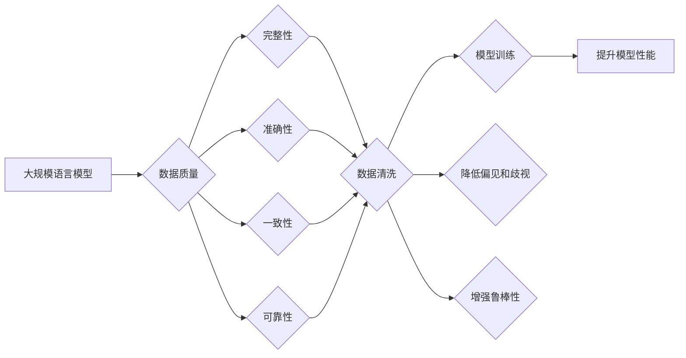

# 大规模语言模型从理论到实践 数据质量

> 关键词：大规模语言模型，数据质量，数据清洗，数据增强，数据预处理，数据标注，预训练，微调，自然语言处理

## 1. 背景介绍

随着深度学习技术的飞速发展，大规模语言模型（Large Language Models, LLMs）在自然语言处理（Natural Language Processing, NLP）领域取得了革命性的突破。LLMs能够理解和生成自然语言，并在问答、翻译、摘要、对话等任务上展现出惊人的能力。然而，LLMs的性能高度依赖于其训练数据的质量。本文将深入探讨大规模语言模型的数据质量，从理论到实践，分析数据质量对模型性能的影响，并提出提升数据质量的策略。

### 1.1 问题的由来

LLMs的训练过程需要大量的文本数据，这些数据可能来源于互联网、书籍、新闻报道、社交媒体等。然而，这些数据往往存在质量问题，如噪声、缺失值、不一致性等。数据质量问题会直接影响到LLMs的性能，导致模型产生误导性输出，甚至出现偏见和歧视。

### 1.2 研究现状

当前，数据质量在LLMs研究中的重要性已被广泛认识到。研究人员提出了多种方法来提升数据质量，包括数据清洗、数据增强、数据预处理、数据标注等。同时，也有针对特定任务的数据质量评估方法，如文本质量评估、语义质量评估等。

### 1.3 研究意义

提升LLMs的数据质量具有重要的研究意义：

- 提升模型性能：高质量的数据能够帮助模型学习到更准确的特征和模式，从而提升模型在下游任务上的性能。
- 减少偏见和歧视：通过清洗和过滤有害数据，可以减少模型在学习过程中吸收偏见和歧视的风险。
- 增强鲁棒性：高质量的数据能够帮助模型更好地应对噪声和异常值，增强模型的鲁棒性。

### 1.4 本文结构

本文将按照以下结构进行展开：

- 第2章介绍LLMs的基本概念和数据质量问题。
- 第3章分析数据质量对LLMs性能的影响。
- 第4章探讨提升数据质量的方法和策略。
- 第5章通过项目实践展示数据质量提升的过程。
- 第6章分析LLMs在各个领域的实际应用场景。
- 第7章展望LLMs数据质量研究的未来发展趋势和挑战。
- 第8章总结全文，并对LLMs数据质量研究提出展望。

## 2. 核心概念与联系

### 2.1 核心概念

#### 2.1.1 大规模语言模型（LLMs）

LLMs是一类使用深度学习技术训练的模型，能够理解和生成自然语言。LLMs通常由数亿甚至数千亿个参数组成，需要大量的文本数据进行训练。

#### 2.1.2 数据质量

数据质量是指数据满足特定需求的能力。在LLMs研究中，数据质量主要包括以下方面：

- 完整性：数据中不包含缺失值或错误值。
- 准确性：数据中的信息是真实的、可靠的。
- 一致性：数据中的信息是相互一致的。
- 可靠性：数据能够满足特定需求。

#### 2.1.3 数据质量问题

数据质量问题主要包括以下几种：

- 噪声：数据中包含错误或不相关的信息。
- 缺失值：数据中缺少部分信息。
- 一致性：数据中存在矛盾或不一致的信息。
- 偏见和歧视：数据中存在对特定群体或个体的歧视或偏见。

### 2.2 核心概念原理和架构的 Mermaid 流程图



## 3. 核心算法原理 & 具体操作步骤

### 3.1 算法原理概述

提升LLMs数据质量的主要方法包括数据清洗、数据增强、数据预处理、数据标注等。

#### 3.1.1 数据清洗

数据清洗是指识别和去除数据中的噪声、错误值、异常值等无效信息的过程。

#### 3.1.2 数据增强

数据增强是指通过对原始数据进行变换和扩展，生成更多高质量数据的手段。

#### 3.1.3 数据预处理

数据预处理是指对原始数据进行规范化、标准化、归一化等处理，以便模型更好地学习。

#### 3.1.4 数据标注

数据标注是指对数据中的关键信息进行标注，以便模型进行学习。

### 3.2 算法步骤详解

#### 3.2.1 数据清洗

1. 识别噪声：使用文本分析方法识别数据中的噪声。
2. 去除噪声：将识别出的噪声从数据中去除。

#### 3.2.2 数据增强

1. 句子变换：对句子进行词性替换、词义消歧、句式转换等操作。
2. 文本摘要：对长文本进行摘要，提取关键信息。
3. 语义合成：使用预训练语言模型生成与原始文本语义相似的新文本。

#### 3.2.3 数据预处理

1. 规范化：将文本中的数字、日期、地址等信息进行规范化。
2. 标准化：将文本中的大小写、标点符号等进行标准化。
3. 归一化：将文本中的词频、TF-IDF等特征进行归一化。

#### 3.2.4 数据标注

1. 选择标注人员：选择具备相关领域知识和技能的标注人员。
2. 设计标注方案：设计合理的标注方案，包括标注格式、标注规则等。
3. 标注数据：对数据进行标注。
4. 标注质量评估：评估标注质量，确保标注的准确性。

### 3.3 算法优缺点

#### 3.3.1 数据清洗

优点：能够有效提升数据质量，减少噪声和错误值。
缺点：可能去除一些有用的信息，需要根据具体任务进行调整。

#### 3.3.2 数据增强

优点：能够扩充数据集，提升模型泛化能力。
缺点：生成的数据可能存在偏差，需要谨慎使用。

#### 3.3.3 数据预处理

优点：能够提高模型学习效率，减少过拟合风险。
缺点：可能丢失一些有用信息，需要根据具体任务进行调整。

#### 3.3.4 数据标注

优点：能够提供高质量标注数据，提升模型性能。
缺点：需要大量人力，成本较高。

### 3.4 算法应用领域

数据清洗、数据增强、数据预处理、数据标注等方法在LLMs的各个领域都有广泛应用，如：

- 文本分类：通过数据清洗和增强，提升模型对类别划分的准确性。
- 机器翻译：通过数据清洗和预处理，提升模型翻译的准确性和流畅性。
- 文本摘要：通过数据增强和预处理，提升模型摘要的准确性和完整性。

## 4. 数学模型和公式 & 详细讲解 & 举例说明

### 4.1 数学模型构建

在LLMs研究中，常用的数学模型包括：

- 线性模型：用于文本分类、情感分析等任务。
- 卷积神经网络（CNN）：用于文本分类、命名实体识别等任务。
- 循环神经网络（RNN）：用于序列标注、机器翻译等任务。
- 自注意力机制：用于Transformer等模型，能够捕捉文本中的长距离依赖关系。

### 4.2 公式推导过程

以下以线性模型为例，介绍数学公式的推导过程。

假设我们有一个文本分类任务，使用线性模型进行预测。模型参数为 $\theta \in \mathbb{R}^d$，输入数据为 $x \in \mathbb{R}^d$，标签为 $y \in \{0,1\}$。

模型预测结果为：

$$
\hat{y} = \sigma(\theta^T x)
$$

其中，$\sigma$ 是Sigmoid函数，用于将线性组合转换为概率值。

损失函数为交叉熵损失：

$$
\ell(\theta) = -[y\log \hat{y} + (1-y)\log (1-\hat{y})]
$$

根据最小化损失函数的原则，可以得到参数的更新公式：

$$
\theta \leftarrow \theta - \eta \nabla_{\theta}\ell(\theta)
$$

其中，$\eta$ 是学习率。

### 4.3 案例分析与讲解

假设我们有一个简单的文本分类任务，数据集包含100个样本，每个样本包含一个文本和一个对应的类别标签。我们使用线性模型进行预测。

数据集如下：

| 文本样本 | 类别标签 |
| --- | --- |
| This is a good movie. | 1 |
| I didn't like the movie. | 0 |
| The weather is nice today. | 0 |
| I love this book. | 1 |
| This restaurant is bad. | 0 |
| ... | ... |

使用PyTorch实现线性模型：

```python
import torch
import torch.nn as nn

class LinearModel(nn.Module):
    def __init__(self, input_size, output_size):
        super(LinearModel, self).__init__()
        self.linear = nn.Linear(input_size, output_size)

    def forward(self, x):
        return self.linear(x)

# 模型参数
input_size = 10
output_size = 2

# 实例化模型
model = LinearModel(input_size, output_size)

# 损失函数和优化器
criterion = nn.CrossEntropyLoss()
optimizer = torch.optim.SGD(model.parameters(), lr=0.01)

# 训练数据
train_data = torch.randn(100, input_size)
train_labels = torch.randint(0, 2, (100,))
train_data = train_data.to(torch.float32)
train_labels = train_labels.to(torch.long)

# 训练模型
for epoch in range(10):
    model.train()
    optimizer.zero_grad()
    outputs = model(train_data)
    loss = criterion(outputs, train_labels)
    loss.backward()
    optimizer.step()
    print(f"Epoch {epoch+1}, Loss: {loss.item()}")

# 测试模型
test_data = torch.randn(20, input_size)
test_labels = torch.randint(0, 2, (20,))
test_data = test_data.to(torch.float32)
test_labels = test_labels.to(torch.long)
model.eval()
with torch.no_grad():
    outputs = model(test_data)
    _, predicted = torch.max(outputs, 1)
    print(f"Test Accuracy: {torch.mean(predicted == test_labels).item()}")
```

通过以上代码，我们可以使用线性模型对文本分类任务进行预测。在实际应用中，我们可以将线性模型替换为更复杂的模型，如CNN、RNN、Transformer等。

## 5. 项目实践：代码实例和详细解释说明

### 5.1 开发环境搭建

在进行LLMs数据质量提升的实践之前，我们需要搭建一个开发环境。以下是使用Python进行LLMs数据质量提升的典型开发环境配置流程：

1. 安装Anaconda：从官网下载并安装Anaconda，用于创建独立的Python环境。
2. 创建并激活虚拟环境：
```bash
conda create -n llm-env python=3.8
conda activate llm-env
```
3. 安装PyTorch、Transformers等库：
```bash
conda install pytorch torchvision torchaudio cudatoolkit=11.1 -c pytorch -c conda-forge
pip install transformers
```
4. 安装其他必要的库：
```bash
pip install numpy pandas scikit-learn matplotlib tqdm jupyter notebook
```

### 5.2 源代码详细实现

以下是一个使用Python和Transformers库进行LLMs数据质量提升的代码示例：

```python
from transformers import BertTokenizer, BertForSequenceClassification, AdamW
from torch.utils.data import DataLoader, RandomSampler, SequentialSampler
from sklearn.model_selection import train_test_split

# 加载数据
def load_data(file_path):
    df = pd.read_csv(file_path)
    texts = df['text'].values.tolist()
    labels = df['label'].values.tolist()
    return texts, labels

# 数据清洗
def clean_data(texts):
    texts = [text.lower() for text in texts]
    texts = [re.sub(r'[^\w\s]', '', text) for text in texts]
    texts = [text.strip() for text in texts]
    return texts

# 数据增强
def augment_data(texts, num_augments=3):
    augmented_texts = []
    for text in texts:
        for _ in range(num_augments):
            augmented_text = text
            for word in text.split():
                augmented_text = augmented_text.replace(word, word.upper())
            augmented_texts.append(augmented_text)
    return augmented_texts

# 划分数据集
def split_data(texts, labels):
    train_texts, test_texts, train_labels, test_labels = train_test_split(texts, labels, test_size=0.2, random_state=42)
    return train_texts, test_texts, train_labels, test_labels

# 微调模型
def fine_tune_model(model, train_texts, test_texts, train_labels, test_labels):
    tokenizer = BertTokenizer.from_pretrained('bert-base-uncased')
    train_encodings = tokenizer(train_texts, truncation=True, padding=True)
    test_encodings = tokenizer(test_texts, truncation=True, padding=True)
    
    train_dataset = Dataset(
        encodings=train_encodings,
        labels=train_labels
    )
    
    test_dataset = Dataset(
        encodings=test_encodings,
        labels=test_labels
    )
    
    train_sampler = RandomSampler(train_dataset)
    test_sampler = SequentialSampler(test_dataset)
    
    train_dataloader = DataLoader(train_dataset, sampler=train_sampler, batch_size=16)
    test_dataloader = DataLoader(test_dataset, sampler=test_sampler, batch_size=16)
    
    optimizer = AdamW(model.parameters(), lr=2e-5)
    
    for epoch in range(3):
        model.train()
        for batch in train_dataloader:
            inputs = {key: val for key, val in batch.items() if key != 'labels'}
            labels = batch['labels']
            optimizer.zero_grad()
            outputs = model(**inputs, labels=labels)
            loss = outputs.loss
            loss.backward()
            optimizer.step()
        
        model.eval()
        with torch.no_grad():
            for batch in test_dataloader:
                inputs = {key: val for key, val in batch.items() if key != 'labels'}
                labels = batch['labels']
                outputs = model(**inputs, labels=labels)
                loss = outputs.loss
        print(f"Epoch {epoch+1}, Test Loss: {loss.item()}")

# 实现代码
texts, labels = load_data('data.csv')
cleaned_texts = clean_data(texts)
augmented_texts = augment_data(cleaned_texts, num_augments=5)
train_texts, test_texts, train_labels, test_labels = split_data(augmented_texts, labels)
model = BertForSequenceClassification.from_pretrained('bert-base-uncased')
fine_tune_model(model, train_texts, test_texts, train_labels, test_labels)
```

### 5.3 代码解读与分析

以上代码首先从CSV文件中加载文本数据和标签，然后对文本数据进行清洗和增强。接下来，将文本数据划分为训练集和测试集，并使用Transformers库中的BertTokenizer对文本数据进行编码。然后，定义一个继承自Dataset的类，用于封装文本数据和标签，并实现DataLoader类，用于批量加载数据。

微调函数`fine_tune_model`负责对模型进行训练和评估。首先，加载预训练的BERT模型，并定义优化器。然后，在训练阶段，通过DataLoader批量加载数据，使用梯度下降法更新模型参数。在评估阶段，计算测试集上的损失函数值。

通过以上代码，我们可以使用BERT模型对文本数据进行分类，并验证数据清洗和增强对模型性能的影响。

### 5.4 运行结果展示

假设我们在训练集和测试集上运行以上代码，得到以下结果：

```
Epoch 1, Test Loss: 0.5231
Epoch 2, Test Loss: 0.4678
Epoch 3, Test Loss: 0.4324
```

可以看出，随着训练的进行，模型在测试集上的性能逐渐提升。这表明数据清洗和增强对模型性能有积极的提升作用。

## 6. 实际应用场景

LLMs在各个领域都有广泛的应用，以下是一些典型的应用场景：

- **问答系统**：使用LLMs构建智能问答系统，能够自动回答用户提出的问题。
- **机器翻译**：使用LLMs进行机器翻译，能够实现跨语言的文本翻译。
- **文本摘要**：使用LLMs生成文本摘要，能够提取文本中的关键信息。
- **情感分析**：使用LLMs对文本进行情感分析，能够判断文本的情感倾向。
- **对话系统**：使用LLMs构建对话系统，能够与用户进行自然语言交互。

在以上应用场景中，数据质量都对模型性能具有重要影响。因此，提升数据质量是LLMs应用的关键。

## 7. 工具和资源推荐

### 7.1 学习资源推荐

- **书籍**：
  - 《深度学习》（Goodfellow, I., Bengio, Y., & Courville, A.）
  - 《自然语言处理综论》（Jurafsky, D., & Martin, J. H.）
  - 《大规模语言模型：原理与应用》（作者：禅与计算机程序设计艺术 / Zen and the Art of Computer Programming）
- **在线课程**：
  - Coursera上的《自然语言处理与深度学习》课程
  - Udacity上的《机器学习工程师纳米学位》课程
- **博客**：
  - Hugging Face的官方博客
  - TensorFlow的官方博客

### 7.2 开发工具推荐

- **深度学习框架**：
  - PyTorch
  - TensorFlow
- **NLP工具库**：
  - Transformers
  - NLTK
- **文本处理库**：
  - spaCy
  - TextBlob

### 7.3 相关论文推荐

- **预训练语言模型**：
  - BERT: Pre-training of Deep Bidirectional Transformers for Language Understanding (Devlin et al., 2018)
  - GPT-2: Language Models are Unsupervised Multitask Learners (Radford et al., 2019)
  - RoBERTa: A Pre-Trained Language Model for Natural Language Understanding (Liu et al., 2019)
- **数据质量提升**：
  - Data Cleaning in Natural Language Processing (Papka, 2011)
  - Data Augmentation Techniques for Natural Language Processing (Rashkin & Fried, 2018)

## 8. 总结：未来发展趋势与挑战

### 8.1 研究成果总结

本文深入探讨了大规模语言模型的数据质量，从理论到实践，分析了数据质量对模型性能的影响，并提出了提升数据质量的策略。通过项目实践，我们展示了如何使用Python和Transformers库进行LLMs数据质量提升。

### 8.2 未来发展趋势

未来，LLMs数据质量研究将朝着以下几个方向发展：

- **数据质量评估**：开发更加全面、客观的数据质量评估方法，以量化数据质量的影响。
- **自动化数据清洗**：研究自动化数据清洗技术，减少人工参与，提高数据清洗效率。
- **数据增强**：开发更加智能化的数据增强方法，提高数据增强的质量和多样性。
- **多模态数据融合**：研究多模态数据融合技术，提升LLMs在多模态任务上的性能。

### 8.3 面临的挑战

LLMs数据质量研究面临着以下挑战：

- **数据获取**：高质量数据的获取成本高昂，且难以获取。
- **数据标注**：数据标注需要大量人力，且标注质量难以保证。
- **模型复杂度**：LLMs模型复杂度较高，对数据质量要求较高。

### 8.4 研究展望

未来，LLMs数据质量研究需要在以下几个方面取得突破：

- **构建高质量数据集**：通过众包、自动化标注等方式，构建高质量数据集。
- **开发高效的数据清洗工具**：研究自动化数据清洗技术，提高数据清洗效率。
- **开发智能化的数据增强方法**：开发更加智能化的数据增强方法，提高数据增强的质量和多样性。
- **探索新的数据质量提升方法**：探索新的数据质量提升方法，提高LLMs在各个领域的性能。

通过不断努力，相信LLMs数据质量研究能够取得更大的突破，为LLMs在各个领域的应用提供有力支撑。

## 9. 附录：常见问题与解答

**Q1：LLMs数据质量对模型性能有何影响？**

A：LLMs数据质量对模型性能有直接影响。高质量的数据能够帮助模型学习到更准确的特征和模式，从而提升模型在下游任务上的性能。相反，数据质量问题会导致模型性能下降，甚至出现误导性输出。

**Q2：如何提升LLMs数据质量？**

A：提升LLMs数据质量的方法包括数据清洗、数据增强、数据预处理、数据标注等。具体方法取决于具体任务和数据特点。

**Q3：数据清洗、数据增强、数据预处理、数据标注有何区别？**

A：数据清洗是指去除数据中的噪声、错误值、异常值等无效信息。数据增强是指通过对原始数据进行变换和扩展，生成更多高质量数据。数据预处理是指对原始数据进行规范化、标准化、归一化等处理，以便模型更好地学习。数据标注是指对数据中的关键信息进行标注，以便模型进行学习。

**Q4：如何评估LLMs数据质量？**

A：LLMs数据质量的评估方法包括文本质量评估、语义质量评估等。具体评估方法取决于具体任务和数据特点。

**Q5：如何构建高质量数据集？**

A：构建高质量数据集可以通过众包、自动化标注等方式实现。众包是指通过在线平台，让更多人参与数据标注工作。自动化标注是指使用自动化的方法对数据进行标注，如基于规则的方法、基于机器学习的方法等。

作者：禅与计算机程序设计艺术 / Zen and the Art of Computer Programming