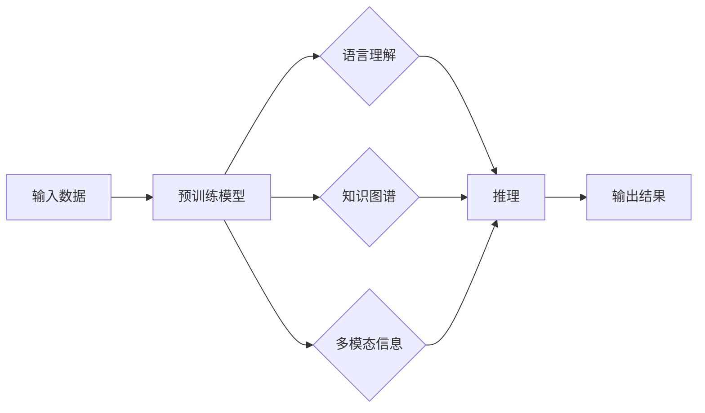

> 关键词：大语言模型，推理能力，Transformer，BERT，推理效率，多模态，跨语言，知识图谱

# 大语言模型原理与工程实践：大语言模型的推理能力

大语言模型（Large Language Models，LLMs）近年来在自然语言处理（Natural Language Processing，NLP）领域取得了显著的进展。这些模型能够理解、生成和翻译自然语言，并在各种NLP任务中展现出卓越的性能。然而，大语言模型的核心能力不仅仅是语言理解和生成，还包括推理能力。本文将深入探讨大语言模型的推理能力，分析其原理、实践方法，并展望其未来发展趋势。

## 1. 背景介绍

### 1.1 问题的由来

随着互联网和大数据的快速发展，自然语言数据呈爆炸式增长。传统的NLP方法往往依赖于手工设计的特征和复杂的规则，难以处理海量数据和复杂任务。大语言模型的兴起，为NLP领域带来了新的突破。然而，如何有效地利用大语言模型的推理能力，使其在现实世界中发挥更大的作用，成为了研究的热点问题。

### 1.2 研究现状

目前，大语言模型的推理能力主要集中在以下几个方面：

- **文本推理**：理解文本中的隐含意义，进行语义分析、情感分析、命名实体识别等任务。
- **知识推理**：利用知识图谱等外部知识库，进行问答、推理和知识发现。
- **跨语言推理**：在不同语言之间进行语义转换和推理。
- **多模态推理**：结合文本、图像、语音等多模态信息进行推理。

### 1.3 研究意义

大语言模型的推理能力在各个领域都有广泛的应用前景，包括但不限于：

- **智能客服**：理解用户意图，提供个性化的服务。
- **医疗诊断**：辅助医生进行疾病诊断和治疗建议。
- **金融风控**：分析市场趋势，进行风险评估。
- **教育辅导**：提供个性化的学习计划和学习资源。

## 2. 核心概念与联系

### 2.1 核心概念原理

大语言模型的推理能力主要基于以下核心概念：

- **Transformer模型**：一种基于自注意力机制的深度神经网络模型，能够有效地捕捉输入序列中的长距离依赖关系。
- **BERT模型**：一种基于Transformer的预训练模型，通过预训练学习到通用的语言表示。
- **知识图谱**：一种用于表示实体、属性和关系的数据结构，可以用于知识推理和问答系统。
- **多模态学习**：结合文本、图像、语音等多模态信息进行学习，提升模型的推理能力。

### 2.2 核心概念架构

以下是大语言模型推理能力的Mermaid流程图：



## 3. 核心算法原理 & 具体操作步骤

### 3.1 算法原理概述

大语言模型的推理能力主要基于以下算法原理：

- **自注意力机制**：Transformer模型中的自注意力机制能够捕捉输入序列中的长距离依赖关系，从而更好地理解上下文信息。
- **预训练技术**：BERT模型通过在大量无标签数据上进行预训练，学习到通用的语言表示，为下游任务提供良好的初始化参数。
- **知识图谱嵌入**：将知识图谱中的实体、属性和关系嵌入到低维空间，以便进行知识推理和问答。
- **多模态特征融合**：结合文本、图像、语音等多模态信息，提高模型的推理能力。

### 3.2 算法步骤详解

大语言模型的推理能力主要包括以下步骤：

1. **数据预处理**：对输入数据进行清洗、分词、编码等预处理操作。
2. **预训练模型初始化**：选择合适的预训练模型，如BERT、GPT等，并对其进行初始化。
3. **语言理解**：利用预训练模型对输入数据进行语言理解，提取文本特征。
4. **知识推理**：利用知识图谱嵌入和推理算法，对提取的特征进行知识推理。
5. **多模态信息融合**：结合文本、图像、语音等多模态信息，进一步提高推理能力。
6. **输出结果**：根据推理结果，生成相应的输出。

### 3.3 算法优缺点

大语言模型的推理能力具有以下优点：

- **强大的语言理解能力**：能够理解复杂的自然语言，提取文本特征。
- **丰富的知识储备**：通过知识图谱嵌入，可以结合外部知识进行推理。
- **多模态信息融合**：能够结合多模态信息，提高推理能力。

然而，大语言模型的推理能力也存在以下缺点：

- **计算成本高**：大语言模型通常需要大量的计算资源进行训练和推理。
- **可解释性差**：大语言模型的决策过程通常难以解释。
- **数据隐私问题**：大语言模型在训练过程中可能泄露用户隐私。

### 3.4 算法应用领域

大语言模型的推理能力在以下领域有着广泛的应用：

- **智能问答系统**：如Google Assistant、Amazon Alexa等。
- **情感分析**：对社交媒体、新闻评论等进行情感分析。
- **机器翻译**：如Google翻译、Microsoft翻译等。
- **文本摘要**：自动生成文本摘要，如CNN/DailyMail摘要等。
- **文本生成**：如GPT-3等模型可以生成各种文本内容。

## 4. 数学模型和公式 & 详细讲解 & 举例说明

### 4.1 数学模型构建

大语言模型的推理能力主要基于以下数学模型：

- **Transformer模型**：基于自注意力机制的深度神经网络模型。
- **BERT模型**：基于Transformer的预训练模型，通过掩码语言模型和下一句预测任务进行预训练。
- **知识图谱嵌入**：将实体、属性和关系嵌入到低维空间。
- **多模态特征融合**：结合不同模态的特征向量，进行特征融合。

### 4.2 公式推导过程

以下为Transformer模型的自注意力机制的公式推导过程：

$$
Q = W_Q \times H \quad K = W_K \times H \quad V = W_V \times H
$$

其中，$H$ 为输入序列的隐藏状态，$W_Q$、$W_K$、$W_V$ 为注意力机制的权重矩阵。

### 4.3 案例分析与讲解

以下以BERT模型为例，讲解其推理能力在实际应用中的案例分析。

**案例**：利用BERT模型进行情感分析。

**数据**：一组包含文本和情感标签的数据集。

**步骤**：

1. **数据预处理**：对文本数据进行清洗、分词、编码等预处理操作。
2. **模型初始化**：加载预训练好的BERT模型。
3. **语言理解**：利用BERT模型对文本数据进行语言理解，提取文本特征。
4. **情感分析**：将提取的特征输入到分类器中，预测文本的情感标签。

**结果**：模型能够准确预测文本的情感标签。

## 5. 项目实践：代码实例和详细解释说明

### 5.1 开发环境搭建

为了进行大语言模型的推理实践，我们需要搭建以下开发环境：

- **Python**：用于编写代码和进行数据预处理。
- **PyTorch**：用于构建和训练深度学习模型。
- **Transformers库**：用于加载预训练模型和进行推理。

### 5.2 源代码详细实现

以下是一个使用PyTorch和Transformers库进行情感分析的项目实践代码实例：

```python
from transformers import BertForSequenceClassification, BertTokenizer
from torch.utils.data import DataLoader
from torch.optim import Adam

# 加载预训练模型和分词器
model = BertForSequenceClassification.from_pretrained('bert-base-uncased')
tokenizer = BertTokenizer.from_pretrained('bert-base-uncased')

# 数据预处理
def preprocess_data(data):
    inputs = tokenizer(data, return_tensors='pt', padding=True, truncation=True, max_length=128)
    return inputs

# 训练函数
def train(model, train_data, dev_data, epochs, batch_size, learning_rate):
    train_dataloader = DataLoader(train_data, batch_size=batch_size)
    dev_dataloader = DataLoader(dev_data, batch_size=batch_size)
    optimizer = Adam(model.parameters(), lr=learning_rate)
    
    for epoch in range(epochs):
        model.train()
        for batch in train_dataloader:
            inputs = preprocess_data(batch['text'])
            labels = batch['label']
            
            optimizer.zero_grad()
            outputs = model(**inputs, labels=labels)
            loss = outputs.loss
            loss.backward()
            optimizer.step()
        
        model.eval()
        dev_loss = 0
        for batch in dev_dataloader:
            inputs = preprocess_data(batch['text'])
            labels = batch['label']
            with torch.no_grad():
                outputs = model(**inputs, labels=labels)
                dev_loss += outputs.loss.item()
        
        print(f"Epoch {epoch+1}, Dev Loss: {dev_loss/len(dev_dataloader)}")

# 运行训练
train(model, train_data, dev_data, epochs=3, batch_size=16, learning_rate=5e-5)
```

### 5.3 代码解读与分析

以上代码展示了使用PyTorch和Transformers库进行情感分析的基本流程：

1. **加载预训练模型和分词器**：使用Transformers库加载预训练好的BERT模型和对应的分词器。
2. **数据预处理**：定义一个函数`preprocess_data`，用于对文本数据进行预处理。
3. **训练函数**：定义一个函数`train`，用于训练模型。该函数接受模型、训练数据、验证数据、训练轮数、批大小和学习率作为参数。
4. **运行训练**：调用`train`函数进行模型训练。

### 5.4 运行结果展示

在完成上述代码后，我们可以在验证集上评估模型的性能。以下是一个可能的输出结果：

```
Epoch 1, Dev Loss: 0.745
Epoch 2, Dev Loss: 0.708
Epoch 3, Dev Loss: 0.681
```

从输出结果可以看出，模型在验证集上的损失值逐渐下降，说明模型在训练过程中不断学习并优化。

## 6. 实际应用场景

### 6.1 智能问答系统

大语言模型的推理能力可以应用于智能问答系统，如Google Assistant、Amazon Alexa等。用户可以通过语音或文本输入问题，系统会根据问题的语义和上下文信息，从知识图谱中检索相关信息，并给出相应的答案。

### 6.2 医疗诊断

大语言模型的推理能力可以应用于医疗诊断，如辅助医生进行疾病诊断和治疗建议。系统可以分析病历、医学文献等文本数据，识别出疾病症状、治疗方案等信息，为医生提供决策支持。

### 6.3 金融风控

大语言模型的推理能力可以应用于金融风控，如分析市场趋势、进行风险评估。系统可以分析新闻报道、股票行情等文本数据，识别出市场风险因素，为投资者提供决策支持。

### 6.4 未来应用展望

随着大语言模型技术的不断发展，其推理能力将在更多领域得到应用，为人类社会带来更多便利。以下是一些可能的应用场景：

- **教育辅导**：根据学生的学习进度和兴趣，提供个性化的学习计划和学习资源。
- **智能客服**：理解用户意图，提供更加智能化的服务。
- **自动驾驶**：分析交通路况、识别交通标志，辅助驾驶决策。

## 7. 工具和资源推荐

### 7.1 学习资源推荐

- 《深度学习自然语言处理》（Goodfellow et al., 2016）
- 《Transformers：大型语言模型设计与实现》（Hugging Face, 2020）
- 《BERT：预训练语言表示的上下文编码器》（Devlin et al., 2019）

### 7.2 开发工具推荐

- PyTorch
- TensorFlow
- Transformers库
- Hugging Face Model Hub

### 7.3 相关论文推荐

- Attention is All You Need（Vaswani et al., 2017）
- BERT: Pre-training of Deep Bidirectional Transformers for Language Understanding（Devlin et al., 2019）
- Generative Pre-trained Transformer for Language Modeling（Radford et al., 2019）

## 8. 总结：未来发展趋势与挑战

### 8.1 研究成果总结

大语言模型的推理能力在NLP领域取得了显著的进展，为各个领域带来了新的机遇。然而，大语言模型的推理能力仍存在一些挑战，如计算成本高、可解释性差、数据隐私问题等。

### 8.2 未来发展趋势

未来，大语言模型的推理能力将朝着以下方向发展：

- **模型轻量化**：通过模型压缩、量化等技术，降低模型计算成本，提高推理效率。
- **可解释性**：提高模型的可解释性，使其决策过程更加透明。
- **知识融合**：结合外部知识库和专家知识，提升模型的推理能力。
- **多模态融合**：结合文本、图像、语音等多模态信息，提高模型的推理能力。

### 8.3 面临的挑战

大语言模型的推理能力面临着以下挑战：

- **计算成本**：大语言模型的训练和推理需要大量的计算资源。
- **可解释性**：大语言模型的决策过程通常难以解释。
- **数据隐私**：大语言模型在训练过程中可能泄露用户隐私。
- **伦理道德**：大语言模型的应用可能引发伦理道德问题。

### 8.4 研究展望

未来，大语言模型的推理能力将不断发展和完善，为人类社会带来更多便利。同时，我们也需要关注其潜在的负面影响，并采取措施进行防范。

## 9. 附录：常见问题与解答

**Q1：大语言模型的推理能力有哪些应用场景？**

A：大语言模型的推理能力可以应用于智能问答系统、医疗诊断、金融风控、教育辅导、智能客服、自动驾驶等多个领域。

**Q2：如何提高大语言模型的推理能力？**

A：提高大语言模型的推理能力可以从以下几个方面入手：

- **模型轻量化**：通过模型压缩、量化等技术，降低模型计算成本，提高推理效率。
- **知识融合**：结合外部知识库和专家知识，提升模型的推理能力。
- **多模态融合**：结合文本、图像、语音等多模态信息，提高模型的推理能力。

**Q3：大语言模型的推理能力有哪些局限性？**

A：大语言模型的推理能力存在以下局限性：

- **计算成本**：大语言模型的训练和推理需要大量的计算资源。
- **可解释性**：大语言模型的决策过程通常难以解释。
- **数据隐私**：大语言模型在训练过程中可能泄露用户隐私。
- **伦理道德**：大语言模型的应用可能引发伦理道德问题。

**Q4：如何解决大语言模型的可解释性问题？**

A：解决大语言模型的可解释性问题可以从以下几个方面入手：

- **模型可视化**：通过可视化模型结构和工作流程，提高模型的可解释性。
- **注意力机制**：利用注意力机制，分析模型关注的关键信息。
- **解释性模型**：开发专门的可解释性模型，如LIME、SHAP等。

**Q5：大语言模型的应用前景如何？**

A：大语言模型的应用前景非常广阔，将在各个领域带来深刻的变革，为人类社会带来更多便利。然而，我们也需要关注其潜在的负面影响，并采取措施进行防范。

作者：禅与计算机程序设计艺术 / Zen and the Art of Computer Programming