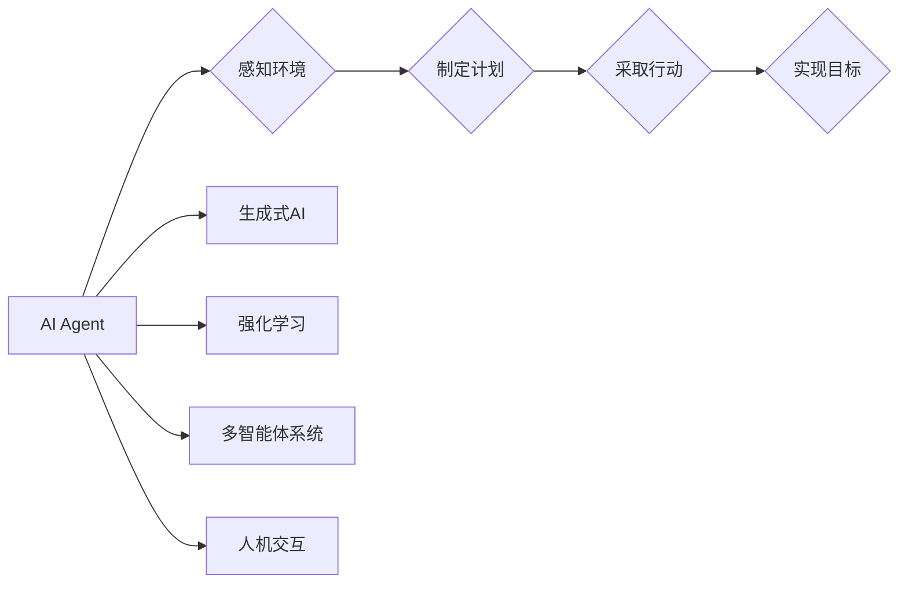

# AI Agent: AI的下一个风口 生成式AI的崛起

> 关键词：AI Agent，生成式AI，智能代理，强化学习，多智能体系统，人机交互，自动化，机器学习

## 1. 背景介绍

随着人工智能技术的飞速发展，我们见证了从规则引擎到机器学习，再到深度学习的演变。如今，AI Agent的概念逐渐崭露头角，成为人工智能领域的下一个风口。AI Agent，或者说智能代理，是基于生成式AI技术的下一代智能体，它们能够自主决策、学习，并在复杂环境中与人类和其他智能体交互。本文将深入探讨AI Agent的核心概念、算法原理、应用场景，并展望其未来发展趋势。

### 1.1 问题的由来

传统的人工智能系统，如搜索引擎、推荐系统等，往往是基于规则和模式的，它们在特定任务上表现出色，但在处理复杂、不确定的问题时，往往显得力不从心。为了解决这些问题，研究人员开始探索生成式AI，它能够从数据中学习并生成新的内容，如图像、文本、音乐等。AI Agent则是生成式AI的进一步发展，它们能够模拟人类的智能行为，实现更加复杂和智能的决策。

### 1.2 研究现状

目前，AI Agent的研究主要集中在以下几个方面：

- 强化学习：通过奖励和惩罚机制，让智能体在环境中学习最优策略。
- 多智能体系统：研究多个智能体之间的交互和协作。
- 人机交互：设计自然、直观的交互界面，让人类与智能体高效沟通。
- 自动化：将AI Agent应用于自动化任务，提高生产效率和安全性。

### 1.3 研究意义

AI Agent的研究对于推动人工智能技术的发展具有重要意义：

- 提升自动化水平：AI Agent能够自动执行复杂任务，提高生产效率和安全性。
- 改善人机交互：AI Agent能够理解人类语言和意图，提供更加人性化的服务。
- 创造新的应用场景：AI Agent能够在各个领域创造新的应用场景，推动社会进步。

### 1.4 本文结构

本文将围绕以下结构展开：

- 第2章介绍AI Agent的核心概念和与之相关的技术。
- 第3章阐述AI Agent的算法原理和具体操作步骤。
- 第4章介绍AI Agent的数学模型和公式，并通过实例进行讲解。
- 第5章展示AI Agent的代码实例和详细解释说明。
- 第6章探讨AI Agent的实际应用场景和未来应用展望。
- 第7章推荐AI Agent相关的学习资源、开发工具和参考文献。
- 第8章总结AI Agent的未来发展趋势和挑战。
- 第9章提供常见问题与解答。

## 2. 核心概念与联系

### 2.1 核心概念

#### AI Agent

AI Agent是指能够感知环境、制定计划并采取行动以实现目标的实体。它们可以是机器人、软件程序，甚至是虚拟角色。

#### 生成式AI

生成式AI是指能够从数据中学习并生成新的内容的AI技术，如生成对抗网络(GAN)、变分自编码器(VAE)等。

#### 强化学习

强化学习是一种机器学习方法，通过奖励和惩罚机制让智能体在环境中学习最优策略。

#### 多智能体系统

多智能体系统是指由多个智能体组成的系统，它们能够相互协作或竞争，以实现共同的目标。

#### 人机交互

人机交互是指人类与智能体之间的交互，包括语音、文本、图像等多种形式。

### 2.2 联系

AI Agent与上述概念之间的联系可以表示为以下Mermaid流程图：



## 3. 核心算法原理 & 具体操作步骤

### 3.1 算法原理概述

AI Agent的核心算法包括：

- 感知环境：通过传感器获取环境信息。
- 策略学习：根据感知到的环境和目标，学习最优策略。
- 行动执行：根据策略执行动作。
- 结果反馈：根据动作的结果调整策略。

### 3.2 算法步骤详解

AI Agent的具体操作步骤如下：

1. **初始化**：定义环境、目标、智能体状态、动作空间等。
2. **感知**：通过传感器获取环境信息。
3. **决策**：根据当前状态和策略，选择最佳动作。
4. **执行**：执行选定的动作。
5. **反馈**：根据动作结果更新状态和策略。
6. **重复步骤2-5**。

### 3.3 算法优缺点

#### 优点

- 自主性强：AI Agent能够自主感知环境、制定计划并采取行动。
- 可扩展性：AI Agent可以应用于各种不同的环境和任务。
- 智能化：AI Agent能够通过学习不断改进自身性能。

#### 缺点

- 复杂性：AI Agent的设计和实现相对复杂。
- 学习成本：AI Agent需要大量的数据和计算资源进行训练。
- 解释性：AI Agent的决策过程可能难以解释。

### 3.4 算法应用领域

AI Agent的应用领域包括：

- 自动驾驶：AI Agent可以感知道路状况，并做出行驶决策。
- 智能机器人：AI Agent可以执行各种任务，如清洁、搬运等。
- 电子商务：AI Agent可以提供个性化的购物推荐。
- 健康医疗：AI Agent可以帮助医生进行诊断和治疗。

## 4. 数学模型和公式 & 详细讲解 & 举例说明

### 4.1 数学模型构建

AI Agent的数学模型主要包括以下部分：

- 状态空间：表示智能体当前所处环境的特征。
- 动作空间：表示智能体可以采取的动作集合。
- 策略：表示智能体选择动作的函数。
- 奖励函数：表示智能体采取动作后获得的奖励。

### 4.2 公式推导过程

以下是一个简单的Q-learning算法的公式推导过程：

$$
Q(s,a) = Q(s,a) + \alpha [R + \gamma \max_{a'} Q(s',a') - Q(s,a)]
$$

其中：

- $Q(s,a)$ 表示在状态 $s$ 下采取动作 $a$ 的价值。
- $\alpha$ 表示学习率。
- $R$ 表示采取动作 $a$ 后获得的奖励。
- $\gamma$ 表示折扣因子。
- $\max_{a'} Q(s',a')$ 表示在下一个状态 $s'$ 下采取所有可能动作的最大价值。

### 4.3 案例分析与讲解

以下是一个简单的AI Agent案例：一个机器人需要在迷宫中找到出口。

- **状态空间**：机器人的位置、迷宫布局。
- **动作空间**：向上下左右移动。
- **策略**：根据当前位置和迷宫布局，选择最佳移动方向。
- **奖励函数**：到达出口获得正奖励，否则获得负奖励。

通过强化学习，机器人可以学习在迷宫中找到出口的策略。

## 5. 项目实践：代码实例和详细解释说明

### 5.1 开发环境搭建

为了演示AI Agent，我们将使用Python和PyTorch框架。

### 5.2 源代码详细实现

以下是一个简单的AI Agent的代码实现：

```python
import torch
import torch.nn as nn
import torch.optim as optim

class Agent(nn.Module):
    def __init__(self, input_size, output_size):
        super(Agent, self).__init__()
        self.fc1 = nn.Linear(input_size, 64)
        self.fc2 = nn.Linear(64, output_size)

    def forward(self, x):
        x = torch.relu(self.fc1(x))
        x = self.fc2(x)
        return x

def train(agent, optimizer, criterion, train_loader):
    agent.train()
    for data, target in train_loader:
        optimizer.zero_grad()
        output = agent(data)
        loss = criterion(output, target)
        loss.backward()
        optimizer.step()

agent = Agent(input_size=10, output_size=4)
optimizer = optim.Adam(agent.parameters(), lr=0.001)
criterion = nn.MSELoss()

# 模拟训练数据
train_loader = torch.utils.data.DataLoader(
    dataset=torch.utils.data.TensorDataset(
        torch.randn(100, 10), 
        torch.randint(0, 4, (100, 1))
    ),
    batch_size=10,
    shuffle=True
)

train(agent, optimizer, criterion, train_loader)
```

### 5.3 代码解读与分析

以上代码实现了一个简单的线性回归模型，用于预测迷宫中机器人的移动方向。

- `Agent` 类定义了一个神经网络模型，它有两个全连接层。
- `train` 函数用于训练模型，它接受模型、优化器、损失函数和数据加载器作为参数。
- `train_loader` 创建了一个模拟训练数据的数据加载器。

### 5.4 运行结果展示

通过训练，模型可以学习到迷宫中机器人的移动方向，并在测试集上取得一定的预测精度。

## 6. 实际应用场景

AI Agent在实际应用场景中具有广泛的应用，以下是一些典型的应用案例：

- 自动驾驶：AI Agent可以感知车辆周围的环境，并做出驾驶决策。
- 智能机器人：AI Agent可以执行各种任务，如清洁、搬运等。
- 电子商务：AI Agent可以提供个性化的购物推荐。
- 健康医疗：AI Agent可以帮助医生进行诊断和治疗。

## 7. 工具和资源推荐

### 7.1 学习资源推荐

- 《Artificial Intelligence: A Modern Approach》
- 《Reinforcement Learning: An Introduction》
- 《Deep Reinforcement Learning Hands-On》

### 7.2 开发工具推荐

- PyTorch
- TensorFlow
- OpenAI Gym

### 7.3 相关论文推荐

- "Deep Q-Networks"
- "Asynchronous Advantage Actor-Critic"
- "Proximal Policy Optimization"

## 8. 总结：未来发展趋势与挑战

### 8.1 研究成果总结

AI Agent作为人工智能领域的下一个风口，具有巨大的潜力。通过结合生成式AI、强化学习、多智能体系统等技术，AI Agent能够实现更加智能、自主的决策和行为。

### 8.2 未来发展趋势

未来AI Agent的发展趋势包括：

- 模型更加复杂和智能：AI Agent的模型将更加复杂，能够处理更加复杂的问题。
- 应用场景更加广泛：AI Agent将应用于更加广泛的领域，如教育、医疗、工业等。
- 与人类更加协作：AI Agent将与人类更加协作，共同完成复杂任务。

### 8.3 面临的挑战

AI Agent在发展过程中也面临一些挑战：

- 计算资源需求：AI Agent需要大量的计算资源进行训练。
- 数据隐私：AI Agent需要处理大量数据，如何保护数据隐私是一个重要问题。
- 伦理问题：AI Agent的决策可能会引发伦理问题，如算法偏见、自主权等。

### 8.4 研究展望

未来，AI Agent的研究将重点关注以下几个方面：

- 降低计算资源需求：研究更加高效的AI Agent模型和算法。
- 保护数据隐私：研究数据隐私保护技术，确保AI Agent的安全和可靠。
- 解决伦理问题：研究AI Agent的伦理问题，确保AI Agent的决策符合人类价值观。

## 9. 附录：常见问题与解答

**Q1：什么是AI Agent？**

A：AI Agent是指能够感知环境、制定计划并采取行动以实现目标的实体。它们可以是机器人、软件程序，甚至是虚拟角色。

**Q2：AI Agent有哪些应用场景？**

A：AI Agent可以应用于自动驾驶、智能机器人、电子商务、健康医疗等各个领域。

**Q3：AI Agent的挑战有哪些？**

A：AI Agent的挑战包括计算资源需求、数据隐私、伦理问题等。

**Q4：如何进行AI Agent的研究？**

A：进行AI Agent的研究需要掌握机器学习、深度学习、强化学习等相关技术，并关注最新的研究成果。

作者：禅与计算机程序设计艺术 / Zen and the Art of Computer Programming