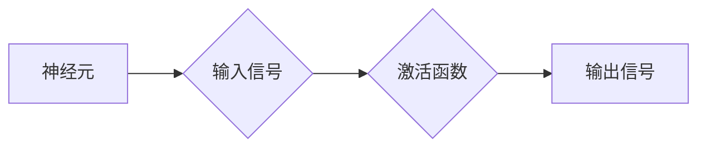
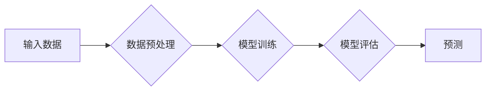
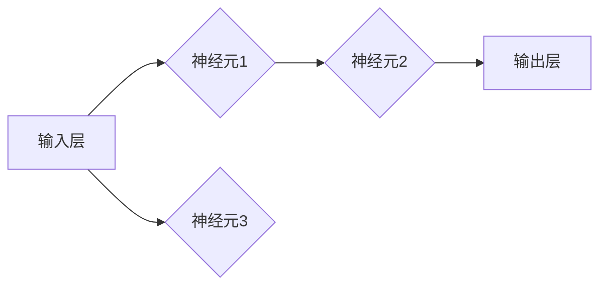

> AI, 神经网络, 仿脑计算, 类脑计算, 超脑计算, 机器学习, 深度学习, 计算模型, 人工智能

# AI 神经网络计算艺术之禅：结构仿脑、功能类脑、性能超脑

### 1. 背景介绍

自20世纪中叶以来，人工智能（AI）领域经历了多次高潮和低谷。近年来，随着计算能力的提升、大数据的涌现和深度学习技术的突破，AI迎来了新一轮的快速发展。神经网络作为AI的核心技术之一，其计算艺术正逐渐从结构仿脑走向功能类脑，并最终迈向性能超脑。

本文旨在探讨AI神经网络的计算艺术，分析其发展历程、核心概念、算法原理、数学模型以及实际应用，并展望其未来发展趋势与挑战。

### 2. 核心概念与联系

#### 2.1 神经元

神经元是神经网络的基本单元，类似于生物大脑中的神经元。每个神经元接收来自其他神经元的输入信号，通过激活函数处理后输出新的信号。



#### 2.2 网络结构

神经网络由多个神经元组成，它们通过连接形成复杂的网络结构。常见的网络结构包括：

- **前馈神经网络（FNN）**：信号从前向后传播，不形成循环。
- **卷积神经网络（CNN）**：适用于图像识别和计算机视觉任务，具有局部感知和权重共享的特性。
- **循环神经网络（RNN）**：具有循环连接，适用于序列数据处理。
- **递归神经网络（RNN）**：是RNN的一种，具有门控机制，能够更好地处理长序列数据。

#### 2.3 训练方法

神经网络训练方法主要包括监督学习、无监督学习和强化学习。其中，监督学习是最常用的训练方法，需要大量标注数据进行训练。



### 3. 核心算法原理 & 具体操作步骤

#### 3.1 算法原理概述

神经网络算法原理主要包括以下步骤：

1. **前向传播**：将输入数据输入网络，逐层计算输出。
2. **反向传播**：计算损失函数，并反向传播梯度，更新网络权重。
3. **优化算法**：使用优化算法（如梯度下降）更新权重，最小化损失函数。

#### 3.2 算法步骤详解

1. **初始化权重**：随机初始化网络权重。
2. **前向传播**：将输入数据输入网络，逐层计算输出。
3. **计算损失**：使用损失函数计算实际输出与真实标签之间的差异。
4. **反向传播**：计算损失函数对权重的梯度。
5. **更新权重**：使用优化算法更新权重。

#### 3.3 算法优缺点

- **优点**：
  - 强大的模型表达能力。
  - 高效的模型训练方法。
  - 广泛的应用领域。
- **缺点**：
  - 训练数据需求量大。
  - 计算复杂度高。
  - 模型可解释性差。

#### 3.4 算法应用领域

神经网络在以下领域有广泛的应用：

- **图像识别**：如人脸识别、物体识别、图像分类等。
- **语音识别**：如语音合成、语音翻译等。
- **自然语言处理**：如文本分类、机器翻译、文本生成等。
- **推荐系统**：如电影推荐、商品推荐等。

### 4. 数学模型和公式 & 详细讲解 & 举例说明

#### 4.1 数学模型构建

神经网络数学模型主要包括以下部分：

- **激活函数**：如Sigmoid、ReLU、Tanh等。
- **权重**：网络中连接神经元的权重。
- **偏置**：网络中每个神经元的偏置项。

#### 4.2 公式推导过程

以下以Sigmoid激活函数为例，进行公式推导：

$$
\sigma(z) = \frac{1}{1+e^{-z}}
$$

其中，$z$ 为输入值。

#### 4.3 案例分析与讲解

以下以一个简单的神经网络为例，讲解其数学模型：



假设输入层输入为 $x_1, x_2, x_3$，权重分别为 $w_{11}, w_{12}, w_{13}, w_{21}, w_{22}, w_{23}, w_{31}, w_{32}, w_{33}$，偏置分别为 $b_1, b_2, b_3$，则输出层输出为：

$$
y = \sigma(w_{11}x_1 + w_{12}x_2 + w_{13}x_3 + b_1)
$$

### 5. 项目实践：代码实例和详细解释说明

#### 5.1 开发环境搭建

1. 安装Python和NumPy库。
2. 安装TensorFlow或PyTorch库。

#### 5.2 源代码详细实现

以下使用TensorFlow实现一个简单的神经网络：

```python
import tensorflow as tf

# 定义模型
model = tf.keras.Sequential([
    tf.keras.layers.Dense(64, activation='relu', input_shape=(3,)),
    tf.keras.layers.Dense(1)
])

# 编译模型
model.compile(optimizer='adam', loss='mse')

# 训练模型
x_train = tf.random.normal([100, 3])
y_train = tf.random.normal([100, 1])

model.fit(x_train, y_train, epochs=10)

# 预测
x_test = tf.random.normal([1, 3])
y_pred = model.predict(x_test)

print(y_pred)
```

#### 5.3 代码解读与分析

1. `import tensorflow as tf`：导入TensorFlow库。
2. `model = tf.keras.Sequential([...])`：定义一个顺序模型，包含两个全连接层。
3. `model.compile(optimizer='adam', loss='mse')`：编译模型，指定优化器和损失函数。
4. `model.fit(x_train, y_train, epochs=10)`：训练模型，使用训练数据训练10个epoch。
5. `model.predict(x_test)`：使用测试数据进行预测。

### 6. 实际应用场景

神经网络在以下领域有广泛的应用：

- **图像识别**：如图像分类、物体检测、图像分割等。
- **语音识别**：如语音合成、语音翻译、语音识别等。
- **自然语言处理**：如文本分类、机器翻译、文本生成等。
- **推荐系统**：如电影推荐、商品推荐等。

### 7. 工具和资源推荐

#### 7.1 学习资源推荐

1. 《深度学习》 - Ian Goodfellow、Yoshua Bengio、Aaron Courville
2. 《神经网络与深度学习》 -邱锡鹏
3. TensorFlow官方文档
4. PyTorch官方文档

#### 7.2 开发工具推荐

1. TensorFlow
2. PyTorch
3. Keras
4. Jupyter Notebook

#### 7.3 相关论文推荐

1. "A Tutorial on Back-Propagation" - Yann LeCun, Yann Bengio, Geoffrey Hinton
2. "Deep Learning" - Ian Goodfellow, Yann Bengio, Aaron Courville
3. "Unsupervised Learning of Deep Representations by Backpropagation" - Yann LeCun, Léon Bottou, Yann Bengio, Patrick Haffner
4. "Convolutional Neural Networks for Visual Recognition" - Krizhevsky, Sutskever, Hinton

### 8. 总结：未来发展趋势与挑战

#### 8.1 研究成果总结

神经网络在AI领域取得了显著的成果，并在图像识别、语音识别、自然语言处理等领域取得了突破。然而，神经网络仍面临诸多挑战，如计算复杂度高、可解释性差、过拟合等。

#### 8.2 未来发展趋势

1. **模型压缩**：减小模型尺寸，降低计算复杂度。
2. **模型轻量化**：降低模型内存占用，提高模型部署效率。
3. **可解释性**：提高模型可解释性，增强模型的可信度。
4. **多模态学习**：将多模态信息（如图像、文本、音频等）进行整合，提高模型的表达能力。

#### 8.3 面临的挑战

1. **计算资源**：神经网络训练需要大量的计算资源，如何降低计算成本是一个挑战。
2. **数据隐私**：如何保护训练数据隐私是一个挑战。
3. **模型偏见**：如何消除模型偏见是一个挑战。

#### 8.4 研究展望

神经网络作为AI的核心技术之一，将在未来继续发挥重要作用。随着研究的深入，神经网络将在性能、可解释性、可扩展性等方面取得突破，为人工智能技术的发展贡献力量。

### 9. 附录：常见问题与解答

**Q1：什么是神经网络？**

A：神经网络是一种模拟人脑神经元连接结构的计算模型，用于处理复杂的非线性问题。

**Q2：神经网络有哪些类型？**

A：神经网络主要有前馈神经网络、卷积神经网络、循环神经网络、递归神经网络等类型。

**Q3：什么是深度学习？**

A：深度学习是一种利用深层神经网络进行学习的机器学习方法。

**Q4：神经网络有哪些应用？**

A：神经网络在图像识别、语音识别、自然语言处理、推荐系统等领域有广泛的应用。

**Q5：如何提高神经网络性能？**

A：提高神经网络性能的方法包括：增加模型深度、增加训练数据、优化模型结构、调整超参数等。

作者：禅与计算机程序设计艺术 / Zen and the Art of Computer Programming