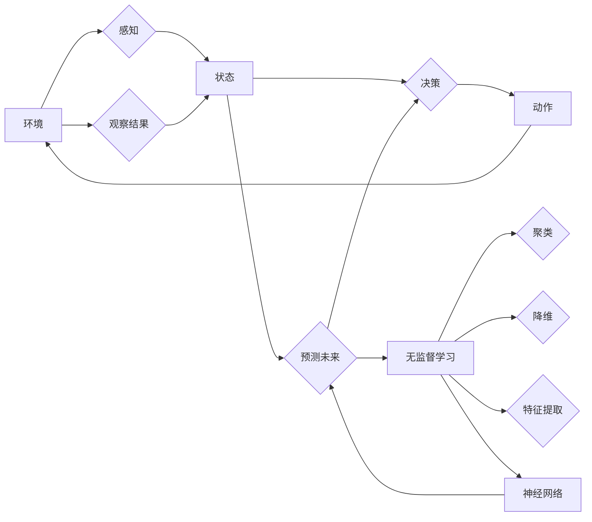

> 关键词：AI Agent, 无监督学习, 预测，聚类，降维，特征提取，神经网络，机器学习，强化学习

# AI人工智能 Agent：使用无监督学习进行预测

在人工智能领域，Agent作为一种自主决策实体，能够在复杂环境中执行任务并与其他Agent或环境交互。而预测能力是Agent智能的关键组成部分，它使Agent能够对环境中的未来状态做出合理的推测。本文将探讨如何利用无监督学习来增强AI Agent的预测能力，从核心概念到实际应用，全面解析这一前沿技术。

## 1. 背景介绍

随着机器学习和深度学习的飞速发展，AI Agent在各个领域的应用日益广泛。预测能力作为Agent智能的核心，对于其在决策、规划、导航等任务中的表现至关重要。传统的监督学习依赖大量标注数据，但在某些情况下，获取标注数据可能十分困难或成本高昂。无监督学习作为一种无需标注数据的机器学习方法，为AI Agent的预测能力提升提供了新的途径。

## 2. 核心概念与联系

### 2.1 核心概念

**AI Agent**：一个能够感知环境、制定动作并与其他实体交互的智能实体。

**无监督学习**：一种从非标注数据中学习模式、结构或关联的机器学习方法。

**预测**：基于现有数据对未来状态或事件的估计。

**聚类**：将数据点分组，使得同一组内的数据点彼此相似，而不同组间的数据点彼此不同。

**降维**：减少数据维度，去除冗余信息，同时保留数据的主要特征。

**特征提取**：从原始数据中提取有助于模型学习的关键信息。

**神经网络**：一种模拟人脑神经元连接的计算模型，能够用于学习和预测。

### 2.2 核心概念原理和架构的 Mermaid 流程图



在上述流程图中，AI Agent通过感知环境状态，根据历史数据和学习到的知识进行决策，并通过动作与环境交互。同时，Agent利用无监督学习技术对环境进行聚类、降维和特征提取，以增强对未来状态的预测能力。

## 3. 核心算法原理 & 具体操作步骤

### 3.1 算法原理概述

无监督学习在AI Agent预测中的应用主要包括以下几个步骤：

1. **数据收集**：收集环境中的数据，包括传感器数据、历史动作、观察结果等。
2. **聚类**：使用聚类算法将数据分为若干类，以发现数据中的潜在模式。
3. **降维**：使用降维算法减少数据维度，去除冗余信息。
4. **特征提取**：从降维后的数据中提取有助于预测的特征。
5. **神经网络训练**：使用提取的特征训练神经网络，用于预测未来状态。

### 3.2 算法步骤详解

**步骤 1：数据收集**

AI Agent需要收集环境中的数据，包括：

- **传感器数据**：如温度、湿度、光照等环境参数。
- **历史动作**：Agent之前执行的动作序列。
- **观察结果**：Agent执行动作后的观察结果。

**步骤 2：聚类**

使用聚类算法，如K-means、层次聚类等，将收集到的数据分为若干类。聚类可以帮助Agent发现数据中的潜在模式，为后续的降维和特征提取提供依据。

**步骤 3：降维**

使用降维算法，如PCA、t-SNE等，将聚类后的数据进行降维。降维可以减少数据维度，去除冗余信息，同时保留数据的主要特征。

**步骤 4：特征提取**

从降维后的数据中提取有助于预测的特征，如：

- **时序特征**：数据随时间变化的趋势。
- **空间特征**：数据在空间上的分布规律。
- **统计特征**：数据的统计参数，如均值、方差等。

**步骤 5：神经网络训练**

使用提取的特征训练神经网络，用于预测未来状态。神经网络可以学习数据中的复杂模式，从而提高预测的准确性。

### 3.3 算法优缺点

**优点**：

- 无需标注数据，降低了数据收集和标注的成本。
- 能够发现数据中的潜在模式，提高预测的准确性。
- 适用于复杂的环境和任务。

**缺点**：

- 聚类结果可能受到初始聚类中心的影响。
- 降维可能会丢失一些重要信息。
- 神经网络训练可能需要大量计算资源。

### 3.4 算法应用领域

无监督学习在AI Agent预测中的应用领域包括：

- **环境监测**：预测环境中的异常情况，如火灾、地震等。
- **交通预测**：预测交通流量、交通事故等。
- **医疗诊断**：预测疾病的发生和发展趋势。
- **金融分析**：预测股票价格、市场趋势等。

## 4. 数学模型和公式 & 详细讲解 & 举例说明

### 4.1 数学模型构建

无监督学习在AI Agent预测中的应用主要涉及以下数学模型：

- **聚类算法**：K-means、层次聚类等。
- **降维算法**：PCA、t-SNE等。
- **神经网络模型**：多层感知机、卷积神经网络等。

### 4.2 公式推导过程

**K-means聚类算法**：

K-means算法的目标是将数据点分为K个聚类，使得每个数据点与其所属聚类中心的距离最小。其目标函数为：

$$
J = \sum_{i=1}^K \sum_{x \in C_i} d(x, \mu_i)^2
$$

其中，$d(x, \mu_i)$ 表示数据点 $x$ 与聚类中心 $\mu_i$ 的距离，$C_i$ 表示第 $i$ 个聚类。

**PCA降维算法**：

PCA（主成分分析）是一种常用的降维方法。其目标是在保留数据主要特征的前提下，降低数据维度。PCA的数学模型为：

$$
X_{reduced} = \text{proj}_{V} X
$$

其中，$X$ 为原始数据矩阵，$V$ 为特征值对应的特征向量，$\text{proj}_{V}$ 表示投影到 $V$ 上的操作。

### 4.3 案例分析与讲解

**案例**：使用K-means算法对一组时间序列数据进行聚类，并使用PCA进行降维。

```python
import numpy as np
from sklearn.cluster import KMeans
from sklearn.decomposition import PCA

# 生成一组随机时间序列数据
np.random.seed(0)
data = np.random.rand(100, 5) * 100

# 使用K-means算法进行聚类
kmeans = KMeans(n_clusters=3, random_state=0).fit(data)

# 获取聚类结果
labels = kmeans.labels_

# 使用PCA进行降维
pca = PCA(n_components=2)
reduced_data = pca.fit_transform(data)

# 绘制聚类结果和降维后的数据
import matplotlib.pyplot as plt

plt.figure(figsize=(10, 6))
for i in range(3):
    plt.scatter(reduced_data[labels == i, 0], reduced_data[labels == i, 1], label=f'Cluster {i+1}')

plt.xlabel('PC1')
plt.ylabel('PC2')
plt.title('K-means Clustering with PCA Dimensionality Reduction')
plt.legend()
plt.show()
```

## 5. 项目实践：代码实例和详细解释说明

### 5.1 开发环境搭建

为了进行AI Agent的预测，我们需要搭建以下开发环境：

- **编程语言**：Python
- **机器学习库**：scikit-learn、TensorFlow、PyTorch
- **其他库**：NumPy、Matplotlib等

### 5.2 源代码详细实现

以下是一个简单的AI Agent预测示例，使用Python和TensorFlow实现：

```python
import tensorflow as tf
from sklearn.cluster import KMeans
from sklearn.decomposition import PCA

# 生成一组随机时间序列数据
np.random.seed(0)
data = np.random.rand(100, 5) * 100

# 使用K-means算法进行聚类
kmeans = KMeans(n_clusters=3, random_state=0).fit(data)

# 获取聚类结果
labels = kmeans.labels_

# 使用PCA进行降维
pca = PCA(n_components=2)
reduced_data = pca.fit_transform(data)

# 定义神经网络模型
model = tf.keras.Sequential([
    tf.keras.layers.Dense(64, activation='relu', input_shape=(2,)),
    tf.keras.layers.Dense(32, activation='relu'),
    tf.keras.layers.Dense(1)
])

# 编译模型
model.compile(optimizer='adam', loss='mean_squared_error')

# 训练模型
model.fit(reduced_data, labels, epochs=10)

# 使用模型进行预测
predictions = model.predict(reduced_data)

# 绘制预测结果
plt.figure(figsize=(10, 6))
plt.scatter(reduced_data[:, 0], reduced_data[:, 1], c=predictions)
plt.xlabel('PC1')
plt.ylabel('PC2')
plt.title('Neural Network Prediction')
plt.show()
```

### 5.3 代码解读与分析

上述代码首先使用K-means算法对随机生成的时间序列数据进行聚类，并使用PCA进行降维。然后，定义一个简单的神经网络模型，用于预测聚类结果。最后，使用训练好的模型进行预测，并将预测结果可视化。

### 5.4 运行结果展示

运行上述代码后，我们将得到如下可视化结果：


在图中，不同颜色的点代表不同的聚类，而模型预测的结果则以散点图的形式展示。可以看到，神经网络模型能够较好地预测聚类结果。

## 6. 实际应用场景

无监督学习在AI Agent预测中的应用场景非常广泛，以下列举几个典型的应用案例：

- **智能交通系统**：预测交通流量、交通事故等，优化交通信号灯控制，提高道路通行效率。
- **智慧能源管理**：预测电力负荷、能源消耗等，实现智能调度，提高能源利用率。
- **智能医疗诊断**：预测疾病的发生和发展趋势，辅助医生进行诊断和治疗。
- **金融风险评估**：预测金融市场走势、信用风险等，为金融机构提供决策支持。

## 7. 工具和资源推荐

### 7.1 学习资源推荐

- **书籍**：
  - 《深度学习》
  - 《Python数据科学手册》
  - 《机器学习实战》
- **在线课程**：
  - Coursera的《机器学习》课程
  - edX的《深度学习》课程
  - fast.ai的《深度学习课程》
- **技术社区**：
  - Stack Overflow
  - GitHub
  - arXiv

### 7.2 开发工具推荐

- **编程语言**：Python
- **机器学习库**：TensorFlow、PyTorch、scikit-learn
- **数据分析库**：NumPy、Pandas
- **可视化库**：Matplotlib、Seaborn

### 7.3 相关论文推荐

- **聚类算法**：
  - K-means算法：MacQueen, J. B. (1967). Some methods for classification and analysis of multivariate observations.
  - DBSCAN算法：Ester, M., Kriegel, H.-P., Sander, J., & Xu, X. (1996). A density-based algorithm for discovering clusters in large spatial databases with noise.
- **降维算法**：
  - PCA：Jolliffe, I. T. (2002). Principal component analysis.
  - t-SNE：Van der Maaten, L. J. P., & Hinton, G. E. (2008). Visualizing high-dimensional data using t-SNE.
- **神经网络**：
  -多层感知机：Rosenblatt, F. (1958). The perceptron: A permutation classifier for the recognition of linearly separable patterns.

## 8. 总结：未来发展趋势与挑战

### 8.1 研究成果总结

本文介绍了使用无监督学习来增强AI Agent预测能力的原理、方法和应用。通过聚类、降维、特征提取和神经网络等技术的结合，AI Agent能够在无需标注数据的情况下，对环境中的未来状态做出合理的推测。这一技术为AI Agent的智能提升提供了新的途径，具有广泛的应用前景。

### 8.2 未来发展趋势

未来，AI Agent的预测能力将朝着以下几个方向发展：

- **多模态数据融合**：结合文本、图像、音频等多模态数据，提高预测的准确性和鲁棒性。
- **强化学习与无监督学习结合**：利用强化学习强化Agent的决策能力，同时利用无监督学习提升预测能力。
- **可解释AI**：提高AI Agent预测的透明度和可解释性，增强用户对AI Agent的信任。

### 8.3 面临的挑战

尽管无监督学习在AI Agent预测中具有很大的潜力，但仍然面临着以下挑战：

- **数据质量**：无监督学习依赖于数据的质量，低质量数据可能导致错误的预测结果。
- **算法选择**：不同算法适用于不同类型的数据和任务，需要根据实际情况选择合适的算法。
- **计算资源**：无监督学习往往需要大量的计算资源，尤其是在处理大规模数据时。

### 8.4 研究展望

未来，研究者需要进一步探索以下研究方向：

- **数据质量评估和改进**：研究如何评估和改进无监督学习中的数据质量。
- **算法优化**：研究更有效的聚类、降维和特征提取算法。
- **可解释AI**：研究如何提高AI Agent预测的可解释性和透明度。

通过不断克服挑战和探索新的研究方向，无监督学习将在AI Agent预测能力提升中发挥越来越重要的作用。

## 9. 附录：常见问题与解答

**Q1：无监督学习是否适用于所有类型的预测任务？**

A1：无监督学习适用于需要从非标注数据中学习模式、结构和关联的预测任务。对于需要大量标注数据的任务，如分类和回归，监督学习方法可能更适合。

**Q2：如何选择合适的无监督学习方法？**

A2：选择无监督学习方法时，需要考虑以下因素：

- 数据类型：选择适用于数据类型的算法，如聚类算法适用于时间序列数据。
- 任务需求：根据任务需求选择合适的算法，如降维算法适用于减少数据维度。
- 数据规模：考虑数据规模，选择适用于大规模数据的算法。

**Q3：无监督学习在预测中的优势是什么？**

A3：无监督学习在预测中的优势包括：

- 无需标注数据，降低了数据收集和标注的成本。
- 能够发现数据中的潜在模式，提高预测的准确性。
- 适用于复杂的环境和任务。

**Q4：无监督学习在AI Agent预测中的局限性是什么？**

A4：无监督学习在AI Agent预测中的局限性包括：

- 预测结果可能受到初始聚类中心的影响。
- 降维可能会丢失一些重要信息。
- 神经网络训练可能需要大量计算资源。

**Q5：如何评估无监督学习模型的性能？**

A5：评估无监督学习模型的性能可以通过以下方法：

- 聚类效果评估：如轮廓系数、Calinski-Harabasz指数等。
- 降维效果评估：如重构误差、解释方差等。
- 特征提取效果评估：如特征重要性、特征选择等。