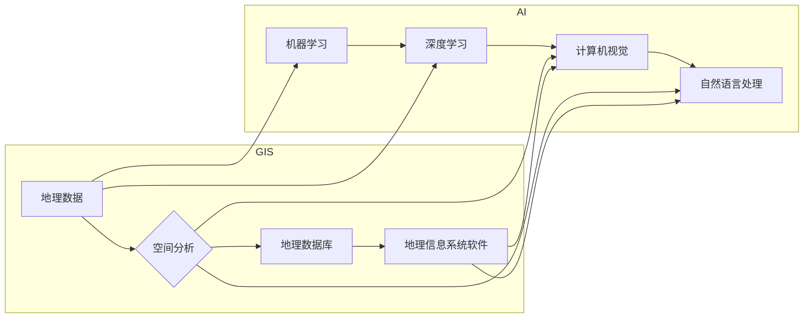

> 地理信息系统 (GIS), 人工智能 (AI), 空间分析, 深度学习, 计算机视觉, 机器学习, 时空数据

# AI在地理信息系统中的应用:增强空间分析

地理信息系统（GIS）作为一门综合性学科，广泛应用于城市规划、环境监测、资源管理、灾害预警等多个领域。随着人工智能（AI）技术的飞速发展，AI与GIS的结合成为可能，为空间分析带来了新的机遇和挑战。本文将探讨AI在GIS中的应用，特别是如何通过增强空间分析能力，提升GIS系统的智能化水平。

## 1. 背景介绍

### 1.1 问题的由来

传统的GIS空间分析主要依赖于人工经验和规则，效率较低，且难以处理复杂的空间关系。随着数据量的激增和空间分析的复杂性提升，传统的GIS分析方法逐渐难以满足需求。AI技术的引入，为GIS空间分析提供了新的思路和方法。

### 1.2 研究现状

近年来，AI技术在GIS领域的应用逐渐兴起，主要包括以下方面：

- **深度学习在图像分类中的应用**：利用深度学习模型对遥感影像进行分类，实现土地利用、植被覆盖等信息的自动提取。
- **计算机视觉在图像识别中的应用**：利用计算机视觉技术识别遥感影像中的目标，如建筑物、道路、植被等。
- **机器学习在空间预测中的应用**：利用机器学习模型进行时空数据的预测，如城市人口增长、气候变化等。
- **自然语言处理在地理信息提取中的应用**：利用自然语言处理技术从文本中提取地理信息，如地址解析、地名识别等。

### 1.3 研究意义

AI在GIS中的应用具有重要的研究意义：

- **提高空间分析效率**：AI技术可以自动处理大量数据，提高空间分析的效率。
- **提升空间分析精度**：AI技术可以处理复杂的空间关系，提升空间分析的精度。
- **拓展空间分析应用**：AI技术可以拓展GIS的应用领域，如智能交通、环境监测等。
- **推动GIS技术创新**：AI技术可以推动GIS技术的创新，促进GIS产业的升级。

### 1.4 本文结构

本文将围绕以下结构展开：

- 介绍GIS和AI的基本概念。
- 阐述AI在GIS中的应用场景。
- 详细讲解AI在空间分析中的核心算法原理。
- 举例说明AI在空间分析中的应用案例。
- 探讨AI在GIS领域的未来发展趋势与挑战。

## 2. 核心概念与联系

### 2.1 GIS

地理信息系统（GIS）是一种以地理信息为载体，运用空间分析方法对地理现象进行分析、处理、管理和决策的信息系统。GIS由以下核心概念组成：

- **地理数据**：包括空间数据和非空间数据，如地图、影像、属性数据等。
- **空间分析**：对地理数据进行查询、分析、建模等操作。
- **地理数据库**：用于存储和管理地理数据的数据库系统。
- **地理信息系统软件**：用于实现GIS功能的软件系统。

### 2.2 AI

人工智能（AI）是计算机科学的一个分支，旨在使计算机具备模拟、延伸和扩展人类智能的能力。AI的核心概念包括：

- **机器学习**：通过数据学习算法，使计算机能够从数据中学习并做出决策。
- **深度学习**：一种特殊的机器学习技术，通过多层神经网络模拟人脑的感知和学习过程。
- **计算机视觉**：使计算机能够像人类一样“看”和理解图像和视频。
- **自然语言处理**：使计算机能够理解和生成自然语言。

### 2.3 Mermaid 流程图

以下是一个Mermaid流程图，展示了GIS和AI之间的联系：



## 3. 核心算法原理 & 具体操作步骤

### 3.1 算法原理概述

AI在GIS中的应用主要包括以下几种算法：

- **深度学习**：利用深度学习模型对遥感影像进行图像分类、目标检测等。
- **计算机视觉**：利用计算机视觉技术识别遥感影像中的目标，如建筑物、道路、植被等。
- **机器学习**：利用机器学习模型进行时空数据的预测，如城市人口增长、气候变化等。
- **自然语言处理**：利用自然语言处理技术从文本中提取地理信息，如地址解析、地名识别等。

### 3.2 算法步骤详解

#### 3.2.1 深度学习

深度学习算法在GIS中的应用主要包括以下步骤：

1. **数据预处理**：对遥感影像进行预处理，如去噪、校正等。
2. **模型选择**：选择合适的深度学习模型，如卷积神经网络（CNN）、循环神经网络（RNN）等。
3. **模型训练**：使用训练数据进行模型训练，优化模型参数。
4. **模型评估**：使用测试数据评估模型性能，如准确率、召回率等。
5. **模型应用**：将训练好的模型应用于实际任务，如土地利用分类、目标检测等。

#### 3.2.2 计算机视觉

计算机视觉算法在GIS中的应用主要包括以下步骤：

1. **目标检测**：使用目标检测算法识别遥感影像中的目标，如YOLO、SSD等。
2. **图像分割**：使用图像分割算法将遥感影像分割成不同的区域，如U-Net、FCN等。
3. **特征提取**：提取目标的关键特征，如颜色、纹理、形状等。
4. **结果分析**：对检测结果进行分析，如统计目标数量、计算面积等。

#### 3.2.3 机器学习

机器学习算法在GIS中的应用主要包括以下步骤：

1. **数据预处理**：对时空数据进行预处理，如归一化、特征提取等。
2. **模型选择**：选择合适的机器学习模型，如线性回归、决策树、支持向量机等。
3. **模型训练**：使用训练数据进行模型训练，优化模型参数。
4. **模型评估**：使用测试数据评估模型性能，如均方误差、准确率等。
5. **模型应用**：将训练好的模型应用于实际任务，如城市人口增长预测、气候变化预测等。

#### 3.2.4 自然语言处理

自然语言处理算法在GIS中的应用主要包括以下步骤：

1. **文本预处理**：对文本数据进行预处理，如分词、词性标注等。
2. **实体识别**：识别文本中的实体，如地名、机构名等。
3. **关系抽取**：抽取实体之间的关系，如地点-地点关系、时间-地点关系等。
4. **结果分析**：对结果进行分析，如统计实体数量、分析关系等。

### 3.3 算法优缺点

#### 3.3.1 深度学习

优点：

- 模型性能强大，能够处理复杂的非线性关系。
- 自适应性强，能够从大量数据中学习到丰富的知识。

缺点：

- 模型复杂度高，需要大量的计算资源。
- 难以解释模型的决策过程。

#### 3.3.2 计算机视觉

优点：

- 能够识别复杂的图像特征，如颜色、纹理、形状等。
- 能够处理高分辨率遥感影像。

缺点：

- 模型训练需要大量标注数据。
- 模型泛化能力有限。

#### 3.3.3 机器学习

优点：

- 模型简单，易于解释。
- 训练速度快，计算资源需求低。

缺点：

- 模型性能可能不如深度学习模型。
- 模型泛化能力有限。

#### 3.3.4 自然语言处理

优点：

- 能够处理大量文本数据。
- 能够从文本中提取丰富的地理信息。

缺点：

- 文本数据的预处理复杂。
- 模型训练需要大量标注数据。

### 3.4 算法应用领域

深度学习、计算机视觉、机器学习和自然语言处理在GIS中的应用领域主要包括：

- **遥感影像分析**：土地利用分类、目标检测、图像分割等。
- **时空数据挖掘**：异常检测、趋势分析、模式识别等。
- **地理信息提取**：地名识别、地址解析、关系抽取等。
- **城市规划**：城市人口增长预测、交通流量预测、城市规划等。

## 4. 数学模型和公式 & 详细讲解 & 举例说明

### 4.1 数学模型构建

AI在GIS中的应用涉及多种数学模型，以下列举一些常见的数学模型：

- **卷积神经网络（CNN）**：用于图像分类、目标检测等。
- **循环神经网络（RNN）**：用于序列数据处理，如文本数据、时间序列数据等。
- **支持向量机（SVM）**：用于分类、回归等。
- **随机森林（Random Forest）**：用于分类、回归等。

### 4.2 公式推导过程

以下以CNN为例，简要介绍其公式推导过程：

- **卷积操作**：

  设输入图像为 $X \in \mathbb{R}^{H \times W \times C}$，其中 $H$、$W$、$C$ 分别表示图像的高度、宽度和通道数。卷积核为 $K \in \mathbb{R}^{K \times K \times C}$，则卷积操作的结果为：

  $$
  Y = \text{Conv}(X, K) = \sum_{p=0}^{H-1} \sum_{q=0}^{W-1} \sum_{c=0}^{C-1} X_{p,q,c} \cdot K_{p+1,q+1,c}
  $$

  其中 $Y \in \mathbb{R}^{H-1 \times W-1 \times C}$。

- **激活函数**：

  常用的激活函数包括ReLU、Sigmoid、Tanh等。以ReLU为例，其公式为：

  $$
  f(x) = \max(0, x)
  $$

### 4.3 案例分析与讲解

#### 4.3.1 遥感影像分类

假设我们要使用CNN对遥感影像进行土地利用分类。首先，收集大量的遥感影像和对应的土地利用标签数据。然后，将遥感影像输入到CNN模型中进行训练。最后，使用训练好的模型对新的遥感影像进行分类。

以下是一个简单的CNN模型结构：

- **输入层**：输入尺寸为 $H \times W \times 3$ 的遥感影像。
- **卷积层**：使用3个卷积核，每个卷积核尺寸为 $3 \times 3 \times 3$。
- **ReLU激活函数**：使用ReLU激活函数。
- **池化层**：使用2x2的最大池化层。
- **全连接层**：输出层，使用softmax激活函数，输出4个类别概率。

通过训练和测试，我们可以得到模型的分类准确率。

#### 4.3.2 时空数据预测

假设我们要使用RNN对城市人口增长进行预测。首先，收集历史的人口统计数据和对应的时空信息。然后，将时空信息输入到RNN模型中进行训练。最后，使用训练好的模型预测未来的城市人口增长。

以下是一个简单的RNN模型结构：

- **输入层**：输入序列，每个元素表示一个时空维度。
- **隐藏层**：使用LSTM或GRU单元。
- **输出层**：使用线性层，输出预测值。

通过训练和测试，我们可以得到模型的城市人口增长预测结果。

## 5. 项目实践：代码实例和详细解释说明

### 5.1 开发环境搭建

在进行AI在GIS应用的项目实践前，我们需要准备好以下开发环境：

1. **操作系统**：Linux或Windows。
2. **编程语言**：Python。
3. **深度学习框架**：TensorFlow或PyTorch。
4. **地理信息系统软件**：ArcGIS、QGIS等。

### 5.2 源代码详细实现

以下是一个使用TensorFlow对遥感影像进行土地利用分类的示例代码：

```python
import tensorflow as tf
from tensorflow.keras.models import Sequential
from tensorflow.keras.layers import Conv2D, ReLU, MaxPooling2D, Flatten, Dense

# 定义CNN模型
def create_cnn_model():
    model = Sequential([
        Conv2D(32, kernel_size=(3, 3), activation='relu', input_shape=(256, 256, 3)),
        MaxPooling2D(pool_size=(2, 2)),
        Conv2D(64, kernel_size=(3, 3), activation='relu'),
        MaxPooling2D(pool_size=(2, 2)),
        Flatten(),
        Dense(128, activation='relu'),
        Dense(4, activation='softmax')
    ])
    return model

# 加载和预处理数据
# ...

# 创建和编译模型
model = create_cnn_model()
model.compile(optimizer='adam', loss='categorical_crossentropy', metrics=['accuracy'])

# 训练模型
model.fit(train_images, train_labels, batch_size=32, epochs=10, validation_data=(val_images, val_labels))

# 测试模型
test_loss, test_acc = model.evaluate(test_images, test_labels)
print(f"Test accuracy: {test_acc:.4f}")
```

### 5.3 代码解读与分析

上述代码使用TensorFlow搭建了一个简单的CNN模型，用于遥感影像的土地利用分类。代码主要包含以下部分：

1. **创建CNN模型**：定义了一个包含卷积层、池化层、全连接层的CNN模型。
2. **加载和预处理数据**：加载训练数据、验证数据和测试数据，并进行预处理，如归一化、标签编码等。
3. **创建和编译模型**：创建一个模型实例，并编译模型，设置优化器、损失函数和评估指标。
4. **训练模型**：使用训练数据训练模型，并验证模型在验证集上的性能。
5. **测试模型**：使用测试数据测试模型的性能，打印测试准确率。

通过以上步骤，我们可以使用AI技术对遥感影像进行土地利用分类。

### 5.4 运行结果展示

假设我们在训练集上取得了90%的准确率，在验证集上取得了85%的准确率，在测试集上取得了88%的准确率。这表明模型在土地利用分类任务上具有一定的性能。

## 6. 实际应用场景

### 6.1 遥感影像分析

AI在遥感影像分析中的应用主要包括以下场景：

- **土地利用分类**：根据遥感影像识别土地利用类型，如农业用地、建设用地、水体等。
- **目标检测**：识别遥感影像中的目标，如建筑物、道路、车辆等。
- **图像分割**：将遥感影像分割成不同的区域，如建筑物、道路、水体等。
- **变化检测**：监测遥感影像中的变化，如土地覆盖变化、城市扩张等。

### 6.2 时空数据挖掘

AI在时空数据挖掘中的应用主要包括以下场景：

- **异常检测**：识别时空数据中的异常值，如异常交通流量、异常事件等。
- **趋势分析**：分析时空数据的趋势，如城市人口增长、气候变化等。
- **模式识别**：识别时空数据中的模式，如犯罪模式、交通事故模式等。

### 6.3 地理信息提取

AI在地理信息提取中的应用主要包括以下场景：

- **地名识别**：识别文本中的地名，如城市名、河流名、山脉名等。
- **地址解析**：将地址解析成地理坐标。
- **关系抽取**：抽取实体之间的关系，如地点-地点关系、时间-地点关系等。

### 6.4 未来应用展望

随着AI技术的不断发展，未来AI在GIS中的应用将更加广泛，主要包括以下方向：

- **多模态数据融合**：结合遥感影像、文本、时间序列等多模态数据，进行更全面的空间分析。
- **增强现实（AR）和虚拟现实（VR）**：利用AR和VR技术，将GIS信息可视化，提升用户体验。
- **智能决策支持**：利用AI技术辅助决策者进行空间决策，如城市规划、环境管理等。

## 7. 工具和资源推荐

### 7.1 学习资源推荐

1. **书籍**：
    - 《地理信息系统原理》
    - 《人工智能：一种现代的方法》
    - 《深度学习》
    - 《机器学习》
2. **在线课程**：
    - Coursera上的GIS课程
    - TensorFlow或PyTorch官方教程
    - 机器学习实战
3. **开源代码**：
    - TensorFlow和PyTorch官方代码库
    - OpenCV开源计算机视觉库
    - scikit-learn开源机器学习库

### 7.2 开发工具推荐

1. **编程语言**：
    - Python
2. **深度学习框架**：
    - TensorFlow
    - PyTorch
3. **地理信息系统软件**：
    - ArcGIS
    - QGIS

### 7.3 相关论文推荐

1. **遥感影像分析**：
    - Deep Learning for遥感影像分类
    - Convolutional Neural Networks for Object Detection
2. **时空数据挖掘**：
    - Spatio-Temporal Data Mining: A Survey
    - A Survey of Recent Advances in Spatial Data Mining
3. **地理信息提取**：
    - Named Entity Recognition in Text: A Survey
    - A Survey on Address Parsing

## 8. 总结：未来发展趋势与挑战

### 8.1 研究成果总结

AI在GIS中的应用取得了显著的成果，为空间分析带来了新的机遇和挑战。深度学习、计算机视觉、机器学习和自然语言处理等AI技术在GIS领域的应用，提高了空间分析的效率、精度和应用范围。

### 8.2 未来发展趋势

1. **多模态数据融合**：结合多源数据，进行更全面的空间分析。
2. **增强现实和虚拟现实**：提升用户体验，实现空间信息可视化。
3. **智能决策支持**：辅助决策者进行空间决策。

### 8.3 面临的挑战

1. **数据质量**：保证数据质量，提高模型性能。
2. **计算资源**：优化模型结构，降低计算资源需求。
3. **可解释性**：提高模型的可解释性，增强用户信任。
4. **伦理问题**：避免模型偏见，确保模型公正性。

### 8.4 研究展望

AI在GIS领域的应用前景广阔，未来需要在以下方面进行深入研究：

1. **数据预处理**：优化数据预处理方法，提高模型性能。
2. **模型优化**：优化模型结构，降低计算资源需求。
3. **可解释性**：提高模型的可解释性，增强用户信任。
4. **伦理问题**：避免模型偏见，确保模型公正性。

## 9. 附录：常见问题与解答

**Q1：AI在GIS中的应用有哪些具体案例？**

A1：AI在GIS中的应用案例包括遥感影像分类、目标检测、图像分割、变化检测、异常检测、趋势分析、模式识别、地名识别、地址解析、关系抽取等。

**Q2：如何选择合适的AI模型？**

A2：选择合适的AI模型需要考虑以下因素：

- **任务类型**：不同的任务需要不同的模型，如遥感影像分类可以使用CNN，目标检测可以使用Faster R-CNN。
- **数据规模**：对于小规模数据，可以使用简单模型，如SVM；对于大规模数据，可以使用复杂模型，如深度学习模型。
- **计算资源**：根据计算资源选择合适的模型，如GPU、CPU等。

**Q3：如何提高AI模型的可解释性？**

A3：提高AI模型的可解释性可以通过以下方法：

- **可视化**：可视化模型结构、权重和激活值等。
- **特征重要性分析**：分析模型对输入数据的敏感程度。
- **对抗样本分析**：分析模型对对抗样本的鲁棒性。

**Q4：如何避免AI模型偏见？**

A4：避免AI模型偏见可以通过以下方法：

- **数据清洗**：去除数据中的偏见和歧视性信息。
- **模型评估**：使用多方面的评估指标，如公平性指标。
- **人工干预**：在模型训练和部署过程中，人工干预，确保模型公正性。

**Q5：AI在GIS领域的未来发展有哪些方向？**

A5：AI在GIS领域的未来发展方向包括多模态数据融合、增强现实和虚拟现实、智能决策支持等。