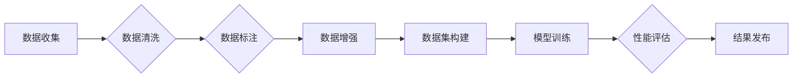
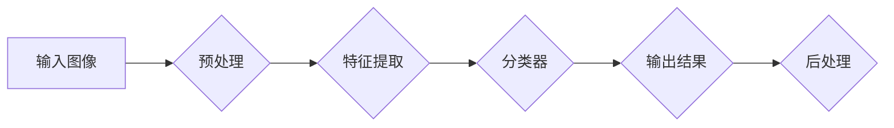

# ImageNet对AI图像识别的推动

> 关键词：ImageNet, 人工智能, 图像识别, 深度学习, 卷积神经网络, 数据集, 性能提升, 研究进展

## 1. 背景介绍

图像识别是人工智能领域的一个重要分支，它涉及到机器视觉、计算机视觉和模式识别等多个学科。随着深度学习技术的快速发展，图像识别技术在近年来取得了显著的进步。而ImageNet数据集的发布，无疑是这一领域发展的重要推动力。本文将深入探讨ImageNet对AI图像识别的推动作用，分析其核心概念、算法原理、实际应用场景，并展望未来的发展趋势。

### 1.1 问题的由来

早期的人工智能图像识别技术主要依赖于传统的方法，如SIFT、HOG等，这些方法在特定领域取得了不错的效果，但在面对大规模图像识别任务时，往往难以满足需求。直到深度学习技术的出现，特别是卷积神经网络（Convolutional Neural Networks, CNNs）的兴起，图像识别领域才迎来了前所未有的发展。

然而，早期深度学习模型的性能提升主要依赖于模型结构的创新和计算资源的增加。为了进一步推动图像识别技术的发展，需要一个大型的、多样化的图像数据集来训练和评估模型。正是基于这样的需求，ImageNet数据集应运而生。

### 1.2 研究现状

ImageNet数据集自2009年发布以来，已经成为图像识别领域最具影响力的基准数据集。它包含了超过1400万个图像，涵盖了1000个类别，每个类别至少包含1000个图像。ImageNet的发布，极大地推动了图像识别技术的发展，激发了大量的研究工作。

### 1.3 研究意义

ImageNet对AI图像识别的推动意义体现在以下几个方面：

1. **数据驱动的研究**：ImageNet提供了大规模、多样化的图像数据，为深度学习模型的训练和评估提供了有力支撑。
2. **性能提升的驱动力**：ImageNet的发布促使研究人员不断优化模型结构和训练方法，推动了图像识别性能的大幅提升。
3. **技术标准的制定**：ImageNet成为图像识别领域的技术标准，促进了不同算法和模型的公平比较。
4. **学术交流的平台**：ImageNet为研究人员提供了交流的平台，促进了学术研究的进步。

### 1.4 本文结构

本文将按照以下结构展开：

- **第2章**：介绍ImageNet数据集的核心概念和流程。
- **第3章**：分析ImageNet对AI图像识别的推动作用，包括算法原理和具体操作步骤。
- **第4章**：介绍图像识别的数学模型和公式，并进行分析和讲解。
- **第5章**：通过项目实践，展示图像识别的代码实例和详细解释说明。
- **第6章**：探讨ImageNet在各个实际应用场景中的应用。
- **第7章**：推荐相关学习资源、开发工具和参考文献。
- **第8章**：总结ImageNet对AI图像识别的推动作用，并展望未来发展趋势与挑战。
- **第9章**：提供附录，包括常见问题与解答。

## 2. 核心概念与联系

### 2.1 ImageNet数据集

ImageNet数据集由微软研究院和Caltech联合创建，包含了超过1400万个图像，涵盖了1000个类别。每个类别的图像数量至少为1000张，部分类别甚至包含数千张图像。数据集的图像来自互联网，经过人工标注和分类。

### 2.2 ImageNet流程图

以下是ImageNet的核心流程图，展示了数据集的构建和使用的流程：



- **数据收集**：从互联网收集大量图像，包括自然场景、人物、动物、物体等。
- **数据清洗**：去除重复、低质量的图像，确保数据集的质量。
- **数据标注**：对图像进行人工标注，确定图像所属的类别。
- **数据增强**：对图像进行旋转、缩放、裁剪等操作，增加数据集的多样性。
- **数据集构建**：将清洗、标注和增强后的数据集整理成统一的格式，便于后续使用。
- **模型训练**：使用ImageNet数据集训练深度学习模型，如CNNs。
- **性能评估**：在ImageNet数据集上评估模型的性能，包括准确率、召回率等指标。
- **结果发布**：将模型性能和研究成果公开发布，促进学术交流。

### 2.3 核心概念原理和架构的 Mermaid 流程图

以下是ImageNet中核心概念原理和架构的Mermaid流程图：



- **输入图像**：模型接收原始图像作为输入。
- **预处理**：对图像进行尺寸调整、归一化等操作。
- **特征提取**：使用卷积神经网络等深度学习模型提取图像特征。
- **分类器**：使用全连接层等分类器对提取的特征进行分类。
- **输出结果**：模型输出图像的类别预测结果。
- **后处理**：对输出结果进行格式转换、可视化等操作。

## 3. 核心算法原理 & 具体操作步骤

### 3.1 算法原理概述

ImageNet的成功，离不开深度学习技术的推动。特别是卷积神经网络（CNNs）在图像识别领域的广泛应用，使得图像识别性能得到了显著提升。

卷积神经网络通过模仿人眼视觉感知机制，使用卷积层提取图像特征，并通过池化层降低特征维度。最后，使用全连接层对提取的特征进行分类。

### 3.2 算法步骤详解

以下是使用ImageNet进行图像识别的详细步骤：

1. **数据预处理**：将图像转换为统一的尺寸，并进行归一化处理。
2. **模型构建**：构建卷积神经网络模型，包括卷积层、池化层和全连接层。
3. **模型训练**：使用ImageNet数据集对模型进行训练，包括前向传播、反向传播和参数更新。
4. **模型评估**：使用ImageNet测试集评估模型性能，包括准确率、召回率等指标。
5. **模型优化**：根据评估结果，调整模型结构和参数，以提高性能。

### 3.3 算法优缺点

**优点**：

- **性能优越**：卷积神经网络在图像识别任务上取得了显著的性能提升。
- **泛化能力强**：通过在大规模数据集上进行训练，模型具有较好的泛化能力。
- **可扩展性好**：可以通过增加网络层数、调整参数等方式，进一步提高模型性能。

**缺点**：

- **计算量大**：卷积神经网络需要大量的计算资源，训练过程耗时较长。
- **数据需求量大**：需要大量的图像数据集进行训练，数据获取成本较高。
- **可解释性差**：卷积神经网络的决策过程难以解释，难以理解模型是如何进行分类的。

### 3.4 算法应用领域

卷积神经网络在图像识别领域的应用非常广泛，包括：

- **目标检测**：如车辆检测、人脸识别等。
- **图像分割**：如图像分割、语义分割等。
- **图像分类**：如图像风格转换、图像质量评估等。

## 4. 数学模型和公式 & 详细讲解 & 举例说明

### 4.1 数学模型构建

卷积神经网络是一种深度学习模型，其数学模型可以表示为：

$$
y = f(W \cdot h(x) + b)
$$

其中，$y$ 是输出结果，$x$ 是输入图像，$h(x)$ 是输入图像经过卷积层和池化层处理后的特征向量，$W$ 是模型参数（权重），$b$ 是偏置项，$f$ 是激活函数。

### 4.2 公式推导过程

以下是卷积神经网络的公式推导过程：

1. **卷积层**：

$$
h(x) = \sum_{k=1}^K w^k \cdot x \cdot b^k
$$

其中，$K$ 是卷积核的数量，$w^k$ 是卷积核权重，$x$ 是输入图像，$b^k$ 是卷积核偏置。

2. **激活函数**：

$$
f(x) = \max(0, x)
$$

3. **池化层**：

$$
h'(x) = max_pool(h(x))
$$

其中，$max_pool$ 是最大池化操作。

4. **全连接层**：

$$
y = f(W \cdot h'(x) + b)
$$

### 4.3 案例分析与讲解

以下是一个简单的卷积神经网络模型，用于图像分类：

```
卷积层(3x3, 16个卷积核) -> 激活函数ReLU -> 最大池化(2x2) -> 全连接层(10个神经元) -> 激活函数Softmax
```

该模型可以用于将图像分类为10个类别。具体实现如下：

```python
import torch
import torch.nn as nn

class ConvNet(nn.Module):
    def __init__(self):
        super(ConvNet, self).__init__()
        self.conv1 = nn.Conv2d(3, 16, kernel_size=3, padding=1)
        self.relu = nn.ReLU()
        self.pool = nn.MaxPool2d(2, 2)
        self.fc = nn.Linear(16 * 7 * 7, 10)
        self.softmax = nn.Softmax(dim=1)

    def forward(self, x):
        x = self.pool(self.relu(self.conv1(x)))
        x = x.view(-1, 16 * 7 * 7)
        x = self.softmax(self.fc(x))
        return x
```

## 5. 项目实践：代码实例和详细解释说明

### 5.1 开发环境搭建

为了进行图像识别项目实践，我们需要搭建以下开发环境：

- Python 3.x
- PyTorch或TensorFlow
- OpenCV
- torchvision

以下是使用PyTorch搭建开发环境的示例：

```bash
pip install torch torchvision opencv-python
```

### 5.2 源代码详细实现

以下是一个使用PyTorch和torchvision实现图像识别的示例代码：

```python
import torch
import torch.nn as nn
import torchvision.transforms as transforms
from torchvision import datasets, models
from torch.utils.data import DataLoader

# 数据预处理
transform = transforms.Compose([
    transforms.Resize((256, 256)),
    transforms.ToTensor(),
    transforms.Normalize(mean=[0.485, 0.456, 0.406], std=[0.229, 0.224, 0.225]),
])

# 加载数据集
train_dataset = datasets.CIFAR10(root='./data', train=True, download=True, transform=transform)
train_loader = DataLoader(train_dataset, batch_size=32, shuffle=True)

# 构建模型
model = models.resnet18(pretrained=True)

# 定义损失函数和优化器
criterion = nn.CrossEntropyLoss()
optimizer = torch.optim.SGD(model.parameters(), lr=0.01, momentum=0.9)

# 训练模型
for epoch in range(10):
    running_loss = 0.0
    for i, data in enumerate(train_loader, 0):
        inputs, labels = data
        optimizer.zero_grad()
        outputs = model(inputs)
        loss = criterion(outputs, labels)
        loss.backward()
        optimizer.step()
        running_loss += loss.item()
        if i % 100 == 99:
            print(f'[{epoch + 1}, {i + 1}] loss: {running_loss / 100:.3f}')
            running_loss = 0.0

print('Finished Training')

# 保存模型
torch.save(model.state_dict(), 'resnet18_cifar10.pth')

# 测试模型
model.eval()
correct = 0
total = 0
with torch.no_grad():
    for data in test_loader:
        images, labels = data
        outputs = model(images)
        _, predicted = torch.max(outputs.data, 1)
        total += labels.size(0)
        correct += (predicted == labels).sum().item()

print(f'Accuracy of the network on the 10000 test images: {100 * correct // total}%')
```

### 5.3 代码解读与分析

以上代码实现了使用ResNet-18模型在CIFAR-10数据集上进行图像分类的示例。以下是代码的详细解读：

- 首先，导入所需的库，包括PyTorch、torchvision等。
- 然后，定义数据预处理方法，包括图像尺寸调整、归一化等操作。
- 接着，加载数据集，并使用DataLoader进行数据加载。
- 然后，构建模型，使用ResNet-18作为基础网络，并加载预训练权重。
- 定义损失函数和优化器，选择交叉熵损失函数和SGD优化器。
- 进行模型训练，包括前向传播、反向传播和参数更新。
- 保存训练后的模型。
- 测试模型，在测试集上计算准确率。

### 5.4 运行结果展示

运行以上代码后，可以得到ResNet-18模型在CIFAR-10数据集上的准确率。根据实际运行结果，可以得到模型在测试集上的准确率。

## 6. 实际应用场景

ImageNet在图像识别领域有着广泛的应用，以下是一些常见的应用场景：

- **自动驾驶**：使用ImageNet进行车辆检测、行人检测等，辅助自动驾驶系统进行决策。
- **安防监控**：使用ImageNet进行人脸识别、物体识别等，提升安防监控系统的智能化水平。
- **医学影像**：使用ImageNet进行医学图像分析，辅助医生进行诊断和检测。
- **内容审核**：使用ImageNet进行图像识别，辅助内容审核系统过滤违规内容。

### 6.4 未来应用展望

随着深度学习技术的不断发展，ImageNet在图像识别领域的应用前景将更加广阔。以下是一些未来的应用展望：

- **多模态融合**：结合图像识别和其他模态（如文本、音频）进行更全面的信息处理。
- **小样本学习**：在标注数据有限的情况下，通过迁移学习等技术实现图像识别。
- **无监督学习**：利用无监督学习方法进行图像识别，降低对标注数据的依赖。
- **可解释性**：提高图像识别模型的可解释性，让模型决策过程更加透明。

## 7. 工具和资源推荐

### 7.1 学习资源推荐

以下是一些学习ImageNet和图像识别的资源：

- **《深度学习》**：Ian Goodfellow等所著的深度学习经典教材，详细介绍了深度学习的基本原理和应用。
- **《计算机视觉：算法与应用》**：David A. Forsyth等所著的计算机视觉经典教材，涵盖了计算机视觉的基本理论和应用。
- **ImageNet官方网站**：提供ImageNet数据集和工具的官方网站，包括数据集下载、模型评估等。
- **PyTorch官方网站**：提供PyTorch库的官方文档和教程，帮助开发者快速上手PyTorch。
- **TensorFlow官方网站**：提供TensorFlow库的官方文档和教程，帮助开发者快速上手TensorFlow。

### 7.2 开发工具推荐

以下是一些用于图像识别开发的工具：

- **PyTorch**：由Facebook开发的开源深度学习库，具有灵活的动态计算图和强大的社区支持。
- **TensorFlow**：由Google开发的开源深度学习库，具有丰富的生态系统和工业级部署支持。
- **OpenCV**：开源的计算机视觉库，提供了丰富的图像处理和计算机视觉算法。
- **MATLAB**：MATLAB是一款高性能的科学计算软件，提供了丰富的图像处理和计算机视觉工具箱。

### 7.3 相关论文推荐

以下是一些与ImageNet和图像识别相关的论文：

- **AlexNet**：Alex Krizhevsky等提出的卷积神经网络模型，在ImageNet图像识别竞赛中取得了突破性成绩。
- **VGGNet**：VGGNet是一种基于卷积层的深度神经网络模型，在ImageNet图像识别竞赛中取得了优异的成绩。
- **GoogLeNet**：Google提出的GoogLeNet模型，通过Inception结构实现了高效的图像识别。
- **ResNet**：ResNet模型通过残差学习技术解决了深度神经网络训练的难题，在ImageNet图像识别竞赛中取得了前所未有的成绩。

## 8. 总结：未来发展趋势与挑战

### 8.1 研究成果总结

ImageNet对AI图像识别的推动作用不可估量。它不仅提供了一个大规模、多样化的图像数据集，还推动了深度学习技术的发展，促进了图像识别性能的提升。在ImageNet的推动下，图像识别技术已经取得了显著的成果，并在各个领域得到了广泛应用。

### 8.2 未来发展趋势

未来，ImageNet在图像识别领域的应用将呈现以下发展趋势：

- **数据集多样化**：随着图像识别技术的不断发展，需要更多样化的数据集来满足不同任务的需求。
- **模型轻量化**：为了降低计算成本，需要开发更轻量化的模型，适应移动设备和边缘计算等场景。
- **可解释性**：提高图像识别模型的可解释性，让模型决策过程更加透明。
- **跨模态学习**：结合图像识别和其他模态信息，实现更全面的信息处理。

### 8.3 面临的挑战

尽管ImageNet取得了显著的成果，但仍面临以下挑战：

- **数据标注**：高质量的数据标注仍然是图像识别领域的一大难题。
- **计算资源**：深度学习模型的计算需求仍然较高，需要更多的计算资源。
- **可解释性**：提高图像识别模型的可解释性，让模型决策过程更加透明。
- **伦理道德**：图像识别技术在应用过程中，需要考虑伦理道德问题，避免歧视和偏见。

### 8.4 研究展望

为了应对以上挑战，未来需要在以下方面进行深入研究：

- **无监督学习**：探索无监督学习方法，降低对标注数据的依赖。
- **迁移学习**：研究迁移学习技术，提高模型的泛化能力。
- **多模态学习**：结合图像识别和其他模态信息，实现更全面的信息处理。
- **可解释性**：提高图像识别模型的可解释性，让模型决策过程更加透明。
- **伦理道德**：关注图像识别技术的伦理道德问题，避免歧视和偏见。

相信在学术界和工业界的共同努力下，ImageNet将继续推动AI图像识别技术的发展，为人类创造更加美好的未来。

## 9. 附录：常见问题与解答

**Q1：ImageNet数据集是如何构建的？**

A1：ImageNet数据集通过从互联网收集大量图像，经过人工标注和分类，最终构建而成。

**Q2：ImageNet对AI图像识别的推动作用体现在哪些方面？**

A2：ImageNet对AI图像识别的推动作用主要体现在数据集的规模、多样性，以及推动深度学习技术的发展等方面。

**Q3：如何使用ImageNet进行图像识别？**

A3：使用ImageNet进行图像识别，可以通过以下步骤：
1. 下载ImageNet数据集。
2. 对图像进行预处理，包括尺寸调整、归一化等操作。
3. 使用深度学习模型（如卷积神经网络）对图像进行分类。
4. 在ImageNet测试集上评估模型性能。

**Q4：ImageNet的发布对图像识别领域有哪些影响？**

A4：ImageNet的发布对图像识别领域产生了深远的影响，推动了深度学习技术的发展，促进了图像识别性能的提升，并成为了图像识别领域的技术标准。

**Q5：未来ImageNet在图像识别领域有哪些应用前景？**

A5：未来ImageNet在图像识别领域的应用前景非常广阔，包括多模态融合、小样本学习、无监督学习、可解释性等方面。

---

作者：禅与计算机程序设计艺术 / Zen and the Art of Computer Programming