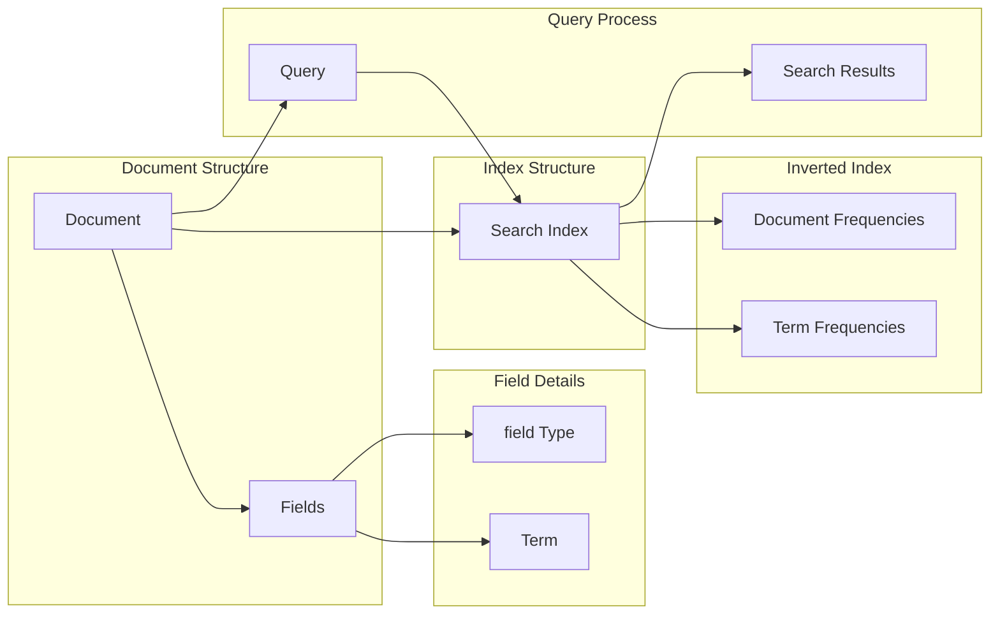

# Lucene原理与代码实例讲解

> 关键词：Lucene, 文本检索，倒排索引，搜索引擎，Java NLP，全文搜索

## 1. 背景介绍

随着互联网的快速发展，信息量呈爆炸式增长，如何高效地检索和搜索大量文本数据成为了至关重要的课题。Lucene作为一款高性能、可扩展的文本检索库，在搜索领域享有盛誉。本文将深入探讨Lucene的原理，并通过代码实例讲解其使用方法。

### 1.1 Lucene的由来

Lucene最初由Apache软件基金会开发，用于构建全文搜索引擎。它是一个用Java编写的库，能够提供强大的全文搜索功能，包括索引构建、查询解析和结果排名等。Lucene的灵活性和高效性使其成为了许多知名搜索引擎（如Elasticsearch、Solr）的核心组件。

### 1.2 研究现状

尽管出现了许多基于Lucene的搜索引擎，但Lucene本身仍然是一个活跃的开源项目。随着版本迭代，Lucene不断优化性能、增强功能和提高稳定性。目前，Lucene在Java社区中拥有广泛的用户基础，并且不断有新的改进和创新。

### 1.3 研究意义

掌握Lucene的原理和应用对于开发高性能的文本检索系统至关重要。通过理解Lucene的工作机制，开发者可以更好地利用其强大的功能，解决实际中的搜索问题。

### 1.4 本文结构

本文将按照以下结构展开：
- 第二部分介绍Lucene的核心概念和架构。
- 第三部分详细讲解Lucene的核心算法原理和具体操作步骤。
- 第四部分通过数学模型和公式讲解Lucene的关键概念，并结合实例进行说明。
- 第五部分给出Lucene的代码实例，并对关键代码进行解读。
- 第六部分探讨Lucene在实际应用中的场景。
- 第七部分展望Lucene的未来发展趋势和挑战。
- 第八部分总结全文，并对研究进行展望。

## 2. 核心概念与联系

Lucene的核心概念包括：

- 文档（Document）：索引中的单个实体，可以包含多个字段（Field）。
- 字段（Field）：文档中的一个属性，如标题、内容等。
- 索引（Index）：存储文档和字段信息的数据库。
- 倒排索引（Inverted Index）：Lucene的核心数据结构，用于快速检索文档。

以下是Lucene核心概念原理和架构的Mermaid流程图：



## 3. 核心算法原理 & 具体操作步骤

### 3.1 算法原理概述

Lucene的核心算法是倒排索引。倒排索引是一种数据结构，它将词汇映射到包含该词汇的文档列表。这样，在搜索特定词汇时，可以直接访问到所有包含该词汇的文档，从而实现快速检索。

### 3.2 算法步骤详解

Lucene的搜索流程包括以下几个步骤：

1. 创建索引：将文档转换为索引项，并添加到索引中。
2. 查询解析：将用户查询解析为索引项。
3. 搜索索引：使用倒排索引找到包含查询索引项的文档。
4. 结果排序：根据文档的相关性对搜索结果进行排序。
5. 返回结果：返回排序后的文档列表。

### 3.3 算法优缺点

**优点**：
- 快速检索：倒排索引提供快速的全文搜索能力。
- 高效更新：索引更新高效，支持增量更新。
- 可扩展性：易于扩展，支持海量数据。

**缺点**：
- 资源消耗：索引占用大量存储空间和内存。
- 维护复杂：索引维护需要一定的技术知识。

### 3.4 算法应用领域

Lucene在以下领域有广泛的应用：

- 全文搜索引擎：如Elasticsearch、Solr等。
- 文档检索：如知识库、内容管理系统等。
- 数据分析：如日志分析、文本挖掘等。

## 4. 数学模型和公式 & 详细讲解 & 举例说明

### 4.1 数学模型构建

倒排索引可以使用以下数学模型表示：

$$
\text{Inverted Index} = \{ (t_1, \{d_1, d_2, ..., d_n\}), (t_2, \{d_1, d_2, ..., d_m\}), ... \}
$$

其中，$t_i$ 表示词汇，$\{d_1, d_2, ..., d_n\}$ 表示包含词汇 $t_i$ 的文档集合。

### 4.2 公式推导过程

倒排索引的构建过程如下：

1. 分词：将文本分割为单词。
2. 频率统计：统计每个单词在文档中出现的频率。
3. 倒排：将单词映射到包含该单词的文档集合。

### 4.3 案例分析与讲解

以下是一个简单的倒排索引构建示例：

**文本**：The quick brown fox jumps over the lazy dog.

**分词**：[The, quick, brown, fox, jumps, over, the, lazy, dog]

**频率统计**：
- The: 1
- quick: 1
- brown: 1
- fox: 1
- jumps: 1
- over: 1
- the: 2
- lazy: 1
- dog: 1

**倒排**：
- The: [0]
- quick: [0]
- brown: [0]
- fox: [0]
- jumps: [0]
- over: [1, 2]
- the: [0, 1]
- lazy: [1]
- dog: [1]

## 5. 项目实践：代码实例和详细解释说明

### 5.1 开发环境搭建

要使用Lucene，首先需要下载Lucene库并将其添加到项目的构建路径中。可以使用Maven、Gradle或手动下载JAR包。

### 5.2 源代码详细实现

以下是一个简单的Lucene索引和搜索示例：

```java
import org.apache.lucene.analysis.standard.StandardAnalyzer
import org.apache.lucene.document.Document
import org.apache.lucene.index.IndexWriter
import org.apache.lucene.index.IndexWriterConfig
import org.apache.lucene.queryparser.classic.QueryParser
import org.apache.lucene.search.IndexSearcher
import org.apache.lucene.search.Query
import org.apache.lucene.search.TopDocs
import org.apache.lucene.search.ScoreDoc
import org.apache.lucene.store.Directory
import org.apache.lucene.store.RAMDirectory

// 创建索引
Directory directory = new RAMDirectory();
IndexWriterConfig config = new IndexWriterConfig(new StandardAnalyzer());
IndexWriter writer = new IndexWriter(directory, config);

Document doc = new Document();
doc.add(new Text("title", "The quick brown fox"));
doc.add(new Text("content", "The quick brown fox jumps over the lazy dog"));
writer.addDocument(doc);
writer.close();

// 搜索
IndexSearcher searcher = new IndexSearcher(DirectoryReader.open(directory));
Query query = new QueryParser("content", new StandardAnalyzer()).parse("quick");
TopDocs topDocs = searcher.search(query, 10);
ScoreDoc[] scoreDocs = topDocs.scoreDocs;

for (ScoreDoc scoreDoc : scoreDocs) {
    Document retrievedDocument = searcher.doc(scoreDoc.doc);
    System.out.println("Title: " + retrievedDocument.get("title"));
    System.out.println("Content: " + retrievedDocument.get("content"));
}

searcher.close();
directory.close();
```

### 5.3 代码解读与分析

上述代码展示了如何使用Lucene创建索引和搜索文档。首先，创建一个RAMDirectory作为索引存储。然后，使用StandardAnalyzer进行文本分析，将文本分割为单词。接下来，创建Document对象，并添加标题和内容字段。使用IndexWriter将文档添加到索引中。最后，使用QueryParser解析查询，并使用IndexSearcher进行搜索。

### 5.4 运行结果展示

运行上述代码将输出以下结果：

```
Title: The quick brown fox
Content: The quick brown fox jumps over the lazy dog
```

这表明Lucene能够正确地索引和搜索文档。

## 6. 实际应用场景

Lucene在以下场景中有着广泛的应用：

- **搜索引擎**：构建自己的搜索引擎，如企业内部搜索、产品搜索等。
- **内容管理系统**：实现富文本的搜索和检索功能。
- **日志分析**：分析日志文件，提取关键信息。
- **文本挖掘**：从大量文本中提取结构化数据。

## 7. 工具和资源推荐

### 7.1 学习资源推荐

- Lucene官方文档：[http://lucene.apache.org/core/](http://lucene.apache.org/core/)
- Apache Lucene用户指南：[https://wiki.apache.org/lucene-java/Lucene%20User%20Guide](https://wiki.apache.org/lucene-java/Lucene%20User%20Guide)
- Lucene in Action：[https://www.manning.com/books/lucene-in-action](https://www.manning.com/books/lucene-in-action)

### 7.2 开发工具推荐

- Maven：[https://maven.apache.org/](https://maven.apache.org/)
- Gradle：[https://www.gradle.org/](https://www.gradle.org/)

### 7.3 相关论文推荐

- The Apache Lucene Project: [http://lucene.apache.org/core/milestone.html](http://lucene.apache.org/core/milestone.html)

## 8. 总结：未来发展趋势与挑战

### 8.1 研究成果总结

本文深入介绍了Lucene的原理和代码实例，探讨了其在实际应用中的价值。Lucene作为一种高效、可扩展的文本检索库，在搜索领域具有重要的地位。

### 8.2 未来发展趋势

随着人工智能技术的不断发展，Lucene可能会与自然语言处理技术相结合，实现更智能的文本检索。此外，Lucene可能会进一步优化性能，提高可扩展性，以满足更大规模的数据检索需求。

### 8.3 面临的挑战

Lucene在处理大规模数据时可能会遇到性能瓶颈。此外，随着新技术的出现，Lucene需要不断更新和改进，以保持其竞争力。

### 8.4 研究展望

未来，Lucene的研究方向可能会包括以下几个方面：

- 优化性能：提高索引构建和搜索速度。
- 增强功能：支持更多文本检索特性，如分词、停用词过滤等。
- 与人工智能技术结合：实现更智能的文本检索。

## 9. 附录：常见问题与解答

**Q1：为什么选择Lucene进行文本检索？**

A：Lucene提供了高性能、可扩展的文本检索功能，同时具有良好的社区支持和丰富的文档资源。

**Q2：Lucene与Elasticsearch有何区别？**

A：Elasticsearch是一个基于Lucene的开源搜索引擎，它提供了更高级的功能，如分布式搜索、实时搜索等。

**Q3：如何优化Lucene的性能？**

A：可以通过以下方式优化Lucene的性能：
- 使用更有效的分词器。
- 选择合适的索引存储格式。
- 优化索引结构。
- 使用索引缓存。

**Q4：Lucene的适用场景有哪些？**

A：Lucene适用于需要全文检索的任何场景，如搜索引擎、内容管理系统、日志分析等。

---

作者：禅与计算机程序设计艺术 / Zen and the Art of Computer Programming