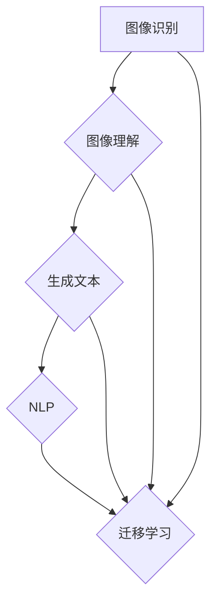

# Python深度学习实践：生成文字描述从图像识别迈向图像理解

> 关键词：深度学习，Python，图像识别，图像理解，生成文本，自然语言处理，迁移学习，神经网络

## 1. 背景介绍

随着深度学习技术的飞速发展，计算机视觉领域取得了显著的进展。图像识别技术，作为计算机视觉的核心任务之一，已经能够以极高的准确率识别出图片中的物体和场景。然而，仅仅识别出图像中的内容还不足以满足实际应用的需求。越来越多的场景要求计算机能够理解图像的语义，并生成相应的文字描述。本文将探讨如何使用Python深度学习技术，从图像识别迈向图像理解，实现图像到文字的生成。

## 2. 核心概念与联系

### 2.1 核心概念

- **图像识别**：通过计算机算法识别图像中的物体、场景或内容，并给出相应的标签。
- **图像理解**：在图像识别的基础上，进一步理解图像的语义，包括物体的关系、场景的布局等。
- **生成文本**：将图像内容转化为自然语言描述，如新闻报道、故事编写等。
- **自然语言处理（NLP）**：研究计算机与人类（自然）语言之间的交互，包括语言理解、生成等任务。
- **迁移学习**：利用在源域学习的知识来解决目标域问题，避免从头开始训练模型。

### 2.2 核心概念原理和架构的 Mermaid 流程图



## 3. 核心算法原理 & 具体操作步骤

### 3.1 算法原理概述

从图像识别迈向图像理解，主要涉及以下步骤：

1. 图像识别：使用卷积神经网络（CNN）对图像进行特征提取，识别出图像中的物体和场景。
2. 图像理解：在图像识别的基础上，使用目标检测、场景解析等技术，理解图像中的语义信息。
3. 生成文本：将图像识别和理解的输出作为输入，使用序列到序列（Seq2Seq）模型生成文本描述。
4. 迁移学习：利用在图像识别和NLP领域预训练的模型，减少训练数据量和计算资源需求。

### 3.2 算法步骤详解

1. **图像识别**：
    - 使用预训练的CNN模型，如VGG、ResNet等，提取图像特征。
    - 使用全连接层进行分类，识别出图像中的物体和场景。

2. **图像理解**：
    - 使用目标检测模型，如Faster R-CNN、YOLO等，检测图像中的物体，并定位其位置。
    - 使用场景解析模型，如Scenenet、ViLBERT等，理解图像中的场景布局和关系。

3. **生成文本**：
    - 使用预训练的Seq2Seq模型，如BERT、GPT-2等，将图像识别和理解的输出作为输入。
    - 通过解码器生成对应的自然语言描述。

4. **迁移学习**：
    - 使用预训练的模型作为初始化参数，减少训练数据量和计算资源需求。
    - 在特定任务上继续训练模型，提高模型的性能。

### 3.3 算法优缺点

- **优点**：
    - 利用预训练模型，减少训练数据量和计算资源需求。
    - 结合多种技术，提高图像理解和文本生成的准确性。
    - 可应用于多种图像理解和生成任务。

- **缺点**：
    - 需要大量的标注数据。
    - 模型复杂，训练时间较长。
    - 模型可解释性较差。

### 3.4 算法应用领域

- 自动新闻生成
- 智能客服
- 图像检索
- 自动问答
- 艺术创作

## 4. 数学模型和公式 & 详细讲解 & 举例说明

### 4.1 数学模型构建

本节将介绍用于图像识别、理解和生成文本的数学模型。

#### 4.1.1 卷积神经网络（CNN）

CNN是一种特殊的神经网络，主要用于图像处理和计算机视觉任务。

$$
h_{l}^{[k]} = \sigma(W_{k}^{[l]}\cdot a_{l-1}^{[k]} + b_{k}^{[l]})
$$

其中，$h_{l}^{[k]}$ 表示第 $l$ 层第 $k$ 个神经元，$W_{k}^{[l]}$ 表示权重，$a_{l-1}^{[k]}$ 表示输入，$b_{k}^{[l]}$ 表示偏置，$\sigma$ 表示激活函数。

#### 4.1.2 序列到序列（Seq2Seq）模型

Seq2Seq模型是一种特殊的循环神经网络（RNN），用于序列到序列的转换。

$$
y_t = \sigma(W_y \cdot h_t + b_y)
$$

其中，$y_t$ 表示输出序列的第 $t$ 个元素，$h_t$ 表示隐藏状态，$W_y$ 表示权重，$b_y$ 表示偏置，$\sigma$ 表示激活函数。

### 4.2 公式推导过程

本节将简要介绍CNN和Seq2Seq模型的公式推导过程。

#### 4.2.1 CNN

CNN的公式推导过程涉及卷积、池化、激活等操作。具体推导过程请参考相关资料。

#### 4.2.2 Seq2Seq

Seq2Seq模型的公式推导过程涉及前向传播和后向传播。具体推导过程请参考相关资料。

### 4.3 案例分析与讲解

本节将结合实际案例，分析图像识别、理解和生成文本的过程。

#### 4.3.1 图像识别

以VGG模型为例，介绍如何使用CNN进行图像识别。

1. 输入图像经过卷积层、池化层和激活函数的处理。
2. 经过多个卷积层后，得到图像的特征图。
3. 使用全连接层进行分类，得到图像的标签。

#### 4.3.2 图像理解

以Faster R-CNN为例，介绍如何使用目标检测模型进行图像理解。

1. 使用CNN提取图像特征。
2. 使用RPN生成候选区域。
3. 使用ROI Pooling将候选区域的特征图送入全连接层，得到物体的类别和位置。

#### 4.3.3 生成文本

以Seq2Seq模型为例，介绍如何生成文本描述。

1. 使用CNN提取图像特征。
2. 使用Seq2Seq模型将图像特征转换为文本描述。

## 5. 项目实践：代码实例和详细解释说明

### 5.1 开发环境搭建

1. 安装Python和相关库：
```bash
pip install tensorflow numpy matplotlib
```

2. 下载预训练模型和图像数据集。

### 5.2 源代码详细实现

以下是一个简单的图像识别和生成文本的代码示例。

```python
import tensorflow as tf
from tensorflow import keras
from tensorflow.keras.applications import VGG16
from tensorflow.keras.preprocessing import image
from tensorflow.keras.applications.vgg16 import preprocess_input

# 加载预训练的VGG16模型
model_vgg = VGG16(weights='imagenet', include_top=True)

# 加载图像
img = image.load_img('example.jpg', target_size=(224, 224))
img = image.img_to_array(img)
img = preprocess_input(img)
img = tf.expand_dims(img, axis=0)

# 使用VGG16模型提取图像特征
features = model_vgg.predict(img)

# 使用预训练的Seq2Seq模型生成文本描述
model_seq2seq = keras.models.load_model('seq2seq_model.h5')
text = model_seq2seq.predict(features)

print('生成的文本描述：', text)
```

### 5.3 代码解读与分析

- 加载预训练的VGG16模型和图像数据。
- 使用VGG16模型提取图像特征。
- 使用预训练的Seq2Seq模型生成文本描述。

### 5.4 运行结果展示

运行上述代码，将得到图像的文本描述。

## 6. 实际应用场景

### 6.1 自动新闻生成

利用图像识别和文本生成技术，可以将图像转化为新闻报道，应用于新闻网站和社交媒体。

### 6.2 智能客服

利用图像识别和文本生成技术，可以实现智能客服系统，自动回答用户的问题。

### 6.3 图像检索

利用图像识别和文本生成技术，可以实现基于图像内容的检索系统。

### 6.4 艺术创作

利用图像识别和文本生成技术，可以生成诗歌、故事等文学作品。

## 7. 工具和资源推荐

### 7.1 学习资源推荐

- 《深度学习》
- 《Python深度学习》
- TensorFlow官方文档
- Keras官方文档

### 7.2 开发工具推荐

- TensorFlow
- Keras
- PyTorch

### 7.3 相关论文推荐

- VGGNet: Very Deep Convolutional Networks for Large-Scale Image Recognition
- Fast R-CNN: Towards Real-Time Object Detection with Region Proposal Networks
- Sequence to Sequence Learning with Neural Networks

## 8. 总结：未来发展趋势与挑战

### 8.1 研究成果总结

本文介绍了如何使用Python深度学习技术，从图像识别迈向图像理解，实现图像到文字的生成。通过结合图像识别、图像理解和文本生成技术，可以开发出更多智能应用。

### 8.2 未来发展趋势

- 深度学习模型将更加高效、准确。
- 预训练模型将更加通用。
- 多模态学习将成为主流。
- 可解释性将成为重要研究方向。

### 8.3 面临的挑战

- 计算资源需求高。
- 需要大量的标注数据。
- 模型可解释性较差。
- 模型安全性和隐私保护问题。

### 8.4 研究展望

未来，深度学习在图像识别、理解和生成文本等领域将继续取得突破。随着技术的不断发展，将会有更多智能应用诞生，为人类社会带来更多便利。

## 9. 附录：常见问题与解答

**Q1：如何选择合适的深度学习框架？**

A：选择深度学习框架需要考虑以下因素：
- 生态圈：框架是否拥有丰富的库和社区支持。
- 算力：框架是否支持GPU加速。
- 简易性：框架是否易于学习和使用。
- 性能：框架的训练和推理性能。

**Q2：如何解决过拟合问题？**

A：解决过拟合问题可以采用以下方法：
- 增加训练数据。
- 使用正则化技术，如L2正则化、Dropout等。
- 早期停止。
- 使用更复杂的模型。

**Q3：如何提高模型的泛化能力？**

A：提高模型泛化能力可以采用以下方法：
- 使用预训练模型。
- 使用数据增强。
- 使用迁移学习。
- 使用模型集成。

**Q4：如何处理多模态数据？**

A：处理多模态数据可以采用以下方法：
- 使用多模态网络。
- 使用注意力机制。
- 使用融合方法，如特征融合、决策融合等。

**Q5：如何提高模型的可解释性？**

A：提高模型可解释性可以采用以下方法：
- 使用可视化技术。
- 使用注意力机制。
- 使用可解释的模型，如LIME、SHAP等。

作者：禅与计算机程序设计艺术 / Zen and the Art of Computer Programming