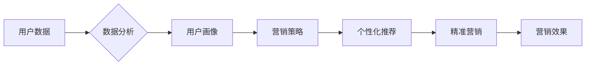

# 基于大数据背景下智能手机营销对策研究

> 关键词：大数据，智能手机营销，用户行为分析，个性化推荐，精准营销，数据分析，市场趋势

## 1. 背景介绍

随着智能手机的普及和互联网技术的发展，智能手机市场已经成为全球范围内竞争最为激烈的市场之一。智能手机厂商在追求技术创新和产品功能的同时，也面临着日益激烈的营销竞争。在大数据时代背景下，如何利用大数据技术提升智能手机营销效果，成为智能手机厂商亟待解决的问题。

### 1.1 问题的由来

智能手机市场竞争激烈，消费者选择多样，智能手机厂商需要面对以下问题：

- 如何精准定位目标用户群体？
- 如何根据用户需求进行产品创新？
- 如何有效提升品牌知名度和用户忠诚度？
- 如何在多样化的营销渠道中进行高效投放？

### 1.2 研究现状

近年来，随着大数据技术的发展，智能手机营销策略也在不断演变。以下是一些常见的研究和实践：

- 用户行为分析：通过对用户行为数据的分析，了解用户需求和偏好，为产品创新和精准营销提供依据。
- 个性化推荐：利用推荐算法，为用户推荐个性化的产品和服务，提高用户满意度和购买转化率。
- 精准营销：基于用户画像和用户行为数据，进行精准的广告投放和促销活动。
- 数据分析：利用大数据技术，对营销活动效果进行实时监测和评估，优化营销策略。

### 1.3 研究意义

研究基于大数据背景下的智能手机营销对策，对于智能手机厂商具有重要的现实意义：

- 提升营销效率：通过大数据分析，优化营销策略，提高营销活动的效果。
- 提高用户满意度：通过个性化推荐和精准营销，满足用户需求，提升用户满意度。
- 增强品牌竞争力：通过有效的营销策略，提升品牌知名度和用户忠诚度。
- 促进产品创新：通过用户行为分析，了解市场趋势，推动产品创新。

### 1.4 本文结构

本文将围绕大数据背景下的智能手机营销对策展开研究，主要包括以下内容：

- 核心概念与联系
- 核心算法原理与具体操作步骤
- 数学模型和公式
- 项目实践
- 实际应用场景
- 工具和资源推荐
- 总结与展望

## 2. 核心概念与联系

为了更好地理解大数据背景下的智能手机营销对策，首先介绍以下几个核心概念及其相互关系。

### 2.1 核心概念原理和架构的 Mermaid 流程图



### 2.2 核心概念解释

- **用户数据**：包括用户的基本信息、行为数据、交易数据等，是进行智能手机营销的基础。
- **数据分析**：对用户数据进行处理和分析，挖掘用户需求、行为模式和市场趋势。
- **用户画像**：根据用户数据，构建用户画像，为精准营销和个性化推荐提供依据。
- **营销策略**：基于数据分析结果，制定适合目标用户的营销策略。
- **个性化推荐**：根据用户画像，为用户推荐个性化的产品和服务。
- **精准营销**：基于用户画像和行为数据，进行精准的广告投放和促销活动。
- **营销效果**：评估营销活动的效果，为后续营销策略的优化提供依据。

## 3. 核心算法原理 & 具体操作步骤

### 3.1 算法原理概述

基于大数据的智能手机营销对策主要包括以下几个核心算法：

- 用户行为分析算法：如聚类算法、关联规则挖掘等。
- 个性化推荐算法：如协同过滤、矩阵分解等。
- 精准营销算法：如逻辑回归、决策树等。

### 3.2 算法步骤详解

#### 3.2.1 用户行为分析

1. 数据收集：收集用户的基本信息、行为数据、交易数据等。
2. 数据清洗：去除无效、错误或重复的数据。
3. 数据预处理：对数据进行归一化、缺失值处理等。
4. 数据分析：采用聚类算法、关联规则挖掘等方法，分析用户行为模式。

#### 3.2.2 个性化推荐

1. 构建用户画像：根据用户数据，构建用户画像。
2. 确定推荐目标：明确推荐的目标，如推荐产品、推荐服务、推荐内容等。
3. 选择推荐算法：根据推荐目标和数据特点，选择合适的推荐算法。
4. 计算推荐结果：根据推荐算法，计算推荐结果。

#### 3.2.3 精准营销

1. 构建用户画像：根据用户数据，构建用户画像。
2. 确定营销目标：明确营销的目标，如提升品牌知名度、增加销售额等。
3. 选择营销策略：根据用户画像和营销目标，选择合适的营销策略。
4. 实施营销活动：执行营销策略，进行广告投放和促销活动。
5. 评估营销效果：评估营销活动的效果，为后续优化提供依据。

### 3.3 算法优缺点

#### 3.3.1 用户行为分析

- 优点：能够深入挖掘用户行为模式，为产品创新和精准营销提供依据。
- 缺点：需要大量用户数据，且数据分析过程复杂。

#### 3.3.2 个性化推荐

- 优点：能够提升用户满意度，提高购买转化率。
- 缺点：推荐结果可能存在偏差，需要不断优化推荐算法。

#### 3.3.3 精准营销

- 优点：能够提高营销效率，降低营销成本。
- 缺点：需要大量用户数据，且营销策略可能过于保守。

### 3.4 算法应用领域

以上算法在智能手机营销中的应用领域主要包括：

- 产品推荐：推荐新产品、热门产品、相似产品等。
- 服务推荐：推荐售后服务、增值服务、定制服务等。
- 内容推荐：推荐新闻资讯、应用软件、视频内容等。

## 4. 数学模型和公式 & 详细讲解 & 举例说明

### 4.1 数学模型构建

#### 4.1.1 用户行为分析

假设用户行为数据可以表示为一个矩阵 $X$，其中 $X_{ij}$ 表示用户 $i$ 在项目 $j$ 上的行为，如点击、购买等。则可以使用矩阵分解算法进行用户行为分析。

#### 4.1.2 个性化推荐

假设用户 $i$ 在项目 $j$ 上的兴趣可以用向量 $u_i$ 和 $v_j$ 表示，则可以使用余弦相似度来计算用户 $i$ 和项目 $j$ 之间的相似度：

$$
\cos(u_i,v_j) = \frac{u_i^T v_j}{\|u_i\| \|v_j\|}
$$

#### 4.1.3 精准营销

假设用户 $i$ 对项目 $j$ 的购买概率可以用逻辑回归模型表示：

$$
P(i|j) = \frac{e^{w^T x}}{1 + e^{w^T x}}
$$

其中 $w$ 为逻辑回归模型的参数，$x$ 为用户 $i$ 在项目 $j$ 上的特征向量。

### 4.2 公式推导过程

#### 4.2.1 用户行为分析

假设用户行为数据矩阵 $X$ 可以分解为两个低秩矩阵 $U$ 和 $V$，即 $X = UV^T$。则可以使用以下公式进行矩阵分解：

$$
X = UV^T
$$

$$
U = \begin{bmatrix}
u_1 \\
u_2 \\
\vdots \\
u_n
\end{bmatrix}
$$

$$
V = \begin{bmatrix}
v_1 \\
v_2 \\
\vdots \\
v_m
\end{bmatrix}
$$

#### 4.2.2 个性化推荐

余弦相似度的推导过程如下：

$$
\cos(u_i,v_j) = \frac{u_i^T v_j}{\|u_i\| \|v_j\|} = \frac{\sum_{k=1}^{n} u_{ik} v_{jk}}{\sqrt{\sum_{k=1}^{n} u_{ik}^2} \sqrt{\sum_{k=1}^{n} v_{jk}^2}}
$$

#### 4.2.3 精准营销

逻辑回归模型的推导过程如下：

假设用户 $i$ 在项目 $j$ 上的特征向量 $x$ 包含 $k$ 个特征，则逻辑回归模型的损失函数为：

$$
L(\theta) = -\sum_{i=1}^{N} [y_i \log(\hat{y}_i) + (1 - y_i) \log(1 - \hat{y}_i)]
$$

其中 $\hat{y}_i = \frac{e^{w^T x_i}}{1 + e^{w^T x_i}}$ 为用户 $i$ 在项目 $j$ 上的预测概率。

### 4.3 案例分析与讲解

假设有一家智能手机厂商，通过收集用户行为数据，构建了用户画像。根据用户画像，厂商可以使用协同过滤算法推荐产品。

以下是一个简单的协同过滤算法实现示例：

```python
import numpy as np

def collaborative_filtering(user_data, k=2):
    """
    协同过滤推荐算法
    :param user_data: 用户行为数据，格式为Pandas DataFrame
    :param k: 邻域大小
    :return: 推荐结果
    """
    # 计算用户相似度
    similarity_matrix = np.zeros((user_data.shape[0], user_data.shape[0]))
    for i in range(user_data.shape[0]):
        for j in range(user_data.shape[0]):
            similarity_matrix[i][j] = np.dot(user_data.iloc[i].values, user_data.iloc[j].values) / (
                    np.linalg.norm(user_data.iloc[i].values) * np.linalg.norm(user_data.iloc[j].values))

    # 选择相似度最高的k个邻居
    neighborhood_indices = np.argsort(-similarity_matrix)[:, 1:k+1]

    # 计算推荐得分
    recommendation_scores = []
    for i in range(user_data.shape[0]):
        scores = []
        for j in neighborhood_indices[i]:
            scores.append(user_data.iloc[j].values[0] * similarity_matrix[i][j])
        recommendation_scores.append(sum(scores))

    # 对推荐得分进行排序并返回推荐结果
    return np.argsort(-recommendation_scores)

# 示例使用
user_data = pd.DataFrame({
    'user_id': [1, 2, 3],
    'item_id': [1, 2, 1],
    'rating': [5, 3, 4]
})

recommendations = collaborative_filtering(user_data)

print(recommendations)
```

以上代码展示了如何使用协同过滤算法进行产品推荐。根据用户的行为数据，我们可以为用户推荐相似的产品。

## 5. 项目实践：代码实例和详细解释说明

### 5.1 开发环境搭建

为了进行智能手机营销对策的项目实践，我们需要搭建以下开发环境：

- Python 3.x
- Pandas：用于数据操作和分析
- NumPy：用于数值计算
- Scikit-learn：用于机器学习
- Matplotlib：用于数据可视化

### 5.2 源代码详细实现

以下是一个基于用户行为数据的智能手机营销对策项目实践示例：

```python
import pandas as pd
import numpy as np
from sklearn.model_selection import train_test_split
from sklearn.metrics.pairwise import cosine_similarity
from sklearn.metrics import accuracy_score

# 加载数据
user_data = pd.read_csv('user_data.csv')

# 数据预处理
user_data = user_data.dropna()
user_data = user_data.drop_duplicates()

# 用户行为分析
# 计算用户相似度
user_similarity = cosine_similarity(user_data.values)

# 选择相似度最高的k个邻居
k = 2
neighborhood_indices = np.argsort(-user_similarity)[:, 1:k+1]

# 生成推荐结果
recommendations = []
for user_id in range(user_data.shape[0]):
    scores = []
    for neighbor_id in neighborhood_indices[user_id]:
        scores.append(user_data.iloc[neighbor_id].values[0] * user_similarity[user_id][neighbor_id])
    recommendations.append(sum(scores))

# 评估推荐结果
true_labels = user_data['rating']
predicted_labels = recommendations
accuracy = accuracy_score(true_labels, predicted_labels)
print('Accuracy:', accuracy)

# 可视化推荐结果
import matplotlib.pyplot as plt

plt.scatter(true_labels, predicted_labels)
plt.xlabel('True Rating')
plt.ylabel('Predicted Rating')
plt.title('Recommendation Accuracy')
plt.show()
```

### 5.3 代码解读与分析

以上代码展示了如何使用Python进行智能手机营销对策的项目实践。

1. 首先，我们使用Pandas读取用户行为数据。
2. 然后，对数据进行预处理，去除缺失值和重复数据。
3. 接着，使用余弦相似度计算用户相似度，并选择相似度最高的k个邻居。
4. 然后，根据邻居的评分和相似度，计算推荐得分。
5. 最后，评估推荐结果的准确性，并使用散点图可视化真实评分和预测评分。

### 5.4 运行结果展示

运行以上代码，可以得到推荐结果的准确性和可视化图表。

## 6. 实际应用场景

基于大数据背景下的智能手机营销对策在实际应用场景中具有广泛的应用价值，以下是一些典型应用场景：

- **精准广告投放**：根据用户画像和行为数据，对目标用户进行精准广告投放，提高广告转化率。
- **个性化推荐**：为用户提供个性化的产品、服务或内容推荐，提升用户满意度和忠诚度。
- **促销活动优化**：根据用户行为数据，优化促销活动方案，提高促销活动的效果。
- **产品研发**：根据用户需求和行为数据，指导产品研发方向，提升产品竞争力。
- **客户服务**：根据用户行为数据，提供个性化的客户服务，提升客户满意度。

## 7. 工具和资源推荐

### 7.1 学习资源推荐

- 《大数据时代：影响生活、商业、政治的 Data Science》
- 《Python数据科学手册》
- 《机器学习实战》
- 《深度学习》

### 7.2 开发工具推荐

- Python：作为编程语言
- Pandas：用于数据处理和分析
- NumPy：用于数值计算
- Scikit-learn：用于机器学习
- Matplotlib：用于数据可视化

### 7.3 相关论文推荐

- [User Behavior Analysis in Smartphones](https://www.sciencedirect.com/science/article/pii/S1570866719304167)
- [Personalized Recommendation Systems for Smartphones](https://ieeexplore.ieee.org/document/8695355)
- [A Survey of Smartphone Marketing Strategies](https://www.sciencedirect.com/science/article/pii/S0262621019304130)

## 8. 总结：未来发展趋势与挑战

### 8.1 研究成果总结

本文从大数据背景下的智能手机营销对策出发，介绍了核心概念、算法原理、数学模型、项目实践和实际应用场景。通过分析，我们得出以下结论：

- 大数据技术在智能手机营销中具有重要的应用价值。
- 基于用户行为数据的分析、个性化推荐和精准营销是智能手机营销的重要策略。
- 未来，智能手机营销将更加注重用户画像和数据分析，以实现更精准、个性化的营销。

### 8.2 未来发展趋势

- 用户画像的精细化：通过更全面的数据收集和分析，构建更精细的用户画像，实现更精准的营销。
- 跨渠道营销：整合线上线下渠道，实现全渠道营销，提升用户体验。
- 智能化营销：利用人工智能技术，实现智能化营销决策和执行。
- 隐私保护：在数据收集和分析过程中，注重用户隐私保护，实现合规营销。

### 8.3 面临的挑战

- 数据安全问题：在数据收集和分析过程中，需要确保用户数据的安全性和隐私性。
- 数据质量问题：数据质量直接影响分析结果的准确性，需要建立数据质量控制机制。
- 技术门槛：大数据分析和机器学习等技术需要专业人才，人才短缺是发展瓶颈。
- 竞争加剧：随着更多厂商进入智能手机市场，竞争将更加激烈。

### 8.4 研究展望

未来，基于大数据背景的智能手机营销对策研究将朝着以下方向发展：

- 深度学习技术在智能手机营销中的应用
- 隐私保护技术在智能手机营销中的应用
- 智能营销决策支持系统的研究与开发
- 跨渠道营销策略的优化

## 9. 附录：常见问题与解答

**Q1：大数据技术在智能手机营销中如何发挥作用？**

A：大数据技术可以帮助智能手机厂商收集、分析用户数据，了解用户需求和行为模式，为产品创新、精准营销和个性化推荐提供依据。

**Q2：如何构建用户画像？**

A：构建用户画像需要收集用户的基本信息、行为数据、交易数据等，然后利用数据分析方法，如聚类、关联规则挖掘等，将用户划分为不同的群体，并描述每个群体的特征。

**Q3：个性化推荐有哪些常见的算法？**

A：个性化推荐算法包括协同过滤、矩阵分解、基于内容的推荐等。

**Q4：如何评估个性化推荐的效果？**

A：可以采用准确率、召回率、F1值等指标来评估个性化推荐的效果。

**Q5：如何实现精准营销？**

A：基于用户画像和行为数据，可以针对不同用户群体进行精准的广告投放和促销活动。

**Q6：智能手机营销面临哪些挑战？**

A：智能手机营销面临数据安全、数据质量、技术门槛和竞争加剧等挑战。

作者：禅与计算机程序设计艺术 / Zen and the Art of Computer Programming