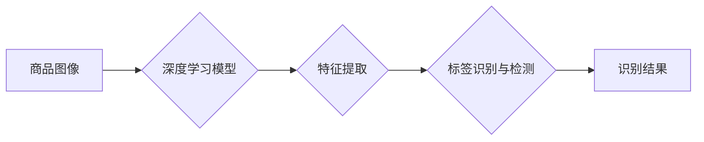

## 基于深度学习的商品标签的识别与检测算法研究

> 关键词：深度学习、商品标签识别、图像处理、卷积神经网络、目标检测

## 1. 背景介绍

随着电子商务的蓬勃发展，商品标签识别与检测技术已成为电商平台、物流管理、库存盘点等领域的重要应用。传统的商品标签识别方法主要依赖于规则匹配和特征提取，但受限于标签的复杂性和多样性，识别准确率和效率往往难以满足实际需求。

深度学习技术的兴起为商品标签识别带来了新的机遇。深度学习模型能够自动学习图像特征，并具有强大的泛化能力，能够有效识别各种类型的商品标签，提高识别准确率和效率。

## 2. 核心概念与联系

### 2.1 商品标签识别与检测

商品标签识别是指从图像中提取商品标签信息，包括标签内容、位置、方向等。商品标签检测是指在图像中定位商品标签的边界框，并判断标签是否存在。

### 2.2 深度学习

深度学习是一种机器学习的子领域，它利用多层神经网络来模拟人类大脑的学习过程。深度学习模型能够自动学习图像特征，并进行复杂的模式识别和分类任务。

### 2.3 卷积神经网络 (CNN)

卷积神经网络 (CNN) 是一种专门用于处理图像数据的深度学习模型。CNN 利用卷积操作和池化操作来提取图像特征，并具有强大的图像识别能力。

**核心概念与架构流程图**



## 3. 核心算法原理 & 具体操作步骤

### 3.1 算法原理概述

基于深度学习的商品标签识别与检测算法通常采用卷积神经网络 (CNN) 作为核心模型。CNN 可以自动学习图像特征，并进行标签识别和检测。

**算法流程:**

1. **数据预处理:** 对商品图像进行预处理，例如调整大小、归一化等。
2. **特征提取:** 使用 CNN 模型提取商品图像的特征。
3. **标签识别:** 使用分类器识别标签的内容。
4. **标签检测:** 使用目标检测器定位标签的边界框。

### 3.2 算法步骤详解

1. **数据预处理:**

   - **图像裁剪:** 将商品图像裁剪成包含标签区域的子图像。
   - **图像增强:** 对图像进行增强处理，例如旋转、翻转、缩放等，以提高模型的鲁棒性。
   - **归一化:** 将图像像素值归一化到 [0, 1] 范围内。

2. **特征提取:**

   - 使用预训练的 CNN 模型提取商品图像的特征。
   - 常见的 CNN 模型包括 ResNet、VGG、Inception 等。
   - 特征提取层可以是 CNN 模型的某些层，例如卷积层、池化层等。

3. **标签识别:**

   - 使用分类器识别标签的内容。
   - 分类器可以是支持向量机 (SVM)、随机森林 (RF) 等传统机器学习模型，也可以是深度学习模型，例如全连接神经网络 (FCN)。
   - 分类器需要训练在标签识别数据集上。

4. **标签检测:**

   - 使用目标检测器定位标签的边界框。
   - 目标检测器可以是 YOLO、Faster R-CNN 等深度学习模型。
   - 目标检测器需要训练在标签检测数据集上。

### 3.3 算法优缺点

**优点:**

- 识别准确率高：深度学习模型能够自动学习图像特征，并具有强大的泛化能力。
- 效率高：深度学习模型的推理速度快，能够满足实时识别的需求。
- 可扩展性强：深度学习模型可以很容易地扩展到识别更多类型的标签。

**缺点:**

- 数据需求大：深度学习模型需要大量的训练数据才能达到较高的识别准确率。
- 计算资源消耗大：训练深度学习模型需要大量的计算资源。
- 可解释性差：深度学习模型的决策过程难以解释。

### 3.4 算法应用领域

基于深度学习的商品标签识别与检测算法广泛应用于以下领域:

- **电商平台:** 商品分类、搜索、推荐等。
- **物流管理:** 商品识别、跟踪、配送等。
- **库存盘点:** 自动识别商品数量和种类。
- **零售行业:** 商品管理、促销活动等。

## 4. 数学模型和公式 & 详细讲解 & 举例说明

### 4.1 数学模型构建

**卷积神经网络 (CNN)**

CNN 模型由多个卷积层、池化层和全连接层组成。

**卷积层:**

卷积层使用卷积核对输入图像进行卷积操作，提取图像特征。卷积核是一个小的矩阵，在图像上滑动，计算每个位置的卷积结果。

**池化层:**

池化层对卷积层的输出进行下采样，减少特征图的大小，提高模型的鲁棒性。常见的池化操作包括最大池化和平均池化。

**全连接层:**

全连接层将池化层的输出进行连接，并进行分类或回归。

**损失函数:**

损失函数用于衡量模型预测结果与真实结果之间的差异。常见的损失函数包括交叉熵损失和均方误差损失。

**优化算法:**

优化算法用于更新模型参数，使损失函数最小化。常见的优化算法包括梯度下降、Adam 等。

### 4.2 公式推导过程

**卷积操作:**

$$
y_{i,j} = \sum_{m=0}^{M-1} \sum_{n=0}^{N-1} x_{i+m,j+n} * w_{m,n}
$$

其中:

- $y_{i,j}$ 是卷积层的输出值。
- $x_{i+m,j+n}$ 是输入图像的像素值。
- $w_{m,n}$ 是卷积核的权值。
- $M$ 和 $N$ 是卷积核的大小。

**最大池化操作:**

$$
y_{i,j} = \max(x_{i,j}, x_{i+1,j}, x_{i,j+1}, x_{i+1,j+1})
$$

其中:

- $y_{i,j}$ 是池化层的输出值。
- $x_{i,j}$ 是卷积层的输出值。

### 4.3 案例分析与讲解

**商品标签识别:**

假设我们有一个商品标签识别任务，目标是识别商品标签的内容。我们可以使用 CNN 模型进行训练，输入商品图像，输出标签内容。

**商品标签检测:**

假设我们有一个商品标签检测任务，目标是定位商品标签的边界框。我们可以使用目标检测器进行训练，输入商品图像，输出标签的边界框坐标。

## 5. 项目实践：代码实例和详细解释说明

### 5.1 开发环境搭建

- **操作系统:** Ubuntu 18.04
- **深度学习框架:** TensorFlow 2.0
- **编程语言:** Python 3.7

### 5.2 源代码详细实现

```python
import tensorflow as tf
from tensorflow.keras.models import Sequential
from tensorflow.keras.layers import Conv2D, MaxPooling2D, Flatten, Dense

# 定义 CNN 模型
model = Sequential()
model.add(Conv2D(32, (3, 3), activation='relu', input_shape=(image_height, image_width, 3)))
model.add(MaxPooling2D((2, 2)))
model.add(Conv2D(64, (3, 3), activation='relu'))
model.add(MaxPooling2D((2, 2)))
model.add(Flatten())
model.add(Dense(10, activation='softmax'))

# 编译模型
model.compile(optimizer='adam',
              loss='categorical_crossentropy',
              metrics=['accuracy'])

# 训练模型
model.fit(train_images, train_labels, epochs=10)

# 评估模型
loss, accuracy = model.evaluate(test_images, test_labels)
print('Loss:', loss)
print('Accuracy:', accuracy)
```

### 5.3 代码解读与分析

- **模型定义:** 使用 `Sequential` 类定义一个 CNN 模型，包含卷积层、池化层和全连接层。
- **模型编译:** 使用 `compile` 方法编译模型，指定优化器、损失函数和评价指标。
- **模型训练:** 使用 `fit` 方法训练模型，输入训练数据和训练轮数。
- **模型评估:** 使用 `evaluate` 方法评估模型，输入测试数据和真实标签。

### 5.4 运行结果展示

训练完成后，可以将模型应用于新的商品图像，进行标签识别和检测。

## 6. 实际应用场景

### 6.1 电商平台商品分类

基于深度学习的商品标签识别技术可以用于电商平台的商品分类。通过识别商品标签的内容，可以自动将商品分类到相应的类别，提高商品搜索和推荐的准确性。

### 6.2 物流管理商品识别

在物流管理中，商品标签识别可以用于自动识别商品种类和数量，提高物流效率。例如，在仓库盘点时，可以使用商品标签识别系统自动识别商品数量，减少人工盘点的时间和成本。

### 6.3 库存盘点自动识别

基于深度学习的商品标签识别技术可以用于自动识别商品数量和种类，提高库存管理的效率。例如，在超市的货架上，可以使用商品标签识别系统自动识别商品数量，及时补货。

### 6.4 未来应用展望

随着深度学习技术的不断发展，商品标签识别与检测技术将有更广泛的应用场景。例如，可以用于智能零售、个性化推荐、反 counterfeiting 等领域。

## 7. 工具和资源推荐

### 7.1 学习资源推荐

- **书籍:**
    - 深度学习
    - 深度学习实战
- **在线课程:**
    - Coursera 深度学习课程
    - Udacity 深度学习课程

### 7.2 开发工具推荐

- **深度学习框架:** TensorFlow, PyTorch, Keras
- **图像处理库:** OpenCV, Pillow

### 7.3 相关论文推荐

- **Object Detection with Deep Learning**
- **YOLO: You Only Look Once**
- **Faster R-CNN: Towards Real-Time Object Detection with Region Proposal Networks**

## 8. 总结：未来发展趋势与挑战

### 8.1 研究成果总结

基于深度学习的商品标签识别与检测技术取得了显著的进展，识别准确率和效率大幅提高。

### 8.2 未来发展趋势

- **模型轻量化:** 开发更轻量化的深度学习模型，降低计算资源消耗。
- **多模态融合:** 将图像识别与其他模态信息（例如文本、音频）融合，提高识别准确率。
- **场景适应性:** 开发更具场景适应性的模型，能够识别不同环境下的商品标签。

### 8.3 面临的挑战

- **数据标注:** 深度学习模型需要大量的标注数据，数据标注成本高昂。
- **模型解释性:** 深度学习模型的决策过程难以解释，缺乏可信度。
- **鲁棒性:** 深度学习模型对噪声和干扰敏感，鲁棒性需要进一步提高。

### 8.4 研究展望

未来，我们将继续研究基于深度学习的商品标签识别与检测技术，探索更先进的算法、模型和应用场景，推动该技术的进一步发展。

## 9. 附录：常见问题与解答

**Q1: 如何选择合适的深度学习模型？**

**A1:** 选择合适的深度学习模型取决于具体的应用场景和数据特点。常见的 CNN 模型包括 ResNet、VGG、Inception 等，可以根据任务需求和数据规模选择合适的模型。

**Q2: 如何解决数据标注问题？**

**A2:** 数据标注是深度学习模型训练的关键环节，可以采用以下方法解决数据标注问题：

- 使用人工标注数据。
- 使用自动标注