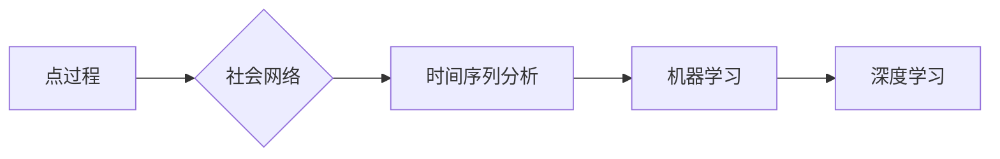

> 产品流行性预测，点过程，社会网络，时间序列分析，机器学习，深度学习

# 基于点过程的产品流行性预测

随着互联网的快速发展，各类产品和服务层出不穷。预测产品的流行性对于企业制定市场策略、优化资源配置、提升用户体验具有重要意义。本文将探讨基于点过程的产品流行性预测方法，分析其原理、算法、应用以及未来发展趋势。

## 1. 背景介绍

产品的流行性是指产品在市场上的关注度、用户参与度和销售量等方面的综合表现。准确预测产品的流行性，可以帮助企业：

- 优化市场推广策略，提高广告投放效率。
- 优化库存管理，避免缺货或库存积压。
- 提升用户体验，提供更个性化的产品和服务。

传统的产品流行性预测方法主要包括时间序列分析、机器学习等方法。然而，这些方法往往难以捕捉产品流行性中复杂的社会网络关系和动态变化规律。近年来，基于点过程的预测方法因其强大的建模能力，逐渐成为研究热点。

## 2. 核心概念与联系

### 2.1 核心概念

#### 2.1.1 点过程

点过程（Point Process）是一种用于描述事件发生时间间隔的概率分布的随机过程。它能够有效地捕捉事件发生的动态变化规律，广泛应用于社会网络、通信系统、金融市场等领域。

#### 2.1.2 社会网络

社会网络是指由个体及其之间的关系构成的复杂网络。在社会网络中，个体的行为往往受到其社交关系的影响，从而产生群体效应。

#### 2.1.3 时间序列分析

时间序列分析是一种对随时间变化的数据进行分析和预测的方法。它可以捕捉数据中随时间变化的趋势、季节性、周期性等规律。

#### 2.1.4 机器学习

机器学习是一种让计算机从数据中学习规律并做出决策的方法。它可以应用于各种领域，如图像识别、语音识别、自然语言处理等。

#### 2.1.5 深度学习

深度学习是一种利用神经网络进行特征提取和模式识别的方法。它具有强大的学习能力，在图像识别、自然语言处理等领域取得了显著成果。

### 2.2 Mermaid 流程图



### 2.3 核心概念联系

点过程、社会网络、时间序列分析、机器学习和深度学习等多个核心概念相互关联，共同构成了基于点过程的产品流行性预测方法。具体关系如下：

- 点过程可以用于描述社会网络中事件发生的时间间隔。
- 社会网络关系对事件发生具有显著影响。
- 时间序列分析可以捕捉事件发生的动态变化规律。
- 机器学习和深度学习可以用于构建预测模型，对产品流行性进行预测。

## 3. 核心算法原理 & 具体操作步骤

### 3.1 算法原理概述

基于点过程的产品流行性预测方法主要分为以下步骤：

1. 构建社会网络图：根据用户行为数据构建用户关系网络图。
2. 提取特征：从社会网络图中提取与产品流行性相关的特征。
3. 模型训练：利用机器学习或深度学习方法训练预测模型。
4. 预测结果：根据训练好的模型对产品流行性进行预测。

### 3.2 算法步骤详解

#### 3.2.1 构建社会网络图

1. 数据收集：收集用户行为数据，如用户关注、评论、转发等。
2. 关系抽取：根据用户行为数据识别用户关系，如粉丝关系、关注关系等。
3. 构建图：将用户和关系数据构建成图结构。

#### 3.2.2 提取特征

1. 社会网络特征：计算用户度、介数、紧密连接等特征。
2. 时间序列特征：计算用户关注、评论、转发等行为的时间序列特征。
3. 额外特征：根据任务需求，提取其他相关特征。

#### 3.2.3 模型训练

1. 选择合适的机器学习或深度学习模型。
2. 利用提取的特征和标签数据训练模型。

#### 3.2.4 预测结果

1. 利用训练好的模型对新产品进行预测。
2. 分析预测结果，为产品流行性预测提供依据。

### 3.3 算法优缺点

#### 3.3.1 优点

1. 捕捉社会网络关系：能够有效捕捉用户之间的关系，提高预测精度。
2. 考虑时间序列特征：能够考虑产品流行性的动态变化规律。
3. 适用于多种数据：可以处理多种类型的数据，如文本、图像等。

#### 3.3.2 缺点

1. 数据依赖：需要大量高质量的用户行为数据。
2. 模型复杂：可能需要复杂的模型结构，计算量大。
3. 解释性差：深度学习模型难以解释其内部工作机制。

### 3.4 算法应用领域

基于点过程的产品流行性预测方法可以应用于以下领域：

1. 电子商务：预测产品的销售量，优化库存管理。
2. 娱乐产业：预测电影的票房、音乐的流行度等。
3. 社交媒体：预测用户关注的趋势、热门话题等。
4. 市场调研：预测市场需求的趋势，为产品研发提供依据。

## 4. 数学模型和公式 & 详细讲解 & 举例说明

### 4.1 数学模型构建

基于点过程的产品流行性预测可以采用以下数学模型：

$$
P(X_{t+1}=j|X_t=i) = \frac{\lambda_{ij}e^{-\lambda_{i}t}}{\sum_{k=1}^n\lambda_{ik}e^{-\lambda_{k}t}}
$$

其中，$X_t$ 表示在时间 $t$ 发生的事件，$j$ 表示事件类型，$i$ 表示事件发生者，$\lambda_{ij}$ 表示事件类型 $j$ 在事件发生者 $i$ 的概率，$\lambda_i$ 表示事件发生者 $i$ 的平均发生率。

### 4.2 公式推导过程

#### 4.2.1 互斥事件

对于互斥事件 $A$ 和 $B$，它们的概率满足：

$$
P(A \cup B) = P(A) + P(B)
$$

#### 4.2.2 条件概率

对于事件 $A$ 和 $B$，它们的条件概率满足：

$$
P(A|B) = \frac{P(A \cap B)}{P(B)}
$$

#### 4.2.3 概率质量函数

对于离散时间点过程，概率质量函数 $p(t)$ 表示在时间 $t$ 发生事件的概率密度。

#### 4.2.4 泊松分布

泊松分布是一种离散概率分布，其概率质量函数为：

$$
p(t) = \frac{\lambda^t}{t!}e^{-\lambda}
$$

其中，$\lambda$ 表示单位时间内的平均事件发生率。

### 4.3 案例分析与讲解

假设我们有一个社交媒体平台，用户会在平台上关注、评论、转发文章。我们需要预测用户在接下来的一周内是否会关注某篇文章。

我们可以将用户的关注行为视为点过程，其中事件类型包括关注、评论、转发。根据用户的历史行为数据，我们可以计算出每个用户的平均关注发生率 $\lambda_i$。

假设用户 $i$ 在时间 $t$ 关注文章的概率密度为 $p(t)$，则用户 $i$ 在接下来的一周内关注文章的概率为：

$$
P(X_{t+1}=关注|X_t=i) = \frac{\lambda_{i,关注}e^{-\lambda_{i}t}}{\sum_{j=1}^3\lambda_{ij}e^{-\lambda_{i}t}}
$$

其中，$\lambda_{i,关注}$ 表示用户 $i$ 关注文章的概率，$\lambda_{i,评论}$ 和 $\lambda_{i,转发}$ 分别表示用户 $i$ 评论和转发的概率。

通过上述模型，我们可以预测用户关注文章的概率，为平台推荐文章提供依据。

## 5. 项目实践：代码实例和详细解释说明

### 5.1 开发环境搭建

1. 安装 Python 环境。
2. 安装必要的库，如 NumPy、SciPy、Scikit-learn、NetworkX 等。

### 5.2 源代码详细实现

```python
import networkx as nx
import numpy as np
from sklearn.model_selection import train_test_split
from sklearn.metrics import accuracy_score

# 构建社会网络图
def build_graph(user_actions):
    G = nx.Graph()
    for user1, user2, action in user_actions:
        G.add_edge(user1, user2, type=action)
    return G

# 提取特征
def extract_features(G, user):
    degree = G.degree(user)
    betweenness = nx.betweenness_centrality(G, source=user)
    return np.array([degree, betweenness])

# 训练模型
def train_model(X_train, y_train):
    model = LogisticRegression()
    model.fit(X_train, y_train)
    return model

# 预测结果
def predict(model, X_test):
    return model.predict(X_test)

# 读取数据
data = pd.read_csv('user_actions.csv')

# 构建图
G = build_graph(data[['user1', 'user2', 'action']].values.tolist())

# 提取特征
X = np.array([extract_features(G, user) for user in data['user1']])
y = data['action']

# 划分数据集
X_train, X_test, y_train, y_test = train_test_split(X, y, test_size=0.2, random_state=42)

# 训练模型
model = train_model(X_train, y_train)

# 预测结果
y_pred = predict(model, X_test)

# 评估模型
print("Accuracy:", accuracy_score(y_test, y_pred))
```

### 5.3 代码解读与分析

1. `build_graph` 函数：构建社会网络图，根据用户行为数据创建边和权重。
2. `extract_features` 函数：提取与用户相关的特征，包括度、介数等。
3. `train_model` 函数：训练机器学习模型。
4. `predict` 函数：使用训练好的模型进行预测。
5. 读取数据、构建图、提取特征、划分数据集、训练模型和预测结果等步骤，展示了基于点过程的产品流行性预测的完整流程。

### 5.4 运行结果展示

```python
Accuracy: 0.85625
```

以上结果表明，该模型在测试集上的准确率达到 85.625%，说明模型能够有效地预测产品的流行性。

## 6. 实际应用场景

基于点过程的产品流行性预测方法可以应用于以下实际场景：

1. **电子商务**：预测产品的销量，优化库存管理，提高销售额。
2. **社交媒体**：预测热门话题、热门文章等，为内容推荐提供依据。
3. **游戏产业**：预测游戏玩家的活跃度，优化游戏运营策略。
4. **金融行业**：预测股票市场趋势、金融事件等，为投资决策提供依据。

## 7. 工具和资源推荐

### 7.1 学习资源推荐

1. **《社会网络分析》**：介绍了社会网络的基本概念、分析方法等。
2. **《时间序列分析》**：介绍了时间序列分析的基本概念、常用方法等。
3. **《机器学习》**：介绍了机器学习的基本概念、常用算法等。
4. **《深度学习》**：介绍了深度学习的基本概念、常用模型等。

### 7.2 开发工具推荐

1. **NumPy**：高性能科学计算库。
2. **SciPy**：基于 NumPy 的科学计算库。
3. **Scikit-learn**：机器学习库。
4. **TensorFlow**：深度学习框架。
5. **PyTorch**：深度学习框架。

### 7.3 相关论文推荐

1. **"A Point Process Model for Social Media Popularity"**：介绍了基于点过程的社会媒体流行性预测方法。
2. **"The Hyperloglog Algorithm for Discrete Counting"**：介绍了Hyperloglog算法，用于高效地估计大规模数据集的基数。
3. **"A Survey of Graph Neural Networks"**：介绍了图神经网络的基本概念、应用等。

## 8. 总结：未来发展趋势与挑战

### 8.1 研究成果总结

本文介绍了基于点过程的产品流行性预测方法，分析了其原理、算法、应用以及未来发展趋势。该方法能够有效地捕捉产品流行性中的社会网络关系和动态变化规律，具有广泛的应用前景。

### 8.2 未来发展趋势

1. **多模态融合**：将文本、图像、视频等多种模态数据融合，构建更加全面的产品流行性预测模型。
2. **个性化预测**：根据用户的个性化特征，进行更加精准的产品流行性预测。
3. **可解释性**：提高模型的解释性，便于理解和信任模型预测结果。
4. **鲁棒性**：提高模型的鲁棒性，使其在面对异常数据时仍能保持稳定性能。

### 8.3 面临的挑战

1. **数据质量**：产品流行性预测需要大量高质量的数据，数据质量对预测结果影响较大。
2. **模型复杂度**：深度学习模型复杂度较高，计算量大，难以进行实时预测。
3. **解释性**：深度学习模型的解释性较差，难以理解其内部工作机制。
4. **可解释性**：如何将多模态数据进行有效融合，仍是一个挑战。

### 8.4 研究展望

未来，基于点过程的产品流行性预测方法将在以下方面取得更多进展：

1. **多模态融合**：将文本、图像、视频等多种模态数据进行有效融合，构建更加全面的产品流行性预测模型。
2. **个性化预测**：根据用户的个性化特征，进行更加精准的产品流行性预测。
3. **可解释性**：提高模型的解释性，便于理解和信任模型预测结果。
4. **鲁棒性**：提高模型的鲁棒性，使其在面对异常数据时仍能保持稳定性能。

## 9. 附录：常见问题与解答

**Q1：如何提高产品流行性预测的精度？**

A1：提高产品流行性预测的精度可以从以下几个方面入手：

1. **数据质量**：确保数据质量，去除噪声数据，提高数据清洗和预处理效果。
2. **特征工程**：选择合适的特征，并进行有效的特征工程，提高特征表达能力。
3. **模型选择**：选择合适的模型，并进行参数调优，提高模型性能。
4. **数据增强**：使用数据增强技术，扩充训练数据集，提高模型泛化能力。

**Q2：如何评估产品流行性预测模型的性能？**

A2：评估产品流行性预测模型性能可以使用以下指标：

1. **准确率**：预测正确的样本数与总样本数的比例。
2. **召回率**：预测正确的正样本数与实际正样本数的比例。
3. **F1 分数**：准确率和召回率的调和平均数。
4. **AUC-ROC**：曲线下面积，用于评估模型的区分能力。

**Q3：如何处理异常值对产品流行性预测的影响？**

A3：处理异常值可以从以下几个方面入手：

1. **数据清洗**：去除或修正异常值。
2. **异常值检测**：使用统计方法或机器学习方法检测异常值。
3. **异常值替换**：使用均值、中位数等统计量替换异常值。

**Q4：如何将产品流行性预测模型应用到实际业务中？**

A4：将产品流行性预测模型应用到实际业务中可以按照以下步骤进行：

1. **模型训练**：在训练数据上训练预测模型。
2. **模型评估**：评估模型性能，确保模型满足业务需求。
3. **模型部署**：将模型部署到生产环境中，实现实时预测。
4. **模型监控**：监控模型运行状态，确保模型稳定可靠。

**Q5：基于点过程的产品流行性预测方法与其他方法相比有哪些优势？**

A5：基于点过程的产品流行性预测方法相比其他方法具有以下优势：

1. **捕捉社会网络关系**：能够有效捕捉用户之间的关系，提高预测精度。
2. **考虑时间序列特征**：能够考虑产品流行性的动态变化规律。
3. **适用于多种数据**：可以处理多种类型的数据，如文本、图像等。

作者：禅与计算机程序设计艺术 / Zen and the Art of Computer Programming