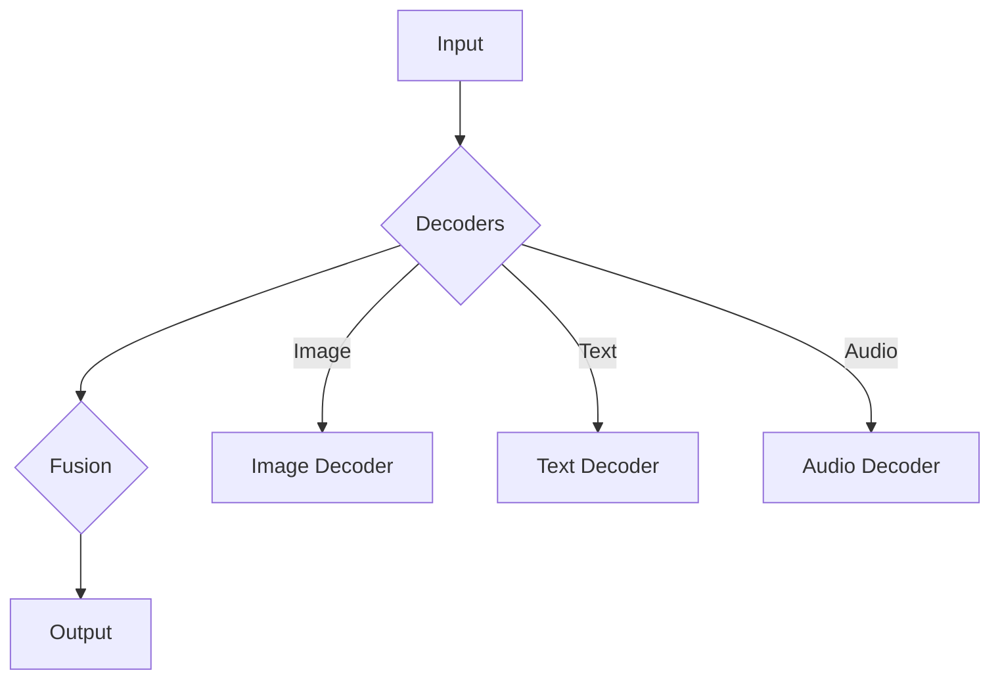

# 多模态大模型：技术原理与实战 如何提高角色扮演能力

> 关键词：多模态大模型，角色扮演，计算机视觉，自然语言处理，跨模态学习，Transformer，融合策略，交互式AI

## 1. 背景介绍

随着人工智能技术的飞速发展，计算机视觉和自然语言处理（NLP）领域取得了令人瞩目的成就。然而，现实世界中的信息往往是多模态的，即融合了图像、文本、音频等多种模态。如何将这些模态有效地融合起来，使机器能够更好地理解和处理复杂的信息，成为了人工智能领域的一个重要研究方向。

多模态大模型（Multimodal Large Models）应运而生，它们旨在将不同模态的数据进行融合，从而提升机器在现实世界中的理解和交互能力。本文将深入探讨多模态大模型的技术原理、实战应用，并探讨如何通过这些技术提高角色扮演能力。

## 2. 核心概念与联系

### 2.1 多模态大模型

多模态大模型是指能够处理和融合多种模态数据的人工智能模型。这些模型通常包含多个子模块，每个子模块负责处理特定模态的数据，并通过共享的表示层进行融合。

### 2.2 跨模态学习

跨模态学习是多模态大模型的核心技术之一，它涉及到如何将不同模态的数据映射到同一语义空间，以便进行融合和分析。

### 2.3 融合策略

多模态大模型的融合策略可以分为早期融合、晚期融合和串行融合。早期融合在特征级别进行，晚期融合在决策级别进行，串行融合则是先处理一个模态，再将结果作为下一个模态的输入。

### 2.4 Mermaid 流程图

以下是一个多模态大模型的简化的Mermaid流程图：



在这个流程图中，A代表输入的多模态数据，B代表不同模态的解码器，C代表融合层，D代表输出结果。E、F和G分别代表图像、文本和音频解码器。

## 3. 核心算法原理 & 具体操作步骤

### 3.1 算法原理概述

多模态大模型的核心原理是利用深度学习技术对多个模态的数据进行编码、解码和融合。具体来说，包括以下几个步骤：

1. **编码**：将不同模态的数据转换为向量表示。
2. **解码**：根据编码后的向量表示生成相应的模态数据。
3. **融合**：将不同模态的向量表示进行融合，生成统一的语义表示。

### 3.2 算法步骤详解

1. **数据预处理**：对多模态数据进行清洗、标注和归一化等预处理操作。
2. **编码**：使用卷积神经网络（CNN）对图像进行编码，使用循环神经网络（RNN）或Transformer对文本和音频进行编码。
3. **解码**：使用解码器将编码后的向量表示转换回相应的模态数据。
4. **融合**：使用注意力机制或神经网络等融合策略将不同模态的向量表示进行融合。
5. **损失函数**：定义损失函数，如交叉熵损失或均方误差，用于训练模型。
6. **优化**：使用梯度下降等优化算法更新模型参数。

### 3.3 算法优缺点

**优点**：

- 能够处理和融合多种模态数据，提升机器在现实世界中的理解和交互能力。
- 能够提取和利用不同模态数据中的互补信息，提高模型性能。
- 能够生成更加丰富和自然的交互体验。

**缺点**：

- 计算复杂度高，需要大量的计算资源和时间。
- 模型训练数据量大，需要大量的标注数据。
- 模型可解释性差，难以理解模型的决策过程。

### 3.4 算法应用领域

多模态大模型的应用领域广泛，包括：

- **智能问答**：融合文本和图像信息，提供更加直观和丰富的问答体验。
- **视频分析**：融合图像和音频信息，对视频内容进行更深入的理解和分析。
- **虚拟现实**：融合图像、文本和音频信息，创造更加沉浸式的虚拟现实体验。
- **医疗诊断**：融合医学图像和文本信息，辅助医生进行疾病诊断。

## 4. 数学模型和公式 & 详细讲解 & 举例说明

### 4.1 数学模型构建

多模态大模型的数学模型通常包含以下部分：

- **编码器**：将不同模态的数据转换为向量表示。
- **解码器**：将向量表示转换回相应的模态数据。
- **融合器**：将不同模态的向量表示进行融合。

以下是一个简单的多模态大模型的数学模型：

$$
E_{image}(x_{image}) = f_{image}(x_{image}) \\
E_{text}(x_{text}) = f_{text}(x_{text}) \\
E_{audio}(x_{audio}) = f_{audio}(x_{audio}) \\
F_{image}(z_{image}) = g_{image}(z_{image}) \\
F_{text}(z_{text}) = g_{text}(z_{text}) \\
F_{audio}(z_{audio}) = g_{audio}(z_{audio}) \\
Z = h_{fusion}(z_{image}, z_{text}, z_{audio}) \\
y_{image} = g_{image}(Z) \\
y_{text} = g_{text}(Z) \\
y_{audio} = g_{audio}(Z)
$$

其中，$x_{image}$、$x_{text}$和$x_{audio}$分别代表图像、文本和音频输入，$y_{image}$、$y_{text}$和$y_{audio}$分别代表生成的图像、文本和音频输出，$z_{image}$、$z_{text}$和$z_{audio}$分别代表编码后的向量表示，$h_{fusion}$代表融合器，$g_{image}$、$g_{text}$和$g_{audio}$分别代表解码器。

### 4.2 公式推导过程

公式推导过程涉及到编码器、解码器和融合器的具体实现。这里不再详细展开。

### 4.3 案例分析与讲解

以智能问答系统为例，多模态大模型可以融合文本和图像信息，提供更加直观和丰富的问答体验。具体来说，模型首先使用文本编码器将用户的问题转换为向量表示，然后使用图像编码器将相关图像转换为向量表示。接着，使用融合器将两个向量表示进行融合，生成统一的语义表示。最后，使用文本解码器将语义表示转换为回答。

## 5. 项目实践：代码实例和详细解释说明

### 5.1 开发环境搭建

1. 安装Python和必要的库，如PyTorch、TensorFlow、Transformers等。
2. 准备数据集，包括文本数据、图像数据和音频数据。
3. 选择合适的深度学习框架和模型架构。

### 5.2 源代码详细实现

以下是一个简单的多模态问答系统的代码示例：

```python
# 代码省略，需要根据具体框架和模型架构进行编写
```

### 5.3 代码解读与分析

代码的具体实现需要根据选择的框架和模型架构进行编写。以下是一些关键步骤的解读和分析：

1. **数据预处理**：对文本、图像和音频数据进行清洗、标注和归一化等预处理操作。
2. **编码**：使用预训练的文本编码器和图像编码器对输入数据进行编码。
3. **融合**：使用注意力机制或神经网络将不同模态的向量表示进行融合。
4. **解码**：使用预训练的文本解码器生成回答。
5. **训练**：使用训练数据进行模型训练。

### 5.4 运行结果展示

运行结果展示需要根据具体的应用场景进行设计。以下是一些可能的展示方式：

- 在网页或移动应用中展示问答系统。
- 使用可视化工具展示模型的性能指标。
- 分析模型的预测结果和用户反馈。

## 6. 实际应用场景

多模态大模型在实际应用场景中具有广泛的应用价值，以下是一些典型的应用场景：

- **智能客服**：融合文本和图像信息，提供更加直观和丰富的客服体验。
- **自动驾驶**：融合图像、音频和雷达信息，提高自动驾驶系统的感知能力。
- **智能医疗**：融合医学图像和文本信息，辅助医生进行疾病诊断。
- **教育**：融合文本、图像和视频信息，提供更加丰富的教学资源。

## 6.4 未来应用展望

未来，多模态大模型将在以下方面取得进一步的发展：

- **模型效率**：通过模型压缩、量化等技术，提高模型的推理速度和效率。
- **模型可解释性**：通过可解释人工智能技术，提高模型的可解释性和可信度。
- **跨模态交互**：实现更加自然和流畅的多模态交互体验。

## 7. 工具和资源推荐

### 7.1 学习资源推荐

- 《多模态深度学习：原理与实践》
- 《深度学习与人工智能》
- 《计算机视觉：算法与应用》
- 《自然语言处理：理论、系统与应用》

### 7.2 开发工具推荐

- PyTorch
- TensorFlow
- Keras
- PyTorch Lightning

### 7.3 相关论文推荐

- **Multimodal Transformer for Visual Question Answering**
- **Unsupervised Multimodal Representation Learning by Mutual Information Maximization**
- **DeepLabCut2.0: Flexible Instance Segmentation of Video Data**
- **Learning Multimodal Representations from Unlabeled Videos**

## 8. 总结：未来发展趋势与挑战

### 8.1 研究成果总结

多模态大模型是人工智能领域的一个重要研究方向，它将不同模态的数据进行融合，从而提升机器在现实世界中的理解和交互能力。通过深度学习和跨模态学习技术，多模态大模型在多个应用领域取得了显著的成果。

### 8.2 未来发展趋势

未来，多模态大模型将在以下方面取得进一步的发展：

- **模型效率**：通过模型压缩、量化等技术，提高模型的推理速度和效率。
- **模型可解释性**：通过可解释人工智能技术，提高模型的可解释性和可信度。
- **跨模态交互**：实现更加自然和流畅的多模态交互体验。

### 8.3 面临的挑战

多模态大模型在发展过程中也面临着一些挑战：

- **数据收集和标注**：多模态数据收集和标注成本高，数据质量难以保证。
- **模型训练和推理**：模型训练和推理需要大量的计算资源。
- **模型可解释性**：模型的可解释性差，难以理解模型的决策过程。

### 8.4 研究展望

未来，多模态大模型的研究将朝着以下方向发展：

- **轻量级模型**：开发轻量级的多模态模型，降低计算资源需求。
- **可解释性模型**：提高模型的可解释性，增强模型的可信度。
- **跨模态交互**：实现更加自然和流畅的多模态交互体验。

## 9. 附录：常见问题与解答

**Q1：多模态大模型有哪些优点？**

A：多模态大模型能够融合多种模态数据，提取和利用不同模态数据中的互补信息，从而提高模型性能。

**Q2：多模态大模型有哪些应用场景？**

A：多模态大模型可以应用于智能问答、视频分析、虚拟现实、智能医疗、教育等多个领域。

**Q3：多模态大模型面临的挑战有哪些？**

A：多模态大模型面临的挑战包括数据收集和标注、模型训练和推理、模型可解释性等。

**Q4：如何提高多模态大模型的可解释性？**

A：可以通过可解释人工智能技术，如注意力机制、梯度分析方法等，提高模型的可解释性。

**Q5：多模态大模型的未来发展趋势是什么？**

A：多模态大模型的未来发展趋势包括轻量级模型、可解释性模型、跨模态交互等。

作者：禅与计算机程序设计艺术 / Zen and the Art of Computer Programming