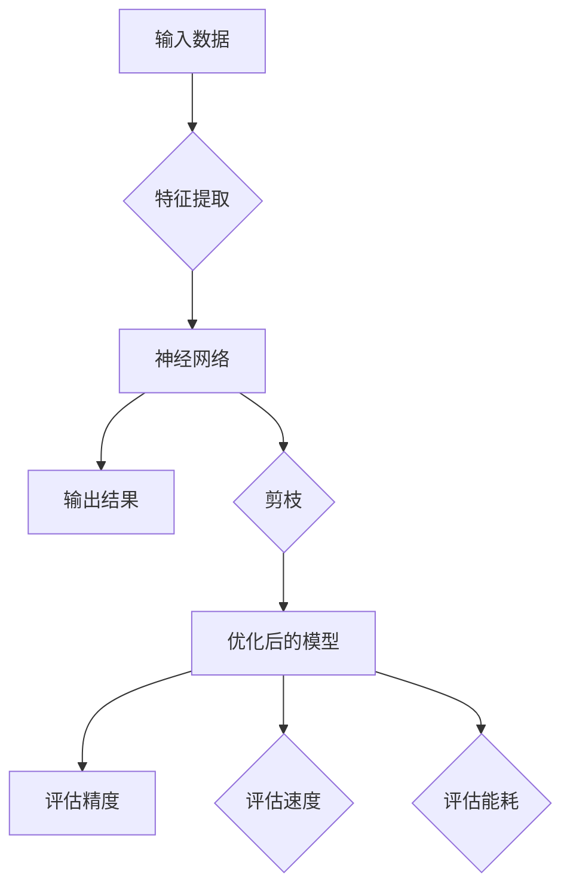

> 关键词：多目标剪枝，神经网络，模型压缩，速度，能耗，精度，剪枝算法，应用场景

# 多目标剪枝：平衡精度、速度与能耗的技术

### 1. 背景介绍

随着深度学习技术的飞速发展，神经网络在图像识别、自然语言处理、语音识别等领域取得了显著的成果。然而，深度学习模型往往伴随着巨大的计算量和存储需求，这对硬件资源和能耗提出了严峻挑战。为了解决这一问题，模型压缩技术应运而生。其中，剪枝技术因其简单易行、效果显著而被广泛应用于模型压缩领域。本文将深入探讨多目标剪枝技术，旨在平衡模型的精度、速度和能耗。

### 2. 核心概念与联系

#### 2.1 核心概念

- **神经网络**：一种模拟人脑神经网络结构和功能的计算模型，通过调整连接权重来学习数据中的特征和模式。
- **剪枝**：一种模型压缩技术，通过移除模型中不重要的连接或神经元，减少模型的参数数量和计算量。
- **精度**：模型在特定任务上的性能指标，通常用准确率、召回率、F1分数等来衡量。
- **速度**：模型处理数据的效率，通常用每秒处理的样本数量来衡量。
- **能耗**：模型运行过程中消耗的能量，通常用瓦特(W)或毫安时(mAh)来衡量。

#### 2.2 核心概念原理和架构的 Mermaid 流程图



### 3. 核心算法原理 & 具体操作步骤

#### 3.1 算法原理概述

多目标剪枝旨在同时优化模型的精度、速度和能耗。其基本原理如下：

1. **选择剪枝策略**：根据任务需求和硬件环境，选择合适的剪枝策略，如权重大小、稀疏程度等。
2. **剪枝操作**：对模型进行剪枝操作，移除不重要的连接或神经元。
3. **优化模型**：使用优化算法重新训练剪枝后的模型，以保持模型的精度。
4. **评估模型**：评估剪枝后模型的精度、速度和能耗，并选择最优的剪枝结果。

#### 3.2 算法步骤详解

1. **初始化模型**：加载预训练的神经网络模型。
2. **选择剪枝策略**：根据任务需求和硬件环境选择合适的剪枝策略，如基于权重大小的剪枝、基于重要性排序的剪枝等。
3. **剪枝操作**：根据选择的剪枝策略，对模型进行剪枝操作，移除不重要的连接或神经元。
4. **优化模型**：使用优化算法（如Adam、SGD等）重新训练剪枝后的模型，以保持模型的精度。
5. **评估模型**：在测试集上评估剪枝后模型的精度、速度和能耗。
6. **迭代优化**：根据评估结果，调整剪枝策略或优化算法参数，重复步骤3-5，直至找到最优的剪枝结果。

#### 3.3 算法优缺点

**优点**：

- **减少模型复杂度**：剪枝可以显著减少模型的参数数量和计算量，降低模型的存储和计算需求。
- **提高模型速度**：剪枝可以减少模型计算量，提高模型的推理速度。
- **降低能耗**：剪枝可以降低模型的功耗，减少能耗。

**缺点**：

- **精度损失**：剪枝可能导致模型精度下降。
- **计算复杂度高**：剪枝和优化过程可能需要大量的计算资源。

#### 3.4 算法应用领域

多目标剪枝技术可以应用于以下领域：

- **移动端设备**：减少模型尺寸，提高移动端设备的性能和续航能力。
- **嵌入式系统**：降低嵌入式系统的功耗和资源消耗。
- **云计算**：提高云计算服务的性能和效率。

### 4. 数学模型和公式 & 详细讲解 & 举例说明

#### 4.1 数学模型构建

多目标剪枝的数学模型可以表示为：

$$
\mathcal{L}(\theta, \omega) = \mathcal{L}_{\text{accuracy}}(\theta) + \lambda \times \mathcal{L}_{\text{size}}(\omega) + \mu \times \mathcal{L}_{\text{speed}}(\omega) + \
u \times \mathcal{L}_{\text{energy}}(\omega)
$$

其中：

- $\theta$ 为模型参数。
- $\omega$ 为剪枝参数。
- $\mathcal{L}_{\text{accuracy}}$ 为模型精度损失。
- $\mathcal{L}_{\text{size}}$ 为模型尺寸。
- $\mathcal{L}_{\text{speed}}$ 为模型速度。
- $\mathcal{L}_{\text{energy}}$ 为模型能耗。

#### 4.2 公式推导过程

多目标剪枝的公式推导过程如下：

1. **模型精度损失**：使用交叉熵损失函数衡量模型在测试集上的精度损失。
2. **模型尺寸**：使用模型参数数量衡量模型尺寸。
3. **模型速度**：使用模型推理时间衡量模型速度。
4. **模型能耗**：使用模型功耗衡量模型能耗。

#### 4.3 案例分析与讲解

以下是一个基于权重大小的剪枝的例子：

1. **初始化模型**：加载预训练的神经网络模型。
2. **选择剪枝策略**：选择基于权重大小的剪枝策略，将权重绝对值小于阈值的连接剪除。
3. **剪枝操作**：对模型进行剪枝操作，移除不重要的连接。
4. **优化模型**：使用优化算法重新训练剪枝后的模型。
5. **评估模型**：在测试集上评估剪枝后模型的精度、速度和能耗。

### 5. 项目实践：代码实例和详细解释说明

#### 5.1 开发环境搭建

以下是一个使用PyTorch进行多目标剪枝的代码示例：

```python
import torch
import torch.nn as nn
import torch.optim as optim

# 初始化模型
model = nn.Sequential(
    nn.Linear(784, 128),
    nn.ReLU(),
    nn.Linear(128, 64),
    nn.ReLU(),
    nn.Linear(64, 10)
)

# 设置剪枝参数
threshold = 0.01
pruned_params = 0

# 基于权重大小的剪枝
for module in model.modules():
    if isinstance(module, nn.Linear):
        params = module.weight.data.abs()
        indices = params < threshold
        pruned_params += indices.sum().item()
        module.weight.data[indices] = 0.0
        module.weight.requires_grad_(False)

# 优化模型
optimizer = optim.SGD(model.parameters(), lr=0.01)
criterion = nn.CrossEntropyLoss()

# 训练模型
for epoch in range(10):
    for data, target in dataloader:
        optimizer.zero_grad()
        output = model(data)
        loss = criterion(output, target)
        loss.backward()
        optimizer.step()

# 评估模型
with torch.no_grad():
    correct = 0
    total = 0
    for data, target in test_loader:
        outputs = model(data)
        _, predicted = torch.max(outputs.data, 1)
        total += target.size(0)
        correct += (predicted == target).sum().item()

print(f'Accuracy of the network on the 10000 test images: {100 * correct // total}%')
```

### 6. 实际应用场景

多目标剪枝技术在以下场景中具有广泛的应用：

- **移动端设备**：在移动端设备上进行图像识别、语音识别等任务，减少模型尺寸，提高设备性能和续航能力。
- **嵌入式系统**：在嵌入式系统中进行物体检测、人脸识别等任务，降低系统功耗和资源消耗。
- **云计算**：在云计算平台上部署大规模深度学习模型，提高服务器的性能和效率。

### 7. 工具和资源推荐

#### 7.1 学习资源推荐

- 《深度学习》
- 《神经网络与深度学习》
- 《PyTorch深度学习实战》

#### 7.2 开发工具推荐

- PyTorch
- TensorFlow
- Keras

#### 7.3 相关论文推荐

- Pruning Neural Networks by Quantization and the Lottery Ticket Hypothesis
- Structured vs Unstructured Pruning
- Neural Network Pruning: A Survey

### 8. 总结：未来发展趋势与挑战

#### 8.1 研究成果总结

多目标剪枝技术是一种有效的模型压缩方法，可以平衡模型的精度、速度和能耗。通过选择合适的剪枝策略和优化算法，可以显著降低模型的复杂度和计算量，提高模型的性能和效率。

#### 8.2 未来发展趋势

未来，多目标剪枝技术将朝着以下方向发展：

- **更有效的剪枝算法**：开发更有效的剪枝算法，进一步提高模型的压缩比和性能。
- **自适应剪枝**：根据不同的应用场景和需求，自适应地调整剪枝参数，实现更好的性能。
- **混合剪枝**：结合多种剪枝方法，进一步提高模型的压缩比和性能。

#### 8.3 面临的挑战

多目标剪枝技术面临以下挑战：

- **精度损失**：剪枝可能导致模型精度下降。
- **计算复杂度**：剪枝和优化过程可能需要大量的计算资源。
- **可解释性**：剪枝过程的可解释性较差，难以理解剪枝决策。

#### 8.4 研究展望

未来，多目标剪枝技术的研究将朝着以下方向展开：

- **开发更有效的剪枝算法**：通过理论分析和实验验证，开发更有效的剪枝算法，进一步提高模型的压缩比和性能。
- **结合其他模型压缩技术**：将多目标剪枝技术与其他模型压缩技术（如量化、知识蒸馏等）相结合，实现更好的性能。
- **提高可解释性**：研究剪枝决策的可解释性，提高剪枝过程的透明度。

### 9. 附录：常见问题与解答

**Q1：多目标剪枝技术是否适用于所有类型的神经网络？**

A1：多目标剪枝技术适用于大多数类型的神经网络，如卷积神经网络、循环神经网络、Transformer等。

**Q2：如何选择合适的剪枝策略？**

A2：选择合适的剪枝策略需要根据任务需求和硬件环境进行综合考虑。常见的剪枝策略包括基于权重大小的剪枝、基于重要性排序的剪枝等。

**Q3：多目标剪枝技术是否会影响模型的泛化能力？**

A3：适当的剪枝可以提升模型的泛化能力，但过度的剪枝可能导致模型精度下降和泛化能力下降。

**Q4：多目标剪枝技术是否可以提高模型的推理速度？**

A4：是的，剪枝可以显著降低模型的计算量，提高模型的推理速度。

**Q5：多目标剪枝技术是否可以降低模型的能耗？**

A5：是的，剪枝可以降低模型的功耗，减少能耗。

作者：禅与计算机程序设计艺术 / Zen and the Art of Computer Programming