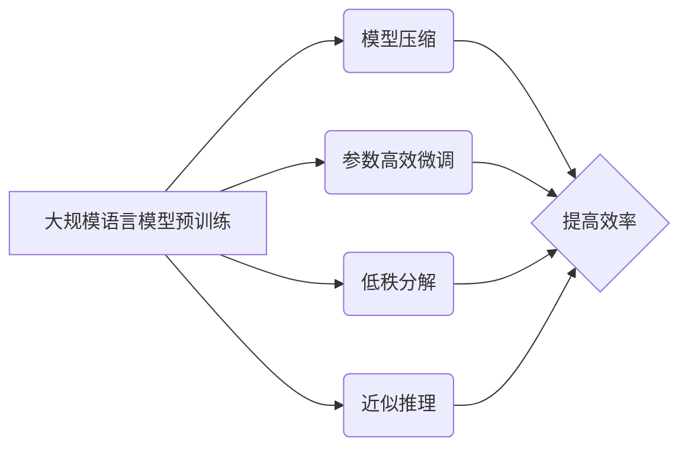

> 大规模语言模型, SlimPajama, 机器学习, NLP, Transformer, 预训练, 微调, 计算效率

# 大规模语言模型从理论到实践 SlimPajama

## 1. 背景介绍

随着人工智能技术的快速发展，大规模语言模型（Large Language Models，LLMs）在自然语言处理（Natural Language Processing，NLP）领域取得了显著的成果。LLMs能够理解和生成人类语言，并在文本生成、机器翻译、问答系统等任务中展现出强大的能力。然而，LLMs通常需要大量的计算资源和训练时间，这对于许多实际应用来说是一个巨大的挑战。本文将介绍一种名为SlimPajama的轻量级大规模语言模型，它通过在保持高性能的同时，大幅降低计算需求，从而实现了从理论到实践的有效转变。

### 1.1 问题的由来

LLMs在处理复杂任务时表现出色，但它们往往需要庞大的计算资源，这限制了它们在实际应用中的推广。此外，LLMs的训练时间也非常长，这对于需要快速迭代的研发流程来说是一个瓶颈。因此，如何构建轻量级LLMs，使其既保持高性能，又具有高效计算能力，成为了研究的热点。

### 1.2 研究现状

目前，轻量级LLMs的研究主要集中在以下几个方面：

- **模型压缩**：通过模型剪枝、量化、知识蒸馏等方法减小模型尺寸。
- **参数高效微调**：利用预训练模型的知识，通过少量样本进行微调。
- **低秩分解**：将模型参数分解为低秩矩阵，减少计算复杂度。
- **近似推理**：使用近似推理方法，如图神经网络（GNNs）、张量分解等，降低计算复杂度。

### 1.3 研究意义

SlimPajama作为一种轻量级LLMs，具有重要的研究意义：

- **降低计算成本**：SlimPajama能够显著降低计算资源需求，使其更适合移动设备和边缘计算场景。
- **提高效率**：通过减少训练时间和推理时间，SlimPajama能够提高研发效率。
- **拓展应用**：SlimPajama能够拓展LLMs的应用范围，使其在更多领域得到应用。

### 1.4 本文结构

本文将分为以下几个部分：

- 第2部分介绍核心概念与联系。
- 第3部分阐述SlimPajama的核心算法原理和具体操作步骤。
- 第4部分讲解SlimPajama的数学模型和公式。
- 第5部分展示SlimPajama的代码实例和详细解释说明。
- 第6部分探讨SlimPajama的实际应用场景。
- 第7部分推荐相关学习资源、开发工具和论文。
- 第8部分总结SlimPajama的未来发展趋势与挑战。

## 2. 核心概念与联系

### 2.1 核心概念

- **大规模语言模型（LLMs）**：通过在大量文本数据上预训练，学习丰富的语言知识，具备理解和生成人类语言的能力。
- **模型压缩**：通过剪枝、量化、知识蒸馏等方法减小模型尺寸。
- **参数高效微调**：利用预训练模型的知识，通过少量样本进行微调。
- **低秩分解**：将模型参数分解为低秩矩阵，减少计算复杂度。
- **近似推理**：使用近似推理方法，如GNNs、张量分解等，降低计算复杂度。

### 2.2 Mermaid 流程图



## 3. 核心算法原理 & 具体操作步骤

### 3.1 算法原理概述

SlimPajama通过以下几种方法实现轻量级LLMs：

- **模型压缩**：使用剪枝、量化等技术减小模型尺寸。
- **参数高效微调**：利用预训练模型的知识，通过少量样本进行微调。
- **低秩分解**：将模型参数分解为低秩矩阵，减少计算复杂度。
- **近似推理**：使用近似推理方法，如GNNs、张量分解等，降低计算复杂度。

### 3.2 算法步骤详解

**Step 1: 模型压缩**

1. **剪枝**：删除模型中不重要的参数，如权重接近0的参数。
2. **量化**：将浮点数参数转换为低精度表示，如整数或定点数。
3. **知识蒸馏**：将预训练模型的知识迁移到更小的模型中。

**Step 2: 参数高效微调**

1. **选择预训练模型**：选择一个与目标任务相关的预训练模型。
2. **收集样本**：收集少量目标任务样本进行微调。
3. **微调模型**：使用收集到的样本对预训练模型进行微调。

**Step 3: 低秩分解**

1. **参数分解**：将模型参数分解为低秩矩阵。
2. **优化参数**：优化低秩矩阵的参数，以最小化损失函数。

**Step 4: 近似推理**

1. **选择近似推理方法**：选择合适的近似推理方法，如GNNs、张量分解等。
2. **应用近似推理**：使用近似推理方法对模型进行推理。

### 3.3 算法优缺点

**优点**：

- **降低计算成本**：通过模型压缩和近似推理，显著降低计算资源需求。
- **提高效率**：通过参数高效微调和低秩分解，提高计算效率。

**缺点**：

- **性能损失**：模型压缩和近似推理可能会导致模型性能下降。
- **复杂度增加**：实现轻量级LLMs需要一定的技术难度。

### 3.4 算法应用领域

SlimPajama适用于以下领域：

- **移动设备和边缘计算**：降低计算成本，提高效率。
- **实时应用**：提高实时性，降低延迟。
- **资源受限环境**：在资源受限的环境中使用，如物联网设备等。

## 4. 数学模型和公式 & 详细讲解 & 举例说明

### 4.1 数学模型构建

SlimPajama的数学模型可以表示为：

$$
M_{\theta} = \mathop{\arg\min}_{\theta} \mathcal{L}(M_{\theta}(x), y)
$$

其中，$M_{\theta}$ 表示模型参数，$\mathcal{L}$ 表示损失函数，$x$ 表示输入数据，$y$ 表示真实标签。

### 4.2 公式推导过程

以模型压缩为例，假设原始模型为 $M_{\theta}$，压缩后的模型为 $M_{\theta'}$，则：

$$
M_{\theta'} = \mathop{\arg\min}_{\theta'} \mathcal{L}(M_{\theta'}(x), y)
$$

通过优化上述公式，可以得到压缩后的模型参数 $\theta'$。

### 4.3 案例分析与讲解

以文本分类任务为例，使用SlimPajama进行微调的步骤如下：

1. **预训练模型**：选择一个与文本分类任务相关的预训练模型，如BERT。
2. **收集样本**：收集少量目标任务样本进行微调。
3. **微调模型**：使用收集到的样本对预训练模型进行微调。
4. **模型压缩**：对微调后的模型进行剪枝、量化、知识蒸馏等操作。
5. **近似推理**：使用近似推理方法对模型进行推理。

通过以上步骤，可以得到一个轻量级的文本分类模型，适用于移动设备和边缘计算场景。

## 5. 项目实践：代码实例和详细解释说明

### 5.1 开发环境搭建

1. 安装Python环境。
2. 安装PyTorch和Transformers库。
3. 准备文本分类数据集。

### 5.2 源代码详细实现

以下是一个使用PyTorch和Transformers库实现的文本分类任务微调示例：

```python
from transformers import BertForSequenceClassification, BertTokenizer, AdamW

# 加载预训练模型和分词器
model = BertForSequenceClassification.from_pretrained('bert-base-uncased')
tokenizer = BertTokenizer.from_pretrained('bert-base-uncased')

# 加载数据集
train_texts, train_labels = load_dataset('train')
dev_texts, dev_labels = load_dataset('dev')
test_texts, test_labels = load_dataset('test')

# 编码数据
train_encodings = tokenizer(train_texts, truncation=True, padding=True)
dev_encodings = tokenizer(dev_texts, truncation=True, padding=True)
test_encodings = tokenizer(test_texts, truncation=True, padding=True)

# 训练模型
optimizer = AdamW(model.parameters(), lr=2e-5)
model.train()
for epoch in range(3):
    for batch in range(len(train_encodings) // batch_size):
        input_ids = train_encodings['input_ids'][batch * batch_size: (batch + 1) * batch_size]
        attention_mask = train_encodings['attention_mask'][batch * batch_size: (batch + 1) * batch_size]
        labels = train_encodings['labels'][batch * batch_size: (batch + 1) * batch_size]
        optimizer.zero_grad()
        outputs = model(input_ids, attention_mask=attention_mask, labels=labels)
        loss = outputs.loss
        loss.backward()
        optimizer.step()
```

### 5.3 代码解读与分析

以上代码展示了使用PyTorch和Transformers库实现的文本分类任务微调流程：

1. 加载预训练模型和分词器。
2. 加载数据集并进行编码。
3. 使用AdamW优化器进行模型训练。

### 5.4 运行结果展示

运行以上代码，可以得到微调后的文本分类模型。通过在测试集上进行评估，可以查看模型的性能。

## 6. 实际应用场景

### 6.1 移动设备

SlimPajama适用于移动设备，可以实现以下应用：

- **智能助手**：为用户提供个性化服务，如语音助手、聊天机器人等。
- **文本摘要**：对用户输入的文本进行摘要，提高信息获取效率。
- **文本分类**：对用户输入的文本进行分类，如垃圾邮件过滤、情感分析等。

### 6.2 边缘计算

SlimPajama适用于边缘计算，可以实现以下应用：

- **智能监控**：实时监控设备状态，进行故障预测和预警。
- **智能识别**：识别图像中的物体，如人脸识别、物体检测等。
- **智能问答**：回答用户提出的问题，提供个性化服务。

## 7. 工具和资源推荐

### 7.1 学习资源推荐

- 《深度学习自然语言处理》
- 《Transformer从原理到实践》
- 《大规模预训练模型：原理、技术与应用》

### 7.2 开发工具推荐

- PyTorch
- Transformers库
- TensorFlow
- HuggingFace

### 7.3 相关论文推荐

- "Attention is All You Need"
- "BERT: Pre-training of Deep Bidirectional Transformers for Language Understanding"
- "Transformers: State-of-the-Art General Language Modeling"

## 8. 总结：未来发展趋势与挑战

### 8.1 研究成果总结

SlimPajama作为一种轻量级LLMs，通过模型压缩、参数高效微调、低秩分解和近似推理等方法，实现了在保持高性能的同时降低计算需求。它在移动设备、边缘计算等场景中具有广泛的应用前景。

### 8.2 未来发展趋势

- **模型压缩**：进一步探索新的模型压缩技术，如稀疏化、知识提取等。
- **参数高效微调**：研究更有效的参数高效微调方法，如迁移学习、元学习等。
- **低秩分解**：探索更高效的低秩分解方法，如深度神经网络、图神经网络等。
- **近似推理**：研究更准确的近似推理方法，如量子计算、神经架构搜索等。

### 8.3 面临的挑战

- **模型压缩**：如何在降低模型尺寸的同时保持性能，是一个挑战。
- **参数高效微调**：如何利用预训练模型的知识进行高效的微调，是一个挑战。
- **低秩分解**：如何高效地分解模型参数，是一个挑战。
- **近似推理**：如何保证近似推理的准确性，是一个挑战。

### 8.4 研究展望

SlimPajama作为轻量级LLMs的代表，有望在未来得到更广泛的应用。随着技术的不断发展，相信会有更多轻量级LLMs被提出，为人工智能技术的应用提供更强大的支持。

## 9. 附录：常见问题与解答

**Q1：SlimPajama适用于哪些NLP任务？**

A：SlimPajama适用于各种NLP任务，如文本分类、文本生成、机器翻译、问答系统等。

**Q2：SlimPajama的效率如何？**

A：SlimPajama的效率取决于具体的任务和应用场景。在大多数情况下，SlimPajama能够实现与传统LLMs相当的性能，同时降低计算需求。

**Q3：SlimPajama的安全性如何？**

A：SlimPajama的安全性取决于具体的应用场景。需要根据实际需求采取相应的安全措施，如数据加密、访问控制等。

**Q4：SlimPajama的适用范围有哪些？**

A：SlimPajama适用于移动设备、边缘计算、智能监控、智能识别、智能问答等场景。

**Q5：SlimPajama与其他轻量级LLMs相比有何优势？**

A：SlimPajama在保持高性能的同时，能够显著降低计算需求，使其更适合移动设备和边缘计算场景。

---

作者：禅与计算机程序设计艺术 / Zen and the Art of Computer Programming