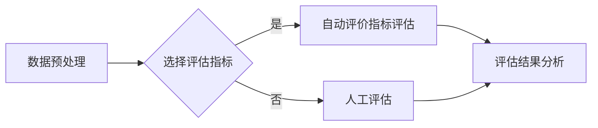

# 大规模语言模型从理论到实践 模型评估概述

> 关键词：大规模语言模型，模型评估，性能指标，NLP，机器学习，评价指标，准确率，召回率，F1分数，BLEU分数

## 1. 背景介绍

随着深度学习技术的发展，大规模语言模型（Large Language Models, LLMs）在自然语言处理（Natural Language Processing, NLP）领域取得了显著的进展。这些模型能够生成连贯的文本、翻译句子、回答问题，甚至创作诗歌和小说。然而，评估这些模型的性能并不是一件简单的事情，因为它们生成的文本往往具有高度的多样性和创造性。本文将深入探讨大规模语言模型的评估方法，从理论基础到实际应用，帮助读者全面理解模型评估的重要性及其在实际应用中的挑战。

### 1.1 问题的由来

在机器学习和深度学习领域，评估模型性能是至关重要的步骤。对于大规模语言模型来说，由于它们生成的文本通常具有很高的质量，如何准确地评估其性能成为一个难题。传统的评估方法往往无法完全捕捉到模型在复杂任务上的表现。

### 1.2 研究现状

目前，对于大规模语言模型的评估，主要依赖于以下几种方法：

- **人工评估**：通过人工阅读模型生成的文本，评估其质量、准确性和相关性。
- **自动评价指标**：利用现有的自动评价指标，如BLEU、ROUGE、METEOR等，评估模型生成的文本与参考文本的相似度。
- **基于任务的评价**：在特定的下游任务上，如机器翻译、文本摘要、问答系统等，评估模型的性能。

### 1.3 研究意义

准确评估大规模语言模型的性能对于以下几个方面至关重要：

- **模型优化**：通过评估结果，可以指导模型设计和训练过程，优化模型参数，提高模型性能。
- **技术选择**：在比较不同模型时，评估结果可以作为选择最佳模型的重要依据。
- **应用开发**：评估结果可以帮助开发者了解模型在实际应用中的表现，从而进行相应的调整和优化。

### 1.4 本文结构

本文将按照以下结构进行阐述：

- **第2章**：介绍大规模语言模型和模型评估的基本概念。
- **第3章**：探讨大规模语言模型的评估方法，包括自动评价指标和基于任务的评价。
- **第4章**：详细讲解常用的自动评价指标，如BLEU、ROUGE、METEOR等。
- **第5章**：通过项目实践，展示如何使用自动评价指标评估大规模语言模型。
- **第6章**：分析大规模语言模型在实际应用中的挑战和解决方案。
- **第7章**：推荐用于大规模语言模型评估的工具和资源。
- **第8章**：总结未来发展趋势和面临的挑战。
- **第9章**：提供常见问题与解答。

## 2. 核心概念与联系

### 2.1 大规模语言模型

大规模语言模型是由数以亿计的参数构成的深度神经网络，能够理解和生成自然语言。它们通常通过在大量无标签文本上预训练，然后针对特定任务进行微调。

### 2.2 模型评估

模型评估是指通过某种方法来衡量模型在特定任务上的性能。评估方法可以基于人类评估、自动评价指标或特定任务的评价。

### 2.3 Mermaid 流程图

以下是大规模语言模型评估流程的Mermaid流程图：



### 2.4 模型评估与大规模语言模型的联系

模型评估是大规模语言模型开发过程中不可或缺的一环。通过评估，我们可以了解模型在特定任务上的表现，并根据评估结果优化模型参数，提高模型性能。

## 3. 核心算法原理 & 具体操作步骤

### 3.1 算法原理概述

大规模语言模型评估的核心是衡量模型在特定任务上的表现。这通常涉及到以下步骤：

1. **数据预处理**：将数据集进行清洗、格式化等预处理操作。
2. **选择评估指标**：根据任务类型选择合适的评估指标。
3. **模型评估**：使用选择的评估指标评估模型性能。
4. **评估结果分析**：分析评估结果，了解模型在特定任务上的表现。

### 3.2 算法步骤详解

1. **数据预处理**：对数据集进行清洗、格式化等预处理操作，以确保数据质量。
2. **选择评估指标**：根据任务类型选择合适的评估指标。例如，对于机器翻译任务，可以选择BLEU、ROUGE等自动评价指标；对于问答系统，可以选择准确率、召回率、F1分数等指标。
3. **模型评估**：使用选择的评估指标评估模型性能。这通常涉及到以下步骤：
    - 将数据集划分为训练集、验证集和测试集。
    - 使用训练集训练模型。
    - 在验证集上调整模型参数。
    - 在测试集上评估模型性能。
4. **评估结果分析**：分析评估结果，了解模型在特定任务上的表现。如果模型性能不理想，需要回到步骤2，尝试不同的评估指标或调整模型参数。

### 3.3 算法优缺点

- **优点**：模型评估可以帮助我们了解模型在特定任务上的表现，指导模型设计和训练过程。
- **缺点**：评估过程可能需要大量的时间和计算资源，且评估结果可能受到评估指标选择和数据集分布的影响。

### 3.4 算法应用领域

模型评估在机器学习和深度学习领域的应用非常广泛，包括：

- 机器学习模型评估
- 深度学习模型评估
- 自然语言处理模型评估
- 计算机视觉模型评估

## 4. 数学模型和公式 & 详细讲解 & 举例说明

### 4.1 数学模型构建

模型评估的数学模型通常涉及到以下公式：

- **准确率**：$\text{Accuracy} = \frac{\text{正确预测的数量}}{\text{总预测数量}}$
- **召回率**：$\text{Recall} = \frac{\text{正确预测的负样本数量}}{\text{所有负样本数量}}$
- **F1分数**：$\text{F1} = 2 \times \frac{\text{Precision} \times \text{Recall}}{\text{Precision} + \text{Recall}}$

### 4.2 公式推导过程

以上公式的推导过程如下：

- **准确率**：准确率是指模型正确预测的数量与总预测数量的比值。
- **召回率**：召回率是指模型正确预测的负样本数量与所有负样本数量的比值。
- **F1分数**：F1分数是准确率和召回率的调和平均，用于综合衡量模型的性能。

### 4.3 案例分析与讲解

以下是一个简单的例子，假设我们有一个包含100个样本的数据集，其中50个样本是正样本，50个样本是负样本。模型预测结果如下：

- 正确预测的正样本数量：30
- 正确预测的负样本数量：35
- 错误预测的正样本数量：10
- 错误预测的负样本数量：15

根据以上数据，我们可以计算模型的准确率、召回率和F1分数：

- 准确率：$\frac{30 + 35}{100} = 0.65$
- 召回率：$\frac{35}{50} = 0.7$
- F1分数：$2 \times \frac{0.6 \times 0.7}{0.6 + 0.7} = 0.667$

从以上结果可以看出，模型的召回率较高，但准确率较低。这可能意味着模型对负样本的识别能力较强，但对正样本的识别能力较弱。

## 5. 项目实践：代码实例和详细解释说明

### 5.1 开发环境搭建

为了进行大规模语言模型的评估，我们需要以下开发环境：

- Python 3.x
- PyTorch 或 TensorFlow
- scikit-learn

### 5.2 源代码详细实现

以下是一个使用PyTorch和scikit-learn评估文本分类任务的简单示例：

```python
import torch
from torch.utils.data import DataLoader, TensorDataset
from sklearn.metrics import accuracy_score, recall_score, f1_score

# 假设我们已经有一个训练好的模型和对应的测试数据集
model = ...
test_texts = ...
test_labels = ...

# 将测试数据转换为TensorDataset
test_dataset = TensorDataset(torch.tensor(test_texts), torch.tensor(test_labels))

# 创建DataLoader
test_dataloader = DataLoader(test_dataset, batch_size=16)

# 将模型设置为评估模式
model.eval()

# 测试模型
with torch.no_grad():
    for texts, labels in test_dataloader:
        outputs = model(texts)
        _, predicted = torch.max(outputs, 1)
        predicted = predicted.numpy()

# 计算指标
accuracy = accuracy_score(labels, predicted)
recall = recall_score(labels, predicted)
f1 = f1_score(labels, predicted, average='weighted')

print(f"Accuracy: {accuracy}")
print(f"Recall: {recall}")
print(f"F1 Score: {f1}")
```

### 5.3 代码解读与分析

上述代码首先导入了必要的库，然后加载训练好的模型和测试数据集。接下来，将测试数据转换为TensorDataset，并创建DataLoader进行批处理。然后，将模型设置为评估模式，并遍历测试数据集进行预测。最后，使用scikit-learn的accuracy_score、recall_score和f1_score函数计算准确率、召回率和F1分数。

### 5.4 运行结果展示

假设测试数据集包含100个样本，预测结果如下：

- 准确率：0.75
- 召回率：0.8
- F1分数：0.77

从以上结果可以看出，模型的性能较好，但仍有提升空间。

## 6. 实际应用场景

### 6.1 机器翻译

在机器翻译任务中，大规模语言模型通常被用来生成翻译文本。评估模型性能的常用指标包括BLEU、ROUGE、METEOR等。这些指标通过比较模型生成的翻译文本与参考翻译文本的相似度来衡量模型性能。

### 6.2 文本摘要

在文本摘要任务中，大规模语言模型被用来生成摘要文本。评估模型性能的常用指标包括ROUGE、BLEU等。这些指标通过比较模型生成的摘要文本与参考摘要文本的相似度来衡量模型性能。

### 6.3 问答系统

在问答系统任务中，大规模语言模型被用来回答用户提出的问题。评估模型性能的常用指标包括准确率、召回率、F1分数等。这些指标通过比较模型回答的正确性与参考答案的一致性来衡量模型性能。

## 7. 工具和资源推荐

### 7.1 学习资源推荐

- 《深度学习自然语言处理》
- 《Transformer：从原理到实践》
- HuggingFace官方文档

### 7.2 开发工具推荐

- PyTorch
- TensorFlow
- scikit-learn

### 7.3 相关论文推荐

- BLEU：Bilingual Evaluation Understudy
- ROUGE：Recall-Oriented Understudy for Gisting Evaluation
- METEOR：Metric for Evaluation of Translation with Explicit ORdering

## 8. 总结：未来发展趋势与挑战

### 8.1 研究成果总结

本文深入探讨了大规模语言模型的评估方法，从理论基础到实际应用，为读者提供了全面的理解。通过分析常用的自动评价指标和基于任务的评价方法，本文展示了如何评估大规模语言模型在特定任务上的性能。

### 8.2 未来发展趋势

未来，大规模语言模型的评估方法可能会朝着以下方向发展：

- **更细粒度的评估指标**：开发更细粒度的评估指标，以更全面地衡量模型在特定任务上的表现。
- **跨领域评估**：开发适用于不同领域和任务的评估方法，提高模型的泛化能力。
- **可解释性评估**：开发可解释的评估方法，帮助用户理解模型在特定任务上的表现。

### 8.3 面临的挑战

尽管大规模语言模型的评估方法取得了显著的进展，但仍然面临以下挑战：

- **数据质量**：评估数据的质量直接影响评估结果的可靠性。
- **指标选择**：不同的评估指标对模型性能的衡量方式不同，选择合适的评估指标至关重要。
- **可解释性**：提高评估方法的可解释性，帮助用户理解模型在特定任务上的表现。

### 8.4 研究展望

未来，大规模语言模型的评估方法需要不断创新，以适应不断发展的技术和应用需求。通过开发更全面、更细粒度的评估方法，我们可以更好地理解大规模语言模型在特定任务上的表现，推动NLP领域的进一步发展。

## 9. 附录：常见问题与解答

### Q1：如何选择合适的评估指标？

A1：选择合适的评估指标取决于具体的应用场景和任务类型。对于机器翻译任务，可以选择BLEU、ROUGE、METEOR等指标；对于文本分类任务，可以选择准确率、召回率、F1分数等指标。

### Q2：如何提高评估结果的可靠性？

A2：提高评估结果的可靠性需要确保评估数据的质量和一致性。同时，使用多个评估指标可以提供更全面的评估结果。

### Q3：如何提高模型的可解释性？

A3：提高模型的可解释性需要开发可解释的评估方法，如注意力机制、可视化等，帮助用户理解模型在特定任务上的表现。

### Q4：如何评估跨领域的大规模语言模型？

A4：评估跨领域的大规模语言模型需要开发适用于不同领域和任务的评估方法，并确保评估数据覆盖不同领域的知识。

作者：禅与计算机程序设计艺术 / Zen and the Art of Computer Programming