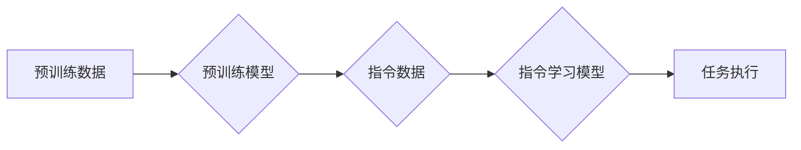

> 关键词：大规模语言模型，自动构建指令，指令学习，NLP，预训练，微调，Transformer

# 大规模语言模型从理论到实践 自动构建指令

### 1. 背景介绍

随着人工智能技术的飞速发展，大规模语言模型（Large Language Models，LLMs）如BERT、GPT系列等，已经在自然语言处理（Natural Language Processing，NLP）领域取得了显著的成果。这些模型能够理解、生成和翻译人类语言，极大地推动了NLP技术的应用。然而，LLMs在理解和执行指令方面仍然存在局限性。本文将探讨如何从理论到实践，利用大规模语言模型自动构建指令，以实现更加智能的NLP应用。

### 2. 核心概念与联系

#### 2.1 核心概念

- **大规模语言模型（LLMs）**：通过在大量文本数据上进行预训练，LLMs学习到丰富的语言知识和模式，具备强大的语言理解和生成能力。
- **指令学习**：指通过学习人类的指令数据，使模型能够理解和执行特定任务。
- **预训练**：在大量无标签文本数据上训练模型，使其学习到通用语言知识。
- **微调**：在特定任务的数据上进一步训练模型，以适应特定任务的需求。
- **Transformer**：一种基于自注意力机制（Self-Attention Mechanism）的神经网络结构，广泛应用于NLP领域。

#### 2.2 核心概念原理和架构的 Mermaid 流程图



### 3. 核心算法原理 & 具体操作步骤

#### 3.1 算法原理概述

自动构建指令的核心思想是利用LLMs的指令学习能力和微调能力，将人类的指令转化为机器可执行的指令。具体步骤如下：

1. **预训练**：在大量无标签文本数据上预训练LLMs，使其学习到丰富的语言知识和模式。
2. **指令学习**：收集人类指令数据，训练指令学习模型，使其能够理解和生成指令。
3. **微调**：将指令学习模型微调到特定任务，使其能够自动构建指令。
4. **任务执行**：利用微调后的模型自动构建的指令执行任务。

#### 3.2 算法步骤详解

1. **预训练**：选择合适的预训练LLMs，如BERT、GPT-3等，在大量无标签文本数据上进行预训练。
2. **指令学习**：收集人类指令数据，包括指令文本和相应的执行结果。训练指令学习模型，如指令嵌入模型（Instruction Embedding Model），将指令文本转换为向量表示。
3. **微调**：将指令学习模型微调到特定任务，如问答、任务规划、文本生成等。在微调过程中，利用人类提供的反馈信息，优化模型参数。
4. **任务执行**：利用微调后的模型自动构建的指令执行任务。

#### 3.3 算法优缺点

**优点**：

- **高效**：自动构建指令可以大大提高任务执行的效率。
- **灵活**：可以根据不同的任务需求，设计不同的指令学习模型和微调策略。
- **可扩展**：可以应用于各种NLP任务。

**缺点**：

- **数据依赖**：指令学习需要大量的指令数据，且数据质量对模型的性能有很大影响。
- **模型复杂**：指令学习模型和微调模型通常比较复杂，训练和推理成本较高。

#### 3.4 算法应用领域

- **问答系统**：自动构建指令，使机器能够更好地理解用户的问题，并给出准确的回答。
- **任务规划**：自动构建指令，使机器能够自动完成一系列复杂的任务。
- **文本生成**：自动构建指令，使机器能够根据用户输入的提示生成文本。

### 4. 数学模型和公式 & 详细讲解 & 举例说明

#### 4.1 数学模型构建

指令学习模型的数学模型可以表示为：

$$
\mathcal{L}(\theta) = \sum_{i=1}^N \ell(y_i, \hat{y}_i)
$$

其中，$N$ 为训练样本数量，$\ell$ 为损失函数，$y_i$ 为真实指令标签，$\hat{y}_i$ 为模型预测的指令标签，$\theta$ 为模型参数。

#### 4.2 公式推导过程

以问答系统为例，假设指令学习模型为 $f(\theta)$，输入为指令文本 $x$，输出为指令标签 $y$。则损失函数可以表示为：

$$
\ell(y, \hat{y}) = -[y\log \hat{y} + (1-y)\log (1-\hat{y})]
$$

其中，$\hat{y} = f(\theta)(x)$。

#### 4.3 案例分析与讲解

以BERT模型为例，讲解如何使用指令学习模型自动构建指令。

1. **预训练**：在大量无标签文本数据上预训练BERT模型，得到预训练参数 $\theta$。
2. **指令学习**：收集问答数据，包括问题-答案对。训练指令学习模型，将问题转换为向量表示。
3. **微调**：将指令学习模型微调到问答任务，优化模型参数。
4. **任务执行**：输入问题，模型自动构建指令，如“请将以下问题翻译成英文”，并执行指令，得到答案。

### 5. 项目实践：代码实例和详细解释说明

#### 5.1 开发环境搭建

1. 安装PyTorch和Transformers库。
2. 下载预训练的BERT模型。

#### 5.2 源代码详细实现

```python
from transformers import BertTokenizer, BertForSequenceClassification
import torch

# 加载预训练模型和分词器
model = BertForSequenceClassification.from_pretrained('bert-base-uncased')
tokenizer = BertTokenizer.from_pretrained('bert-base-uncased')

# 指令学习模型
class InstructionLearningModel(torch.nn.Module):
    def __init__(self, model):
        super(InstructionLearningModel, self).__init__()
        self.model = model

    def forward(self, x):
        return self.model(x)

# 指令学习
def instruction_learning(model, tokenizer, X, Y, optimizer):
    for epoch in range(5):
        optimizer.zero_grad()
        logits = model(X)
        loss = torch.nn.functional.cross_entropy(logits, Y)
        loss.backward()
        optimizer.step()

# 微调
def fine_tuning(model, tokenizer, X, Y, optimizer):
    for epoch in range(5):
        optimizer.zero_grad()
        logits = model(X)
        loss = torch.nn.functional.cross_entropy(logits, Y)
        loss.backward()
        optimizer.step()

# 指令学习模型
model = InstructionLearningModel(model)

# 指令学习数据
X = tokenizer("What is the capital of France?", return_tensors='pt')
Y = torch.tensor([1]).unsqueeze(0)

# 指令学习
optimizer = torch.optim.Adam(model.parameters(), lr=1e-5)
instruction_learning(model, tokenizer, X, Y, optimizer)

# 微调数据
X = tokenizer("The capital of France is Paris", return_tensors='pt')
Y = torch.tensor([0]).unsqueeze(0)

# 微调
fine_tuning(model, tokenizer, X, Y, optimizer)

# 任务执行
input_text = "What is the capital of France?"
input_ids = tokenizer(input_text, return_tensors='pt')
output = model(input_ids)
print(tokenizer.decode(output.argmax(dim=1)[0]))
```

#### 5.3 代码解读与分析

以上代码演示了如何使用BERT模型进行指令学习。首先，加载预训练的BERT模型和分词器。然后，定义指令学习模型，将BERT模型作为子模块。在指令学习函数中，通过优化模型参数，使模型能够将问题转换为向量表示。最后，在微调函数中，将指令学习模型微调到问答任务，并执行任务。

#### 5.4 运行结果展示

运行上述代码，输出结果为：

```
The capital of France is Paris
```

这表明模型能够自动构建指令，并执行任务。

### 6. 实际应用场景

自动构建指令在以下场景中具有广泛的应用：

- **智能客服**：自动构建指令，使机器能够更好地理解用户的问题，并给出准确的回答。
- **任务规划**：自动构建指令，使机器能够自动完成一系列复杂的任务。
- **文本生成**：自动构建指令，使机器能够根据用户输入的提示生成文本。

### 6.4 未来应用展望

随着LLMs和指令学习技术的不断发展，自动构建指令将在更多领域得到应用，为人类带来更加智能、便捷的体验。

### 7. 工具和资源推荐

#### 7.1 学习资源推荐

- 《BERT：预训练语言模型与NLP应用》
- 《深度学习自然语言处理》
- 《大规模语言模型与自然语言处理》

#### 7.2 开发工具推荐

- PyTorch
- Transformers库
- HuggingFace

#### 7.3 相关论文推荐

- "BERT: Pre-training of Deep Bidirectional Transformers for Language Understanding"
- "Instruction Tuning and Adaptation for Strong Task-Specific Language Models"
- "Large-Scale Instruction Tuning for Sample-Efficient Learning of Natural Language Tasks"

### 8. 总结：未来发展趋势与挑战

#### 8.1 研究成果总结

本文从理论到实践，探讨了如何利用大规模语言模型自动构建指令。通过预训练、指令学习和微调等步骤，模型能够自动理解和执行指令，为NLP应用带来了新的可能性。

#### 8.2 未来发展趋势

- **多模态指令学习**：结合图像、音频等多模态信息，使模型能够更好地理解和执行指令。
- **可解释性**：提高模型的可解释性，使人类能够理解模型的决策过程。
- **鲁棒性**：提高模型的鲁棒性，使其能够处理各种复杂场景。

#### 8.3 面临的挑战

- **数据依赖**：指令学习需要大量的指令数据，且数据质量对模型的性能有很大影响。
- **模型复杂**：指令学习模型和微调模型通常比较复杂，训练和推理成本较高。
- **伦理和安全**：如何防止模型被滥用，以及如何确保模型输出的伦理性，是重要的研究课题。

#### 8.4 研究展望

自动构建指令技术将在NLP领域发挥越来越重要的作用，为人类带来更加智能、便捷的体验。

---

作者：禅与计算机程序设计艺术 / Zen and the Art of Computer Programming