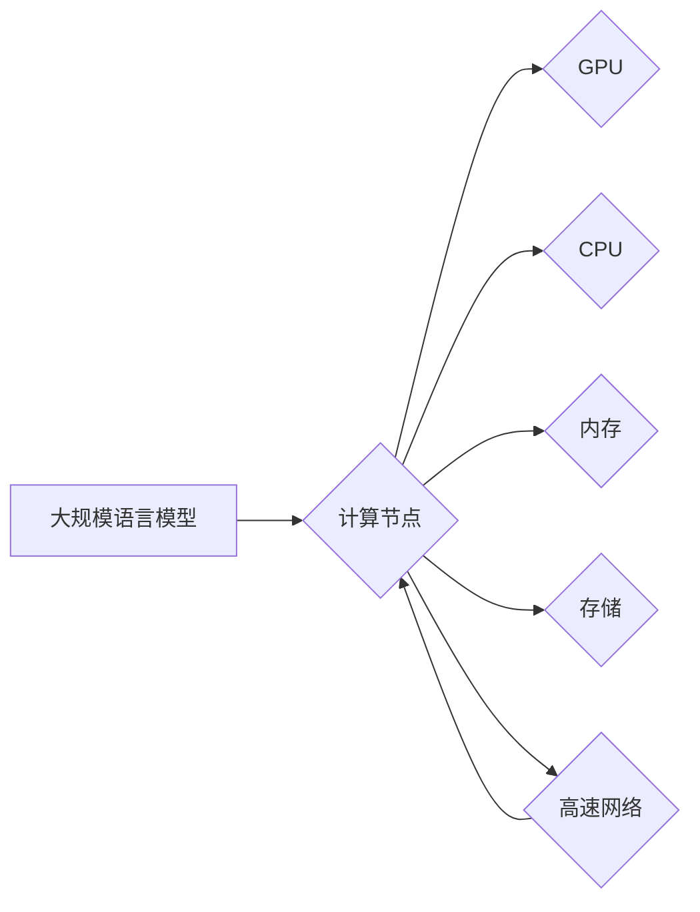

> 大规模语言模型, 高性能计算集群, 硬件组成, 计算节点, GPU, CPU, 内存, 存储, 网络架构

# 大规模语言模型从理论到实践 高性能计算集群的典型硬件组成

> 关键词：大规模语言模型，高性能计算集群，硬件组成，计算节点，GPU，CPU，内存，存储，网络架构

## 1. 背景介绍

随着深度学习在自然语言处理（NLP）领域的飞速发展，大规模语言模型（Large Language Models, LLMs）逐渐成为研究热点。这些模型通过在庞大的数据集上进行预训练，学会了丰富的语言知识，并在各种NLP任务中取得了显著的成果。然而，构建和运行大规模语言模型需要大量的计算资源和复杂的高性能计算集群支持。本文将深入探讨高性能计算集群的典型硬件组成，并分析其在大规模语言模型实践中的应用。

### 1.1 问题的由来

大规模语言模型通常包含数亿甚至数千亿个参数，这使得它们的训练和推理过程对计算资源的需求极高。传统的个人电脑或服务器难以满足这些需求，因此需要构建专门的高性能计算集群来支撑模型训练和部署。

### 1.2 研究现状

目前，高性能计算集群在LLMs的应用中扮演着至关重要的角色。高性能计算集群由多个计算节点组成，每个节点都配备了高性能的CPU、GPU、内存和存储设备。此外，集群还需要具备高效的网络架构，以保证节点之间的数据传输和协同工作。

### 1.3 研究意义

深入理解高性能计算集群的硬件组成对于LLMs的实践具有重要意义：

- 提高模型训练效率：合理配置硬件资源可以显著提高模型训练速度，缩短研发周期。
- 降低计算成本：优化硬件配置可以降低能耗和硬件采购成本。
- 提升模型性能：高性能计算集群可以为LLMs提供更强大的计算能力，从而提升模型性能。

### 1.4 本文结构

本文将分为以下章节：

- 第2章：介绍LLMs的核心概念和架构。
- 第3章：分析高性能计算集群的典型硬件组成。
- 第4章：探讨高性能计算集群在LLMs中的应用。
- 第5章：介绍LLMs在集群上的实践案例。
- 第6章：展望LLMs和集群发展的未来趋势。
- 第7章：推荐相关学习和开发资源。
- 第8章：总结全文，并展望LLMs和集群发展的未来挑战。

## 2. 核心概念与联系

### 2.1 核心概念

#### 大规模语言模型（LLMs）

大规模语言模型是指通过在庞大的文本语料库上进行预训练，学习到丰富的语言知识和模式的模型。LLMs具有强大的语言理解和生成能力，可以应用于各种NLP任务，如文本分类、机器翻译、问答系统等。

#### 高性能计算集群

高性能计算集群是指由多个高性能计算节点组成的分布式计算系统。每个计算节点都配备了高性能的CPU、GPU、内存和存储设备，并通过高速网络连接在一起，以协同处理大规模的计算任务。

### 2.2 架构的 Mermaid 流程图



## 3. 核心算法原理 & 具体操作步骤

### 3.1 算法原理概述

LLMs的训练过程通常包括以下步骤：

1. 预训练：在大量无标注文本上进行预训练，学习语言模式和知识。
2. 微调：在下游任务上进行微调，优化模型参数以适应特定任务。
3. 推理：在测试数据上进行推理，预测结果。

高性能计算集群通过并行计算加速LLMs的训练和推理过程。

### 3.2 算法步骤详解

#### 预训练

1. 准备大量无标注文本数据。
2. 设计预训练任务，如语言建模、掩码语言模型等。
3. 在高性能计算集群上进行预训练，学习语言模式和知识。

#### 微调

1. 收集下游任务的标注数据。
2. 在预训练模型的基础上进行微调，优化模型参数以适应特定任务。
3. 在高性能计算集群上进行微调，提高模型性能。

#### 推理

1. 准备测试数据。
2. 在高性能计算集群上进行推理，预测结果。
3. 评估模型性能。

### 3.3 算法优缺点

#### 优点

- 提高训练和推理速度。
- 降低计算成本。
- 提升模型性能。

#### 缺点

- 需要大量的计算资源。
- 需要复杂的集群管理和维护。

### 3.4 算法应用领域

LLMs和集群技术可以应用于以下领域：

- 自然语言处理（NLP）。
- 计算机视觉（CV）。
- 智能语音（ASR和TTS）。
- 金融计算。
- 物联网（IoT）。

## 4. 数学模型和公式 & 详细讲解 & 举例说明

### 4.1 数学模型构建

LLMs通常使用神经网络进行构建，包括以下数学模型：

- **卷积神经网络（CNN）**：用于文本分类、情感分析等任务。
- **循环神经网络（RNN）**：用于序列处理，如机器翻译、语音识别等。
- **Transformer模型**：用于生成模型和序列到序列模型。

### 4.2 公式推导过程

以下以Transformer模型为例，介绍其数学模型的推导过程：

$$
\text{Attention}(Q, K, V) = \text{softmax}\left(\frac{QK^T}{\sqrt{d_k}}\right)V
$$

其中，$Q$、$K$ 和 $V$ 分别是查询（Query）、键（Key）和值（Value）矩阵，$d_k$ 是注意力机制中键的维度。

### 4.3 案例分析与讲解

以BERT模型为例，讲解其在大规模语言模型中的实践应用：

BERT模型使用Transformer架构，通过掩码语言模型（Masked Language Model, MLM）和下一句预测（Next Sentence Prediction, NSP）任务进行预训练。在预训练过程中，BERT学习到丰富的语言模式和知识，从而在下游任务中取得优异的性能。

## 5. 项目实践：代码实例和详细解释说明

### 5.1 开发环境搭建

在构建高性能计算集群之前，需要搭建以下开发环境：

- 操作系统：Linux或Unix。
- 编程语言：Python。
- 框架：TensorFlow或PyTorch。
- 硬件：GPU、CPU、内存、存储。

### 5.2 源代码详细实现

以下是一个使用PyTorch和TensorFlow框架构建BERT模型并进行微调的简单示例：

```python
# 使用PyTorch构建BERT模型并进行微调
from transformers import BertForSequenceClassification, BertTokenizer

# 加载预训练BERT模型和分词器
model = BertForSequenceClassification.from_pretrained('bert-base-uncased')
tokenizer = BertTokenizer.from_pretrained('bert-base-uncased')

# 预处理数据
def preprocess_data(texts, labels):
    inputs = tokenizer(texts, return_tensors='pt', padding=True, truncation=True)
    labels = torch.tensor(labels)
    return inputs, labels

# 训练模型
def train_model(model, train_data, dev_data, epochs=3):
    # 训练代码 ...

# 微调模型
def fine_tune_model(model, train_data, dev_data, epochs=3):
    # 微调代码 ...

# 评估模型
def evaluate_model(model, test_data):
    # 评估代码 ...
```

### 5.3 代码解读与分析

以上代码展示了使用PyTorch框架构建BERT模型并进行微调的基本流程。首先，加载预训练的BERT模型和分词器。然后，预处理数据，包括文本编码、填充和截断。接下来，定义训练和评估函数，以实现模型训练、微调和评估。

### 5.4 运行结果展示

运行以上代码，可以在训练集和开发集上评估模型的性能。根据评估结果，调整模型参数或改进训练过程，以提升模型性能。

## 6. 实际应用场景

### 6.1 文本分类

LLMs和集群技术可以应用于文本分类任务，如情感分析、主题分类、垃圾邮件检测等。以下是一个使用BERT模型进行文本分类的案例：

- 收集标注数据，包括文本和对应的分类标签。
- 使用BERT模型对文本进行编码。
- 在预训练模型的基础上进行微调，优化模型参数以适应特定任务。
- 在测试数据上进行推理，预测结果。

### 6.2 机器翻译

LLMs和集群技术可以应用于机器翻译任务，如将一种语言翻译成另一种语言。以下是一个使用BERT模型进行机器翻译的案例：

- 收集双语文本数据。
- 使用BERT模型对源语言和目标语言的文本进行编码。
- 在预训练模型的基础上进行微调，优化模型参数以适应特定任务。
- 在测试数据上进行推理，将源语言翻译成目标语言。

## 7. 工具和资源推荐

### 7.1 学习资源推荐

- 《深度学习》（Goodfellow等著）
- 《动手学深度学习》（花书）
- 《PyTorch深度学习》（Adam et al. 著）
- 《TensorFlow实战》（François Chollet 著）

### 7.2 开发工具推荐

- PyTorch
- TensorFlow
- Keras
- PyTorch Lightning

### 7.3 相关论文推荐

- "Attention is All You Need"
- "BERT: Pre-training of Deep Bidirectional Transformers for Language Understanding"
- "Generative Language Models"
- "Language Models are Unsupervised Multitask Learners"

## 8. 总结：未来发展趋势与挑战

### 8.1 研究成果总结

本文介绍了大规模语言模型和高速计算集群的核心概念、硬件组成、应用场景和实践案例。通过构建高性能计算集群，可以显著提高LLMs的训练和推理效率，从而在各个领域取得更好的性能。

### 8.2 未来发展趋势

未来，LLMs和集群技术将呈现以下发展趋势：

- 模型规模将进一步扩大。
- 算法将更加高效和节能。
- 应用场景将更加广泛。

### 8.3 面临的挑战

LLMs和集群技术在实际应用中仍面临以下挑战：

- 计算资源需求巨大。
- 集群管理和维护复杂。
- 模型可解释性和安全性问题。

### 8.4 研究展望

未来，研究人员需要关注以下研究方向：

- 开发更加高效的算法和模型。
- 构建更加智能和可解释的模型。
- 解决计算资源和能源消耗问题。

## 9. 附录：常见问题与解答

**Q1：LLMs和集群技术是否适用于所有NLP任务？**

A：LLMs和集群技术可以应用于大多数NLP任务，如文本分类、机器翻译、问答系统等。但对于某些需要特定领域知识的任务，可能需要结合领域知识库和专业知识。

**Q2：如何选择合适的计算集群架构？**

A：选择计算集群架构需要考虑以下因素：

- 计算任务的需求。
- 预算限制。
- 硬件资源可用性。

**Q3：如何优化集群性能？**

A：优化集群性能的方法包括：

- 使用高性能硬件。
- 优化软件配置。
- 管理好集群资源。

**Q4：LLMs的可解释性和安全性如何保证？**

A：保证LLMs的可解释性和安全性需要：

- 开发可解释的模型。
- 设计合理的训练数据集。
- 建立模型监督机制。

---

作者：禅与计算机程序设计艺术 / Zen and the Art of Computer Programming