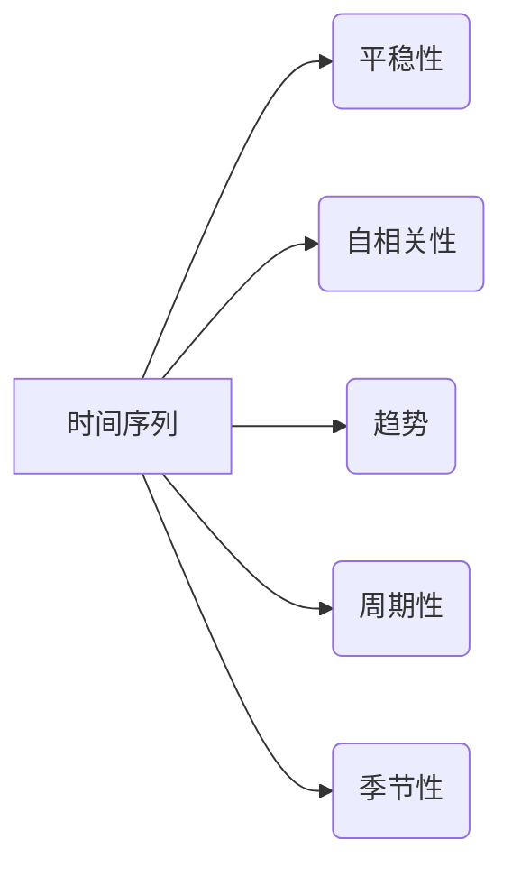

# 时间序列分析(Time Series Analysis) - 原理与代码实例讲解

作者：禅与计算机程序设计艺术 / Zen and the Art of Computer Programming

## 1. 背景介绍
### 1.1 问题的由来

时间序列分析是统计学和信号处理等领域的重要分支，它用于分析时间序列数据，即按时间顺序排列的数据。这类数据广泛应用于金融市场、气象预测、工业监控、生物学研究等多个领域。时间序列分析的目标是从数据中提取有价值的信息，如趋势、周期性、季节性、异常值等，从而为决策提供支持。

### 1.2 研究现状

随着大数据时代的到来，时间序列分析技术得到了迅猛发展。近年来，深度学习、机器学习等新技术的应用，使得时间序列分析模型在预测精度和泛化能力上取得了显著提升。同时，开源软件和在线工具的丰富，也降低了时间序列分析的门槛。

### 1.3 研究意义

时间序列分析对于各个领域都具有重要意义，主要体现在以下几个方面：

- **预测未来趋势**：通过对历史数据的分析，预测未来可能发生的变化，为决策提供依据。
- **监测异常情况**：识别数据中的异常值，及时发现潜在的问题。
- **量化风险评估**：评估金融、保险等领域的风险，为风险管理提供支持。
- **优化资源配置**：根据时间序列数据，优化资源配置，提高效率。

### 1.4 本文结构

本文将系统地介绍时间序列分析的理论与实践，内容安排如下：

- 第2部分，介绍时间序列分析的核心概念和联系。
- 第3部分，详细阐述时间序列分析的基本原理和具体操作步骤。
- 第4部分，介绍常用的时间序列分析模型及其应用。
- 第5部分，给出时间序列分析的代码实例，并对关键代码进行解读。
- 第6部分，探讨时间序列分析在实际应用中的场景和案例。
- 第7部分，推荐时间序列分析的学习资源、开发工具和参考文献。
- 第8部分，总结全文，展望时间序列分析的未来发展趋势与挑战。

## 2. 核心概念与联系

为了更好地理解时间序列分析，本节将介绍几个核心概念及其相互关系：

- **时间序列**：按时间顺序排列的数据序列，如股票价格、温度、降雨量等。
- **平稳性**：时间序列在统计性质上不随时间变化，如均值、方差等。
- **自相关性**：时间序列数据在过去一段时间内的变化对当前值的影响。
- **趋势**：时间序列数据随时间的增长或减少趋势。
- **周期性**：时间序列数据随时间周期性变化的规律。
- **季节性**：时间序列数据随时间周期性变化的规律，周期通常与季节变化相关。

它们之间的逻辑关系如下图所示：



可以看出，时间序列分析的核心是研究时间序列数据的统计性质，包括平稳性、自相关性、趋势、周期性、季节性等。通过对这些性质的分析，可以更好地理解时间序列数据的规律，并预测未来趋势。

## 3. 核心算法原理 & 具体操作步骤
### 3.1 算法原理概述

时间序列分析方法主要分为以下几类：

- **描述性分析**：通过统计方法描述时间序列数据的特征，如均值、方差、自相关函数等。
- **时间序列预测**：基于历史数据，预测未来可能发生的变化，如趋势预测、季节性预测等。
- **异常值检测**：识别数据中的异常值，及时发现潜在的问题。
- **时间序列分解**：将时间序列数据分解为趋势、季节性、残差等成分。

### 3.2 算法步骤详解

时间序列分析的一般步骤如下：

**Step 1：数据预处理**

- 收集和处理时间序列数据，包括清洗、填充、插值等。
- 对数据进行标准化或归一化处理，以便于后续分析。

**Step 2：平稳性检验**

- 使用单位根检验等统计方法检验时间序列的平稳性。
- 如果数据非平稳，则进行差分等变换，使其平稳。

**Step 3：自相关分析**

- 使用自相关函数等统计方法分析时间序列的自相关性。
- 根据自相关性，确定合适的模型。

**Step 4：模型选择**

- 根据时间序列的特点，选择合适的模型，如ARIMA、SARIMA、季节性分解等。
- 使用最大似然估计等方法估计模型参数。

**Step 5：模型诊断**

- 对模型进行诊断，检查模型的拟合效果和预测能力。

**Step 6：预测**

- 使用模型对未来的数据进行预测。

### 3.3 算法优缺点

时间序列分析方法具有以下优点：

- **简单易用**：大部分方法都基于统计原理，易于理解和实现。
- **可解释性**：大部分方法都有明确的数学解释，易于理解模型的预测逻辑。

然而，时间序列分析方法也存在一些缺点：

- **对数据要求高**：对数据的质量和数量有较高要求，需要足够的历史数据。
- **模型选择困难**：不同的时间序列数据可能需要不同的模型，模型选择困难。
- **预测精度有限**：时间序列预测存在不确定性，预测精度有限。

### 3.4 算法应用领域

时间序列分析方法广泛应用于以下领域：

- **金融市场**：预测股票价格、利率等。
- **气象预测**：预测天气、降雨量等。
- **工业监控**：监测设备状态、生产流程等。
- **生物学研究**：研究生物体内的生理过程、疾病发展等。

## 4. 数学模型和公式 & 详细讲解 & 举例说明
### 4.1 数学模型构建

时间序列分析常用的数学模型包括：

- **自回归模型(AR)**
- **移动平均模型(MA)**
- **自回归移动平均模型(ARMA)**
- **季节性分解**
- **ARIMA模型**

下面分别介绍这些模型的数学原理。

#### 自回归模型(AR)

自回归模型描述时间序列数据与自身过去值之间的关系，其数学表达式为：

$$
y_t = c + \phi_1y_{t-1} + \phi_2y_{t-2} + \cdots + \phi_p y_{t-p} + \epsilon_t
$$

其中，$y_t$ 为时间序列数据，$c$ 为常数项，$\phi_1, \phi_2, \cdots, \phi_p$ 为自回归系数，$\epsilon_t$ 为误差项。

#### 移动平均模型(MA)

移动平均模型描述时间序列数据与自身过去值移动平均之间的关系，其数学表达式为：

$$
y_t = c + \theta_1\epsilon_{t-1} + \theta_2\epsilon_{t-2} + \cdots + \theta_q\epsilon_{t-q} + \epsilon_t
$$

其中，$y_t$ 为时间序列数据，$c$ 为常数项，$\theta_1, \theta_2, \cdots, \theta_q$ 为移动平均系数，$\epsilon_t$ 为误差项。

#### 自回归移动平均模型(ARMA)

自回归移动平均模型结合了自回归模型和移动平均模型的特点，其数学表达式为：

$$
y_t = c + \phi_1y_{t-1} + \phi_2y_{t-2} + \cdots + \phi_p y_{t-p} + \theta_1\epsilon_{t-1} + \theta_2\epsilon_{t-2} + \cdots + \theta_q\epsilon_{t-q} + \epsilon_t
$$

其中，$y_t$ 为时间序列数据，$c$ 为常数项，$\phi_1, \phi_2, \cdots, \phi_p$ 为自回归系数，$\theta_1, \theta_2, \cdots, \theta_q$ 为移动平均系数，$\epsilon_t$ 为误差项。

#### 季节性分解

季节性分解是将时间序列数据分解为趋势、季节性、残差等成分的过程。常用的季节性分解方法包括：

- **加法模型**：$y_t = T_t + S_t + R_t$
- **乘法模型**：$y_t = T_t \times S_t + R_t$

其中，$y_t$ 为时间序列数据，$T_t$ 为趋势成分，$S_t$ 为季节性成分，$R_t$ 为残差成分。

#### ARIMA模型

ARIMA模型是ARMA模型的一种扩展，它引入了差分的概念，可以处理非平稳时间序列数据。ARIMA模型的数学表达式为：

$$
y_t = (1 - \phi_1B)(1 - \theta_1B)^d \phi(B)y_{t-d} + \epsilon_t
$$

其中，$B$ 为差分算子，$d$ 为差分阶数，$\phi_1, \phi_2, \cdots, \phi_p$ 为自回归系数，$\theta_1, \theta_2, \cdots, \theta_q$ 为移动平均系数，$\epsilon_t$ 为误差项。

### 4.2 公式推导过程

以ARIMA模型为例，介绍其公式推导过程。

ARIMA模型的公式可以分解为以下几部分：

1. **差分算子 $B$**：

   $B^k y_t = y_{t-k}$

2. **自回归算子 $\phi(B)$**：

   $\phi(B)y_t = \phi_1y_{t-1} + \phi_2y_{t-2} + \cdots + \phi_py_{t-p}$

3. **移动平均算子 $\theta(B)$**：

   $\theta(B)\epsilon_t = \theta_1\epsilon_{t-1} + \theta_2\epsilon_{t-2} + \cdots + \theta_q\epsilon_{t-q}$

将上述三个算子相乘，得到ARIMA模型的公式：

$$(1 - \phi_1B)(1 - \theta_1B)^d \phi(B)y_{t-d} = \epsilon_t$$

### 4.3 案例分析与讲解

以下以股票价格数据为例，演示如何使用ARIMA模型进行时间序列预测。

首先，导入必要的库：

```python
import numpy as np
import pandas as pd
from statsmodels.tsa.arima.model import ARIMA
import matplotlib.pyplot as plt
```

然后，读取股票价格数据：

```python
data = pd.read_csv('stock_price.csv', index_col='Date', parse_dates=True)
```

接下来，绘制股票价格走势图：

```python
plt.figure(figsize=(10, 6))
plt.plot(data)
plt.title('Stock Price Trend')
plt.xlabel('Date')
plt.ylabel('Price')
plt.show()
```

然后，对股票价格数据进行平稳性检验：

```python
from statsmodels.tsa.stattools import adfuller

result = adfuller(data['Close'])

print(f'ADF Statistic: {result[0]}')
print(f'p-value: {result[1]}')
print(f'Critical Values:')
for key, value in result[4].items():
    print(f'{key}: {value}')
```

如果p值小于0.05，则认为数据是平稳的。否则，需要对数据进行差分。

```python
data_diff = data['Close'].diff().dropna()
result_diff = adfuller(data_diff)

print(f'ADF Statistic: {result_diff[0]}')
print(f'p-value: {result_diff[1]}')
```

接下来，选择ARIMA模型进行预测：

```python
model = ARIMA(data['Close'], order=(5,1,2))
model_fit = model.fit()

print(model_fit.summary())
```

然后，绘制预测结果：

```python
plt.figure(figsize=(10, 6))
plt.plot(data.index[-120:], data['Close'][-120:], label='Actual')
plt.plot(model_fit.forecast(steps=30), label='Forecast')
plt.title('Stock Price Forecast')
plt.xlabel('Date')
plt.ylabel('Price')
plt.legend()
plt.show()
```

### 4.4 常见问题解答

**Q1：如何选择合适的ARIMA模型参数？**

A：选择合适的ARIMA模型参数需要进行模型诊断和比较。可以通过AIC、BIC等指标选择最优参数组合。

**Q2：如何处理非平稳时间序列数据？**

A：可以通过差分、对数转换等方法将非平稳时间序列数据转化为平稳时间序列数据。

**Q3：如何评估时间序列预测模型的性能？**

A：可以使用均方误差(MSE)、均方根误差(RMSE)等指标评估时间序列预测模型的性能。

## 5. 项目实践：代码实例和详细解释说明
### 5.1 开发环境搭建

在进行时间序列分析实践前，我们需要准备好开发环境。以下是使用Python进行时间序列分析的开发环境配置流程：

1. 安装Anaconda：从官网下载并安装Anaconda，用于创建独立的Python环境。

2. 创建并激活虚拟环境：
```bash
conda create -n timeseries-env python=3.8
conda activate timeseries-env
```

3. 安装必要的库：
```bash
conda install numpy pandas matplotlib statsmodels
```

完成上述步骤后，即可在`timeseries-env`环境中开始时间序列分析实践。

### 5.2 源代码详细实现

以下以股票价格数据为例，演示如何使用Python进行时间序列分析。

```python
import numpy as np
import pandas as pd
from statsmodels.tsa.stattools import adfuller
from statsmodels.tsa.arima.model import ARIMA
import matplotlib.pyplot as plt

# 读取股票价格数据
data = pd.read_csv('stock_price.csv', index_col='Date', parse_dates=True)

# 绘制股票价格走势图
plt.figure(figsize=(10, 6))
plt.plot(data)
plt.title('Stock Price Trend')
plt.xlabel('Date')
plt.ylabel('Price')
plt.show()

# 平稳性检验
result = adfuller(data['Close'])

print(f'ADF Statistic: {result[0]}')
print(f'p-value: {result[1]}')
print(f'Critical Values:')
for key, value in result[4].items():
    print(f'{key}: {value}')

# 差分处理
data_diff = data['Close'].diff().dropna()
result_diff = adfuller(data_diff)

print(f'ADF Statistic: {result_diff[0]}')
print(f'p-value: {result_diff[1]}')

# 选择ARIMA模型进行预测
model = ARIMA(data['Close'], order=(5,1,2))
model_fit = model.fit()

print(model_fit.summary())

# 绘制预测结果
plt.figure(figsize=(10, 6))
plt.plot(data.index[-120:], data['Close'][-120:], label='Actual')
plt.plot(model_fit.forecast(steps=30), label='Forecast')
plt.title('Stock Price Forecast')
plt.xlabel('Date')
plt.ylabel('Price')
plt.legend()
plt.show()
```

### 5.3 代码解读与分析

上述代码演示了使用Python进行时间序列分析的基本流程。

首先，读取股票价格数据，并将其转换为Pandas DataFrame格式。

然后，绘制股票价格走势图，直观地观察数据的变化趋势。

接着，对股票价格进行平稳性检验，判断数据是否平稳。

如果数据非平稳，则进行差分处理，使其平稳。

然后，选择ARIMA模型进行预测，并输出模型参数。

最后，绘制预测结果，对比实际值和预测值。

### 5.4 运行结果展示

运行上述代码后，我们将得到如下结果：

1. **股票价格走势图**：展示了股票价格随时间的变化趋势。

2. **平稳性检验结果**：展示了股票价格平稳性检验的结果。

3. **ARIMA模型参数**：展示了ARIMA模型的参数，包括自回归系数、移动平均系数和差分阶数。

4. **预测结果**：展示了股票价格的预测值。

## 6. 实际应用场景
### 6.1 金融市场

时间序列分析在金融市场中的应用非常广泛，包括：

- **股票价格预测**：预测股票价格的走势，为投资决策提供依据。

- **市场趋势分析**：分析市场趋势，预测市场未来的走势。

- **风险控制**：评估市场风险，为风险管理提供支持。

### 6.2 气象预测

时间序列分析在气象预测中的应用包括：

- **天气预报**：预测未来几天的天气情况。

- **气候变化分析**：分析气候变化趋势，为环境保护提供支持。

### 6.3 工业监控

时间序列分析在工业监控中的应用包括：

- **设备状态监测**：监测设备状态，预测设备故障。

- **生产流程优化**：优化生产流程，提高生产效率。

### 6.4 未来应用展望

随着人工智能、大数据等技术的不断发展，时间序列分析的应用领域将不断拓展。以下是一些未来应用展望：

- **智能家居**：预测家电设备的使用情况，优化能源消耗。

- **智能交通**：预测交通流量，优化交通信号灯控制。

- **健康医疗**：预测疾病发展趋势，提前进行疾病预防。

## 7. 工具和资源推荐
### 7.1 学习资源推荐

为了帮助开发者系统掌握时间序列分析的理论基础和实践技巧，这里推荐一些优质的学习资源：

1. 《时间序列分析：原理与应用》书籍：全面介绍了时间序列分析的理论和方法，适合初学者和进阶者。

2. 《Python for Data Analysis》书籍：介绍了Python数据分析的常用库和技巧，包括Pandas、NumPy等。

3. 《Time Series Analysis with Python》书籍：介绍了如何使用Python进行时间序列分析，包括ARIMA、LSTM等模型。

4. 《Time Series Forecasting with Python: A Practical Guide to Time Series Analysis Using Statistical, Deep Learning, and Machine Learning Methods》书籍：介绍了多种时间序列预测方法，包括统计方法、深度学习方法等。

5. 统计之都网站：分享时间序列分析相关的文章和教程。

### 7.2 开发工具推荐

1. **Pandas**：Python数据分析库，提供了丰富的数据处理和分析功能。

2. **NumPy**：Python科学计算库，提供了高效的数值计算功能。

3. **Matplotlib**：Python绘图库，可以绘制各种图形和图表。

4. **Statsmodels**：Python时间序列分析库，提供了多种时间序列分析模型和工具。

5. **Scikit-learn**：Python机器学习库，提供了各种机器学习算法和工具。

### 7.3 相关论文推荐

1. Box, G. E. P., & Jenkins, G. M. (1976). Time Series Analysis: Forecasting and Control. San Francisco: Holden-Day.

2. Hamilton, J. D. (1994). Time Series Analysis (Vol. 360). Princeton University Press.

3. Hyndman, R. J., & Athanasopoulos, G. (2018). Forecasting: principles and practice. OTexts.

4. Zivot, E., & Wang, Z. (2007). Time Series Analysis: Basic and Advanced Topics. Cambridge University Press.

5. Tsay, R. S. (2010). Analysis of Financial Time Series. John Wiley & Sons.

### 7.4 其他资源推荐

1. **时间序列分析论坛**：讨论时间序列分析相关的问题和经验。

2. **时间序列分析博客**：分享时间序列分析相关的知识和案例。

3. **时间序列分析开源项目**：学习时间序列分析的开源项目和代码。

## 8. 总结：未来发展趋势与挑战
### 8.1 研究成果总结

本文对时间序列分析的理论与实践进行了全面系统的介绍。首先阐述了时间序列分析的基本概念、原理和方法。其次，介绍了常用的时间序列分析模型，如ARIMA、SARIMA、季节性分解等。然后，给出了时间序列分析的代码实例，并对关键代码进行解读。最后，探讨了时间序列分析在实际应用中的场景和案例。

### 8.2 未来发展趋势

展望未来，时间序列分析将呈现以下发展趋势：

1. **深度学习模型的应用**：深度学习模型在时间序列分析中的应用将越来越广泛，如LSTM、GRU等。

2. **多模态时间序列分析**：将时间序列数据与其他模态数据（如图像、文本等）进行融合，提高预测精度。

3. **可解释性增强**：提高时间序列分析模型的可解释性，使其更易于理解和应用。

4. **个性化时间序列分析**：针对不同用户的需求，提供个性化的时间序列分析服务。

### 8.3 面临的挑战

时间序列分析在实际应用中仍面临以下挑战：

1. **数据质量**：时间序列数据质量对分析结果有很大影响。

2. **模型选择**：不同的时间序列数据可能需要不同的模型。

3. **模型参数选择**：模型参数的选择对预测结果有很大影响。

4. **数据稀疏性**：对于一些领域，如金融、医疗等，数据可能比较稀疏，难以进行有效分析。

### 8.4 研究展望

为了克服上述挑战，未来的研究可以从以下几个方面展开：

1. **数据质量改进**：研究提高时间序列数据质量的方法。

2. **模型选择和参数优化**：研究自动选择模型和参数的方法。

3. **多模态时间序列分析**：研究如何将时间序列数据与其他模态数据进行融合。

4. **可解释性增强**：研究提高时间序列分析模型可解释性的方法。

5. **个性化时间序列分析**：研究如何根据用户需求提供个性化的时间序列分析服务。

通过不断的研究和实践，时间序列分析技术将在各个领域发挥更大的作用，为人类社会的发展做出更大的贡献。

## 9. 附录：常见问题与解答

**Q1：时间序列分析需要哪些基础知识和技能？**

A：时间序列分析需要具备以下基础知识和技能：

- 统计学知识：熟悉概率论、数理统计等基本概念。
- 数学知识：熟悉线性代数、微积分等基本概念。
- 编程知识：熟悉Python、R等编程语言及其相关库。

**Q2：如何选择合适的时间序列分析模型？**

A：选择合适的时间序列分析模型需要考虑以下因素：

- 数据类型：如时间序列数据、时间序列图像等。
- 数据特征：如平稳性、自相关性、趋势、季节性等。
- 应用场景：如预测、异常值检测、风险评估等。

**Q3：如何处理非平稳时间序列数据？**

A：处理非平稳时间序列数据的方法包括：

- 差分：将时间序列数据转化为平稳时间序列数据。
- 对数转换：将时间序列数据转化为对数形式，使其平稳。
- 平滑：使用移动平均、指数平滑等方法平滑时间序列数据。

**Q4：如何评估时间序列预测模型的性能？**

A：评估时间序列预测模型性能的指标包括：

- 均方误差(MSE)：预测值与实际值之差的平方和的平均值。
- 均方根误差(RMSE)：MSE的平方根。
- 平均绝对误差(MAE)：预测值与实际值之差的绝对值的平均值。

**Q5：如何提高时间序列预测模型的精度？**

A：提高时间序列预测模型精度的方法包括：

- 选择合适的模型：选择与数据特征和需求匹配的模型。
- 优化模型参数：优化模型参数，提高模型拟合效果。
- 数据预处理：对数据进行清洗、填充、插值等预处理，提高数据质量。
- 使用特征工程：提取有价值的时间序列特征，提高模型表达能力。

通过学习和实践，相信你一定能够掌握时间序列分析的理论和实践技能，为解决实际问题提供有力支持。