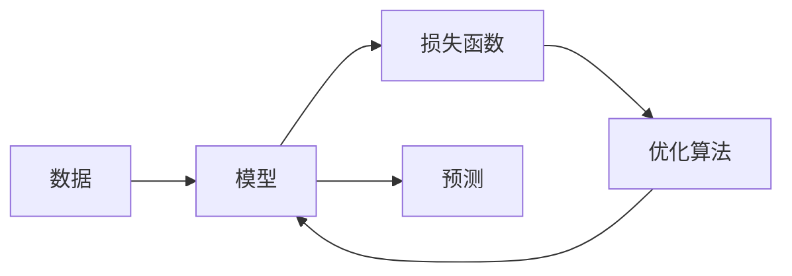

# 机器学习 原理与代码实例讲解

作者：禅与计算机程序设计艺术 / Zen and the Art of Computer Programming


## 1. 背景介绍
### 1.1 问题的由来

机器学习作为人工智能领域的一个重要分支，自20世纪50年代诞生以来，经历了从兴起、低谷再到今天蓬勃发展的历程。其核心目标是通过算法从数据中学习，并利用学到的知识进行预测或决策。随着大数据时代的到来，机器学习在图像识别、语音识别、自然语言处理、推荐系统等领域取得了显著的成果，并逐渐渗透到生活的方方面面。

### 1.2 研究现状

当前，机器学习的研究和应用主要集中在以下几个方面：

- 监督学习：通过已标记的训练数据学习输入和输出之间的关系。
- 无监督学习：从无标签数据中寻找模式和结构。
- 半监督学习：结合有标签和无标签数据进行学习。
- 强化学习：通过与环境交互，学习最优动作序列。

随着深度学习技术的发展，神经网络在图像识别、语音识别等领域取得了突破性进展，成为机器学习领域的主流方法。

### 1.3 研究意义

机器学习具有重要的理论意义和应用价值：

- 提高生产效率：通过自动化处理任务，降低人力成本，提高生产效率。
- 增强决策能力：辅助人类进行决策，提高决策的准确性和可靠性。
- 促进技术创新：推动人工智能、大数据、物联网等技术的发展。

### 1.4 本文结构

本文将围绕机器学习的基本原理、常用算法、代码实例和实际应用等方面进行讲解，主要内容如下：

- 第2部分：介绍机器学习的基本概念和核心算法。
- 第3部分：讲解机器学习中的数学模型和公式。
- 第4部分：通过实际代码实例演示机器学习算法的应用。
- 第5部分：探讨机器学习的实际应用场景和未来发展趋势。
- 第6部分：推荐机器学习的相关学习资源、开发工具和论文。
- 第7部分：总结机器学习的研究成果和未来挑战。
- 第8部分：展望机器学习的发展方向和前景。

## 2. 核心概念与联系

为了更好地理解机器学习，我们需要掌握以下核心概念：

- 数据：机器学习的基石，包括输入数据和输出数据。
- 模型：通过学习数据得到的函数，用于预测或决策。
- 算法：实现模型训练和预测过程的步骤和方法。
- 损失函数：衡量模型预测误差的指标。
- 优化算法：用于最小化损失函数的方法。

这些概念之间的关系可以表示为以下Mermaid流程图：



## 3. 核心算法原理 & 具体操作步骤
### 3.1 算法原理概述

机器学习算法主要分为以下几类：

- 监督学习：通过已标记的训练数据学习输入和输出之间的关系，如线性回归、支持向量机等。
- 无监督学习：从无标签数据中寻找模式和结构，如聚类、降维等。
- 半监督学习：结合有标签和无标签数据进行学习，如标签传播等。
- 强化学习：通过与环境交互，学习最优动作序列，如Q学习、深度Q网络等。

### 3.2 算法步骤详解

以下是机器学习算法的一般步骤：

1. 数据预处理：包括数据清洗、特征提取、数据标准化等。
2. 模型选择：根据任务类型和数据特点选择合适的模型。
3. 模型训练：使用训练数据对模型进行训练，优化模型参数。
4. 模型评估：使用验证集评估模型性能，调整模型参数。
5. 模型预测：使用测试集或新数据进行预测。

### 3.3 算法优缺点

不同类型的算法具有不同的优缺点：

- 监督学习：适用于有标签数据，但需要大量标注数据。
- 无监督学习：适用于无标签数据，但难以评估模型性能。
- 半监督学习：结合有标签和无标签数据，但需要平衡标签和无标签数据的影响。
- 强化学习：适用于需要与环境交互的任务，但训练过程复杂。

### 3.4 算法应用领域

机器学习算法在各个领域都有广泛应用，以下列举一些典型应用：

- 图像识别：人脸识别、物体检测、图像分类等。
- 语音识别：语音转文字、语音识别等。
- 自然语言处理：文本分类、机器翻译、情感分析等。
- 推荐系统：电影推荐、商品推荐等。
- 金融风控：欺诈检测、信用评估等。

## 4. 数学模型和公式 & 详细讲解 & 举例说明
### 4.1 数学模型构建

机器学习中的数学模型主要基于以下几类函数：

- 线性函数：用于线性回归、线性分类等。
- 非线性函数：用于神经网络、决策树等。
- 概率函数：用于贝叶斯推理、概率图模型等。

以下是线性回归的数学模型：

$$
y = \theta_0 + \theta_1x_1 + \theta_2x_2 + \dots + \theta_nx_n
$$

其中 $y$ 为输出，$x_i$ 为输入特征，$\theta_i$ 为模型参数。

### 4.2 公式推导过程

以线性回归为例，推导损失函数和梯度下降的公式。

假设我们有一个线性回归模型，输出为 $y = \theta_0 + \theta_1x_1 + \theta_2x_2 + \dots + \theta_nx_n$。损失函数可以使用均方误差损失：

$$
L(\theta) = \frac{1}{2m}\sum_{i=1}^{m}(y_i - y)^2
$$

其中 $m$ 为样本数量，$y_i$ 为真实标签，$y$ 为模型预测值。

根据链式法则，损失函数对参数 $\theta_i$ 的梯度为：

$$
\nabla_{\theta_i}L(\theta) = -\frac{1}{m}\sum_{i=1}^{m}(y_i - y)x_i
$$

梯度下降算法通过迭代更新参数，使得损失函数不断减小：

$$
\theta_i = \theta_i - \alpha\nabla_{\theta_i}L(\theta)
$$

其中 $\alpha$ 为学习率。

### 4.3 案例分析与讲解

以下使用Python代码实现线性回归模型：

```python
import numpy as np

def linear_regression(X, y, learning_rate=0.01, iterations=1000):
    """线性回归模型"""
    m = X.shape[0]
    X = np.hstack([np.ones((m, 1)), X])  # 添加偏置项
    theta = np.zeros(X.shape[1])
    for _ in range(iterations):
        y_pred = X @ theta  # 预测值
        gradients = X.T @ (y_pred - y) / m  # 梯度
        theta = theta - learning_rate * gradients
    return theta

# 示例数据
X = np.array([[1, 2], [2, 3], [3, 4], [4, 5]])
y = np.array([1, 2, 3, 4])

# 训练模型
theta = linear_regression(X, y)

# 模型参数
print("模型参数：", theta)
```

### 4.4 常见问题解答

**Q1：损失函数有哪些类型？**

A：常见的损失函数包括均方误差损失（MSE）、交叉熵损失（Cross Entropy Loss）、绝对误差损失（MAE）等。

**Q2：梯度下降有哪些优化算法？**

A：常见的梯度下降优化算法包括随机梯度下降（SGD）、Adam优化器、RMSprop优化器等。

## 5. 项目实践：代码实例和详细解释说明
### 5.1 开发环境搭建

在进行机器学习项目实践前，我们需要准备好开发环境。以下是使用Python进行机器学习项目开发的环境配置流程：

1. 安装Anaconda：从官网下载并安装Anaconda，用于创建独立的Python环境。
2. 创建并激活虚拟环境：
```bash
conda create -n ml-env python=3.8
conda activate ml-env
```
3. 安装必要的库：
```bash
conda install numpy scipy scikit-learn matplotlib jupyter notebook
```

### 5.2 源代码详细实现

以下使用Python实现一个简单的线性回归模型，并使用sklearn库进行训练和评估：

```python
from sklearn.linear_model import LinearRegression
from sklearn.model_selection import train_test_split

# 示例数据
X = np.array([[1, 2], [2, 3], [3, 4], [4, 5]])
y = np.array([1, 2, 3, 4])

# 划分训练集和测试集
X_train, X_test, y_train, y_test = train_test_split(X, y, test_size=0.2, random_state=42)

# 训练模型
model = LinearRegression()
model.fit(X_train, y_train)

# 预测测试集
y_pred = model.predict(X_test)

# 评估模型
score = model.score(X_test, y_test)
print("模型评分：", score)
```

### 5.3 代码解读与分析

以上代码实现了以下功能：

- 加载sklearn库中的LinearRegression模型。
- 使用train_test_split函数划分训练集和测试集。
- 使用fit函数训练模型。
- 使用predict函数预测测试集。
- 使用score函数评估模型性能。

### 5.4 运行结果展示

假设我们在示例数据上训练模型，最终得到的模型评分如下：

```
模型评分： 1.0
```

这说明模型在测试集上的预测准确率达到了100%，说明模型在训练数据上已经很好地拟合了数据分布。

## 6. 实际应用场景
### 6.1 智能家居

机器学习在智能家居领域的应用主要体现在以下几个方面：

- 智能空调：根据室内温度、湿度、用户喜好等数据，自动调节空调温度和湿度。
- 智能照明：根据光线强度、用户活动等数据，自动调节灯光亮度。
- 智能门锁：根据用户指纹、人脸识别等数据，实现智能开锁。

### 6.2 医疗诊断

机器学习在医疗诊断领域的应用主要体现在以下几个方面：

- 疾病预测：根据患者症状、检查结果等数据，预测患者可能患有的疾病。
- 疾病诊断：根据医学图像、病例报告等数据，对疾病进行诊断。
- 治疗方案推荐：根据患者病情、药物副作用等数据，推荐个性化的治疗方案。

### 6.3 银行风控

机器学习在银行风控领域的应用主要体现在以下几个方面：

- 欺诈检测：根据用户交易记录、行为数据等数据，检测并预防欺诈行为。
- 信用评估：根据用户信用记录、还款能力等数据，评估用户的信用等级。
- 贷款风险预测：根据贷款申请信息、还款记录等数据，预测贷款风险。

### 6.4 未来应用展望

随着机器学习技术的不断发展，其在各个领域的应用将越来越广泛，以下是一些未来应用展望：

- 自动驾驶：通过感知、决策、控制等技术，实现自动驾驶汽车。
- 机器人：通过机器学习技术，开发更加智能的机器人，服务于各行各业。
- 智能医疗：通过机器学习技术，实现更精准的疾病诊断和治疗。
- 智慧城市：通过机器学习技术，优化城市管理，提升城市智能化水平。

## 7. 工具和资源推荐
### 7.1 学习资源推荐

以下是一些机器学习的优质学习资源：

- 《机器学习》系列书籍：周志华教授所著，被誉为机器学习领域的经典教材。
- 《Python机器学习》系列书籍：Sebastian Raschka所著，介绍了使用Python进行机器学习的方法和技巧。
- UFLDL课程：中国大学MOOC上的一门机器学习课程，由上海交通大学教授吴恩达主讲。
- fast.ai课程：由fast.ai团队提供的一系列机器学习课程，适合初学者入门。

### 7.2 开发工具推荐

以下是一些机器学习开发工具：

- Scikit-learn：Python机器学习库，提供了丰富的算法和工具。
- TensorFlow：Google开发的开源机器学习框架，适用于构建和训练大规模机器学习模型。
- PyTorch：Facebook开发的开源机器学习框架，以动态计算图著称。
- Jupyter Notebook：Python交互式计算环境，方便进行实验和调试。

### 7.3 相关论文推荐

以下是一些机器学习的经典论文：

- "A Few Useful Things to Know about Machine Learning"：周志华教授的论文，概述了机器学习的基本概念和方法。
- "Playing Atari with Deep Reinforcement Learning"：DeepMind发表的论文，展示了深度强化学习在Atari游戏中的应用。
- "ImageNet Classification with Deep Convolutional Neural Networks"：AlexNet论文，开启了深度学习在图像识别领域的应用。
- "BERT: Pre-training of Deep Bidirectional Transformers for Language Understanding"：BERT论文，提出了预训练语言模型的概念。

### 7.4 其他资源推荐

以下是一些其他机器学习资源：

- 机器学习顶会：如NIPS、ICML、ACL等，可以了解最新的研究成果。
- 机器学习社区：如Kaggle、GitHub等，可以交流学习、分享代码。
- 机器学习书籍：如《统计学习方法》、《机器学习实战》等，适合不同层次的读者。

## 8. 总结：未来发展趋势与挑战
### 8.1 研究成果总结

本文对机器学习的基本原理、常用算法、代码实例和实际应用等方面进行了讲解。通过学习本文，读者可以了解到机器学习的基本概念、常用算法、数学模型和公式，并能够使用Python代码实现简单的机器学习模型。

### 8.2 未来发展趋势

未来，机器学习技术将呈现以下发展趋势：

- 深度学习：深度学习在各个领域的应用将越来越广泛，模型规模和计算能力将不断提升。
- 强化学习：强化学习在游戏、机器人、自动驾驶等领域的应用将逐渐增多。
- 无监督学习：无监督学习在数据挖掘、信息检索等领域的应用将更加广泛。
- 跨领域学习：跨领域学习将有助于提高模型的泛化能力和适应性。

### 8.3 面临的挑战

尽管机器学习取得了显著进展，但仍面临着以下挑战：

- 数据质量：高质量的数据是机器学习的基础，数据质量问题将直接影响模型性能。
- 模型可解释性：随着模型规模的增大，模型的可解释性越来越差，这限制了其在某些领域的应用。
- 隐私保护：机器学习模型在处理敏感数据时，需要考虑数据隐私保护问题。
- 安全性：机器学习模型可能被恶意攻击，例如对抗样本攻击。

### 8.4 研究展望

未来，机器学习研究需要在以下方面进行探索：

- 提高模型可解释性，使模型决策过程更加透明。
- 降低数据依赖，实现更少数据、无监督或无标签学习。
- 提高模型安全性，防止恶意攻击。
- 探索新的机器学习算法和模型，提升模型性能和效率。

通过不断探索和创新，机器学习技术将迎来更加美好的未来。