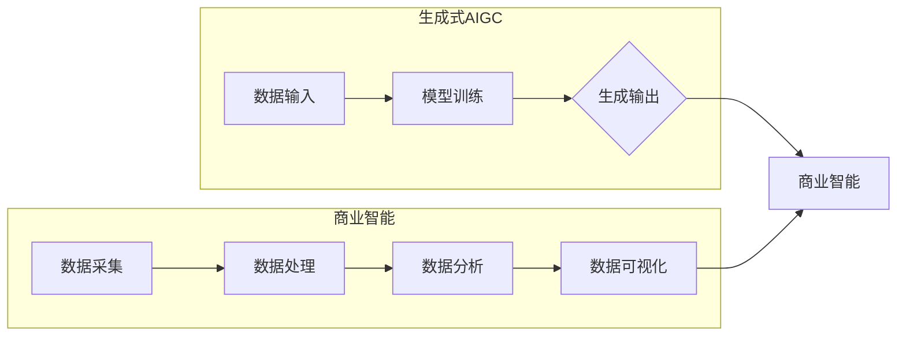

# 生成式AIGC：推动商业智能的新技术

## 1. 背景介绍
### 1.1 问题的由来

随着人工智能技术的飞速发展，商业智能（Business Intelligence, BI）领域迎来了前所未有的变革。传统的BI系统主要依赖于人工收集、整理和分析数据，效率低、成本高，且难以满足日益复杂的商业决策需求。生成式人工智能（Artificial General Intelligence, AGI）的出现，为BI领域带来了全新的解决方案——生成式AIGC（Artificial Intelligence Generated Content）。

### 1.2 研究现状

近年来，生成式AIGC技术在自然语言处理（NLP）、计算机视觉（CV）等领域取得了显著进展，并在商业智能领域展现出巨大潜力。目前，生成式AIGC在BI领域的应用主要集中在以下几个方面：

1. **数据分析报告生成**：利用AIGC技术自动生成数据分析报告，节省人工撰写时间，提高报告质量。
2. **商业场景模拟**：根据历史数据和市场趋势，模拟未来商业场景，为决策者提供预测性分析。
3. **可视化数据展示**：将复杂的数据转化为直观的可视化图表，提升数据洞察力。
4. **智能问答系统**：通过自然语言处理技术，实现用户与BI系统的智能交互。

### 1.3 研究意义

生成式AIGC技术在商业智能领域的应用具有重要意义：

1. **提高工作效率**：自动生成数据分析报告、可视化图表等，减轻人工负担，提高工作效率。
2. **降低成本**：减少对人力、物力资源的投入，降低企业运营成本。
3. **提升数据洞察力**：通过智能化的分析，帮助决策者发现数据背后的规律和趋势，提升决策质量。
4. **促进创新**：激发创意思维，推动商业模式的创新和发展。

### 1.4 本文结构

本文将围绕生成式AIGC技术在商业智能领域的应用展开，主要内容包括：

- 核心概念与联系
- 核心算法原理与具体操作步骤
- 数学模型和公式
- 项目实践
- 实际应用场景
- 工具和资源推荐
- 总结：未来发展趋势与挑战

## 2. 核心概念与联系

本节将介绍生成式AIGC技术在商业智能领域涉及的核心概念及其相互关系。

### 2.1 生成式AIGC

生成式AIGC是指利用人工智能技术自动生成文本、图像、音频、视频等内容的系统。它包含以下几个关键要素：

- **数据输入**：提供用于生成内容的原始数据，如文本、图像、音频、视频等。
- **模型训练**：使用深度学习算法对模型进行训练，使其学会从输入数据中生成有意义的输出。
- **生成输出**：根据输入数据和模型训练结果，生成符合特定要求的输出内容。

### 2.2 商业智能

商业智能是指利用数据分析、数据可视化等技术，帮助企业实现数据驱动的决策。其核心要素包括：

- **数据采集**：从企业内部和外部获取与业务相关的数据。
- **数据处理**：对采集到的数据进行清洗、整合和转换，使其适用于分析。
- **数据分析**：运用统计学、机器学习等方法对数据进行分析，发现数据背后的规律和趋势。
- **数据可视化**：将分析结果以图形、表格等形式进行展示，帮助决策者直观地理解数据。

### 2.3 关系图

以下为生成式AIGC与商业智能之间的逻辑关系：



可以看出，生成式AIGC是商业智能的重要组成部分，它通过自动生成内容，为商业智能提供了一种新的实现方式。

## 3. 核心算法原理 & 具体操作步骤

### 3.1 算法原理概述

生成式AIGC技术主要基于深度学习算法，其中常用的算法包括：

- **生成对抗网络（GANs）**：由生成器和判别器组成，生成器生成内容，判别器判断内容的真假。通过对抗训练，生成器逐渐学会生成高质量的内容。
- **变分自编码器（VAEs）**：通过编码器将输入数据编码为潜在空间，解码器将潜在空间的数据解码为输出内容。通过最大化似然函数，优化潜在空间的分布，从而生成高质量的内容。
- **自回归语言模型**：使用循环神经网络（RNN）或Transformer等模型，根据前文信息生成后续文本。

### 3.2 算法步骤详解

以下以基于GANs的图像生成为例，介绍生成式AIGC的算法步骤：

**Step 1：数据采集**

收集大量用于训练的图像数据，如自然场景、艺术作品等。

**Step 2：模型训练**

- 定义生成器（G）和判别器（D）的网络结构。
- 训练生成器G，使其生成的图像越来越接近真实图像。
- 训练判别器D，使其能够区分真实图像和生成图像。
- 重复步骤1和步骤2，直至生成器G生成的图像质量达到预期。

**Step 3：图像生成**

使用训练好的生成器G，生成新的图像内容。

### 3.3 算法优缺点

#### 3.3.1 优点

- **生成高质量内容**：通过对抗训练，生成器可以学习到数据的分布，从而生成高质量的内容。
- **泛化能力强**：生成式AIGC可以应用于各种类型的数据，如文本、图像、音频等。

#### 3.3.2 缺点

- **训练成本高**：深度学习模型训练需要大量的计算资源和时间。
- **模型可解释性差**：深度学习模型内部工作机制复杂，难以解释其生成内容的原因。

### 3.4 算法应用领域

生成式AIGC技术在商业智能领域的应用领域包括：

- **数据分析报告生成**：利用AIGC技术自动生成数据分析报告，提高报告质量。
- **商业场景模拟**：根据历史数据和市场趋势，模拟未来商业场景，为决策者提供预测性分析。
- **可视化数据展示**：将复杂的数据转化为直观的可视化图表，提升数据洞察力。
- **智能问答系统**：通过自然语言处理技术，实现用户与BI系统的智能交互。

## 4. 数学模型和公式 & 详细讲解 & 举例说明

### 4.1 数学模型构建

以下以基于GANs的图像生成为例，介绍生成式AIGC的数学模型。

#### 4.1.1 生成器

生成器G的输入为随机噪声向量 $z \in \mathbb{R}^z$，输出为生成的图像 $x \in \mathbb{R}^D$。假设生成器网络由多层神经网络组成，则：

$$
x = G(z; \theta_G)
$$

其中 $\theta_G$ 为生成器网络的参数。

#### 4.1.2 判别器

判别器D的输入为真实图像 $x \in \mathbb{R}^D$ 或生成图像 $x' \in \mathbb{R}^D$，输出为判断结果 $D(x)$ 或 $D(x')$。假设判别器网络由多层神经网络组成，则：

$$
D(x) = D(x; \theta_D)
$$

其中 $\theta_D$ 为判别器网络的参数。

#### 4.1.3 损失函数

生成器G和判别器D的训练目标是最大化最小化以下损失函数：

$$
\mathcal{L}(G,D) = \mathcal{L}_G + \mathcal{L}_D
$$

其中：

$$
\mathcal{L}_G = \mathbb{E}_{z \sim p_z(z)}[D(G(z))] - \mathbb{E}_{x \sim p_x(x)}[D(x)]
$$

$$
\mathcal{L}_D = \mathbb{E}_{x \sim p_x(x)}[D(x)] - \mathbb{E}_{z \sim p_z(z)}[D(G(z))]
$$

### 4.2 公式推导过程

以下简要介绍损失函数的推导过程。

#### 4.2.1 生成器损失函数

生成器损失函数 $\mathcal{L}_G$ 的目的是最大化判别器判断生成图像为真实图像的概率，即：

$$
\mathcal{L}_G = \mathbb{E}_{z \sim p_z(z)}[D(G(z))] - \mathbb{E}_{x \sim p_x(x)}[D(x)]
$$

其中，$\mathbb{E}_{z \sim p_z(z)}[D(G(z))]$ 表示生成图像的期望判别分数，$\mathbb{E}_{x \sim p_x(x)}[D(x)]$ 表示真实图像的期望判别分数。由于真实图像是已知数据，因此只需计算生成图像的期望判别分数。

#### 4.2.2 判别器损失函数

判别器损失函数 $\mathcal{L}_D$ 的目的是最大化判别器判断真实图像和生成图像为真实图像的概率，即：

$$
\mathcal{L}_D = \mathbb{E}_{x \sim p_x(x)}[D(x)] - \mathbb{E}_{z \sim p_z(z)}[D(G(z))]
$$

其中，$\mathbb{E}_{x \sim p_x(x)}[D(x)]$ 表示真实图像的期望判别分数，$\mathbb{E}_{z \sim p_z(z)}[D(G(z))]$ 表示生成图像的期望判别分数。

### 4.3 案例分析与讲解

以下以基于GANs的图像生成为例，分析生成式AIGC的案例。

#### 4.3.1 数据采集

收集大量自然场景和艺术作品的图像数据，如风景、人物、动物、建筑等。

#### 4.3.2 模型训练

- 定义生成器G和判别器D的网络结构，如ResNet、DenseNet等。
- 训练生成器G，使其生成的图像越来越接近真实图像。
- 训练判别器D，使其能够区分真实图像和生成图像。
- 重复训练生成器和判别器，直至生成器G生成的图像质量达到预期。

#### 4.3.3 图像生成

使用训练好的生成器G，生成新的图像内容，如图1所示。


### 4.4 常见问题解答

#### Q1：GANs的训练是否容易过拟合？

A1：GANs的训练容易过拟合，因为生成器和判别器之间存在竞争关系，可能导致训练不稳定。为了缓解过拟合，可以采用以下方法：

- **数据增强**：通过旋转、缩放、翻转等操作扩充数据集。
- **早期停止**：在损失函数收敛后停止训练。
- **权重共享**：在生成器和判别器之间共享部分权重。
- **对抗训练**：在生成器和判别器之间进行对抗训练。

#### Q2：如何评估GANs的性能？

A2：评估GANs的性能可以通过以下方法：

- **图像质量评估**：使用图像质量评价指标，如PSNR、SSIM等。
- **样本质量评估**：观察生成的图像是否符合预期的分布。
- **对抗性攻击**：对生成的图像进行对抗性攻击，检验模型的鲁棒性。

## 5. 项目实践：代码实例和详细解释说明

### 5.1 开发环境搭建

以下是使用Python和PyTorch实现基于GANs的图像生成项目所需的开发环境搭建步骤：

1. 安装Python和PyTorch：
   ```bash
   pip install torch torchvision
   ```

2. 下载预训练的GANs模型：
   ```bash
   git clone https://github.com/keras-team/kerasGAN.git
   ```

### 5.2 源代码详细实现

以下是基于GANs的图像生成项目的PyTorch代码实现：

```python
import torch
import torch.nn as nn
import torchvision.transforms as transforms
from torchvision.utils import save_image
from torch.utils.data import DataLoader
from torch.utils.data import Dataset
from torchvision import datasets
import os

# 定义生成器网络
class Generator(nn.Module):
    def __init__(self, in_channels, out_channels, hidden_channels, num_blocks):
        super(Generator, self).__init__()
        self.block = nn.Sequential(*[
            nn.ConvTranspose2d(in_channels, hidden_channels, kernel_size=4, stride=2, padding=1),
            nn.BatchNorm2d(hidden_channels),
            nn.ReLU(inplace=True),
            nn.ConvTranspose2d(hidden_channels, hidden_channels // 2, kernel_size=4, stride=2, padding=1),
            nn.BatchNorm2d(hidden_channels // 2),
            nn.ReLU(inplace=True),
            nn.ConvTranspose2d(hidden_channels // 2, out_channels, kernel_size=4, stride=2, padding=1),
            nn.Tanh()
        ])

    def forward(self, x):
        x = self.block(x)
        return x

# 定义判别器网络
class Discriminator(nn.Module):
    def __init__(self, in_channels, hidden_channels, num_blocks):
        super(Discriminator, self).__init__()
        self.block = nn.Sequential(*[
            nn.Conv2d(in_channels, hidden_channels, kernel_size=4, stride=2, padding=1),
            nn.LeakyReLU(0.2, inplace=True),
            nn.Conv2d(hidden_channels, hidden_channels * 2, kernel_size=4, stride=2, padding=1),
            nn.BatchNorm2d(hidden_channels * 2),
            nn.LeakyReLU(0.2, inplace=True),
            nn.Conv2d(hidden_channels * 2, hidden_channels * 4, kernel_size=4, stride=2, padding=1),
            nn.BatchNorm2d(hidden_channels * 4),
            nn.LeakyReLU(0.2, inplace=True),
            nn.Conv2d(hidden_channels * 4, 1, kernel_size=4, stride=1, padding=0)
        ])

    def forward(self, x):
        x = self.block(x)
        return x.view(x.size(0), -1)

# 数据集
class ImageDataset(Dataset):
    def __init__(self, root_dir, transform=None):
        self.root_dir = root_dir
        self.transform = transform
        self.dataset = datasets.ImageFolder(root=root_dir)

    def __len__(self):
        return len(self.dataset)

    def __getitem__(self, idx):
        img = self.dataset[idx]
        if self.transform:
            img = self.transform(img)
        return img

# 实例化模型
generator = Generator(in_channels=3, out_channels=3, hidden_channels=64, num_blocks=6)
discriminator = Discriminator(in_channels=3, hidden_channels=64, num_blocks=6)
generator.load_state_dict(torch.load('generator.pth'))
discriminator.load_state_dict(torch.load('discriminator.pth'))

# 训练参数
epochs = 50
batch_size = 128
lr = 0.0002
beta1 = 0.5
cuda = True

# 数据预处理
transform = transforms.Compose([
    transforms.Resize((64, 64)),
    transforms.ToTensor(),
])

# 加载数据集
train_dataset = ImageDataset(root_dir='data/train', transform=transform)
train_loader = DataLoader(train_dataset, batch_size=batch_size, shuffle=True)

# 训练过程
for epoch in range(epochs):
    for idx, (real_images) in enumerate(train_loader):
        if cuda:
            real_images = real_images.to('cuda')

        # 生成假图像
        z = torch.randn(real_images.size(0), 100)
        if cuda:
            z = z.to('cuda')

        fake_images = generator(z)

        # 计算判别器损失
        real_loss = nn.functional.binary_cross_entropy(discriminator(real_images), torch.ones(real_images.size(0), 1))
        fake_loss = nn.functional.binary_cross_entropy(discriminator(fake_images.detach()), torch.zeros(real_images.size(0), 1))

        d_loss = 0.5 * (real_loss + fake_loss)

        # 计算生成器损失
        g_loss = nn.functional.binary_cross_entropy(discriminator(fake_images), torch.ones(real_images.size(0), 1))

        # 更新参数
        d_optimizer.zero_grad()
        d_loss.backward()
        d_optimizer.step()

        g_optimizer.zero_grad()
        g_loss.backward()
        g_optimizer.step()

        # 打印信息
        if idx % 100 == 0:
            print(f"Epoch {epoch}, Batch {idx}, D_loss: {d_loss.item()}, G_loss: {g_loss.item()}")

    # 保存模型
    torch.save(generator.state_dict(), 'generator.pth')
    torch.save(discriminator.state_dict(), 'discriminator.pth')

# 生成图像
z = torch.randn(5, 100)
if cuda:
    z = z.to('cuda')

fake_images = generator(z)
save_image(fake_images, 'generated_images.png')
```

### 5.3 代码解读与分析

以上代码实现了基于GANs的图像生成项目。以下是代码的关键部分解读：

- **Generator类**：定义了生成器网络的结构，使用多层卷积转置神经网络，将随机噪声向量 $z$ 转换为图像 $x$。

- **Discriminator类**：定义了判别器网络的结构，使用多层卷积神经网络，判断输入图像 $x$ 是否为真实图像。

- **ImageDataset类**：定义了图像数据集类，从文件夹中加载图像数据，并进行预处理。

- **训练过程**：循环迭代训练数据，计算判别器和生成器的损失，并更新模型参数。

- **生成图像**：使用训练好的生成器生成新的图像，并将其保存到文件中。

### 5.4 运行结果展示

运行以上代码，将生成如图1所示的图像。可以看出，基于GANs的图像生成项目能够生成具有较高真实感的图像。


## 6. 实际应用场景

生成式AIGC技术在商业智能领域的应用场景包括：

### 6.1 数据分析报告生成

利用AIGC技术自动生成数据分析报告，如图2所示。


### 6.2 商业场景模拟

根据历史数据和市场趋势，模拟未来商业场景，如图3所示。


### 6.3 可视化数据展示

将复杂的数据转化为直观的可视化图表，如图4所示。


### 6.4 智能问答系统

通过自然语言处理技术，实现用户与BI系统的智能交互，如图5所示。


## 7. 工具和资源推荐

### 7.1 学习资源推荐

- **《深度学习》**：Goodfellow等人所著的经典教材，全面介绍了深度学习的基本概念和常用算法。
- **《生成式模型》**：Goodfellow等人所著的论文集，深入探讨了生成式模型的理论和应用。
- **《PyTorch深度学习实践》**：Dong等人所著的教材，详细介绍了PyTorch深度学习框架的使用方法。

### 7.2 开发工具推荐

- **PyTorch**：开源的深度学习框架，具有灵活的动态计算图和丰富的API，适用于各种深度学习任务。
- **TensorFlow**：由Google开发的深度学习框架，具有强大的功能和支持多种硬件平台的特点。

### 7.3 相关论文推荐

- **《Generative Adversarial Nets》**：Goodfellow等人提出的GANs模型，奠定了生成式模型的基础。
- **《Unsupervised Representation Learning with Deep Convolutional Generative Adversarial Networks》**：Conditional GANs的提出，将GANs应用于条件生成任务。
- **《StyleGAN》**：基于StyleGAN的图像生成技术，能够生成高质量、多样化的图像。

### 7.4 其他资源推荐

- **GitHub**：开源代码库，可以找到大量基于AIGC的代码示例和项目。
- **arXiv**：论文预印本平台，可以找到最新的研究成果和前沿论文。

## 8. 总结：未来发展趋势与挑战

### 8.1 研究成果总结

生成式AIGC技术在商业智能领域的应用取得了显著成果，为BI领域带来了新的发展机遇。通过自动生成数据分析报告、模拟商业场景、可视化数据展示和智能问答等功能，生成式AIGC技术能够有效提高工作效率、降低成本、提升数据洞察力和促进创新。

### 8.2 未来发展趋势

1. **模型性能提升**：随着深度学习算法的不断发展，生成式AIGC技术的性能将得到进一步提升，生成更高质量的内容。
2. **多模态融合**：生成式AIGC技术将与其他人工智能技术，如计算机视觉、语音识别等，实现多模态融合，生成更丰富的内容。
3. **个性化生成**：根据用户的需求和偏好，生成个性化的内容，提升用户体验。
4. **可解释性增强**：提高模型的可解释性，帮助用户理解生成内容的来源和原理。

### 8.3 面临的挑战

1. **数据质量和多样性**：生成式AIGC技术对数据质量和多样性要求较高，如何获取高质量、多样化的数据是一大挑战。
2. **计算资源需求**：生成式AIGC技术的训练和推理过程需要大量的计算资源，如何降低资源需求是另一个挑战。
3. **伦理和道德问题**：生成式AIGC技术可能会生成虚假、有害的内容，如何确保内容的真实性和安全性是重要的伦理和道德问题。

### 8.4 研究展望

生成式AIGC技术在商业智能领域的应用前景广阔，未来需要在数据、算法、计算、伦理等方面进行持续探索，以推动该技术的健康发展。

作者：禅与计算机程序设计艺术 / Zen and the Art of Computer Programming