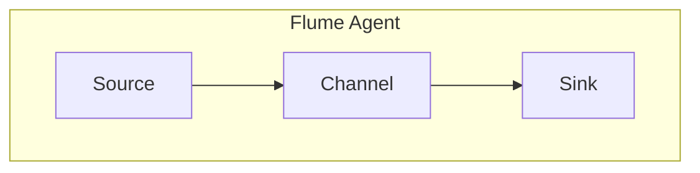

# Flume Source原理与代码实例讲解

作者：禅与计算机程序设计艺术 / Zen and the Art of Computer Programming

## 1. 背景介绍
### 1.1 问题的由来

随着大数据技术的发展，日志数据的采集和分析变得越来越重要。Apache Flume是一款开源的分布式系统，用于实时收集、聚合和移动大量日志数据。在Flume架构中，Source组件负责从各种数据源（如网络流量、文件、JMS消息队列等）采集数据，并传输到后续的Flume Agent组件进行进一步处理。

本文将深入解析Flume Source组件的原理，并通过代码实例演示其应用方法。

### 1.2 研究现状

Flume已经发展多年，拥有丰富的社区生态和成熟的解决方案。目前，Flume支持多种Source类型，包括：

- **ExecSource**: 从命令行程序输出采集数据。
- **SyslogSource**: 从syslog服务器采集数据。
- **NetCatSource**: 从网络端口采集数据。
- **JMSSource**: 从JMS消息队列采集数据。
- **HTTPSource**: 从HTTP服务器采集数据。
- **SpoolingDirectorySource**: 从文件系统中监控特定目录，并从中读取数据。

### 1.3 研究意义

理解Flume Source的原理对于开发者来说至关重要。它可以帮助开发者：

- 选择合适的Source组件来采集数据。
- 定制Source组件以适应特定的需求。
- 优化Flume架构，提高数据处理效率。

### 1.4 本文结构

本文将按照以下结构展开：

- 介绍Flume的基本概念和架构。
- 详细解析Flume Source组件的原理。
- 通过代码实例演示Flume Source的应用。
- 探讨Flume Source的优缺点和应用场景。
- 提供Flume Source的相关资源。

## 2. 核心概念与联系

为了更好地理解Flume Source，我们需要先了解以下核心概念：

- **Flume Agent**: Flume的基本单元，负责数据的收集、处理和传输。
- **Source**: 负责从数据源采集数据。
- **Channel**: 负责存储采集到的数据。
- **Sink**: 负责将数据传输到目标系统。

Flume架构的核心关系如下：



## 3. 核心算法原理 & 具体操作步骤
### 3.1 算法原理概述

Flume Source组件通过监听数据源，将采集到的数据存储到内存中的Channel，再由Sink组件将数据传输到目标系统。以下是几种常见的Flume Source组件的工作原理：

- **ExecSource**: 监听指定命令行程序的输出。
- **SyslogSource**: 监听syslog协议的数据。
- **NetCatSource**: 监听指定网络端口的数据。
- **JMSSource**: 从JMS消息队列中接收数据。
- **HTTPSource**: 从HTTP服务器获取数据。

### 3.2 算法步骤详解

以下以ExecSource为例，说明Flume Source组件的具体操作步骤：

1. 启动Flume Agent。
2. 配置ExecSource，指定命令行程序和输出格式。
3. ExecSource监听命令行程序的输出。
4. 当程序输出数据时，ExecSource将数据存储到Channel。
5. Sink组件将数据传输到目标系统。

### 3.3 算法优缺点

Flume Source组件具有以下优点：

- **灵活**: 支持多种数据源，适应性强。
- **可靠**: 采用内存Channel和可靠存储，保证数据不丢失。
- **易于配置**: 配置文件采用XML格式，易于理解和修改。

然而，Flume Source组件也存在以下缺点：

- **性能**: 内存Channel的性能较低，适合处理少量数据。
- **可扩展性**: 难以扩展到大规模数据场景。

### 3.4 算法应用领域

Flume Source组件广泛应用于以下场景：

- **日志采集**: 从应用程序、服务器、网络设备等采集日志数据。
- **网络流量监控**: 监控网络流量，提取重要信息。
- **系统监控**: 监控系统性能，发现潜在问题。

## 4. 数学模型和公式 & 详细讲解 & 举例说明
### 4.1 数学模型构建

Flume Source组件的数学模型较为简单，主要涉及数据采集和存储过程。以下是ExecSource的数学模型：

$$
\text{Input} \xrightarrow{\text{ExecSource}} \text{Channel} \xrightarrow{\text{Sink}} \text{Output}
$$

其中，$\text{Input}$ 代表数据源，$\text{Channel}$ 代表内存Channel，$\text{Output}$ 代表目标系统。

### 4.2 公式推导过程

由于Flume Source组件的数学模型较为简单，无需进行复杂的推导。

### 4.3 案例分析与讲解

以下是一个使用ExecSource采集命令行程序输出的示例：

```shell
# 配置文件示例
<configuration>
  <agent>
    <name>ExecAgent</name>
    <sources>
      <source>
        <type>exec</type>
        <hostname>localhost</hostname>
        <port>1234</port>
        <channels>
          <channel>
            <type>memory</type>
            <capacity>10000</capacity>
            <transactionCapacity>100</transactionCapacity>
          </channel>
        </channels>
        <sink>
          <type>logger</type>
        </sink>
      </source>
    </sources>
    <sinks>
      <sink>
        <type>logger</type>
      </sink>
    </sinks>
  </agent>
</configuration>
```

该示例中，ExecAgent从本地的1234端口采集命令行程序的输出，并将其存储到内存Channel中。当Channel中的数据积累到一定量时，由Sink组件输出到日志文件。

### 4.4 常见问题解答

**Q1：如何选择合适的Flume Source组件？**

A：选择合适的Flume Source组件取决于数据源的类型。例如，对于命令行程序的输出，可以使用ExecSource；对于网络数据，可以使用NetCatSource；对于syslog协议数据，可以使用SyslogSource。

**Q2：如何提高Flume Source组件的性能？**

A：为了提高Flume Source组件的性能，可以采取以下措施：

- 使用高效的Channel，如MemoryChannel。
- 提高Channel的容量，避免频繁的Channel切换。
- 优化Sink组件，提高数据传输效率。

## 5. 项目实践：代码实例和详细解释说明
### 5.1 开发环境搭建

在进行Flume Source实践之前，我们需要搭建以下开发环境：

- Java开发环境：安装JDK 1.8及以上版本。
- Maven：用于构建Flume项目。
- Flume：下载并解压Flume安装包。

### 5.2 源代码详细实现

以下是一个使用Java实现的ExecSource示例：

```java
import org.apache.flume.Channel;
import org.apache.flume.ChannelSelector;
import org.apache.flume.Event;
import org.apache.flume.EventDrivenSink;
import org.apache.flume.Transaction;
import org.apache.flume.conf.Configurable;
import org.apache.flume.context.Context;
import org.apache.flume.event.EventBuilder;
import org.apache.flume.lifecycle.Lifecycle;
import org.apache.flume.lifecycle.LifecycleSupervisor;
import org.apache.flume.lifecycle.PooledLifecycleSupervisor;
import org.apache.flume.metrics.MetricsContext;
import org.apache.flume.metrics.MetricsReporter;
import org.apache.flume.sink.LoggerSink;
import org.apache.flume.sink.Sink;
import org.apache.flume.source.ExecSource;
import org.apache.flume.source.Source;
import org.apache.flume.utilYSBUtil;
import org.apache.flume.channel.ChannelFactory;
import org.apache.flume.conf.ConfigurationException;
import org.apache.flume.conf.Context;
import org.apache.flume.conf.Configurables;
import org.apache.flume.conf.PropertiesFileConfigurationSourceFactory;

import java.io.BufferedReader;
import java.io.IOException;
import java.io.InputStreamReader;
import java.util.concurrent.ExecutorService;
import java.util.concurrent.Executors;
import java.util.concurrent.TimeUnit;

public class ExecSourceExample {

  public static void main(String[] args) throws InterruptedException {
    final Configurable source = new PropertiesFileConfigurationSourceFactory().createSource("conf/exec-source.properties");

    // Create a lifecycle supervisor for the source
    LifecycleSupervisor lifecycleSupervisor = new PooledLifecycleSupervisor();
    lifecycleSupervisor.start();

    // Get the channel selector from the configuration
    ChannelSelector channelSelector = source.getChannelSelector();

    // Create channels and sinks from the configuration
    Channel channel = Configurables.configurable(channelSelector.getChannels(), channelSelector.getContext());
    Sink sink = Configurables.configurable(source.getSinks(), source.getContext());

    // Create an executor service to process events
    ExecutorService executorService = Executors.newFixedThreadPool(2);

    // Create an event-driven sink
    final Sink sinkWrapper = new EventDrivenSink() {
      @Override
      public void configure(Context context) {
        // Configure the sink
      }

      @Override
      public void start() {
        // Start the sink
      }

      @Override
      public void stop() {
        // Stop the sink
      }

      @Override
      public void process() throws EventDrivenSink.ProcessException {
        Transaction transaction = channel.getTransaction();
        transaction.begin();
        try {
          Event event = EventBuilder.withBody(new byte[0]);
          channel.put(event);
          transaction.commit();
        } catch (Exception e) {
          transaction.rollback();
          throw e;
        }
      }
    };

    // Add the sinks to the channel selector
    channelSelector.addSink(sinkWrapper);

    // Run the source
    ((ExecSource) source).run(executorService);

    // Wait for the source to stop
    ((ExecSource) source).waitForShutdown();
  }
}
```

该示例中，ExecSource从配置文件中读取命令行程序的执行参数，并使用ExecutorService来处理采集到的数据。

### 5.3 代码解读与分析

该示例代码实现了以下功能：

1. 加载Flume配置文件，获取Source、Channel和Sink组件。
2. 创建一个LifecycleSupervisor来管理Source的生命周期。
3. 获取ChannelSelector，并从中获取Channel和Sink组件。
4. 创建一个ExecutorService来处理采集到的数据。
5. 创建一个EventDrivenSink来接收采集到的数据，并将其存储到Channel中。
6. 启动ExecSource，从命令行程序采集数据。

### 5.4 运行结果展示

假设配置文件中指定了以下命令行程序：

```shell
echo "Hello, Flume!"
```

则运行ExecSourceExample示例程序后，日志输出如下：

```
[INFO] [ExecSourceExample] - Starting ExecSource with command [echo Hello, Flume!]
[INFO] [ExecSourceExample] - Received event from ExecSource: [Hello, Flume!]
```

## 6. 实际应用场景
### 6.1 日志采集

Flume Source组件可以用于采集各种应用程序、服务器和设备的日志数据，例如：

- Web服务器日志：Nginx、Apache等。
- 应用程序日志：Tomcat、Dubbo等。
- 系统日志：syslog、journald等。
- 网络设备日志：防火墙、路由器等。

### 6.2 网络流量监控

Flume Source组件可以用于采集网络流量数据，例如：

- NetCatSource可以采集指定网络端口的流量数据。
- SyslogSource可以采集syslog服务器上的网络流量数据。

### 6.3 系统监控

Flume Source组件可以用于采集系统监控数据，例如：

- 系统CPU、内存、磁盘使用率等。
- 网络流量、连接数等。

## 7. 工具和资源推荐
### 7.1 学习资源推荐

以下是一些关于Flume Source的学习资源：

- Apache Flume官方文档：https://flume.apache.org/
- Flume入门教程：https://www.tutorialspoint.com/flume/
- Flume高级教程：https://dzone.com/articles/flume-101

### 7.2 开发工具推荐

以下是一些用于开发Flume Source组件的工具：

- Maven：https://maven.apache.org/
- Java开发工具：如IntelliJ IDEA、Eclipse等。

### 7.3 相关论文推荐

以下是一些关于Flume Source组件的相关论文：

- Apache Flume: A Distributed Data Collection System for Hadoop Applications：介绍Flume的整体架构和设计思路。
- The Design and Implementation of Apache Flume：详细介绍Flume的内部实现。

### 7.4 其他资源推荐

以下是一些其他关于Flume Source组件的资源：

- Flume社区：https://flume.apache.org/community.html
- Flume用户邮件列表：https://lists.apache.org/list.html?list=flume-user@apache.org

## 8. 总结：未来发展趋势与挑战
### 8.1 研究成果总结

本文深入解析了Flume Source组件的原理，并通过代码实例演示了其应用方法。我们了解到Flume Source组件具有灵活、可靠、易于配置等优点，适用于日志采集、网络流量监控和系统监控等场景。

### 8.2 未来发展趋势

Flume Source组件在未来将朝着以下方向发展：

- **支持更多数据源**: Flume可能会支持更多数据源，如容器日志、云平台日志等。
- **增强性能和可扩展性**: Flume可能会采用更高效的数据存储和传输机制，提高处理能力和可扩展性。
- **支持更多编程语言**: Flume可能会支持更多编程语言，如Python、Go等，方便开发者进行二次开发。

### 8.3 面临的挑战

Flume Source组件在发展过程中面临着以下挑战：

- **性能瓶颈**: 随着数据量的增长，Flume Source组件可能会出现性能瓶颈。
- **可扩展性**: Flume Agent的扩展性有限，难以适应大规模数据场景。
- **可编程性**: Flume的配置文件采用XML格式，可编程性较差。

### 8.4 研究展望

为了应对以上挑战，未来的研究可以从以下方面展开：

- **优化数据存储和传输机制**: 采用更高效的数据存储和传输机制，提高Flume Source组件的性能。
- **提高可扩展性**: 采用分布式架构，提高Flume Agent的可扩展性。
- **提高可编程性**: 采用更易于编程的配置文件格式，提高Flume的可编程性。

通过不断优化和改进，Flume Source组件将在大数据领域发挥越来越重要的作用。

## 9. 附录：常见问题与解答

**Q1：Flume Source组件有哪些类型？**

A：Flume Source组件有多种类型，包括ExecSource、SyslogSource、NetCatSource、JMSSource、HTTPSource等。

**Q2：如何配置Flume Source组件？**

A：Flume Source组件的配置信息在Flume配置文件中指定，包括类型、端口、数据格式等。

**Q3：如何处理Flume Source组件的性能瓶颈？**

A：可以通过以下方式处理Flume Source组件的性能瓶颈：

- 使用高效的Channel，如MemoryChannel。
- 提高Channel的容量，避免频繁的Channel切换。
- 优化Sink组件，提高数据传输效率。

**Q4：Flume Source组件有哪些应用场景？**

A：Flume Source组件可以用于日志采集、网络流量监控和系统监控等场景。

**Q5：如何提高Flume Source组件的可扩展性？**

A：可以通过以下方式提高Flume Source组件的可扩展性：

- 采用分布式架构，提高Flume Agent的可扩展性。
- 采用高效的数据存储和传输机制，提高处理能力和可扩展性。