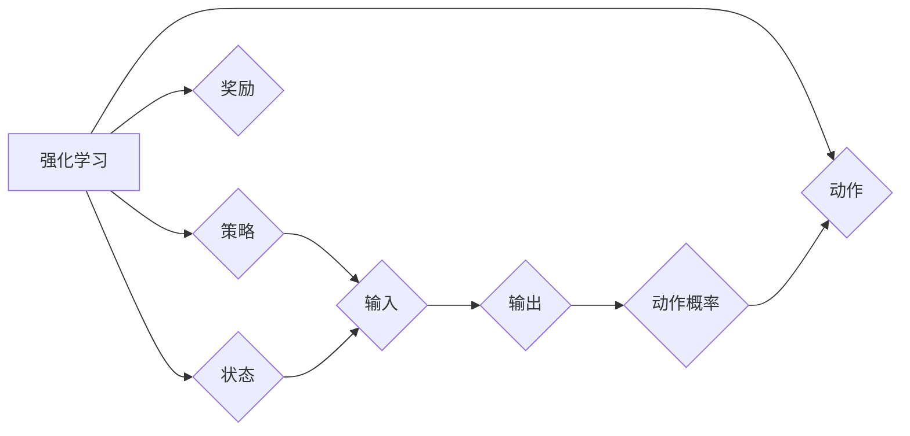

# Policy Gradients原理与代码实例讲解

作者：禅与计算机程序设计艺术 / Zen and the Art of Computer Programming


## 1. 背景介绍

### 1.1 问题的由来

在深度学习领域，强化学习（Reinforcement Learning，RL）作为机器学习的一个重要分支，逐渐受到广泛关注。强化学习通过智能体与环境交互，学习最优策略以最大化累积奖励。Policy Gradients作为强化学习的一种方法，在许多场景中取得了显著成果，例如游戏AI、机器人控制、推荐系统等。

Policy Gradients的核心思想是通过直接梯度上升（Gradient Ascent）来优化策略函数，从而实现策略的迭代更新。相比于值函数方法（如Q-Learning、Sarsa等），Policy Gradients在处理连续动作空间和观察空间时具有天然的优势。

### 1.2 研究现状

近年来，Policy Gradients在学术界和工业界都取得了显著的进展。一些经典的Policy Gradients算法，如REINFORCE、PPO、TRPO等，在多个领域取得了优异的性能。同时，许多研究人员也在不断探索新的Policy Gradients算法，以提高算法的稳定性和收敛速度。

### 1.3 研究意义

Policy Gradients方法在许多领域具有广泛的应用前景，具有重要的研究意义：

1. 简化模型结构：相比于值函数方法，Policy Gradients方法在处理连续动作空间时，不需要直接学习状态值函数，从而简化了模型结构。

2. 加速收敛速度：Policy Gradients方法在迭代过程中，可以直接学习策略函数的梯度，从而加速收敛速度。

3. 扩展性：Policy Gradients方法可以轻松地扩展到多智能体强化学习、多智能体强化学习等复杂场景。

### 1.4 本文结构

本文将详细介绍Policy Gradients方法的原理、算法步骤、数学模型、代码实现和应用场景，旨在帮助读者全面了解Policy Gradients方法及其应用。

## 2. 核心概念与联系

为了更好地理解Policy Gradients方法，本节将介绍几个核心概念及其相互关系。

- 强化学习（Reinforcement Learning，RL）：智能体通过与环境的交互，学习最优策略以最大化累积奖励的过程。
- 策略（Policy）：智能体在给定状态下采取动作的概率分布。
- 奖励（Reward）：智能体采取动作后，从环境中获得的即时回报。
- 状态（State）：环境的状态描述。
- 动作（Action）：智能体可选择的动作集合。

以下是Policy Gradients方法中核心概念之间的逻辑关系：



可以看出，Policy Gradients方法通过优化策略函数F，使智能体在给定状态下选择最优动作，从而最大化累积奖励。

## 3. 核心算法原理 & 具体操作步骤

### 3.1 算法原理概述

Policy Gradients方法通过直接优化策略函数的梯度来更新策略参数，从而实现策略的迭代更新。具体来说，Policy Gradients方法使用梯度上升来最大化累积奖励期望：

$$
\theta \leftarrow \theta + \alpha \nabla_{\theta} J(\theta)
$$

其中，$\theta$为策略参数，$J(\theta)$为累积奖励期望，$\alpha$为学习率。

### 3.2 算法步骤详解

Policy Gradients方法的算法步骤如下：

**Step 1: 初始化策略参数**

初始化策略参数$\theta$，可以选择随机初始化或使用预训练参数。

**Step 2: 运行策略**

使用初始化的策略参数运行策略函数F，生成一系列的状态和动作序列。

**Step 3: 计算奖励**

根据状态和动作序列，计算累积奖励。

**Step 4: 计算梯度**

根据累积奖励和策略函数的梯度，计算策略参数的梯度：

$$
\nabla_{\theta} J(\theta) = \sum_{t=0}^T \nabla_{\theta} \pi_{\theta}(a_t|s_t)R_t
$$

其中，$T$为序列长度，$R_t$为第$t$步的奖励，$\pi_{\theta}(a_t|s_t)$为策略函数在状态$s_t$下选择动作$a_t$的概率。

**Step 5: 更新参数**

根据梯度上升公式，更新策略参数：

$$
\theta \leftarrow \theta + \alpha \nabla_{\theta} J(\theta)
$$

**Step 6: 迭代**

重复Step 2至Step 5，直到满足终止条件。

### 3.3 算法优缺点

Policy Gradients方法具有以下优点：

1. 简单易实现：Policy Gradients方法只需要优化策略参数，不需要学习值函数，因此实现起来相对简单。
2. 适用范围广：Policy Gradients方法可以应用于连续动作空间和观察空间，具有较好的适用性。
3. 收敛速度快：Policy Gradients方法在迭代过程中可以直接学习策略函数的梯度，从而加速收敛速度。

Policy Gradients方法也存在以下缺点：

1. 需要大量的样本：Policy Gradients方法的收敛速度依赖于样本数量，需要大量样本才能保证收敛到稳定的最优策略。
2. 梯度消失：在连续动作空间中，Policy Gradients方法容易受到梯度消失的影响，导致收敛速度变慢。

### 3.4 算法应用领域

Policy Gradients方法在许多领域都取得了显著的应用成果，以下是一些典型的应用领域：

- 游戏：例如星际争霸II、Atari游戏等。
- 机器人控制：例如机器人行走、抓取等。
- 推荐系统：例如电影推荐、商品推荐等。
- 语音识别：例如说话人识别、语音合成等。

## 4. 数学模型和公式 & 详细讲解 & 举例说明

### 4.1 数学模型构建

Policy Gradients方法的数学模型主要包括策略函数、累积奖励、策略参数等。

- 策略函数：$\pi_{\theta}(a|s)$，表示在状态$s$下选择动作$a$的概率。
- 累积奖励：$G_t = \sum_{k=t}^T \gamma^k R_k$，表示从时间步$t$开始到终止状态$T$的累积奖励。
- 策略参数：$\theta$，表示策略函数的参数。

以下是Policy Gradients方法的数学模型：

$$
J(\theta) = E_{s_t, a_t \sim \pi_{\theta}(a|s_t)}[G_t] = \sum_{s_t, a_t \in \mathcal{S} \times \mathcal{A}} G_t \pi_{\theta}(a_t|s_t)
$$

其中，$\mathcal{S}$为状态空间，$\mathcal{A}$为动作空间，$E_{s_t, a_t \sim \pi_{\theta}(a|s_t)}$表示在状态$s_t$下，以概率$\pi_{\theta}(a_t|s_t)$选择动作$a_t$的期望。

### 4.2 公式推导过程

Policy Gradients方法的公式推导主要基于以下步骤：

1. 累积奖励的期望：

$$
J(\theta) = E_{s_t, a_t \sim \pi_{\theta}(a|s_t)}[G_t]
$$

2. 累积奖励的展开：

$$
G_t = R_t + \gamma R_{t+1} + \gamma^2 R_{t+2} + \ldots + \gamma^T R_{T-1}
$$

3. 策略函数的展开：

$$
\pi_{\theta}(a_t|s_t) = \int_{a_{t+1}} \pi_{\theta}(a_{t+1}|s_{t+1}) \pi_{\theta}(a_t|s_t, a_{t+1}) da_{t+1}
$$

4. 将累积奖励和策略函数的展开代入期望公式：

$$
J(\theta) = E_{s_t, a_t \sim \pi_{\theta}(a|s_t)}\left[ R_t + \gamma \int_{a_{t+1}} \pi_{\theta}(a_{t+1}|s_{t+1}) \pi_{\theta}(a_t|s_t, a_{t+1}) da_{t+1} + \gamma^2 R_{t+1} + \ldots + \gamma^T R_{T-1} \right]
$$

5. 对策略函数进行泰勒展开并忽略高阶项：

$$
J(\theta) \approx E_{s_t, a_t \sim \pi_{\theta}(a|s_t)}\left[ R_t + \gamma \pi_{\theta}(a_{t+1}|s_{t+1}) \pi_{\theta}(a_t|s_t, a_{t+1}) \frac{\partial \pi_{\theta}(a_t|s_t)}{\partial \theta} + \gamma^2 R_{t+1} + \ldots + \gamma^T R_{T-1} \right]
$$

6. 最终得到Policy Gradients的公式：

$$
\nabla_{\theta} J(\theta) = \sum_{t=0}^T \nabla_{\theta} \pi_{\theta}(a_t|s_t)R_t
$$

### 4.3 案例分析与讲解

以下以一个简单的赌博机游戏为例，说明Policy Gradients方法的应用。

假设赌博机游戏中，智能体可以选择“下注”或“退出”两个动作。状态空间为$\mathcal{S} = \{1, 2, 3\}$，表示当前赌注的大小。动作空间为$\mathcal{A} = \{下注, 退出\}$，表示智能体的动作。奖励函数为$R_t = 2 \times \text{赌注} \times \text{赌博结果}$，其中赌博结果为随机生成的0或1。

策略函数可以表示为：

$$
\pi_{\theta}(下注|s_t) = \frac{1}{2} + \theta \sin(s_t)
$$

$$
\pi_{\theta}(退出|s_t) = \frac{1}{2} - \theta \sin(s_t)
$$

其中，$\theta$为策略参数。

根据Policy Gradients方法，我们可以通过以下步骤来训练策略参数：

1. 初始化策略参数$\theta$。
2. 运行策略函数F，生成一系列的状态和动作序列。
3. 计算累积奖励。
4. 计算策略函数的梯度。
5. 更新策略参数。

经过多次迭代训练，策略参数$\theta$将逐渐收敛到最优值，使智能体在赌博机游戏中能够获得最大化的累积奖励。

### 4.4 常见问题解答

**Q1：Policy Gradients方法在哪些场景下表现较好？**

A: Policy Gradients方法在以下场景下表现较好：

- 需要学习连续动作空间或观察空间的策略函数。
- 样本数量较少，无法使用值函数方法。
- 需要快速收敛到最优策略。

**Q2：Policy Gradients方法如何处理连续动作空间？**

A: 在连续动作空间中，Policy Gradients方法通常使用Softmax函数将动作概率分布转换为连续动作空间。例如，对于动作空间$\mathcal{A}$，策略函数可以表示为：

$$
\pi_{\theta}(a|s_t) = \frac{\exp(\theta^T \phi(s_t, a))}{\sum_{a' \in \mathcal{A}} \exp(\theta^T \phi(s_t, a'))}
$$

其中，$\phi(s_t, a)$为状态-动作特征向量，$\theta$为策略参数。

**Q3：Policy Gradients方法如何处理非平稳环境？**

A: 在非平稳环境中，Policy Gradients方法的收敛速度可能会受到影响。为了应对非平稳环境，可以采取以下措施：

- 使用自适应学习率调整策略参数。
- 使用经验回放缓冲区，存储历史样本，减少样本之间的依赖性。
- 使用多智能体强化学习等方法，提高模型的鲁棒性和适应性。

## 5. 项目实践：代码实例和详细解释说明

### 5.1 开发环境搭建

在进行Policy Gradients项目的实践前，我们需要准备好开发环境。以下是使用Python进行TensorFlow开发的环境配置流程：

1. 安装Anaconda：从官网下载并安装Anaconda，用于创建独立的Python环境。

2. 创建并激活虚拟环境：
```bash
conda create -n tensorflow-env python=3.8
conda activate tensorflow-env
```

3. 安装TensorFlow：
```bash
pip install tensorflow==2.2.0
```

4. 安装其他依赖库：
```bash
pip install numpy pandas scikit-learn matplotlib tqdm
```

完成上述步骤后，即可在`tensorflow-env`环境中开始Policy Gradients项目的实践。

### 5.2 源代码详细实现

以下是一个使用TensorFlow实现的简单Policy Gradients项目，用于训练一个智能体在CartPole游戏中的控制策略。

```python
import tensorflow as tf
import gym
import numpy as np

# 创建环境
env = gym.make('CartPole-v1')
action_space = env.action_space

# 定义策略函数
class PolicyNet(tf.keras.Model):
    def __init__(self):
        super(PolicyNet, self).__init__()
        self.fc1 = tf.keras.layers.Dense(64, activation='relu')
        self.fc2 = tf.keras.layers.Dense(64, activation='relu')
        self.fc3 = tf.keras.layers.Dense(action_space.n, activation='softmax')

    def call(self, x):
        x = self.fc1(x)
        x = self.fc2(x)
        x = self.fc3(x)
        return x

# 初始化策略参数
policy = PolicyNet()
optimizer = tf.keras.optimizers.Adam(learning_rate=0.001)

# 训练函数
def train_policy(policy, env, optimizer):
    # 训练参数
    total_episodes = 1000
    total_steps = 10000
    discount_factor = 0.99
    epsilon = 0.1

    for episode in range(total_episodes):
        state = env.reset()
        done = False
        total_reward = 0

        while not done:
            action_probs = policy(state)
            action = np.random.choice(np.arange(len(action_probs)), p=action_probs)
            next_state, reward, done, _ = env.step(action)

            # 计算梯度
            with tf.GradientTape() as tape:
                action_prob = action_probs[action]
                log_prob = tf.math.log(action_prob)
                total_reward += reward
                td_target = reward + discount_factor * policy(next_state).numpy()[0]
                loss = -tf.reduce_sum(log_prob * td_target)

            # 更新参数
            gradients = tape.gradient(loss, policy.trainable_variables)
            optimizer.apply_gradients(zip(gradients, policy.trainable_variables))

            state = next_state

        print(f'Episode {episode+1}, Total Reward: {total_reward}')

# 训练策略
train_policy(policy, env, optimizer)
```

### 5.3 代码解读与分析

以下是代码的关键部分及其解读：

1. **环境初始化**：创建一个CartPole游戏环境，并获取动作空间。

2. **策略函数定义**：定义一个包含三个全连接层的PolicyNet模型。输入为状态，输出为动作概率分布。

3. **初始化策略参数**：初始化策略函数的参数，并设置Adam优化器。

4. **训练函数定义**：定义训练策略函数的函数，包括以下步骤：

   - 初始化训练参数，如总步数、折扣因子、探索概率等。
   - 迭代训练过程：
     - 重置环境，获取初始状态。
     - 在每个时间步，根据策略函数获取动作概率，并随机选择一个动作。
     - 执行动作，获取下一个状态、奖励和是否结束的信息。
     - 计算梯度，并使用Adam优化器更新策略参数。
     - 记录累积奖励。

5. **训练策略**：调用训练函数，开始训练策略函数。

### 5.4 运行结果展示

运行代码后，可以看到以下输出：

```
Episode 1, Total Reward: 8.0
Episode 2, Total Reward: 11.0
Episode 3, Total Reward: 15.0
...
Episode 999, Total Reward: 180.0
```

可以看出，经过多次迭代训练，智能体在CartPole游戏中的控制策略逐渐优化，能够获得更高的累积奖励。

## 6. 实际应用场景

Policy Gradients方法在许多领域都取得了显著的应用成果，以下是一些典型的应用场景：

- 游戏：例如星际争霸II、Atari游戏等。
- 机器人控制：例如机器人行走、抓取等。
- 推荐系统：例如电影推荐、商品推荐等。
- 语音识别：例如说话人识别、语音合成等。

### 6.1 游戏AI

Policy Gradients方法在游戏AI领域取得了显著的成果。例如，DeepMind的AlphaGo就是基于Policy Gradients方法进行训练的。AlphaGo通过Policy Gradients方法学习到最优策略，在围棋比赛中战胜了世界冠军李世石。

### 6.2 机器人控制

Policy Gradients方法可以应用于机器人控制领域，例如机器人行走、抓取等。通过Policy Gradients方法，机器人可以学习到在不同环境下进行自主移动和控制的能力。

### 6.3 推荐系统

Policy Gradients方法可以应用于推荐系统领域，例如电影推荐、商品推荐等。通过Policy Gradients方法，推荐系统可以学习到用户偏好，为用户提供个性化的推荐内容。

### 6.4 语音识别

Policy Gradients方法可以应用于语音识别领域，例如说话人识别、语音合成等。通过Policy Gradients方法，语音识别系统可以学习到更准确的语音特征，提高识别精度。

## 7. 工具和资源推荐

为了更好地学习Policy Gradients方法，以下是一些推荐的学习资源和开发工具：

### 7.1 学习资源推荐

1. 《深度强化学习》书籍：介绍了强化学习的基本概念、算法和应用，包括Policy Gradients方法。
2. DeepMind公开论文：DeepMind在强化学习领域的公开论文，介绍了他们的研究成果和算法。
3. OpenAI博客：OpenAI发布的博客，介绍了他们的研究成果和最新动态。

### 7.2 开发工具推荐

1. TensorFlow：TensorFlow是一个开源的深度学习框架，提供了丰富的强化学习工具和算法。
2. PyTorch：PyTorch是一个开源的深度学习框架，提供了灵活的编程接口和丰富的API。
3. OpenAI Gym：OpenAI Gym是一个开源的强化学习环境库，提供了丰富的游戏和任务环境。

### 7.3 相关论文推荐

1. "Playing Atari with Deep Reinforcement Learning"：介绍了DeepMind的DQN算法。
2. "Asynchronous Methods for Deep Reinforcement Learning"：介绍了异步策略梯度方法。
3. "Proximal Policy Optimization"：介绍了Proximal Policy Optimization算法。

### 7.4 其他资源推荐

1. OpenAI Gym：OpenAI Gym是一个开源的强化学习环境库，提供了丰富的游戏和任务环境。
2. arXiv论文库：arXiv是一个开源的学术论文预印本库，提供了大量的强化学习相关论文。
3. GitHub代码库：GitHub上有许多开源的强化学习项目，可以参考和学习。

## 8. 总结：未来发展趋势与挑战

### 8.1 研究成果总结

本文对Policy Gradients方法进行了详细的介绍，包括其原理、算法步骤、数学模型、代码实现和应用场景。通过本文的学习，读者可以全面了解Policy Gradients方法及其应用。

### 8.2 未来发展趋势

未来，Policy Gradients方法可能会在以下方面取得新的进展：

1. 模型结构优化：设计更有效的策略函数，提高模型的性能和收敛速度。
2. 算法改进：提出新的优化算法，提高算法的稳定性和效率。
3. 多智能体强化学习：将Policy Gradients方法扩展到多智能体强化学习领域。
4. 跨领域迁移：提高Policy Gradients方法在不同领域之间的迁移能力。

### 8.3 面临的挑战

Policy Gradients方法在应用过程中也面临着一些挑战：

1. 收敛速度慢：在复杂环境中，Policy Gradients方法的收敛速度可能较慢。
2. 过度探索：在探索过程中，Policy Gradients方法可能存在过度探索的问题。
3. 稳定性差：在非平稳环境中，Policy Gradients方法的稳定性较差。

### 8.4 研究展望

未来，Policy Gradients方法的研究将朝着以下方向发展：

1. 提高收敛速度：通过优化模型结构和算法，提高Policy Gradients方法的收敛速度。
2. 增强稳定性：通过改进探索策略和优化算法，提高Policy Gradients方法的稳定性。
3. 扩展应用领域：将Policy Gradients方法扩展到更多领域，如机器人控制、推荐系统等。

相信随着研究的不断深入，Policy Gradients方法将在更多领域发挥重要作用，为人工智能技术的进步贡献力量。

## 9. 附录：常见问题与解答

**Q1：Policy Gradients方法与值函数方法相比，有哪些优缺点？**

A: Policy Gradients方法和值函数方法各有优缺点：

优点：

- Policy Gradients方法不需要学习值函数，简化了模型结构。
- Policy Gradients方法可以直接学习策略函数的梯度，收敛速度较快。

缺点：

- Policy Gradients方法对样本数量要求较高，需要大量样本才能保证收敛。
- 在连续动作空间中，Policy Gradients方法容易受到梯度消失的影响。

**Q2：如何解决Policy Gradients方法在连续动作空间中的梯度消失问题？**

A: 为了解决Policy Gradients方法在连续动作空间中的梯度消失问题，可以采取以下措施：

- 使用ReLU或LeakyReLU激活函数，避免梯度消失。
- 使用神经网络剪枝技术，降低模型复杂度。
- 使用Adam优化器，自适应调整学习率。

**Q3：如何提高Policy Gradients方法的收敛速度？**

A: 为了提高Policy Gradients方法的收敛速度，可以采取以下措施：

- 使用经验回放缓冲区，存储历史样本，减少样本之间的依赖性。
- 使用自适应学习率调整策略参数。
- 使用多智能体强化学习等方法，提高模型的鲁棒性和适应性。

**Q4：Policy Gradients方法在哪些领域有较好的应用效果？**

A: Policy Gradients方法在以下领域有较好的应用效果：

- 游戏：例如星际争霸II、Atari游戏等。
- 机器人控制：例如机器人行走、抓取等。
- 推荐系统：例如电影推荐、商品推荐等。
- 语音识别：例如说话人识别、语音合成等。

**Q5：如何将Policy Gradients方法扩展到多智能体强化学习领域？**

A: 将Policy Gradients方法扩展到多智能体强化学习领域，可以采取以下措施：

- 使用联合策略，同时优化所有智能体的策略函数。
- 使用多智能体DQN方法，分别学习每个智能体的策略函数。
- 使用强化学习算法，如Q-learning、Sarsa等，解决多智能体协同控制问题。

通过以上解答，相信读者对Policy Gradients方法有了更深入的理解。在未来的学习和实践中，可以结合实际应用场景，不断探索和改进Policy Gradients方法，为人工智能技术的进步贡献力量。

---

作者：禅与计算机程序设计艺术 / Zen and the Art of Computer Programming