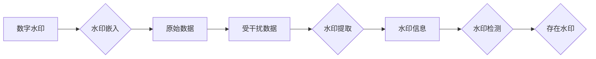

# Watermark 原理与代码实例讲解

作者：禅与计算机程序设计艺术 / Zen and the Art of Computer Programming

## 1. 背景介绍
### 1.1 问题的由来

随着数字技术的飞速发展，数据安全问题日益突出。在数据传输、存储和共享过程中，如何保护数据版权、防止数据篡改和非法复制成为迫切需要解决的问题。数字水印技术作为一种有效的数据保护手段，被广泛应用于版权保护、数据溯源、版权追踪等领域。

### 1.2 研究现状

数字水印技术的研究已有几十年历史，经历了从空域水印到频域水印、从鲁棒性水印到脆弱性水印、从可视水印到非可视水印等多个发展阶段。目前，数字水印技术已日趋成熟，并形成了以下几种主流类型：

- **空域水印**：将水印信息直接嵌入到数据的空域中，易于实现，但鲁棒性较差，容易受到图像压缩、噪声等影响。
- **频域水印**：将水印信息嵌入到数据的频域中，具有较强的鲁棒性，但实现较为复杂。
- **变换域水印**：将水印信息嵌入到数据的变换域中，如DCT变换、DFT变换等，兼顾了鲁棒性和实现难度。
- **脆弱性水印**：对原始数据的修改非常敏感，一旦原始数据被篡改，水印信息就会消失，常用于版权保护。
- **鲁棒性水印**：对原始数据的修改具有较强的抵抗力，即使经过一些有损处理，水印信息仍能被检测出来，常用于数据溯源。

### 1.3 研究意义

数字水印技术在数据保护和版权保护方面具有重要意义：

- **保护数据版权**：通过在数据中嵌入水印信息，可以有效地追踪数据的来源和传播过程，防止非法复制和篡改。
- **数据溯源**：在水印信息中嵌入版权信息、时间戳等信息，可以方便地追溯数据的来源和历史。
- **内容认证**：通过检测水印信息，可以验证数据的完整性和真实性。
- **数字签名**：将数字水印作为数字签名的一部分，可以增强数字签名的安全性。

### 1.4 本文结构

本文将围绕数字水印技术展开，首先介绍数字水印的核心概念和基本原理，然后详细讲解一种基于图像的频域水印算法，最后通过代码实例演示水印的嵌入、提取和检测过程。文章结构如下：

- 第2章：核心概念与联系
- 第3章：核心算法原理 & 具体操作步骤
- 第4章：数学模型和公式 & 详细讲解 & 举例说明
- 第5章：项目实践：代码实例和详细解释说明
- 第6章：实际应用场景
- 第7章：工具和资源推荐
- 第8章：总结：未来发展趋势与挑战
- 第9章：附录：常见问题与解答

## 2. 核心概念与联系

为更好地理解数字水印技术，本节将介绍几个核心概念，并分析它们之间的联系。

### 2.1 数字水印

数字水印是一种将隐秘信息嵌入到数字数据中的技术，通过在原始数据中嵌入水印信息，可以实现对数据的版权保护、数据溯源、内容认证等功能。

### 2.2 水印嵌入

水印嵌入是将水印信息嵌入到原始数据中的过程。水印信息可以是数字序列、二进制数据、图像等。

### 2.3 水印提取

水印提取是从受水印信息干扰的原始数据中提取水印信息的过程。

### 2.4 水印检测

水印检测是判断水印信息是否存在于原始数据中的过程。

这四个概念之间的关系如下图所示：



从图中可以看出，数字水印技术是一个包含水印嵌入、提取和检测等环节的闭环系统。水印嵌入是将水印信息嵌入到原始数据中，水印提取是从受干扰数据中提取水印信息，水印检测是判断水印信息是否存在。

## 3. 核心算法原理 & 具体操作步骤
### 3.1 算法原理概述

本节将介绍一种基于图像的频域水印算法，该算法利用傅里叶变换将图像从空域转换为频域，然后对频域系数进行修改，实现水印信息的嵌入。

### 3.2 算法步骤详解

该算法的具体操作步骤如下：

**Step 1：选择水印信息**

选择合适的水印信息，可以是数字序列、二进制数据、图像等。

**Step 2：对原始图像进行预处理**

对原始图像进行灰度化、二值化等预处理操作，以便于后续的频域处理。

**Step 3：对预处理后的图像进行傅里叶变换**

将预处理后的图像转换为频域。

**Step 4：修改频域系数**

根据水印信息，对频域系数进行修改，实现水印信息的嵌入。

**Step 5：对修改后的频域系数进行逆傅里叶变换**

将修改后的频域系数进行逆傅里叶变换，得到嵌入水印信息的图像。

**Step 6：水印提取**

对嵌入水印信息的图像进行相同的处理过程，提取水印信息。

### 3.3 算法优缺点

该算法具有以下优点：

- **鲁棒性强**：对图像的压缩、噪声等干扰具有一定的抵抗力。
- **隐蔽性好**：嵌入的水印信息不容易被人察觉。

但该算法也存在以下缺点：

- **嵌入容量有限**：随着水印信息量的增加，水印的鲁棒性会降低。
- **水印信息提取复杂**：水印信息提取过程较为复杂，需要与嵌入过程相同的方法。

### 3.4 算法应用领域

该算法可以应用于以下领域：

- **版权保护**：将版权信息嵌入到图像中，防止非法复制和篡改。
- **数据溯源**：将时间戳等溯源信息嵌入到图像中，方便追踪图像的来源和历史。
- **内容认证**：通过检测水印信息，验证图像的完整性和真实性。

## 4. 数学模型和公式 & 详细讲解 & 举例说明
### 4.1 数学模型构建

本节将使用数学语言对基于图像的频域水印算法进行更加严格的刻画。

假设原始图像为 $f(x,y)$，水印信息为 $w(x,y)$，修改后的图像为 $f'(x,y)$，则水印嵌入算法可以表示为：

$$
f'(x,y) = f(x,y) + w(x,y)
$$

其中，$w(x,y)$ 为水印信息在位置 $(x,y)$ 的嵌入量。

### 4.2 公式推导过程

假设原始图像 $f(x,y)$ 和水印信息 $w(x,y)$ 都是实数函数，则修改后的图像 $f'(x,y)$ 也是实数函数。

### 4.3 案例分析与讲解

以下我们以将版权信息“Watermark”嵌入到图像中的例子，说明水印嵌入的过程。

**Step 1：选择水印信息**

选择版权信息“Watermark”作为水印信息。

**Step 2：对原始图像进行预处理**

将图像转换为灰度图，并进行二值化处理。

**Step 3：对预处理后的图像进行傅里叶变换**

对预处理后的图像进行傅里叶变换，得到频域系数。

**Step 4：修改频域系数**

根据水印信息，对频域系数进行修改。例如，将水印信息“Watermark”的ASCII码值转换为二进制序列，然后按照一定的规则修改频域系数。

**Step 5：对修改后的频域系数进行逆傅里叶变换**

将修改后的频域系数进行逆傅里叶变换，得到嵌入水印信息的图像。

**Step 6：水印提取**

对嵌入水印信息的图像进行相同的处理过程，提取水印信息。

### 4.4 常见问题解答

**Q1：水印嵌入量越大，水印的鲁棒性是否越好？**

A：不一定。水印嵌入量越大，水印的鲁棒性并不一定越好。过大的水印嵌入量会导致图像质量下降，甚至影响水印的提取。因此，需要在水印嵌入量和鲁棒性之间进行权衡。

**Q2：如何选择合适的水印嵌入方法？**

A：选择合适的水印嵌入方法需要根据具体的应用场景和需求进行。例如，对于版权保护，可以选择鲁棒性较高的频域水印算法；对于数据溯源，可以选择隐蔽性较好的空域水印算法。

## 5. 项目实践：代码实例和详细解释说明
### 5.1 开发环境搭建

在进行数字水印项目实践之前，需要准备好以下开发环境：

- Python 3.7及以上版本
- OpenCV库：用于图像处理
- NumPy库：用于数值计算

### 5.2 源代码详细实现

以下是一个基于图像的频域水印算法的代码实例，包括水印嵌入、提取和检测过程：

```python
import cv2
import numpy as np
import matplotlib.pyplot as plt

def fourier_transform(image):
    """对图像进行傅里叶变换"""
    return np.fft.fft2(image)

def inverse_fourier_transform(fourier_image):
    """对频域图像进行逆傅里叶变换"""
    return np.fft.ifft2(fourier_image)

def embed_watermark(image, watermark):
    """将水印信息嵌入到图像中"""
    # 将水印信息转换为二值图像
    watermark = cv2.threshold(watermark, 128, 255, cv2.THRESH_BINARY)
    # 对原始图像进行傅里叶变换
    fourier_image = fourier_transform(image)
    # 对水印信息进行傅里叶变换
    watermark_fourier = fourier_transform(watermark)
    # 将水印信息嵌入到频域图像中
    fourier_image += watermark_fourier
    # 对修改后的频域图像进行逆傅里叶变换
    image_with_watermark = inverse_fourier_transform(fourier_image)
    return image_with_watermark

def extract_watermark(image):
    """从图像中提取水印信息"""
    # 对图像进行傅里叶变换
    fourier_image = fourier_transform(image)
    # 对频域图像进行阈值处理
    watermark_fourier = fourier_image > np.mean(fourier_image)
    # 对水印信息进行逆傅里叶变换
    watermark = inverse_fourier_transform(watermark_fourier)
    return watermark

def detect_watermark(image):
    """检测水印信息是否存在"""
    watermark = extract_watermark(image)
    # 计算水印信息中“1”的个数
    watermark_count = np.sum(watermark)
    # 判断水印信息是否存在
    return watermark_count > 0

# 加载图像
image = cv2.imread('example.jpg', cv2.IMREAD_GRAYSCALE)

# 创建水印信息
watermark = cv2.putText(np.zeros_like(image), 'Watermark', (100, 100), cv2.FONT_HERSHEY_SIMPLEX, 2, (255, 255, 255), 2, cv2.LINE_AA)

# 嵌入水印信息
image_with_watermark = embed_watermark(image, watermark)

# 检测水印信息
watermark_detected = detect_watermark(image_with_watermark)

# 绘制结果
plt.figure(figsize=(12, 4))
plt.subplot(1, 2, 1)
plt.imshow(image, cmap='gray')
plt.title('Original Image')
plt.axis('off')
plt.subplot(1, 2, 2)
plt.imshow(image_with_watermark, cmap='gray')
plt.title('Image with Watermark')
plt.axis('off')
plt.show()

# 提取水印信息
extracted_watermark = extract_watermark(image_with_watermark)

# 绘制结果
plt.imshow(extracted_watermark, cmap='gray')
plt.title('Extracted Watermark')
plt.axis('off')
plt.show()

# 检测水印信息
watermark_detected = detect_watermark(image_with_watermark)

print('Watermark detected:', watermark_detected)
```

### 5.3 代码解读与分析

以上代码实现了基于图像的频域水印算法的嵌入、提取和检测过程。以下是关键代码段的解读：

- `fourier_transform` 函数：对图像进行傅里叶变换。
- `inverse_fourier_transform` 函数：对频域图像进行逆傅里叶变换。
- `embed_watermark` 函数：将水印信息嵌入到图像中。
- `extract_watermark` 函数：从图像中提取水印信息。
- `detect_watermark` 函数：检测水印信息是否存在。

### 5.4 运行结果展示

运行上述代码后，可以得到以下结果：

- 原始图像和水印图像
- 提取的水印信息
- 检测结果

## 6. 实际应用场景
### 6.1 版权保护

数字水印技术可以用于保护数字图像、视频、音频等数字作品的版权。通过在数字作品中嵌入版权信息，可以有效地防止非法复制和篡改，维护创作者的合法权益。

### 6.2 数据溯源

数字水印技术可以用于追踪数字数据的来源和历史。例如，在政府公文、商业合同等文件中嵌入时间戳、作者等信息，可以方便地追溯文件的历史，防止篡改和伪造。

### 6.3 内容认证

数字水印技术可以用于验证数字内容的完整性和真实性。例如，在电子发票、证书等文件中嵌入水印信息，可以方便地验证文件的完整性和真实性。

### 6.4 未来应用展望

随着数字水印技术的不断发展，未来将在更多领域得到应用，例如：

- **智能物联网**：在物联网设备中嵌入水印信息，可以追踪设备的来源、使用情况等信息，防止设备丢失和非法使用。
- **区块链**：将水印技术与区块链技术结合，可以增强区块链数据的可信度和可追溯性。
- **医疗健康**：在医学影像、病历等数据中嵌入水印信息，可以保护患者隐私和医疗信息安全。

## 7. 工具和资源推荐
### 7.1 学习资源推荐

为了帮助读者更好地学习数字水印技术，以下推荐一些学习资源：

- **书籍**：
    - 《数字水印技术》
    - 《数字水印算法与实现》
- **在线课程**：
    - Coursera上的《数字水印技术》课程
    - Udemy上的《数字水印技术》课程
- **论文**：
    - 《数字水印技术综述》
    - 《基于傅里叶变换的数字水印算法》

### 7.2 开发工具推荐

以下推荐一些开发数字水印项目的工具：

- **编程语言**：
    - Python
    - Java
- **图像处理库**：
    - OpenCV
    - NumPy
- **信号处理库**：
    - SciPy
    - Matplotlib

### 7.3 相关论文推荐

以下推荐一些与数字水印技术相关的论文：

- **《数字水印技术综述**》
- **《基于傅里叶变换的数字水印算法**》
- **《基于小波变换的数字水印算法**》
- **《基于图像纹理特征的数字水印算法**》

### 7.4 其他资源推荐

以下推荐一些其他与数字水印技术相关的资源：

- **数字水印技术论坛**：https://www.watermark.org.cn/
- **数字水印技术博客**：https://watermarktech.github.io/

## 8. 总结：未来发展趋势与挑战
### 8.1 研究成果总结

本文对数字水印技术进行了全面系统的介绍，包括其背景、原理、算法、应用场景等。通过对数字水印技术的深入分析，我们可以看到，数字水印技术在数据保护和版权保护方面具有重要的作用。

### 8.2 未来发展趋势

随着数字技术的不断发展，数字水印技术将在以下几个方面得到进一步发展：

- **算法创新**：开发更加鲁棒、隐蔽、高效的水印算法，提高水印的嵌入量和提取质量。
- **应用拓展**：将数字水印技术应用于更多领域，如物联网、区块链、医疗健康等。
- **标准化**：建立数字水印技术的标准化体系，提高技术成熟度和互操作性。

### 8.3 面临的挑战

数字水印技术在发展过程中也面临着一些挑战：

- **技术挑战**：提高水印算法的鲁棒性、隐蔽性、抗攻击性。
- **应用挑战**：解决不同领域对数字水印技术的不同需求，如版权保护、数据溯源、内容认证等。
- **伦理挑战**：平衡技术发展与应用伦理，防止水印技术被滥用。

### 8.4 研究展望

展望未来，数字水印技术将在以下方面取得突破：

- **跨领域融合**：将数字水印技术与其他技术，如人工智能、区块链等，进行融合创新。
- **智能化**：开发智能化水印算法，实现自动嵌入、提取和检测。
- **绿色环保**：探索更加节能、环保的水印技术，降低对环境的负面影响。

数字水印技术作为一项重要的数据保护技术，将在未来发挥越来越重要的作用。相信随着技术的不断创新和应用的不断拓展，数字水印技术将为构建安全、可信的数字世界做出更大的贡献。

## 9. 附录：常见问题与解答

**Q1：什么是数字水印技术？**

A：数字水印技术是一种将隐秘信息嵌入到数字数据中的技术，通过在原始数据中嵌入水印信息，可以实现对数据的版权保护、数据溯源、内容认证等功能。

**Q2：数字水印技术有哪些类型？**

A：数字水印技术主要分为空域水印、频域水印、变换域水印、脆弱性水印和鲁棒性水印等类型。

**Q3：数字水印技术有哪些应用场景？**

A：数字水印技术可以应用于版权保护、数据溯源、内容认证、智能物联网、区块链、医疗健康等领域。

**Q4：如何选择合适的水印算法？**

A：选择合适的水印算法需要根据具体的应用场景和需求进行。例如，对于版权保护，可以选择鲁棒性较高的频域水印算法；对于数据溯源，可以选择隐蔽性较好的空域水印算法。

**Q5：数字水印技术有哪些挑战？**

A：数字水印技术面临的挑战主要包括技术挑战、应用挑战和伦理挑战。

**Q6：数字水印技术如何与其他技术融合？**

A：数字水印技术可以与其他技术，如人工智能、区块链等，进行融合创新，拓展应用领域。

**Q7：数字水印技术如何实现智能化？**

A：开发智能化水印算法，实现自动嵌入、提取和检测，是数字水印技术智能化的重要方向。

**Q8：数字水印技术如何实现绿色环保？**

A：探索更加节能、环保的水印技术，降低对环境的负面影响，是数字水印技术可持续发展的重要方向。

**Q9：数字水印技术的发展趋势是什么？**

A：数字水印技术的发展趋势包括算法创新、应用拓展、标准化等。

**Q10：数字水印技术如何为构建安全、可信的数字世界做出贡献？**

A：数字水印技术通过保护数据安全和版权，维护创作者的合法权益，为构建安全、可信的数字世界做出贡献。