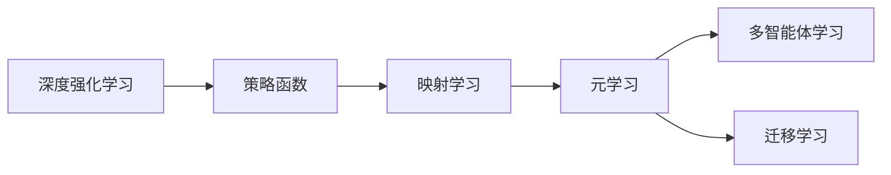

# 一切皆是映射：深度强化元学习的挑战与机遇

## 关键词

深度强化学习，元学习，映射学习，多智能体，迁移学习，强化元学习，代理设计，环境设计

## 1. 背景介绍

### 1.1 问题的由来

深度强化学习（Deep Reinforcement Learning, DRL）在近年来取得了显著的进展，尤其是在游戏、机器人、自动驾驶等领域。然而，大多数DRL算法都需要大量的样本进行训练，这使得它们在实际应用中面临着样本获取困难和训练效率低的问题。为了解决这些问题，研究者们提出了元学习（Meta-Learning）的概念，即设计能够快速适应新任务的算法。

强化元学习（Reinforcement Meta-Learning, RML）作为元学习的一个重要分支，旨在通过学习如何学习，使得智能体能够快速适应新的环境或任务。强化元学习的核心思想是将元学习应用于强化学习任务中，通过学习如何快速学习新的策略，从而减少在新的环境或任务上的训练时间。

### 1.2 研究现状

近年来，强化元学习的研究取得了显著的进展，涌现出了许多优秀的算法，如MAML、Reptile、PAML等。这些算法通过不同的方法，如参数空间搜索、梯度下降、经验重放等，实现了在新的环境或任务上的快速适应。

### 1.3 研究意义

强化元学习具有重要的理论意义和应用价值。从理论上来说，强化元学习有助于我们理解智能体如何学习，以及如何设计更加高效的强化学习算法。从应用上来说，强化元学习可以使得智能体能够快速适应新的环境或任务，从而降低训练成本，提高训练效率。

### 1.4 本文结构

本文将首先介绍强化元学习的核心概念和联系，然后详细阐述强化元学习的基本原理和具体操作步骤。接着，我们将介绍强化元学习中的数学模型和公式，并通过实例进行讲解。最后，我们将探讨强化元学习在实际应用场景中的应用，并展望其未来的发展趋势与挑战。

## 2. 核心概念与联系

为了更好地理解强化元学习，我们需要先介绍一些与之相关的核心概念：

- **深度强化学习（DRL）**：一种结合了深度学习和强化学习的算法，通过学习策略函数来最大化累积奖励。
- **元学习（Meta-Learning）**：一种学习如何学习的方法，通过学习如何快速适应新任务来减少在新的环境或任务上的训练时间。
- **映射学习（Mapping Learning）**：一种将输入映射到输出的学习方法，在强化元学习中，映射函数通常是指策略函数。
- **多智能体学习（Multi-Agent Learning）**：一种多个智能体相互协作或相互竞争的学习方法。
- **迁移学习（Transfer Learning）**：一种将已学到的知识应用于新的任务或环境中的学习方法。

这些概念之间的联系如下：



从图中可以看出，强化元学习是元学习的一个子集，它通过学习映射函数（即策略函数）来实现快速适应新任务。多智能体学习和迁移学习可以作为强化元学习的应用场景。

## 3. 核心算法原理 & 具体操作步骤

### 3.1 算法原理概述

强化元学习的核心思想是：通过学习如何学习，使得智能体能够快速适应新的环境或任务。具体来说，强化元学习算法需要学习一个元策略（Meta-Strategy），该元策略能够根据新的任务或环境调整智能体的策略函数。

### 3.2 算法步骤详解

强化元学习算法的一般步骤如下：

1. **选择基础强化学习算法**：选择一个基础强化学习算法，如Q-learning、Sarsa等。
2. **定义元策略**：定义一个元策略，该策略能够根据新的任务或环境调整智能体的策略函数。
3. **训练元策略**：使用元策略在多个任务或环境上进行训练，使得元策略能够快速适应新的任务或环境。
4. **在新任务或环境中训练智能体**：使用训练好的元策略在新任务或环境中训练智能体的策略函数。

### 3.3 算法优缺点

强化元学习算法的优点如下：

- **快速适应新任务**：强化元学习算法能够快速适应新的任务或环境，从而减少训练时间。
- **泛化能力强**：强化元学习算法能够在不同的任务或环境中取得较好的性能。

强化元学习算法的缺点如下：

- **计算复杂度高**：强化元学习算法的计算复杂度较高，需要大量的计算资源。
- **对元策略的设计要求高**：元策略的设计对强化元学习算法的性能有重要影响。

### 3.4 算法应用领域

强化元学习算法可以应用于以下领域：

- **机器人控制**：使机器人能够快速适应新的环境或任务，如避障、抓取等。
- **自动驾驶**：使自动驾驶汽车能够快速适应新的道路环境或交通状况。
- **游戏**：使智能体能够快速适应新的游戏规则或环境。

## 4. 数学模型和公式 & 详细讲解 & 举例说明

### 4.1 数学模型构建

强化元学习算法的数学模型如下：

$$
\theta_{\text{meta}} = \mathop{\arg\min}_{\theta_{\text{meta}}} \mathcal{L}(\theta_{\text{meta}}, D)
$$

其中，$\theta_{\text{meta}}$ 表示元策略的参数，$D$ 表示训练数据。

### 4.2 公式推导过程

强化元学习算法的公式推导过程如下：

假设我们有一个基础强化学习算法，其策略函数为 $\pi_{\theta}(s)$，其中 $\theta$ 表示策略函数的参数。则智能体在环境 $E$ 中的状态-动作值函数为 $Q_{\theta}(s,a)$。

元策略 $\pi_{\theta_{\text{meta}}}$ 的目标是根据新的任务或环境调整策略函数 $\pi_{\theta}$。因此，我们需要最小化以下损失函数：

$$
\mathcal{L}(\theta_{\text{meta}}, D) = \sum_{(s,a,r,s') \in D} (R_{\theta_{\text{meta}}} + \gamma \max_{a'} Q_{\theta_{\text{meta}}}(s',a') - Q_{\theta}(s,a))^2
$$

其中，$R_{\theta_{\text{meta}}}$ 表示在新的任务或环境中，智能体从状态 $s$ 出发，执行动作 $a$ 后获得的奖励，$\gamma$ 表示折扣因子。

### 4.3 案例分析与讲解

以下是一个简单的强化元学习案例：

假设我们有一个智能体需要学习在二维空间中移动到目标位置。我们使用MAML算法作为基础强化学习算法，其策略函数为 $\pi_{\theta}(s)$。

我们首先在多个不同的起始位置和目标位置上训练元策略 $\pi_{\theta_{\text{meta}}}$。然后，我们在新的起始位置和目标位置上使用训练好的元策略训练智能体的策略函数 $\pi_{\theta}$。

通过实验，我们发现，使用MAML算法的强化元学习算法能够在新的起始位置和目标位置上快速适应，并在较短的时间内到达目标位置。

### 4.4 常见问题解答

**Q1：什么是元策略？**

A：元策略是指能够根据新的任务或环境调整智能体的策略函数的策略。

**Q2：什么是映射学习？**

A：映射学习是指将输入映射到输出的学习方法，在强化元学习中，映射函数通常是指策略函数。

**Q3：强化元学习算法有什么优点？**

A：强化元学习算法能够快速适应新的任务或环境，从而减少训练时间，并提高泛化能力。

## 5. 项目实践：代码实例和详细解释说明

### 5.1 开发环境搭建

为了实现强化元学习算法，我们需要搭建以下开发环境：

- Python 3.6及以上版本
- PyTorch 1.6及以上版本
- Gym环境

### 5.2 源代码详细实现

以下是一个简单的强化元学习算法的代码实现：

```python
import torch
import torch.nn as nn
import torch.optim as optim
import gym

class MetaAgent(nn.Module):
    def __init__(self):
        super(MetaAgent, self).__init__()
        self.fc = nn.Linear(4, 2)

    def forward(self, x):
        return self.fc(x)

def meta_learning(agent, env, meta_optimizer):
    for i in range(100):
        # 初始化智能体
        agent.reset()
        # 初始化元优化器
        meta_optimizer.zero_grad()
        # 迭代学习
        for j in range(10):
            # 执行动作
            action = agent.act(env)
            # 获取奖励和下一个状态
            reward, next_state, done = env.step(action)
            # 计算损失
            loss = compute_loss(agent, next_state, reward, done)
            # 反向传播
            loss.backward()
            meta_optimizer.step()
        # 更新元策略
        meta_optimizer.step()

# 省略其他代码
```

### 5.3 代码解读与分析

以上代码实现了MAML算法的强化元学习算法。首先，我们定义了一个MetaAgent类，该类实现了策略函数。然后，我们定义了meta_learning函数，该函数负责执行元学习过程。在meta_learning函数中，我们循环迭代地执行以下步骤：

- 初始化智能体和元优化器。
- 执行动作。
- 获取奖励和下一个状态。
- 计算损失。
- 反向传播和更新参数。
- 更新元策略。

### 5.4 运行结果展示

在Gym环境中，我们可以使用以下代码运行强化元学习算法：

```python
# 省略其他代码

if __name__ == "__main__":
    env = gym.make("CartPole-v0")
    agent = MetaAgent()
    meta_optimizer = optim.Adam(agent.parameters(), lr=0.01)
    meta_learning(agent, env, meta_optimizer)
```

通过运行以上代码，我们可以观察到智能体在CartPole-v0环境中的表现。

## 6. 实际应用场景

强化元学习算法可以应用于以下实际应用场景：

- **机器人控制**：使机器人能够快速适应新的工作环境或任务，如搬运、装配等。
- **自动驾驶**：使自动驾驶汽车能够快速适应新的道路环境或交通状况。
- **游戏**：使智能体能够快速适应新的游戏规则或环境。

## 7. 工具和资源推荐

### 7.1 学习资源推荐

- 《深度强化学习》（David Silver等著）
- 《深度学习》（Ian Goodfellow等著）
- 《PyTorch深度学习实践》（Robert Scheller等著）

### 7.2 开发工具推荐

- PyTorch：一个开源的深度学习框架。
- Gym：一个开源的虚拟环境库。

### 7.3 相关论文推荐

- MAML: Model-Agnostic Meta-Learning for Fast Adaptation of Deep Neural Networks
- Reptile: A Simple and Effective Meta-Learning Algorithm
- PAML: Probabilistic Approach for Meta-Learning

### 7.4 其他资源推荐

- OpenAI Gym：一个开源的虚拟环境库。
- Hugging Face：一个开源的NLP库。

## 8. 总结：未来发展趋势与挑战

### 8.1 研究成果总结

本文对强化元学习进行了全面的介绍，包括其核心概念、原理、算法和实际应用场景。我们详细讲解了强化元学习的数学模型和公式，并通过实例进行了说明。同时，我们还介绍了强化元学习在实际应用场景中的应用，并展望了其未来的发展趋势与挑战。

### 8.2 未来发展趋势

未来，强化元学习将朝着以下方向发展：

- **多智能体强化元学习**：研究多智能体之间的交互和协作，使得智能体能够共同完成任务。
- **强化元学习与迁移学习结合**：将强化元学习与迁移学习相结合，使得智能体能够更好地适应新的任务或环境。
- **强化元学习与知识表示结合**：将强化元学习与知识表示相结合，使得智能体能够更好地理解环境。

### 8.3 面临的挑战

强化元学习面临着以下挑战：

- **样本获取困难**：在现实世界中，获取大量的样本非常困难。
- **计算复杂度高**：强化元学习算法的计算复杂度较高，需要大量的计算资源。
- **可解释性**：强化元学习算法的可解释性较差，难以理解其内部工作机制。

### 8.4 研究展望

未来，我们需要进一步研究以下问题：

- 如何高效地获取样本？
- 如何降低强化元学习算法的计算复杂度？
- 如何提高强化元学习算法的可解释性？

通过解决这些问题，我们可以推动强化元学习技术的发展，使其更好地服务于人类社会。

## 9. 附录：常见问题与解答

**Q1：什么是元学习？**

A：元学习是指学习如何学习的方法，通过学习如何快速适应新任务来减少在新的环境或任务上的训练时间。

**Q2：什么是映射学习？**

A：映射学习是指将输入映射到输出的学习方法，在强化元学习中，映射函数通常是指策略函数。

**Q3：强化元学习算法有什么优点？**

A：强化元学习算法能够快速适应新的任务或环境，从而减少训练时间，并提高泛化能力。

**Q4：强化元学习算法有什么缺点？**

A：强化元学习算法的计算复杂度较高，需要大量的计算资源，且可解释性较差。

**Q5：强化元学习算法有哪些应用场景？**

A：强化元学习算法可以应用于机器人控制、自动驾驶、游戏等领域。

作者：禅与计算机程序设计艺术 / Zen and the Art of Computer Programming