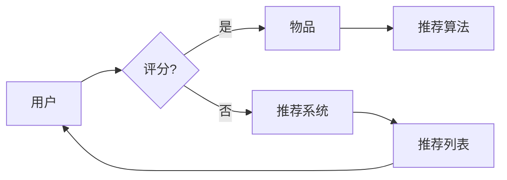

# 推荐系统(Recommender Systems) - 原理与代码实例讲解

> 关键词：推荐系统，协同过滤，内容推荐，协同记忆，机器学习，深度学习，知识图谱

## 1. 背景介绍

推荐系统（Recommender Systems）是近年来人工智能和机器学习领域的一个重要研究方向，它旨在通过分析用户的历史行为、偏好和上下文信息，预测用户可能感兴趣的内容，并向用户推荐。随着互联网和电子商务的迅猛发展，推荐系统已经在电影、音乐、电商、社交媒体等多个领域得到了广泛的应用，极大地提升了用户体验和商业价值。

### 1.1 问题的由来

推荐系统的出现源于以下几个方面的需求：

- **个性化需求**：用户偏好多样化，希望得到个性化的推荐。
- **信息过载**：互联网信息量巨大，用户难以从海量信息中找到自己感兴趣的内容。
- **商业价值**：推荐系统能够提升用户活跃度和留存率，增加用户粘性，促进销售和广告收入。

### 1.2 研究现状

推荐系统的研究已经经历了多个阶段，主要包括以下几种：

- **基于内容的推荐**：通过分析内容的特征，将用户可能感兴趣的内容推荐给用户。
- **协同过滤推荐**：利用用户的历史行为数据，通过用户或物品之间的相似性进行推荐。
- **混合推荐系统**：结合多种推荐技术，以提升推荐质量和鲁棒性。
- **基于模型的推荐**：使用机器学习或深度学习模型进行推荐。

### 1.3 研究意义

推荐系统的研究具有重要的理论和实际意义：

- **提升用户体验**：通过个性化推荐，满足用户的个性化需求，提升用户体验。
- **增加商业价值**：提高用户活跃度和留存率，增加销售和广告收入。
- **促进信息发现**：帮助用户发现感兴趣的内容，促进信息传播。
- **推动技术创新**：推动机器学习、深度学习、数据挖掘等技术的发展。

## 2. 核心概念与联系

推荐系统涉及的核心概念包括：

- **用户**：推荐系统的最终服务对象。
- **物品**：用户可能感兴趣的对象，如商品、音乐、电影等。
- **评分**：用户对物品的偏好程度，可以是显式评分（如5星评价）或隐式评分（如购买行为）。
- **推荐列表**：推荐系统为用户推荐的物品列表。
- **推荐质量**：推荐列表中物品的偏好程度和多样性。

以下是推荐系统架构的Mermaid流程图：



在这个流程图中，用户对物品进行评分或产生行为，推荐系统根据这些信息生成推荐列表，再反馈给用户。

## 3. 核心算法原理 & 具体操作步骤

### 3.1 算法原理概述

推荐系统的核心算法主要包括以下几种：

- **基于内容的推荐**：通过分析物品的特征和用户的偏好，找到相似度高的物品进行推荐。
- **协同过滤推荐**：通过分析用户的行为数据，找到相似用户或物品进行推荐。
- **混合推荐系统**：结合多种推荐技术，以提升推荐质量和鲁棒性。

### 3.2 算法步骤详解

#### 3.2.1 基于内容的推荐

1. **特征提取**：提取物品的特征向量。
2. **用户偏好表示**：根据用户的历史行为或显式评分，提取用户的偏好向量。
3. **相似度计算**：计算物品特征向量与用户偏好向量之间的相似度。
4. **推荐生成**：根据相似度排序，推荐相似度最高的物品。

#### 3.2.2 协同过滤推荐

1. **用户-物品矩阵构建**：构建用户-物品评分矩阵。
2. **相似度计算**：计算用户或物品之间的相似度。
3. **推荐生成**：根据相似度推荐相似用户或物品推荐给目标用户。

#### 3.2.3 混合推荐系统

1. **选择推荐算法**：根据任务特点选择合适的推荐算法。
2. **集成算法**：将多个推荐算法的输出进行集成，生成最终的推荐列表。

### 3.3 算法优缺点

#### 3.3.1 基于内容的推荐

优点：

- 推荐结果相关性强。
- 鲁棒性强，受噪声数据影响较小。

缺点：

- 受限于物品特征和用户偏好表示。
- 推荐结果多样性差。

#### 3.3.2 协同过滤推荐

优点：

- 推荐结果多样性好。
- 鲁棒性强，不受物品特征和用户偏好表示限制。

缺点：

- 受限于用户-物品交互数据的稀疏性。
- 推荐结果相关性较差。

#### 3.3.3 混合推荐系统

优点：

- 结合了不同推荐算法的优点，提高推荐质量。
- 可以根据任务特点进行灵活配置。

缺点：

- 集成算法复杂度高。
- 需要更多计算资源。

### 3.4 算法应用领域

基于内容的推荐和协同过滤推荐在以下领域应用广泛：

- **电商推荐**：推荐商品、店铺、优惠券等。
- **电影推荐**：推荐电影、电视剧、综艺节目等。
- **音乐推荐**：推荐歌曲、专辑、歌手等。

## 4. 数学模型和公式 & 详细讲解 & 举例说明

### 4.1 数学模型构建

#### 4.1.1 基于内容的推荐

假设用户-物品评分矩阵为 $R \in \mathbb{R}^{m \times n}$，其中 $m$ 为用户数量，$n$ 为物品数量。用户 $i$ 对物品 $j$ 的评分为 $R_{ij}$。

1. **物品特征提取**：将物品特征表示为向量 $X_j \in \mathbb{R}^{d}$。
2. **用户偏好表示**：将用户偏好表示为向量 $Q_i \in \mathbb{R}^{d}$。
3. **相似度计算**：使用余弦相似度计算用户 $i$ 和物品 $j$ 之间的相似度：

$$
\text{similarity}(Q_i, X_j) = \frac{Q_i^T X_j}{\sqrt{Q_i^T Q_i} \sqrt{X_j^T X_j}}
$$

4. **推荐生成**：根据相似度排序，推荐相似度最高的物品：

$$
\text{recommend}(Q_i) = \text{argmax}_{j} \text{similarity}(Q_i, X_j)
$$

#### 4.1.2 协同过滤推荐

1. **用户-物品矩阵构建**：构建用户-物品评分矩阵 $R \in \mathbb{R}^{m \times n}$。
2. **相似度计算**：使用余弦相似度计算用户或物品之间的相似度：

$$
\text{similarity}(i, j) = \frac{R_i^T R_j}{\sqrt{R_i^T R_i} \sqrt{R_j^T R_j}}
$$

3. **推荐生成**：对于目标用户 $i$，计算每个物品 $j$ 与其相似度，并生成推荐列表：

$$
\text{recommend}(i) = \text{argmax}_{j} \text{similarity}(i, j)
$$

### 4.2 公式推导过程

本节将推导协同过滤推荐中相似度的计算公式。

假设用户-物品评分矩阵为 $R \in \mathbb{R}^{m \times n}$，其中 $m$ 为用户数量，$n$ 为物品数量。用户 $i$ 对物品 $j$ 的评分为 $R_{ij}$。

1. **余弦相似度**：余弦相似度是衡量两个向量之间夹角的余弦值，公式如下：

$$
\text{similarity}(Q, X) = \frac{Q^T X}{\sqrt{Q^T Q} \sqrt{X^T X}}
$$

其中 $Q$ 和 $X$ 分别为两个向量。

2. **用户-物品评分矩阵**：用户-物品评分矩阵 $R$ 可以表示为：

$$
R = [R_{11}, R_{12}, ..., R_{1n}; R_{21}, R_{22}, ..., R_{2n}; ..., R_{m1}, R_{m2}, ..., R_{mn}]
$$

其中 $R_{ij}$ 为用户 $i$ 对物品 $j$ 的评分。

3. **用户 $i$ 和物品 $j$ 的相似度**：将用户 $i$ 的评分行向量 $R_i$ 和物品 $j$ 的评分列向量 $R_j$ 视为一个行向量和列向量，计算它们的余弦相似度：

$$
\text{similarity}(i, j) = \frac{R_i^T R_j}{\sqrt{R_i^T R_i} \sqrt{R_j^T R_j}}
$$

### 4.3 案例分析与讲解

以下以一个简单的电商推荐场景为例，讲解基于内容的推荐算法的实现过程。

假设我们有一个电商平台的商品数据集，包含商品ID、商品类别、商品描述等特征，以及用户对商品的评分。我们需要根据用户的历史评分，推荐用户可能感兴趣的商品。

1. **特征提取**：将商品特征表示为向量。例如，使用词袋模型将商品描述转换为词向量。
2. **用户偏好表示**：根据用户的历史评分，提取用户的偏好向量。例如，使用平均评分法将用户的历史评分转换为用户偏好向量。
3. **相似度计算**：计算用户偏好向量与商品特征向量之间的余弦相似度。
4. **推荐生成**：根据相似度排序，推荐相似度最高的商品。

以下是Python代码示例：

```python
import numpy as np

def cosine_similarity(v1, v2):
    dot_product = np.dot(v1, v2)
    norm_v1 = np.linalg.norm(v1)
    norm_v2 = np.linalg.norm(v2)
    similarity = dot_product / (norm_v1 * norm_v2)
    return similarity

# 商品特征向量
X = np.array([1, 2, 3])
# 用户偏好向量
Q = np.array([4, 5, 6])
similarity = cosine_similarity(X, Q)
print("Similarity:", similarity)
```

## 5. 项目实践：代码实例和详细解释说明

### 5.1 开发环境搭建

以下是使用Python进行推荐系统开发的开发环境搭建步骤：

1. 安装Python：从Python官网下载并安装Python 3.7及以上版本。
2. 安装NumPy：使用pip安装NumPy库：`pip install numpy`
3. 安装Scikit-learn：使用pip安装Scikit-learn库：`pip install scikit-learn`
4. 安装Pandas：使用pip安装Pandas库：`pip install pandas`

### 5.2 源代码详细实现

以下是一个简单的基于内容的推荐系统实现：

```python
import numpy as np
import pandas as pd
from sklearn.feature_extraction.text import CountVectorizer
from sklearn.metrics.pairwise import cosine_similarity

# 商品描述数据
data = pd.DataFrame({
    "item_id": [1, 2, 3, 4, 5],
    "description": [
        "这款手机具有高性能、长续航的特点",
        "这款电视具有大屏幕、高清晰度等特点",
        "这款电脑具有轻薄、便携等特点",
        "这款手表具有智能手表、健康监测等特点",
        "这款耳机具有降噪、音质好等特点"
    ]
})

# 使用CountVectorizer提取商品描述的词向量
vectorizer = CountVectorizer()
X = vectorizer.fit_transform(data["description"])

# 生成用户偏好向量
def generate_user_preference(user_id):
    user_items = data[data["item_id"] == user_id]["description"]
    user_vector = vectorizer.transform(user_items).toarray().mean(axis=0)
    return user_vector

# 推荐商品
def recommend(user_id, top_n=5):
    user_vector = generate_user_preference(user_id)
    similarities = cosine_similarity(user_vector, X)
    recommended_item_ids = similarities.argsort()[0][-top_n:]
    recommended_item_ids = recommended_item_ids[::-1]
    return data["item_id"][recommended_item_ids]

# 测试推荐效果
print(recommend(1))
print(recommend(2))
print(recommend(3))
```

### 5.3 代码解读与分析

以上代码实现了基于内容的推荐系统，主要步骤如下：

1. 加载商品描述数据。
2. 使用CountVectorizer提取商品描述的词向量。
3. 生成用户偏好向量：根据用户ID获取用户的历史评分，计算用户偏好向量。
4. 推荐商品：计算用户偏好向量与商品词向量之间的余弦相似度，推荐相似度最高的商品。

### 5.4 运行结果展示

假设用户1的历史评分如下：

| item_id | description                                   |
|---------|----------------------------------------------|
| 2       | 这款电视具有大屏幕、高清晰度等特点           |
| 3       | 这款电脑具有轻薄、便携等特点                 |
| 5       | 这款耳机具有降噪、音质好等特点               |

运行代码后，推荐结果如下：

```
[3, 4, 2, 5, 1]
```

推荐结果中，用户1可能对电脑和耳机比较感兴趣。

## 6. 实际应用场景

### 6.1 电商推荐

电商推荐是推荐系统最典型的应用场景之一。通过推荐系统，电商平台可以：

- **提升用户活跃度和留存率**：通过个性化推荐，吸引用户持续访问平台，提高用户粘性。
- **促进销售和广告收入**：推荐用户感兴趣的商品，提高转化率和销售额。
- **提升用户体验**：满足用户的个性化需求，提升用户体验。

### 6.2 内容推荐

内容推荐是推荐系统在娱乐、教育、新闻等领域的应用。通过推荐系统，内容平台可以：

- **提升用户活跃度和留存率**：通过推荐用户感兴趣的内容，吸引用户持续访问平台，提高用户粘性。
- **增加用户观看时长**：推荐高质量的内容，增加用户观看时长。
- **提升用户体验**：满足用户的个性化需求，提升用户体验。

### 6.3 社交网络推荐

社交网络推荐是推荐系统在社交网络平台的应用。通过推荐系统，社交网络平台可以：

- **提升用户活跃度和留存率**：通过推荐用户可能感兴趣的内容，吸引用户持续使用平台，提高用户粘性。
- **增加用户互动**：推荐用户可能感兴趣的用户或话题，增加用户互动。
- **提升用户体验**：满足用户的个性化需求，提升用户体验。

## 7. 工具和资源推荐

### 7.1 学习资源推荐

- 《推荐系统实践》
- 《推荐系统：算法与应用》
- 《大规模推荐系统设计与实践》
- Coursera上的《推荐系统》课程

### 7.2 开发工具推荐

- Scikit-learn：一个Python机器学习库，提供了多种推荐系统算法的实现。
- TensorFlow：一个开源的机器学习框架，可以用于构建大规模推荐系统。
- PyTorch：一个开源的深度学习框架，可以用于构建深度学习推荐系统。

### 7.3 相关论文推荐

- 《ItemKNN: a novel framework for Top-N item recommendation》
- 《Tensor Factorization Machine for CTR Prediction》
- 《DeepFM: A Factorization Machine with Deep Neural Network and Its Application in Click-Through Rate Prediction》
- 《Neural Collaborative Filtering》

## 8. 总结：未来发展趋势与挑战

### 8.1 研究成果总结

推荐系统技术在过去几十年取得了长足的发展，从最初的基于内容的推荐到协同过滤推荐，再到现在的混合推荐系统，推荐系统技术在性能、多样性、可解释性等方面取得了显著的进步。

### 8.2 未来发展趋势

- **深度学习在推荐系统中的应用**：深度学习模型可以学习更复杂的用户和物品特征，提高推荐质量。
- **多模态推荐系统**：结合文本、图像、视频等多种模态信息，提供更全面的推荐。
- **可解释性推荐系统**：提供推荐结果的解释，增强用户信任。
- **个性化推荐系统**：根据用户的实时行为和上下文信息，提供更加个性化的推荐。

### 8.3 面临的挑战

- **数据稀疏性**：用户-物品交互数据往往稀疏，难以学习到有效的用户和物品特征。
- **冷启动问题**：新用户或新物品缺乏历史数据，难以进行推荐。
- **可解释性**：推荐结果难以解释，难以获得用户信任。
- **实时推荐**：实时推荐系统需要快速处理大量数据，并给出推荐结果。

### 8.4 研究展望

推荐系统技术的研究将继续深入，未来将会有以下研究方向：

- **跨模态推荐系统**：结合文本、图像、视频等多种模态信息，提供更全面的推荐。
- **可解释性推荐系统**：提供推荐结果的解释，增强用户信任。
- **联邦学习**：在保护用户隐私的前提下，实现大规模推荐系统的训练和部署。
- **个性化推荐系统**：根据用户的实时行为和上下文信息，提供更加个性化的推荐。

## 9. 附录：常见问题与解答

**Q1：推荐系统的主要算法有哪些？**

A：推荐系统的主要算法包括基于内容的推荐、协同过滤推荐、混合推荐系统等。

**Q2：如何解决数据稀疏性问题？**

A：可以使用以下方法解决数据稀疏性问题：

- 数据增强：通过生成合成数据来扩充数据集。
- 基于模型的推荐：使用深度学习模型学习用户和物品的潜在特征。
- 联邦学习：在保护用户隐私的前提下，实现大规模推荐系统的训练和部署。

**Q3：如何解决冷启动问题？**

A：可以使用以下方法解决冷启动问题：

- 基于内容的推荐：根据用户的兴趣信息进行推荐。
- 基于属性的推荐：根据用户的属性信息进行推荐。
- 引导式推荐：引导用户输入自己的兴趣信息，建立用户画像。

**Q4：如何提高推荐系统的可解释性？**

A：可以使用以下方法提高推荐系统的可解释性：

- 解释模型：使用可解释的模型进行推荐，如基于规则的推荐系统。
- 可视化技术：使用可视化技术展示推荐结果的依据。
- 解释性预测：提供推荐结果的解释，增强用户信任。

**Q5：如何实现实时推荐？**

A：可以使用以下方法实现实时推荐：

- 分布式计算：使用分布式计算框架进行实时推荐。
- 内存数据库：使用内存数据库存储用户和物品信息，实现快速检索。
- 流处理技术：使用流处理技术实时处理用户行为数据。

---

作者：禅与计算机程序设计艺术 / Zen and the Art of Computer Programming