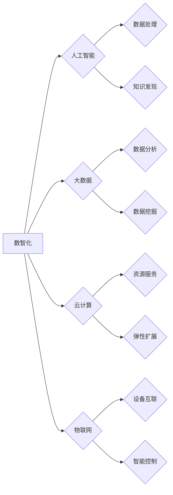

# 数智时代的到来与发展趋势

> 关键词：数智化，人工智能，大数据，物联网，智能化转型，未来趋势，挑战与机遇

## 1. 背景介绍

随着信息技术的飞速发展，我们正迈入一个全新的时代——数智时代。数智化（Digital Intelligence）是信息技术与实体经济深度融合的结果，它以大数据、云计算、人工智能、物联网等为代表的技术，正在深刻地改变着我们的生活方式、工作方式和商业模式。

### 1.1 问题的由来

在传统时代，信息处理主要依靠人工，效率低下，成本高昂。随着全球信息化进程的加速，人们迫切需要一种新的技术手段来处理海量数据，提高生产效率，优化资源配置。数智化应运而生，它通过整合信息技术和实体经济，为人类社会带来了前所未有的机遇和挑战。

### 1.2 研究现状

数智化技术已经在多个领域取得了显著成果，如智能制造、智能交通、智慧城市、智能医疗等。这些应用不仅提高了生产效率，降低了成本，还改善了人们的生活质量。然而，数智化技术也面临着数据安全、隐私保护、伦理道德等挑战。

### 1.3 研究意义

研究数智化技术的发展趋势和挑战，对于推动我国经济高质量发展、提升国际竞争力具有重要意义。通过深入研究，我们可以更好地把握数智化技术的发展方向，为政府、企业、个人提供决策参考，促进数智化技术的健康发展。

### 1.4 本文结构

本文将围绕数智时代的到来与发展趋势展开论述，具体结构如下：

- 第2章介绍数智化的核心概念及其与相关技术的联系。
- 第3章阐述数智化技术的核心算法原理和具体操作步骤。
- 第4章讲解数智化技术的数学模型和公式，并结合实例进行分析。
- 第5章展示数智化技术的项目实践，包括开发环境搭建、代码实现和运行结果展示。
- 第6章探讨数智化技术在各个领域的应用场景和未来发展趋势。
- 第7章推荐数智化技术相关的学习资源、开发工具和参考文献。
- 第8章总结数智化技术的发展趋势与挑战，并展望未来研究展望。
- 第9章附录部分提供常见问题与解答。

## 2. 核心概念与联系

### 2.1 核心概念

**数智化**：指将信息数字化，利用人工智能、大数据、云计算等先进技术对数据进行处理、分析和应用，从而实现智能化、自动化和优化的过程。

**人工智能**：指使计算机具有模拟、延伸和扩展人类智能的理论、方法、技术及应用。

**大数据**：指规模巨大、类型多样、价值密度低的数据集合。

**云计算**：指通过网络将计算资源、存储资源、数据资源等服务提供给用户，用户可以按需使用。

**物联网**：指通过互联网将各种物品连接起来，实现物品与物品、人与物品之间的信息交互和智能控制。

### 2.2 核心概念原理和架构的 Mermaid 流程图



### 2.3 核心概念的联系

数智化是人工智能、大数据、云计算、物联网等技术的融合应用。人工智能提供智能处理和分析数据的能力，大数据提供海量数据资源，云计算提供强大的计算和存储能力，物联网提供设备互联和智能控制的基础设施。这些技术的结合，使得数智化成为可能。

## 3. 核心算法原理 & 具体操作步骤

### 3.1 算法原理概述

数智化技术的核心是算法，主要包括以下几类：

- **机器学习算法**：用于从数据中学习模式和规律，如监督学习、无监督学习、强化学习等。
- **深度学习算法**：一种特殊的机器学习算法，通过模拟人脑神经元连接的方式，对数据进行特征提取和模式识别。
- **大数据分析算法**：用于处理和分析海量数据，如聚类、分类、关联规则挖掘等。
- **云计算算法**：用于优化云计算资源的使用效率，如负载均衡、弹性伸缩等。

### 3.2 算法步骤详解

数智化技术的算法步骤主要包括以下几步：

1. 数据采集：从各种渠道收集数据，如传感器、网络爬虫、用户行为数据等。
2. 数据预处理：对采集到的数据进行清洗、去重、转换等处理，使其符合分析要求。
3. 特征提取：从预处理后的数据中提取有用的特征，用于后续建模和分析。
4. 模型训练：使用机器学习或深度学习算法，在训练数据上训练模型。
5. 模型评估：在测试数据上评估模型的性能，如准确率、召回率等。
6. 模型部署：将训练好的模型部署到实际应用中，进行预测和决策。

### 3.3 算法优缺点

数智化技术的算法具有以下优点：

- **高效性**：能够快速处理和分析海量数据，提高生产效率。
- **智能化**：能够自动学习和优化，提高决策水平。
- **灵活性**：可以根据不同的应用场景和需求，选择合适的算法和模型。

然而，数智化技术的算法也存在着一些缺点：

- **数据依赖性**：算法的性能很大程度上依赖于数据的质量和数量。
- **计算复杂性**：一些复杂的算法需要大量的计算资源。
- **可解释性**：一些深度学习算法的决策过程难以解释。

### 3.4 算法应用领域

数智化技术的算法应用领域非常广泛，包括：

- **智能制造**：如智能工厂、智能机器人、智能设备等。
- **智能交通**：如智能交通信号灯、自动驾驶、智能停车场等。
- **智慧城市**：如智能电网、智能水务、智能安防等。
- **智能医疗**：如智能诊断、智能药物研发、智能健康管理等。

## 4. 数学模型和公式 & 详细讲解 & 举例说明

### 4.1 数学模型构建

数智化技术的数学模型主要包括以下几种：

- **线性回归模型**：用于预测连续变量。
- **逻辑回归模型**：用于预测离散变量，如分类任务。
- **支持向量机模型**：用于分类和回归任务。
- **神经网络模型**：用于复杂的数据处理和分析任务。

### 4.2 公式推导过程

以线性回归模型为例，其公式推导过程如下：

$$
y = \beta_0 + \beta_1x_1 + \beta_2x_2 + ... + \beta_nx_n + \epsilon
$$

其中，$y$ 为因变量，$x_1, x_2, ..., x_n$ 为自变量，$\beta_0, \beta_1, ..., \beta_n$ 为模型参数，$\epsilon$ 为误差项。

### 4.3 案例分析与讲解

以下是一个使用线性回归模型进行房价预测的案例：

假设我们收集了某地区100套二手房的数据，包括房屋面积（$x_1$）、房屋朝向（$x_2$）、楼层（$x_3$）和售价（$y$）。我们希望构建一个线性回归模型，预测房屋的售价。

首先，我们将数据转化为矩阵形式：

$$
X = \begin{bmatrix}
x_{11} & x_{12} & x_{13} \\
x_{21} & x_{22} & x_{23} \\
\vdots & \vdots & \vdots \\
x_{100} & x_{102} & x_{103}
\end{bmatrix}, \quad 
Y = \begin{bmatrix}
y_1 \\
y_2 \\
\vdots \\
y_{100}
\end{bmatrix}
$$

然后，我们使用最小二乘法求解模型参数 $\beta$：

$$
\beta = (X^T X)^{-1} X^T Y
$$

最后，使用求解得到的模型参数预测新的房屋售价。

## 5. 项目实践：代码实例和详细解释说明

### 5.1 开发环境搭建

以下是一个使用Python进行线性回归模型开发的简单示例：

```bash
# 安装必要的库
pip install numpy matplotlib scikit-learn
```

### 5.2 源代码详细实现

```python
import numpy as np
import matplotlib.pyplot as plt
from sklearn.linear_model import LinearRegression

# 创建样本数据
X = np.array([[1, 2], [2, 3], [3, 4], [4, 5]])
y = np.dot(X, np.array([1, 2])) + 3

# 创建线性回归模型
model = LinearRegression()

# 训练模型
model.fit(X, y)

# 绘制预测结果
plt.scatter(X[:, 0], y)
plt.plot(X[:, 0], model.predict(X), color='red')
plt.show()
```

### 5.3 代码解读与分析

- 第一行代码导入必要的库。
- 第二行代码创建样本数据，包括自变量 $X$ 和因变量 $y$。
- 第三行代码创建线性回归模型。
- 第四行代码使用样本数据训练模型。
- 第五行代码绘制预测结果，其中红色曲线表示模型的预测结果。

### 5.4 运行结果展示

运行上述代码后，将显示一个散点图，其中蓝色点表示样本数据，红色曲线表示模型的预测结果。

## 6. 实际应用场景

数智化技术在各个领域都有广泛的应用，以下是一些典型的应用场景：

### 6.1 智能制造

智能制造是数智化技术在工业领域的重要应用，通过引入人工智能、物联网等技术，实现生产过程的自动化、智能化和高效化。

- **智能工厂**：通过工业互联网将生产设备、生产线、物流系统等连接起来，实现生产过程的实时监控和智能控制。
- **智能机器人**：使用人工智能技术，使机器人能够执行各种复杂的任务，如焊接、装配、搬运等。
- **智能设备**：通过传感器和物联网技术，使设备能够实现远程监控、故障诊断、预测性维护等功能。

### 6.2 智能交通

智能交通是数智化技术在交通运输领域的应用，通过引入人工智能、大数据等技术，实现交通系统的智能化管理。

- **智能交通信号灯**：根据实时交通流量自动调整信号灯配时，提高交通效率。
- **自动驾驶**：利用人工智能和传感器技术，使汽车能够实现自动驾驶，提高行驶安全性和效率。
- **智能停车场**：通过智能停车系统，实现停车场的智能化管理和高效利用。

### 6.3 智慧城市

智慧城市是数智化技术在城市管理领域的应用，通过引入物联网、大数据、人工智能等技术，实现城市管理的高效、智能和人性化。

- **智能电网**：通过智能化技术，实现电网的实时监控、故障诊断和智能调度。
- **智能水务**：通过物联网技术，实现水资源的实时监测、调度和管理。
- **智能安防**：通过视频监控、人脸识别等技术，实现城市安全的智能化管理。

### 6.4 未来应用展望

随着数智化技术的不断发展，未来将会有更多新的应用场景出现，以下是一些值得关注的趋势：

- **智能农业**：通过物联网、大数据、人工智能等技术，实现农业生产的智能化管理，提高农业生产效率。
- **智能医疗**：通过人工智能、大数据、物联网等技术，实现医疗服务的智能化，提高医疗质量和效率。
- **智能教育**：通过人工智能、大数据、虚拟现实等技术，实现个性化教育，提高教育质量和公平性。

## 7. 工具和资源推荐

### 7.1 学习资源推荐

- 《Python编程：从入门到实践》
- 《机器学习实战》
- 《深度学习》
- 《大数据时代》
- 《智能时代》

### 7.2 开发工具推荐

- Python编程语言
- NumPy库
- Pandas库
- Scikit-learn库
- TensorFlow库
- PyTorch库
- Hadoop和Spark等大数据处理工具

### 7.3 相关论文推荐

- 《大数据时代：影响生活、商业、科学决策的四大驱动》
- 《智能时代：大数据与机器学习驱动的社会变革》
- 《深度学习》
- 《大数据》
- 《人工智能：一种现代的方法》

## 8. 总结：未来发展趋势与挑战

### 8.1 研究成果总结

数智化技术是信息技术与实体经济深度融合的产物，它通过整合人工智能、大数据、云计算、物联网等技术，为人类社会带来了前所未有的机遇和挑战。数智化技术已经在多个领域取得了显著成果，为经济社会发展注入了新的动力。

### 8.2 未来发展趋势

未来，数智化技术将呈现以下发展趋势：

- **跨领域融合**：数智化技术将与其他技术（如区块链、边缘计算等）深度融合，形成更加多元化的应用场景。
- **个性化定制**：数智化技术将更好地满足用户个性化需求，提供更加智能、便捷的服务。
- **产业协同**：数智化技术将推动产业链上下游企业协同发展，提升产业链整体竞争力。
- **安全可控**：数智化技术将更加注重数据安全、隐私保护、伦理道德等问题。

### 8.3 面临的挑战

数智化技术也面临着一些挑战：

- **数据安全**：随着数据规模的不断扩大，数据安全问题日益突出。
- **隐私保护**：如何保护用户隐私，防止数据泄露，是数智化技术发展的重要课题。
- **伦理道德**：数智化技术的应用引发了一些伦理道德问题，如算法歧视、隐私侵犯等。
- **人才短缺**：数智化技术发展需要大量专业人才，人才短缺是制约数智化技术发展的重要因素。

### 8.4 研究展望

未来，数智化技术的研究将重点关注以下方面：

- **安全可控**：研究更加安全、可靠、可解释的数智化技术。
- **隐私保护**：研究更加有效的隐私保护技术，确保用户隐私安全。
- **伦理道德**：研究数智化技术的伦理道德规范，确保数智化技术健康发展。
- **人才培养**：加强数智化技术人才的培养，为数智化技术发展提供人才保障。

## 9. 附录：常见问题与解答

**Q1：什么是数智化？**

A：数智化是指将信息数字化，利用人工智能、大数据、云计算等先进技术对数据进行处理、分析和应用，从而实现智能化、自动化和优化的过程。

**Q2：数智化技术有哪些应用场景？**

A：数智化技术应用场景非常广泛，包括智能制造、智能交通、智慧城市、智能医疗等。

**Q3：数智化技术面临的挑战有哪些？**

A：数智化技术面临的挑战主要包括数据安全、隐私保护、伦理道德、人才短缺等。

**Q4：如何应对数智化技术面临的挑战？**

A：应对数智化技术面临的挑战需要从多个方面入手，包括加强安全技术研发、完善隐私保护法规、制定伦理道德规范、培养专业人才等。

**Q5：数智化技术未来的发展趋势是什么？**

A：数智化技术未来的发展趋势主要包括跨领域融合、个性化定制、产业协同、安全可控等。