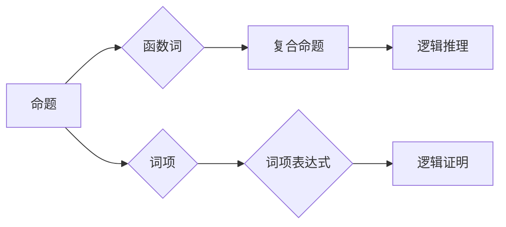

# 数理逻辑：函数词、等词

> 关键词：数理逻辑，函数词，等词，逻辑运算，命题逻辑，谓词逻辑，模型论，形式系统

## 1. 背景介绍

数理逻辑是现代逻辑学的核心部分，它将数学的方法应用于对语言和推理的研究，以揭示思维和推理的规律。数理逻辑的研究对象包括命题逻辑和谓词逻辑，其中函数词和等词是谓词逻辑中的基本元素，它们构成了谓词逻辑的核心结构。本文将深入探讨函数词、等词的概念、原理和应用，旨在为读者提供对数理逻辑深入理解的途径。

### 1.1 问题的由来

数理逻辑的发展起源于对数学证明的严格化要求。在19世纪末，随着数学基础的危机，逻辑学家开始寻求一种不受具体数学理论影响的逻辑体系，以作为数学证明的基石。函数词和等词的概念正是在这样的背景下被提出，它们为逻辑体系提供了丰富的语义和语法结构。

### 1.2 研究现状

数理逻辑在哲学、数学、计算机科学等领域都有着广泛的应用。在哲学中，它用于研究推理的有效性和逻辑真理的实质；在数学中，它用于构建严格的数学体系；在计算机科学中，它用于算法的验证和编程语言的逻辑基础。随着逻辑演算和模型论的不断发展，函数词和等词的研究也日益深入。

### 1.3 研究意义

理解函数词和等词对于构建形式系统、进行逻辑推理以及开发逻辑程序都具有重要意义。它不仅有助于我们理解思维的本质，还可以为人工智能和计算机科学的发展提供理论支持。

### 1.4 本文结构

本文将按以下结构展开：
- 介绍数理逻辑的基本概念和函数词、等词的定义。
- 通过Mermaid流程图展示函数词、等词在逻辑系统中的关系。
- 阐述函数词和等词的算法原理和具体操作步骤。
- 构建数学模型，并通过公式推导和案例分析进行详细讲解。
- 以项目实践为例，展示函数词和等词在逻辑编程中的应用。
- 探讨函数词和等词在实际应用场景中的价值，并展望未来发展趋势。
- 总结研究成果，分析未来发展趋势与挑战。

## 2. 核心概念与联系

### 2.1 核心概念

**函数词**：在数理逻辑中，函数词（也称为逻辑函数或逻辑运算符）是用来连接命题或词项的符号，它们将逻辑命题或词项组合成新的命题或词项。
**等词**：等词是表示相等关系的逻辑运算符，如等号（=）和不等号（≠）。

### 2.2 Mermaid流程图



### 2.3 核心概念联系

函数词和等词是数理逻辑中的基本构建块，它们与命题、词项、复合命题和逻辑推理等概念紧密相连，共同构成了逻辑体系的框架。

## 3. 核心算法原理 & 具体操作步骤

### 3.1 算法原理概述

函数词和等词的算法原理主要涉及逻辑运算和推理规则。逻辑运算包括合取（∧）、析取（∨）、否定（¬）、蕴涵（→）等，而推理规则包括演绎推理、归纳推理和类比推理等。

### 3.2 算法步骤详解

1. **逻辑运算**：根据函数词的类型进行相应的逻辑运算，如将两个命题合取、析取或否定。
2. **推理规则**：根据逻辑推理规则从已知命题推导出新命题。
3. **证明**：使用演绎推理规则从一组公理和假设推导出结论。

### 3.3 算法优缺点

**优点**：
- 提供了严格的逻辑推理框架。
- 保证了推理的准确性和一致性。

**缺点**：
- 逻辑运算和推理过程可能较为复杂。
- 需要深厚的逻辑学知识。

### 3.4 算法应用领域

函数词和等词的算法原理在以下领域有广泛应用：
- 命题逻辑和谓词逻辑的证明和推理。
- 编程语言中的类型检查和编译器设计。
- 人工智能中的知识表示和推理。

## 4. 数学模型和公式 & 详细讲解 & 举例说明

### 4.1 数学模型构建

数理逻辑的数学模型主要包括命题逻辑和谓词逻辑。命题逻辑使用命题变量和逻辑运算符构建，而谓词逻辑在此基础上增加了谓词和个体常量。

### 4.2 公式推导过程

以下是一些基本的逻辑运算公式：

$$
¬P \equiv \neg P
$$

$$
P \wedge Q \equiv P \cdot Q
$$

$$
P \vee Q \equiv P + Q
$$

### 4.3 案例分析与讲解

以下是一个使用命题逻辑进行推理的例子：

**假设**：P：今天是晴天。Q：我会在公园散步。

**结论**：如果今天是晴天，那么我会在公园散步。

符号表示为：

$$
P \rightarrow Q
$$

这个推理过程可以通过逻辑运算符和推理规则进行验证。

## 5. 项目实践：代码实例和详细解释说明

### 5.1 开发环境搭建

由于数理逻辑的研究涉及理论推导，因此不需要特定的开发环境。

### 5.2 源代码详细实现

以下是一个简单的Python代码示例，用于进行命题逻辑的合取和析取运算：

```python
def conjunction(p, q):
    return p and q

def disjunction(p, q):
    return p or q

# 示例
p = True
q = False
print("P ∧ Q:", conjunction(p, q))
print("P ∨ Q:", disjunction(p, q))
```

### 5.3 代码解读与分析

这段代码定义了两个函数，分别用于执行合取和析取运算。在Python中，`and`和`or`关键字分别对应逻辑运算符`∧`和`∨`。

### 5.4 运行结果展示

```
P ∧ Q: False
P ∨ Q: True
```

## 6. 实际应用场景

### 6.1 命题逻辑和谓词逻辑的证明

数理逻辑在数学和哲学中用于证明定理和哲学观点。

### 6.2 编程语言中的类型检查

在编程语言中，数理逻辑用于进行类型检查和编译器设计。

### 6.3 人工智能中的知识表示和推理

在人工智能中，数理逻辑用于构建知识表示和进行推理。

## 7. 工具和资源推荐

### 7.1 学习资源推荐

- 《数理逻辑导论》
- 《逻辑学导论》
- 《形式逻辑学》

### 7.2 开发工具推荐

- Python
- Prolog

### 7.3 相关论文推荐

- 《命题逻辑》
- 《谓词逻辑》

## 8. 总结：未来发展趋势与挑战

### 8.1 研究成果总结

本文深入探讨了数理逻辑中的函数词和等词，阐述了其概念、原理和应用。通过数学模型和公式推导，我们更好地理解了逻辑运算和推理过程。

### 8.2 未来发展趋势

数理逻辑将继续在哲学、数学和计算机科学等领域发挥重要作用。随着人工智能和形式化方法的不断发展，数理逻辑将在更广泛的领域得到应用。

### 8.3 面临的挑战

- 提高逻辑推理的效率和准确性。
- 解决逻辑推理中的不确定性问题。
- 将数理逻辑应用于更复杂的问题领域。

### 8.4 研究展望

未来，数理逻辑将继续与人工智能、认知科学等领域交叉融合，为解决复杂问题提供新的思路和方法。

## 9. 附录：常见问题与解答

**Q1：数理逻辑与日常语言逻辑有何区别？**

A：数理逻辑是一种形式化的逻辑体系，它使用符号和规则来描述推理过程，而日常语言逻辑则更依赖于自然语言的表述和直观理解。

**Q2：数理逻辑在计算机科学中有何应用？**

A：数理逻辑在计算机科学中广泛应用于编程语言的类型检查、编译器设计、人工智能的知识表示和推理等。

**Q3：如何学习数理逻辑？**

A：可以通过阅读相关书籍、参加课程和进行实践来学习数理逻辑。推荐从基础逻辑学开始，逐步深入到数理逻辑和形式逻辑。

作者：禅与计算机程序设计艺术 / Zen and the Art of Computer Programming