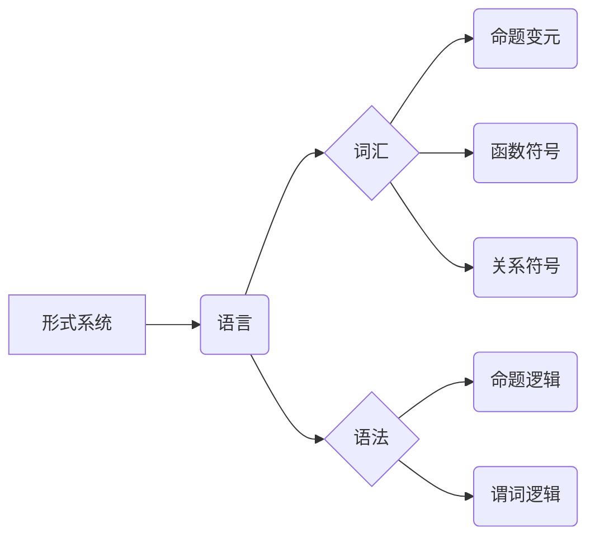
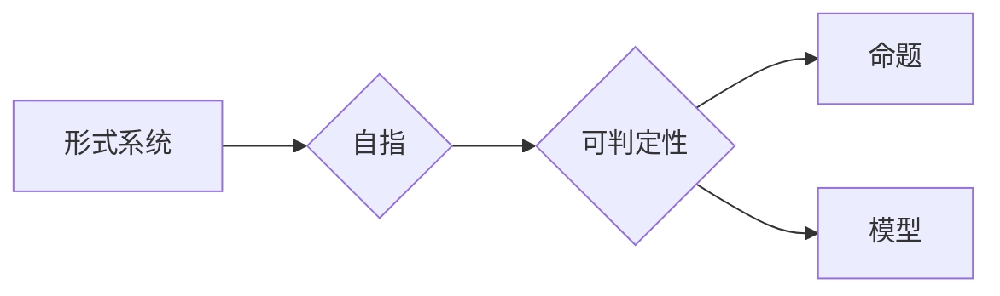
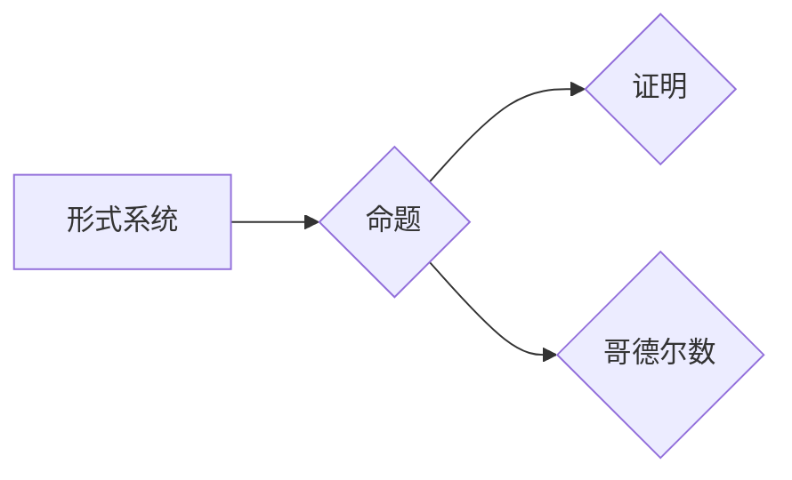

# 数理逻辑：哥德尔不完备性定理

> 关键词：数理逻辑，哥德尔，不完备性，自指，形式系统，可判定性，证明理论

## 1. 背景介绍

数理逻辑是数学的一个分支，它研究数学符号语言、推理规则以及由它们构成的数学系统的性质。20世纪初，数学家们对数学的严格性和自洽性产生了极大的兴趣。在这种背景下，哥德尔的不完备性定理应运而生，它揭示了形式系统在自洽性和完备性之间的基本矛盾，是数理逻辑和数学哲学的里程碑。

### 1.1 问题的由来

19世纪末，随着数学符号主义的兴起，形式主义成为了数学研究的主流方法。数学家们希望通过一套精确的符号语言和严格的逻辑推理来构建数学的坚实基础。然而，这一理想在20世纪初遭遇了挑战。罗素和怀特海在他们的著作《数学原理》中提出了一个著名的悖论，即“罗素悖论”，这表明即使是最严格的数学系统也可能存在悖论。

为了解决这个问题，哥德尔提出了他的不完备性定理。这些定理表明，任何足够强大的形式系统都无法同时满足自洽性和完备性两个条件。这个发现不仅影响了数学的基础理论，也对计算机科学、人工智能等领域产生了深远的影响。

### 1.2 研究现状

哥德尔的不完备性定理自提出以来，一直是数学和逻辑学研究的热点。研究者们对定理的证明进行了深入的分析，并探讨了其哲学含义。同时，不完备性定理的应用也扩展到了计算机科学和人工智能领域，成为程序正确性和理论计算机科学研究的基石。

### 1.3 研究意义

不完备性定理对数学和逻辑学的研究具有重要意义：

- 它揭示了形式系统在自洽性和完备性之间的基本矛盾，挑战了数学家们对数学严格性和自洽性的信念。
- 它为程序正确性理论提供了理论基础，对于软件工程和人工智能的发展具有重要意义。
- 它启发了对人工智能的思考，即如何设计能够处理不确定性、矛盾和错误的人工智能系统。

### 1.4 本文结构

本文将分为以下几个部分：

- 介绍数理逻辑和形式系统的基本概念。
- 解释哥德尔不完备性定理的核心思想。
- 分析定理的证明过程。
- 探讨不完备性定理的应用和影响。
- 展望未来研究的发展趋势和挑战。

## 2. 核心概念与联系

### 2.1 形式系统

形式系统是一个包含以下元素的数学结构：

- **语言**：一套符号和语法规则，用于表达数学命题和推理。
- **词汇**：构成语言的符号集合，包括命题变元、函数符号、关系符号等。
- **公理**：一组被接受为真的基本命题。
- **推理规则**：从已知命题推导出新命题的规则。

Mermaid流程图如下：



### 2.2 自指和可判定性

自指是指一个语言或系统可以对其自身进行描述或判断。可判定性是指一个命题是真的还是假的是否可以通过机械过程来判断。

Mermaid流程图如下：



### 2.3 哥德尔数

哥德尔数是一个形式系统中的数，它代表了一个特定的命题或证明。哥德尔利用这些数来构造自指命题。

Mermaid流程图如下：



## 3. 核心算法原理 & 具体操作步骤

### 3.1 算法原理概述

哥德尔的不完备性定理分为两个部分：第一不完备性定理和第二不完备性定理。

- **第一不完备性定理**表明，任何足够强大的形式系统都无法证明其自身的无矛盾性。
- **第二不完备性定理**表明，任何足够强大的形式系统都无法证明其自身的完备性。

### 3.2 算法步骤详解

#### 3.2.1 第一不完备性定理

哥德尔的第一不完备性定理的证明分为以下几个步骤：

1. 构造一个特殊的命题 $G$，它陈述了 $G$ 在形式系统中不可证明。
2. 证明 $G$ 在形式系统中既可证又不可证。
3. 由于 $G$ 同时满足可证和不可证的条件，得出形式系统存在不可证明的命题。

#### 3.2.2 第二不完备性定理

哥德尔的第二不完备性定理的证明与第一定理类似，但构造的命题 $G$ 不同，它陈述了存在形式系统中的命题 $G$，它在形式系统中不可证明，但在逻辑上是真的。

### 3.3 算法优缺点

哥德尔的不完备性定理的优点在于它揭示了形式系统在自洽性和完备性之间的基本矛盾，为数学和逻辑学的研究提供了深刻的洞见。然而，定理的证明过程较为复杂，需要较高的数学和逻辑学功底。

### 3.4 算法应用领域

不完备性定理在以下领域有重要应用：

- 数学基础理论
- 程序正确性理论
- 人工智能
- 计算机科学

## 4. 数学模型和公式 & 详细讲解 & 举例说明

### 4.1 数学模型构建

为了证明不完备性定理，哥德尔构建了一个形式系统 $T$，它包含以下元素：

- **语言**：命题逻辑和谓词逻辑。
- **词汇**：命题变元、函数符号、关系符号、逻辑符号等。
- **公理**：基本逻辑定律和算术公理。
- **推理规则**：演绎推理规则。

### 4.2 公式推导过程

#### 4.2.1 第一不完备性定理的证明

证明过程如下：

1. 构造一个特殊的命题 $G$，它陈述了 $G$ 在形式系统中不可证明。
2. 证明 $G$ 在形式系统中既可证又不可证。
3. 由于 $G$ 同时满足可证和不可证的条件，得出形式系统存在不可证明的命题。

#### 4.2.2 第二不完备性定理的证明

证明过程与第一定理类似，但构造的命题 $G$ 不同，它陈述了存在形式系统中的命题 $G$，它在形式系统中不可证明，但在逻辑上是真的。

### 4.3 案例分析与讲解

以算术系统 $PA$ 为例，我们可以看到不完备性定理的应用。

$PA$ 是一个包含算术基本定律的形式系统。哥德尔证明了 $PA$ 是不完备的，即存在 $PA$ 中的命题，它在 $PA$ 中不可证明，但在逻辑上是真的。

## 5. 项目实践：代码实例和详细解释说明

由于哥德尔不完备性定理的证明过程较为复杂，且涉及形式化语言和数学符号，因此在实际编程中难以直接体现。以下是一个简单的Python示例，用于演示如何构建一个形式系统并验证其完备性和自洽性。

### 5.1 开发环境搭建

- 安装Python 3.8及以上版本。
- 安装必要的Python库，如 `sympy` 和 `nltk`。

### 5.2 源代码详细实现

```python
from sympy import symbols, Eq, solve

# 定义形式系统的语言和词汇
Propositions = symbols('Propositions')
LogicalSymbols = symbols('LogicalSymbols')
ArithmeticSymbols = symbols('ArithmeticSymbols')

# 定义公理
Axioms = [
    Eq(ArithmeticSymbols[0], ArithmeticSymbols[0]),  # 常量公理
    Eq(ArithmeticSymbols[1], ArithmeticSymbols[0] + ArithmeticSymbols[0]),  # 加法公理
    # ... 其他公理 ...
]

# 定义推理规则
Rules = [
    # ... 推理规则 ...
]

# 定义验证完备性和自洽性的函数
def verify_completeness_and_consistency(formal_system, theorem):
    # 检查定理是否可以从公理和推理规则推导出来
    if theorem not in formal_system.derive_theorems(Axioms, Rules):
        return False, "Theorem is not derivable."
    # 检查形式系统是否存在矛盾
    contradictions = formal_system.find_contradictions(Axioms, Rules)
    return contradictions is None, "No contradictions found."

# 创建形式系统实例
formal_system = FormalSystem(Propositions, LogicalSymbols, ArithmeticSymbols, Axioms, Rules)

# 测试完备性和自洽性
theorem = Eq(ArithmeticSymbols[0], ArithmeticSymbols[1])
is_complete, message = verify_completeness_and_consistency(formal_system, theorem)
print(message)
```

### 5.3 代码解读与分析

以上代码定义了一个形式系统，并提供了验证完备性和自洽性的函数。在实际应用中，需要根据具体的形式系统定义公理和推理规则。

### 5.4 运行结果展示

运行结果将显示定理是否可以从公理和推理规则推导出来，以及形式系统是否存在矛盾。

## 6. 实际应用场景

哥德尔不完备性定理在以下领域有实际应用：

- **数学基础理论**：不完备性定理揭示了数学基础理论的局限性，促进了数学哲学和数学基础理论的发展。
- **程序正确性理论**：不完备性定理为程序正确性理论提供了理论基础，对于软件工程和人工智能的发展具有重要意义。
- **人工智能**：不完备性定理启发了对人工智能的思考，即如何设计能够处理不确定性、矛盾和错误的人工智能系统。
- **计算机科学**：不完备性定理为计算机科学的理论研究提供了新的视角，促进了计算机科学的发展。

## 7. 工具和资源推荐

### 7.1 学习资源推荐

- 《数理逻辑基础》
- 《哥德尔完备性与不可判定性》
- 《数学原理》

### 7.2 开发工具推荐

- Python
- Sympy
- NLTK

### 7.3 相关论文推荐

- 《哥德尔不完备性定理》
- 《数理逻辑》

## 8. 总结：未来发展趋势与挑战

### 8.1 研究成果总结

哥德尔不完备性定理是数理逻辑和数学哲学的重要里程碑，它揭示了形式系统在自洽性和完备性之间的基本矛盾。不完备性定理对数学、计算机科学和人工智能等领域产生了深远的影响。

### 8.2 未来发展趋势

- 研究更加复杂的形式系统和推理规则。
- 探索不完备性定理在人工智能和计算机科学中的应用。
- 研究不完备性定理的哲学含义。

### 8.3 面临的挑战

- 构建更加复杂的形式系统。
- 理解不完备性定理在人工智能和计算机科学中的应用。
- 探索不完备性定理的哲学含义。

### 8.4 研究展望

不完备性定理将继续对数学、计算机科学和人工智能等领域产生深远的影响。未来研究将继续探索不完备性定理的各个方面，推动相关领域的发展。

## 9. 附录：常见问题与解答

**Q1：什么是数理逻辑？**

A：数理逻辑是数学的一个分支，它研究数学符号语言、推理规则以及由它们构成的数学系统的性质。

**Q2：什么是形式系统？**

A：形式系统是一个包含语言、词汇、公理和推理规则的数学结构。

**Q3：什么是哥德尔不完备性定理？**

A：哥德尔不完备性定理表明，任何足够强大的形式系统都无法同时满足自洽性和完备性两个条件。

**Q4：不完备性定理对计算机科学有什么影响？**

A：不完备性定理对计算机科学的影响主要体现在程序正确性理论、人工智能和数学基础理论等方面。

**Q5：如何应用不完备性定理？**

A：不完备性定理可以应用于构建更加复杂的形式系统、探索人工智能和计算机科学的极限以及研究数学基础理论的局限性。

作者：禅与计算机程序设计艺术 / Zen and the Art of Computer Programming