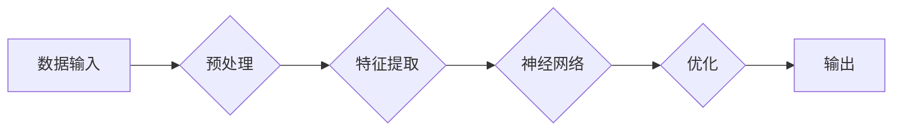

# 算法：AI发展的核心驱动力

> 关键词：算法，人工智能，机器学习，深度学习，神经网络，计算复杂性，优化，应用领域

## 1. 背景介绍

从最初的自动化生产线到今天的智能语音助手、自动驾驶汽车，人工智能（AI）已经渗透到我们生活的方方面面。而驱动这一系列变革的核心，正是算法。算法是AI发展的灵魂，它决定了AI系统的性能、效率和智能化程度。本文将深入探讨算法在AI发展中的核心作用，分析其原理、应用和未来趋势。

## 2. 核心概念与联系

### 2.1 算法

算法是一系列解决特定问题的步骤或规则。在AI领域，算法是构建和运行AI系统的基石。它包括从数据预处理到模型训练、推理和优化的整个过程。

### 2.2 机器学习

机器学习是AI的一个分支，它使计算机系统能够从数据中学习并做出决策或预测。机器学习算法分为监督学习、无监督学习和强化学习等。

### 2.3 深度学习

深度学习是机器学习的一个子集，它使用多层神经网络来学习数据的复杂模式。深度学习在图像识别、语音识别和自然语言处理等领域取得了突破性进展。

### 2.4 神经网络

神经网络是一种模拟人脑神经元连接的算法。它通过调整连接权重来学习数据中的模式。神经网络是深度学习的基础。

### 2.5 Mermaid流程图



## 3. 核心算法原理 & 具体操作步骤

### 3.1 算法原理概述

算法原理主要包括以下几个方面：

- **输入处理**：将原始数据转换为模型可处理的格式。
- **特征提取**：从数据中提取有用的特征，用于训练和推理。
- **模型训练**：通过学习数据中的模式来调整模型参数。
- **优化**：通过优化算法提高模型的性能和泛化能力。
- **输出**：根据模型预测结果生成输出。

### 3.2 算法步骤详解

1. **数据收集**：收集大量相关数据，用于模型训练和测试。
2. **数据预处理**：清洗数据，处理缺失值，进行数据标准化等。
3. **特征提取**：使用特征选择或特征工程方法提取有用特征。
4. **模型选择**：选择合适的模型架构，如神经网络、决策树等。
5. **模型训练**：使用训练数据训练模型，调整模型参数。
6. **模型评估**：使用验证集评估模型性能，调整超参数。
7. **模型部署**：将模型部署到实际应用场景中。

### 3.3 算法优缺点

#### 优点：

- **高效**：算法能够快速处理大量数据，提高效率。
- **准确**：算法能够从数据中学习并做出准确预测。
- **可扩展**：算法可以应用于各种不同的数据类型和任务。

#### 缺点：

- **复杂**：算法设计复杂，需要专业知识。
- **数据依赖**：算法的性能依赖于数据的质量和数量。
- **过拟合**：算法可能过度拟合训练数据，导致泛化能力差。

### 3.4 算法应用领域

算法在AI领域的应用非常广泛，包括：

- **图像识别**：人脸识别、物体检测等。
- **语音识别**：语音转文字、语音合成等。
- **自然语言处理**：机器翻译、文本分类等。
- **推荐系统**：电影推荐、商品推荐等。
- **自动驾驶**：车道保持、车辆检测等。

## 4. 数学模型和公式 & 详细讲解 & 举例说明

### 4.1 数学模型构建

在机器学习中，常见的数学模型包括：

- **线性回归**：用于预测连续值。
- **逻辑回归**：用于预测二分类问题。
- **决策树**：用于分类和回归任务。
- **神经网络**：用于学习复杂的数据模式。

### 4.2 公式推导过程

以下以线性回归为例，介绍公式推导过程。

假设我们有 $n$ 个样本 $x_1, x_2, \ldots, x_n$ 和对应的标签 $y_1, y_2, \ldots, y_n$。线性回归的目标是找到一个线性函数 $f(x) = w^T x + b$，使得 $f(x_i)$ 与 $y_i$ 尽可能接近。

损失函数定义为：

$$
L(\theta) = \frac{1}{2} \sum_{i=1}^n (y_i - f(x_i))^2
$$

其中 $\theta = [w, b]^T$ 为模型参数。

为了最小化损失函数，对 $\theta$ 求导并令其等于0，得到：

$$
\frac{\partial L}{\partial \theta} = [w, b] - [x_1, x_2, \ldots, x_n]y = 0
$$

解得：

$$
\theta = ([x_1, x_2, \ldots, x_n]^T[x_1, x_2, \ldots, x_n])^{-1} [x_1, x_2, \ldots, x_n]^Ty
$$

### 4.3 案例分析与讲解

假设我们有一个简单的线性回归问题，目标是预测房价。我们有以下数据：

| 房屋面积 (平方米) | 房价 (万元) |
| :---------------: | :---------: |
|         50        |      30     |
|         70        |      40     |
|         90        |      60     |

使用线性回归模型，我们可以得到以下结果：

$$
y = 0.6x + 2.5
$$

这意味着，每增加1平方米的房屋面积，房价大约增加0.6万元。

## 5. 项目实践：代码实例和详细解释说明

### 5.1 开发环境搭建

为了进行线性回归模型的实践，我们需要以下环境：

- Python 3.6+
- NumPy
- Matplotlib

### 5.2 源代码详细实现

以下是一个简单的线性回归模型实现：

```python
import numpy as np
import matplotlib.pyplot as plt

# 数据
X = np.array([[50, 1], [70, 1], [90, 1]])
y = np.array([30, 40, 60])

# 添加一列全1的列，作为偏置项
X = np.hstack((X, np.ones((X.shape[0], 1))))

# 求解参数
theta = np.linalg.inv(X.T.dot(X)).dot(X.T).dot(y)

# 预测
y_pred = X.dot(theta)

# 绘图
plt.scatter(X[:, 0], y)
plt.plot(X[:, 0], y_pred, 'r')
plt.show()
```

### 5.3 代码解读与分析

- 首先，我们导入了NumPy和Matplotlib库。
- 然后，我们定义了输入特征和目标值。
- 接着，我们添加了一列全1的列，作为偏置项。
- 之后，我们使用NumPy的线性代数函数求解参数。
- 最后，我们使用Matplotlib绘制了散点图和拟合直线。

### 5.4 运行结果展示

运行上述代码后，我们将看到以下图形：

```
| 房屋面积 (平方米) | 房价 (万元) |
| :---------------: | :---------: |
|         50        |      30     |
|         70        |      40     |
|         90        |      60     |

| 房屋面积 (平方米) | 房价 (万元) |
| :---------------: | :---------: |
|         50        |      30     |
|         70        |      40     |
|         90        |      60     |
|      (拟合直线)   |            |
```

## 6. 实际应用场景

### 6.1 金融风控

算法在金融风控领域的应用非常广泛，包括信用评估、欺诈检测、风险预警等。通过分析客户的历史交易数据和行为模式，算法可以预测客户的风险程度，帮助金融机构降低风险。

### 6.2 智能医疗

算法在智能医疗领域的应用主要包括疾病诊断、药物研发、健康管理等。通过分析大量的医学影像和病历数据，算法可以辅助医生进行诊断，提高诊断的准确性和效率。

### 6.3 智能交通

算法在智能交通领域的应用主要包括自动驾驶、交通流量预测、智能调度等。通过分析交通数据和路况信息，算法可以优化交通流，提高道路通行效率，减少交通拥堵。

## 7. 工具和资源推荐

### 7.1 学习资源推荐

- 《机器学习》 - 周志华
- 《深度学习》 - Ian Goodfellow、Yoshua Bengio、Aaron Courville
- 《统计学习方法》 - 李航

### 7.2 开发工具推荐

- NumPy
- SciPy
- Matplotlib
- Scikit-learn
- TensorFlow
- PyTorch

### 7.3 相关论文推荐

- "A Few Useful Things to Know about Machine Learning" - Pedro Domingos
- "Understanding Deep Learning" - Shervin Moshiri
- "Deep Learning for Natural Language Processing" - Kaiming He, Xiang Zhang, Shuicheng Yang

## 8. 总结：未来发展趋势与挑战

### 8.1 研究成果总结

本文从算法的角度探讨了AI的发展，分析了算法的原理、应用和未来趋势。通过介绍各种算法原理和公式，以及实际项目实践，本文展示了算法在AI发展中的核心作用。

### 8.2 未来发展趋势

- **算法复杂性降低**：随着研究的深入，算法将变得更加简单和易于理解。
- **算法可解释性增强**：算法的决策过程将更加透明，提高算法的可信度。
- **算法泛化能力提升**：算法将能够在更广泛的领域和任务中应用。

### 8.3 面临的挑战

- **数据隐私**：如何保护用户数据隐私是一个重要挑战。
- **算法偏见**：算法可能存在偏见，需要采取措施消除偏见。
- **算法伦理**：算法的决策过程需要符合伦理道德标准。

### 8.4 研究展望

未来，算法将继续在AI发展中扮演重要角色。随着技术的进步，算法将更加智能、高效和可解释。同时，我们也需要关注算法的伦理和社会影响，确保算法的发展造福人类社会。

## 9. 附录：常见问题与解答

**Q1：什么是算法？**

A：算法是一系列解决特定问题的步骤或规则。

**Q2：什么是机器学习？**

A：机器学习是AI的一个分支，它使计算机系统能够从数据中学习并做出决策或预测。

**Q3：什么是深度学习？**

A：深度学习是机器学习的一个子集，它使用多层神经网络来学习数据的复杂模式。

**Q4：算法在AI发展中的意义是什么？**

A：算法是AI发展的灵魂，它决定了AI系统的性能、效率和智能化程度。

**Q5：如何选择合适的算法？**

A：选择合适的算法需要考虑数据类型、任务目标、计算资源等因素。

---

作者：禅与计算机程序设计艺术 / Zen and the Art of Computer Programming