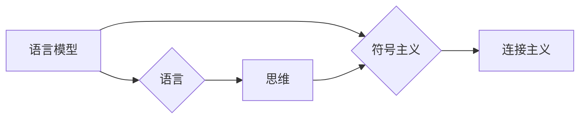
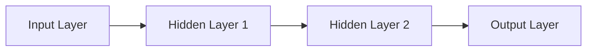

> 关键词：语言模型，认知科学，人工智能，思维，符号主义，连接主义，人工智能伦理

# 语言与思维的区别：大模型的认知困惑

随着深度学习技术的飞速发展，大语言模型（Large Language Models, LLMs）如BERT、GPT等取得了令人瞩目的成果。这些模型在语言理解、文本生成等领域展现出了惊人的能力，但与此同时，我们也开始思考：这些模型是否真的理解了语言和思维？它们与人类思维有何区别？本文将探讨语言与思维的区别，以及大模型在认知困惑中的角色。

## 1. 背景介绍

人类语言是思维的外在表现，而思维则是人类认知活动的核心。长期以来，认知科学家和心理学家一直在探讨语言与思维的关系。传统的符号主义认为，语言是思维的符号系统，人类的思维活动可以通过语言来表达和交流。而连接主义则认为，思维是由大脑神经元之间的连接和活动产生的，语言只是思维的一种表现形式。

随着人工智能技术的发展，大语言模型在语言处理任务上取得了显著成果，但它们的“理解”是否等同于人类的思维理解，成为了学术界和工业界共同关注的问题。

## 2. 核心概念与联系

### 2.1 语言模型

语言模型是一种统计模型，用于预测下一个词或词组，从而生成自然语言文本。大语言模型通过在大规模语料库上进行预训练，学习到了丰富的语言知识和模式，能够生成流畅、连贯的文本。

### 2.2 思维

思维是人类认知活动的核心，包括感知、记忆、判断、推理、决策等能力。思维过程是主观的、动态的，与个体的经验、知识、情感等因素密切相关。

### 2.3 符号主义与连接主义

符号主义认为，语言是思维的符号系统，人类的思维活动可以通过语言来表达和交流。连接主义则认为，思维是由大脑神经元之间的连接和活动产生的，语言只是思维的一种表现形式。

### 2.4 Mermaid 流程图

以下是语言模型、思维、符号主义与连接主义之间的逻辑关系图：



## 3. 核心算法原理 & 具体操作步骤

### 3.1 算法原理概述

大语言模型通常基于深度神经网络，通过预训练和微调两个阶段来学习语言知识和模式。

### 3.2 算法步骤详解

1. 预训练：在大量无标注语料库上，通过自监督任务训练模型，学习语言知识和模式。
2. 微调：在特定任务的标注数据上，调整模型参数，使其适应特定任务。

### 3.3 算法优缺点

**优点**：

* 能够处理大规模数据，学习丰富的语言知识和模式。
* 生成文本流畅、连贯。
* 可应用于各种语言处理任务。

**缺点**：

* 缺乏真正的理解能力，只是模拟人类的语言行为。
* 可能存在偏见和歧视。
* 难以解释其决策过程。

### 3.4 算法应用领域

* 自然语言理解
* 文本生成
* 对话系统
* 情感分析

## 4. 数学模型和公式 & 详细讲解 & 举例说明

### 4.1 数学模型构建

大语言模型通常基于深度神经网络，以下是一个简单的神经网络结构：



### 4.2 公式推导过程

假设输入层有 $n$ 个神经元，隐藏层有 $m$ 个神经元，输出层有 $k$ 个神经元。则神经网络的权重矩阵为 $W$，偏置矩阵为 $b$，激活函数为 $f$。

输入层到隐藏层的输出为：

$$
h_1 = f(W_1 \cdot x + b_1)
$$

隐藏层到输出层的输出为：

$$
y = f(W_2 \cdot h_1 + b_2)
$$

### 4.3 案例分析与讲解

以下是一个简单的文本生成案例：

假设我们有一个语言模型，输入为 "The cat"，输出为 "sat on the mat"。

我们可以通过以下步骤生成文本：

1. 输入 "The cat"，模型预测下一个词为 "sat"。
2. 输入 "The cat sat"，模型预测下一个词为 "on"。
3. 输入 "The cat sat on"，模型预测下一个词为 "the"。
4. 输入 "The cat sat on the"，模型预测下一个词为 "mat"。

最终生成文本 "The cat sat on the mat"。

## 5. 项目实践：代码实例和详细解释说明

### 5.1 开发环境搭建

由于篇幅限制，此处不提供具体的开发环境搭建步骤。一般来说，需要安装Python、TensorFlow或PyTorch等深度学习框架。

### 5.2 源代码详细实现

以下是一个简单的文本生成示例，使用TensorFlow和Keras构建：

```python
import tensorflow as tf
from tensorflow.keras.layers import Input, Embedding, LSTM, Dense
from tensorflow.keras.models import Model

# 定义模型
input_word = Input(shape=(None,), dtype='int32')
embedding = Embedding(input_dim=vocab_size, output_dim=embedding_dim, input_length=max_length)(input_word)
hidden = LSTM(units=256, return_sequences=True)(embedding)
output = Dense(vocab_size, activation='softmax')(hidden)

model = Model(inputs=input_word, outputs=output)

# 编译模型
model.compile(optimizer='adam', loss='categorical_crossentropy', metrics=['accuracy'])

# 训练模型
model.fit(dataset, epochs=10)
```

### 5.3 代码解读与分析

1. 定义输入层、嵌入层、LSTM层和输出层。
2. 编译模型，设置优化器、损失函数和指标。
3. 训练模型。

## 6. 实际应用场景

大语言模型在以下场景中有着广泛的应用：

* **文本生成**：生成文章、诗歌、代码等。
* **机器翻译**：将一种语言翻译成另一种语言。
* **问答系统**：回答用户提出的问题。
* **对话系统**：与用户进行自然语言对话。

## 7. 工具和资源推荐

### 7.1 学习资源推荐

* 《深度学习》（Ian Goodfellow）
* 《神经网络与深度学习》（邱锡鹏）
* 《自然语言处理综论》（周明）

### 7.2 开发工具推荐

* TensorFlow
* PyTorch

### 7.3 相关论文推荐

* "A Neural Probabilistic Language Model"（Bengio et al., 2003）
* "Deep Learning for Natural Language Processing"（Goldberg, 2017）
* "BERT: Pre-training of Deep Bidirectional Transformers for Language Understanding"（Devlin et al., 2019）

## 8. 总结：未来发展趋势与挑战

### 8.1 研究成果总结

大语言模型在语言处理任务上取得了显著成果，但它们仍然缺乏真正的理解能力。

### 8.2 未来发展趋势

* 开发更加智能的语言模型，使其能够真正理解语言和思维。
* 探索人机协同的智能交互模式。
* 将大语言模型应用于更多领域，如医疗、法律、金融等。

### 8.3 面临的挑战

* 如何让大语言模型真正理解语言和思维。
* 如何解决大语言模型存在的偏见和歧视问题。
* 如何提高大语言模型的可解释性。
* 如何在大语言模型中融入伦理和道德约束。

### 8.4 研究展望

语言与思维的区别是一个复杂而深刻的课题。大语言模型为我们提供了新的研究视角和工具，但仍然需要进一步探索和研究。相信随着人工智能技术的不断发展，我们能够更好地理解语言与思维的关系，构建更加智能和人性化的智能系统。

## 9. 附录：常见问题与解答

**Q1：大语言模型是否能够真正理解语言？**

A：目前的大语言模型只是模拟人类的语言行为，缺乏真正的理解能力。它们通过学习语言模式和知识，生成流畅、连贯的文本，但并不能真正理解文本的意义。

**Q2：如何解决大语言模型存在的偏见和歧视问题？**

A：解决大语言模型偏见和歧视问题需要从多个方面入手，包括：
* 收集更加多样化和均衡的数据集。
* 设计更加公平的评估指标。
* 开发能够检测和纠正模型偏见的方法。

**Q3：如何提高大语言模型的可解释性？**

A：提高大语言模型的可解释性需要：
* 研究模型内部的工作机制。
* 开发能够解释模型决策过程的方法。
* 增强模型的可解释性和透明度。

**Q4：如何在大语言模型中融入伦理和道德约束？**

A：在大语言模型中融入伦理和道德约束需要：
* 制定相应的伦理规范和道德准则。
* 设计能够识别和过滤有害内容的算法。
* 加强对大语言模型的监管和审查。

作者：禅与计算机程序设计艺术 / Zen and the Art of Computer Programming