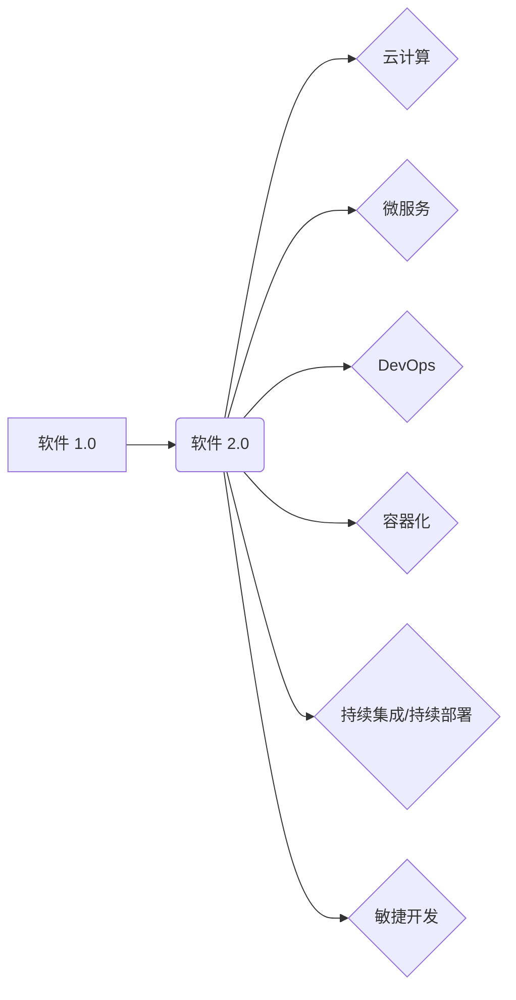

# 软件 2.0 的应用：从实验室走向现实

> 关键词：软件 2.0，云计算，微服务，DevOps，容器化，持续集成/持续部署，敏捷开发

## 1. 背景介绍

随着云计算、大数据、物联网等技术的飞速发展，软件行业正经历着从传统软件 1.0 到软件 2.0 的转型。软件 2.0 强调的是软件的敏捷性、可扩展性和可维护性，它不再仅仅是执行特定功能的程序，而是成为一个更加灵活、可扩展的服务平台。本文将探讨软件 2.0 的核心概念、应用实践以及面临的挑战。

### 1.1 软件发展的历史

1. **软件 1.0 时代**：以单体应用程序为主，功能单一，难以维护和扩展。
2. **软件 2.0 时代**：以云计算、微服务、DevOps 等技术为基础，实现软件的敏捷开发、快速迭代和持续集成/持续部署。
3. **软件 3.0 时代**：以人工智能、机器学习等技术为驱动，实现软件的智能化和自动化。

### 1.2 软件转型的原因

1. **技术进步**：云计算、大数据、物联网等新技术的发展，为软件 2.0 的应用提供了技术支撑。
2. **市场变化**：用户需求的快速变化，要求软件能够快速响应市场变化。
3. **竞争压力**：软件行业的竞争日益激烈，要求软件企业提高开发效率和产品质量。

### 1.3 本文结构

本文将分为以下几个部分：

- 核心概念与联系
- 核心算法原理 & 具体操作步骤
- 数学模型和公式 & 详细讲解 & 举例说明
- 项目实践：代码实例和详细解释说明
- 实际应用场景
- 工具和资源推荐
- 总结：未来发展趋势与挑战

## 2. 核心概念与联系

### 2.1 核心概念

1. **云计算**：提供可按需使用的计算资源，包括网络、存储、数据库、应用程序等。
2. **微服务**：将大型应用程序拆分为多个小型、独立的服务，每个服务负责特定的功能。
3. **DevOps**：将软件开发和运维团队合并，实现快速、高效的软件开发和部署。
4. **容器化**：将应用程序及其依赖环境打包到一个容器中，实现环境的隔离和一致性。
5. **持续集成/持续部署**：将代码提交到版本控制系统后，自动进行测试和部署，实现快速迭代。
6. **敏捷开发**：强调快速迭代、客户参与和响应变化。

### 2.2 Mermaid 流程图



### 2.3 软件架构演变

软件 2.0 的核心是软件架构的演变，从单体应用程序向微服务架构转变。这种转变带来了以下优势：

1. **可扩展性**：通过将应用程序拆分为多个微服务，可以独立扩展每个服务，提高整体系统的可扩展性。
2. **可维护性**：每个微服务都是独立开发的，便于维护和更新。
3. **可复用性**：微服务可以独立部署和升级，提高代码复用率。

## 3. 核心算法原理 & 具体操作步骤

### 3.1 算法原理概述

软件 2.0 的核心算法包括：

1. **服务发现**：通过服务注册中心，实现服务之间的自动发现和调用。
2. **负载均衡**：将请求分配到不同的服务实例，提高系统的吞吐量和可用性。
3. **熔断机制**：在服务出现故障时，自动切断请求，避免级联故障。
4. **限流机制**：限制每个服务的请求量，防止系统过载。
5. **链路跟踪**：追踪请求在系统中的流转过程，方便故障定位和性能分析。

### 3.2 算法步骤详解

1. **服务发现**：服务启动时，注册到服务注册中心，包括服务名、端口号等信息。服务调用时，从注册中心获取服务实例信息，并通过HTTP/REST等协议进行调用。

2. **负载均衡**：使用轮询、随机、最少连接数等方法，将请求分配到不同的服务实例。

3. **熔断机制**：当服务实例连续失败一定次数后，自动将其从服务列表中移除，防止级联故障。

4. **限流机制**：使用令牌桶或漏桶算法，限制每个服务的请求量。

5. **链路跟踪**：使用分布式追踪系统（如Zipkin、Jaeger等），记录请求在系统中的流转过程，包括服务调用、响应时间、异常信息等。

### 3.3 算法优缺点

**优点**：

1. **高可用性**：通过服务发现、负载均衡、熔断机制等技术，提高系统的可用性。
2. **可扩展性**：通过微服务架构，提高系统的可扩展性。
3. **可维护性**：通过微服务架构，提高系统的可维护性。

**缺点**：

1. **复杂性**：微服务架构增加了系统的复杂性，需要更多的管理和维护工作。
2. **开发难度**：微服务架构需要开发者具备更高的技术能力。

### 3.4 算法应用领域

软件 2.0 的核心算法在以下领域得到广泛应用：

1. **金融行业**：如在线交易、支付系统等。
2. **电子商务**：如电商平台、在线商店等。
3. **社交媒体**：如微博、微信等。
4. **云计算平台**：如阿里云、腾讯云等。

## 4. 数学模型和公式 & 详细讲解 & 举例说明

### 4.1 数学模型构建

软件 2.0 的数学模型主要包括：

1. **服务发现模型**：使用一致性哈希算法，实现服务的均匀分布。
2. **负载均衡模型**：使用轮询、随机、最少连接数等方法，实现请求的均匀分配。
3. **熔断模型**：使用指数退避算法，实现熔断的自动恢复。

### 4.2 公式推导过程

以下以一致性哈希算法为例，进行公式推导：

**一致性哈希算法**：

1. 将所有服务实例映射到一个哈希环上。
2. 当请求到来时，根据请求的key值，在哈希环上找到对应的服务实例。

**公式推导**：

1. 将服务实例映射到哈希环上：
   $$
   hash(key) \rightarrow \text{service instance}
   $$
2. 请求到来时，查找对应的服务实例：
   $$
   \text{service instance} = hash(key)
   $$

### 4.3 案例分析与讲解

以下以一个在线支付系统为例，分析软件 2.0 在实际应用中的数学模型：

1. **服务发现模型**：使用一致性哈希算法，将支付服务实例均匀分布在哈希环上。
2. **负载均衡模型**：使用轮询算法，将请求均匀分配到不同的支付服务实例。
3. **熔断模型**：当支付服务实例连续失败一定次数后，将其从服务列表中移除，并使用指数退避算法自动恢复。

## 5. 项目实践：代码实例和详细解释说明

### 5.1 开发环境搭建

1. 安装Java开发环境。
2. 安装Maven或Gradle构建工具。
3. 安装Spring Boot框架。
4. 安装Docker容器化工具。

### 5.2 源代码详细实现

以下是一个简单的微服务示例，使用Spring Cloud框架实现服务发现、负载均衡、熔断机制等功能：

```java
@SpringBootApplication
@EnableDiscoveryClient
public class PaymentServiceApplication {

    public static void main(String[] args) {
        SpringApplication.run(PaymentServiceApplication.class, args);
    }

    @RestController
    public class PaymentController {

        @Autowired
        private RestTemplate restTemplate;

        @GetMapping("/pay")
        public String pay() {
            // 请求其他服务
            String response = restTemplate.getForObject("http://order-service/pay", String.class);
            return response;
        }
    }
}
```

### 5.3 代码解读与分析

以上代码展示了如何使用Spring Cloud框架实现服务发现、负载均衡、熔断机制等功能：

1. `@SpringBootApplication`：标注主程序入口类。
2. `@EnableDiscoveryClient`：启用服务发现功能。
3. `@RestController`：标注RESTful控制器。
4. `@Autowired`：自动注入RestTemplate对象，用于调用其他服务。
5. `@GetMapping("/pay")`：定义支付接口。

### 5.4 运行结果展示

1. 启动服务发现注册中心。
2. 启动支付服务。
3. 启动订单服务。
4. 调用支付接口，查看结果。

## 6. 实际应用场景

软件 2.0 在以下实际应用场景中得到了广泛应用：

1. **金融行业**：如在线支付、贷款、保险等。
2. **电子商务**：如电商平台、在线商店等。
3. **社交媒体**：如微博、微信等。
4. **云计算平台**：如阿里云、腾讯云等。

## 7. 工具和资源推荐

### 7.1 学习资源推荐

1. 《Spring Cloud微服务实战》
2. 《Docker实战》
3. 《DevOps实践》

### 7.2 开发工具推荐

1. Spring Boot
2. Docker
3. Kubernetes

### 7.3 相关论文推荐

1. Microservices: A Lightweight Architecture for Scalable, Modular, and Sustainable Systems
2. Microservices: Four Steps to the Cloud
3. DevOps and Continuous Delivery: The Culture of Collaboration, Automation, and Measurement

## 8. 总结：未来发展趋势与挑战

### 8.1 研究成果总结

软件 2.0 的应用，推动了软件行业向敏捷、高效、可扩展的方向发展。云计算、微服务、DevOps等技术的应用，提高了软件的开发效率和质量。

### 8.2 未来发展趋势

1. **人工智能与软件 2.0**：将人工智能技术应用于软件 2.0，实现智能化的开发、部署和维护。
2. **边缘计算与软件 2.0**：将软件 2.0 应用于边缘计算，实现实时、高效的数据处理。
3. **区块链与软件 2.0**：将区块链技术应用于软件 2.0，实现数据的安全、可靠和可追溯。

### 8.3 面临的挑战

1. **技术复杂性**：软件 2.0 的技术架构更加复杂，需要开发者和运维人员具备更高的技术能力。
2. **安全性**：软件 2.0 的分布式架构增加了系统的安全风险。
3. **运维难度**：软件 2.0 的运维工作更加复杂，需要更高效的运维工具和流程。

### 8.4 研究展望

1. **简化技术架构**：研究更加简单、高效的软件 2.0 架构，降低开发者和运维人员的负担。
2. **提高安全性**：研究更加安全、可靠的软件 2.0 技术，保障数据的安全。
3. **优化运维流程**：研究更加高效的运维工具和流程，提高运维效率。

## 9. 附录：常见问题与解答

**Q1：什么是微服务？**

A：微服务是将大型应用程序拆分为多个小型、独立的服务，每个服务负责特定的功能。微服务架构具有以下特点：

1. 独立部署和升级
2. 代码复用性高
3. 轻量级、可扩展性强
4. 灵活、可定制性强

**Q2：什么是DevOps？**

A：DevOps是一种软件开发和运维模式，强调开发团队和运维团队的紧密合作，实现快速、高效的软件开发和部署。

**Q3：什么是容器化？**

A：容器化是将应用程序及其依赖环境打包到一个容器中，实现环境的隔离和一致性。常见的容器化技术包括Docker和Kubernetes。

**Q4：什么是持续集成/持续部署？**

A：持续集成/持续部署（CI/CD）是一种软件开发流程，将代码提交到版本控制系统后，自动进行测试和部署，实现快速迭代。

**Q5：软件 2.0 的应用有哪些优势？**

A：软件 2.0 的应用具有以下优势：

1. 灵活、可扩展性强
2. 开发效率高
3. 质量可靠
4. 可维护性强

**Q6：软件 2.0 的应用有哪些挑战？**

A：软件 2.0 的应用具有以下挑战：

1. 技术复杂性高
2. 安全性风险增加
3. 运维难度大

作者：禅与计算机程序设计艺术 / Zen and the Art of Computer Programming