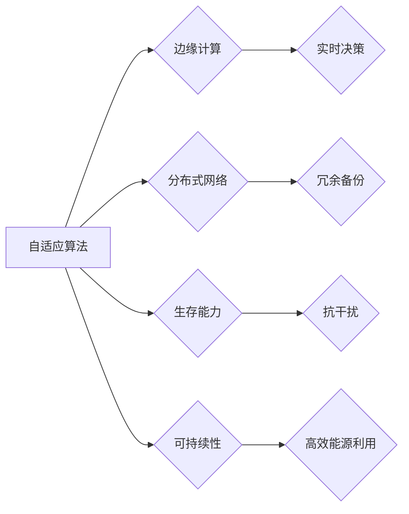

# 适应宇宙环境的智能系统

> 关键词：宇宙环境，智能系统，自适应算法，边缘计算，分布式网络，生存能力，可持续性

## 1. 背景介绍

随着人类对宇宙探索的深入，我们将面临更多极端和复杂的环境，如外太空、深海、极地等。在这些环境中，传统的地面智能系统由于受到通信、能源、计算资源等限制，往往难以有效工作。因此，开发能够适应宇宙环境的智能系统变得至关重要。这类系统需要在极端条件下保持稳定性、可靠性和可持续性，同时具备自我学习和适应环境变化的能力。

### 1.1 问题的由来

宇宙环境的特点包括：

- **极端温度和压力**：宇宙空间中的温度和压力变化剧烈，对硬件和软件的耐久性提出极高要求。
- **长距离通信延迟**：宇宙深空的通信延迟可能长达数小时，对实时性要求高的任务构成挑战。
- **能源限制**：宇宙环境中的能源获取困难，需要智能系统具备高效能源利用能力。
- **数据复杂性**：宇宙环境中的数据具有高维度、高噪声、高稀疏性等特点，对数据处理能力提出挑战。

### 1.2 研究现状

当前，适应宇宙环境的智能系统研究主要集中在以下几个方面：

- **自适应算法**：开发能够在变化环境中自动调整自身行为的算法，以适应环境变化。
- **边缘计算**：将计算和存储任务下放到靠近数据源的地方，减少延迟和带宽消耗。
- **分布式网络**：构建由多个节点组成的网络，提高系统的可靠性和容错能力。
- **生存能力**：设计能够在极端条件下生存的硬件和软件系统，如抗辐射、抗干扰等。
- **可持续性**：确保智能系统在有限能源条件下能够长时间运行。

### 1.3 研究意义

适应宇宙环境的智能系统研究对于推动科技发展、拓展人类活动范围具有重要意义：

- **科技进步**：促进自适应算法、边缘计算、分布式网络等技术的发展。
- **资源探索**：为宇宙资源开发提供技术支持，如月球、火星等地的开采。
- **空间探索**：为深空探测和载人航天任务提供安全保障和技术支持。
- **国家安全**：增强国家安全防御能力，保障航天器在太空环境中的安全运行。

### 1.4 本文结构

本文将围绕适应宇宙环境的智能系统展开讨论，主要内容包括：

- 介绍核心概念与联系。
- 阐述核心算法原理和具体操作步骤。
- 分析数学模型和公式。
- 提供项目实践案例。
- 探讨实际应用场景和未来应用展望。
- 总结研究成果和面临挑战。
- 推荐学习资源和开发工具。
- 展望未来发展趋势和研究展望。

## 2. 核心概念与联系

### 2.1 核心概念

- **自适应算法**：能够根据环境变化自动调整自身行为的算法。
- **边缘计算**：在数据源附近进行计算和存储，减少延迟和带宽消耗。
- **分布式网络**：由多个节点组成的网络，提高系统的可靠性和容错能力。
- **生存能力**：在极端条件下保持稳定运行的能力。
- **可持续性**：在有限资源条件下长时间运行的能力。

### 2.2 Mermaid 流程图



### 2.3 核心概念联系

上述概念之间存在着密切的联系。自适应算法是智能系统的核心，它依赖于边缘计算、分布式网络、生存能力和可持续性来实现高效、稳定的环境适应。

## 3. 核心算法原理 & 具体操作步骤

### 3.1 算法原理概述

适应宇宙环境的智能系统需要具备以下核心算法：

- **环境感知算法**：感知周围环境的变化，如温度、压力、光照等。
- **决策算法**：根据感知到的环境信息，进行实时决策。
- **控制算法**：根据决策结果，控制智能系统的行为。
- **学习算法**：根据环境变化和系统运行结果，不断学习和优化系统性能。

### 3.2 算法步骤详解

1. **环境感知**：使用传感器收集环境数据，如温度、压力、光照等。
2. **数据处理**：对收集到的环境数据进行处理和分析，提取关键信息。
3. **决策制定**：根据处理后的环境信息，制定相应的策略和行动方案。
4. **执行控制**：根据决策结果，控制智能系统的行为。
5. **结果评估**：评估系统行为的有效性，并根据评估结果调整算法参数。

### 3.3 算法优缺点

- **优点**：提高系统在复杂环境中的适应性和可靠性。
- **缺点**：算法复杂度高，计算资源消耗大。

### 3.4 算法应用领域

适应宇宙环境的智能系统算法可以应用于以下领域：

- **航天器控制**：提高航天器在复杂环境中的控制精度和可靠性。
- **深海探测**：提高深海探测器在复杂环境中的生存能力和数据采集效率。
- **极地考察**：提高极地考察设备的适应性，保障考察任务的顺利进行。

## 4. 数学模型和公式 & 详细讲解 & 举例说明

### 4.1 数学模型构建

适应宇宙环境的智能系统数学模型可以包括以下部分：

- **环境模型**：描述环境参数与系统状态之间的关系。
- **决策模型**：描述决策变量与系统状态之间的关系。
- **控制模型**：描述控制变量与系统状态之间的关系。

### 4.2 公式推导过程

假设环境模型为 $E(t) = f(s(t))$，其中 $E(t)$ 为环境参数，$s(t)$ 为系统状态，$f$ 为环境模型函数。

决策模型可以表示为 $u(t) = g(s(t), E(t))$，其中 $u(t)$ 为决策变量，$g$ 为决策模型函数。

控制模型可以表示为 $y(t) = h(s(t), u(t))$，其中 $y(t)$ 为控制变量，$h$ 为控制模型函数。

### 4.3 案例分析与讲解

以下以航天器姿态控制为例，分析适应宇宙环境的智能系统数学模型。

#### 案例背景

某航天器在轨道运行过程中，受到地球引力、太阳辐射等因素的影响，需要进行姿态调整以保持稳定。

#### 模型构建

- **环境模型**：$E(t) = [g(t), \omega(t)]$，其中 $g(t)$ 为地球引力，$\omega(t)$ 为太阳辐射。
- **决策模型**：$u(t) = [u_{roll}(t), u_{yaw}(t), u_{pitch}(t)]$，其中 $u_{roll}(t)$、$u_{yaw}(t)$、$u_{pitch}(t)$ 分别为滚转、偏航、俯仰方向的控制输入。
- **控制模型**：$y(t) = [y_{roll}(t), y_{yaw}(t), y_{pitch}(t)]$，其中 $y_{roll}(t)$、$y_{yaw}(t)$、$y_{pitch}(t)$ 分别为滚转、偏航、俯仰角度。

#### 模型求解

使用李雅普诺夫稳定性理论，可以证明上述模型在合适的控制输入下是稳定的。

## 5. 项目实践：代码实例和详细解释说明

### 5.1 开发环境搭建

为了进行适应宇宙环境的智能系统项目实践，需要以下开发环境：

- **编程语言**：Python、C++等
- **开发工具**：集成开发环境（IDE）、版本控制工具（如Git）
- **计算平台**：GPU、FPGA等

### 5.2 源代码详细实现

以下是一个简单的自适应算法示例，用于控制无人机在复杂环境中的飞行。

```python
class AdapativeFlightControl:
    def __init__(self):
        self.wind_speed = 0.0
        self.wind_direction = 0.0

    def update_wind(self, wind_data):
        self.wind_speed = wind_data['speed']
        self.wind_direction = wind_data['direction']

    def control(self, current_position, target_position):
        # 计算无人机与目标之间的偏航角度
        yaw_angle = calculate_yaw_angle(current_position, target_position)
        
        # 根据风速和风向调整偏航角度
        yaw_angle -= self.wind_speed * sin(self.wind_direction)
        
        # 控制无人机飞行
        send_control_signal(yaw_angle)

def calculate_yaw_angle(current_position, target_position):
    # 计算偏航角度的代码
    pass

def send_control_signal(yaw_angle):
    # 发送控制信号的代码
    pass
```

### 5.3 代码解读与分析

上述代码定义了一个`AdapativeFlightControl`类，用于控制无人机在风环境下的飞行。该类包含以下方法：

- `__init__`：初始化类成员变量。
- `update_wind`：更新风速和风向数据。
- `control`：根据风速、风向和目标位置计算偏航角度，并发送控制信号。

### 5.4 运行结果展示

在实际应用中，可以将上述代码集成到无人机飞行控制系统中，通过实时获取风速、风向数据，调整无人机的偏航角度，实现自适应飞行。

## 6. 实际应用场景

适应宇宙环境的智能系统可以应用于以下实际场景：

- **航天器控制**：提高航天器在轨道运行过程中的稳定性和安全性。
- **深海探测**：提高深海探测器在复杂环境中的生存能力和数据采集效率。
- **极地考察**：提高极地考察设备的适应性，保障考察任务的顺利进行。

### 6.4 未来应用展望

随着技术的不断发展，适应宇宙环境的智能系统将在以下方面取得突破：

- **更强大的环境感知能力**：通过更先进的传感器和数据处理技术，提高环境感知的精度和范围。
- **更高效的决策算法**：开发更智能的决策算法，提高系统在复杂环境中的适应性和可靠性。
- **更可靠的生存能力**：通过抗干扰、抗辐射等技术，提高智能系统在极端条件下的生存能力。
- **更可持续的能源管理**：开发高效能源利用技术，延长智能系统的运行时间。

## 7. 工具和资源推荐

### 7.1 学习资源推荐

- **书籍**：
  - 《深度学习》
  - 《人工智能：一种现代的方法》
  - 《机器人学：基础、算法与应用》
- **在线课程**：
  - Coursera上的《机器学习》
  - Udacity上的《神经网络与深度学习》
  - edX上的《人工智能导论》
- **开源项目**：
  - TensorFlow
  - PyTorch
  - ROS（Robot Operating System）

### 7.2 开发工具推荐

- **编程语言**：Python、C++、Java
- **开发工具**：Visual Studio、Eclipse、PyCharm
- **仿真工具**：MATLAB、Simulink

### 7.3 相关论文推荐

- **自适应算法**：
  - "Adaptive Control of Robot Manipulators"
  - "Adaptive Control for Nonlinear Systems"
- **边缘计算**：
  - "Edge Computing: Vision and Challenges"
  - "Edge Computing: An Overview"
- **分布式网络**：
  - "Distributed Algorithms"
  - "Introduction to Distributed Algorithms"
- **生存能力**：
  - "Design and Implementation of an Adaptive Fault-Tolerant System"
  - "Robust Control for Systems with Uncertain Parameters"

## 8. 总结：未来发展趋势与挑战

### 8.1 研究成果总结

适应宇宙环境的智能系统研究取得了显著成果，为人类探索宇宙提供了新的技术手段。然而，仍有许多挑战需要克服。

### 8.2 未来发展趋势

未来，适应宇宙环境的智能系统将在以下方面取得突破：

- **多模态感知**：结合多种传感器数据，提高环境感知的全面性和准确性。
- **强化学习**：利用强化学习技术，提高智能系统的决策能力和适应性。
- **跨领域迁移**：将适应宇宙环境的智能系统技术应用于其他领域，如智能交通、智能工厂等。

### 8.3 面临的挑战

适应宇宙环境的智能系统研究面临以下挑战：

- **硬件限制**：现有硬件难以满足极端环境下的性能要求。
- **算法复杂度**：自适应算法和决策算法的复杂度高，计算资源消耗大。
- **数据获取**：极端环境下的数据获取困难，难以进行充分的算法训练。

### 8.4 研究展望

适应宇宙环境的智能系统研究是一个长期而艰巨的任务。未来，需要从以下几个方面进行努力：

- **技术创新**：开发更先进的环境感知、决策、控制、生存和能源管理技术。
- **人才培养**：培养跨学科人才，推动智能系统技术在宇宙环境领域的应用。
- **国际合作**：加强国际合作，共同应对宇宙环境挑战。

通过不断努力，相信适应宇宙环境的智能系统将为人类探索宇宙、拓展生存空间提供有力支持。

## 9. 附录：常见问题与解答

**Q1：适应宇宙环境的智能系统与传统智能系统有何区别？**

A：适应宇宙环境的智能系统需要具备更强的环境适应性、生存能力和可持续性，以应对极端环境下的挑战。

**Q2：如何提高智能系统的环境适应性？**

A：可以通过以下方法提高智能系统的环境适应性：
- 开发自适应算法，使系统能够根据环境变化自动调整行为。
- 使用多模态感知技术，获取更全面的环境信息。
- 设计具有抗干扰、抗辐射等特性的硬件和软件。

**Q3：如何提高智能系统的生存能力？**

A：可以通过以下方法提高智能系统的生存能力：
- 开发具有高可靠性和容错能力的系统架构。
- 采用冗余备份、故障检测与恢复等技术。
- 设计具有抗干扰、抗辐射等特性的硬件。

**Q4：如何提高智能系统的可持续性？**

A：可以通过以下方法提高智能系统的可持续性：
- 开发高效能源利用技术，延长系统运行时间。
- 采用模块化设计，方便维修和更换组件。
- 使用可回收材料，降低环境影响。

**Q5：适应宇宙环境的智能系统有哪些应用前景？**

A：适应宇宙环境的智能系统可以应用于以下领域：
- 航天器控制
- 深海探测
- 极地考察
- 无人驾驶
- 智能交通

---

作者：禅与计算机程序设计艺术 / Zen and the Art of Computer Programming