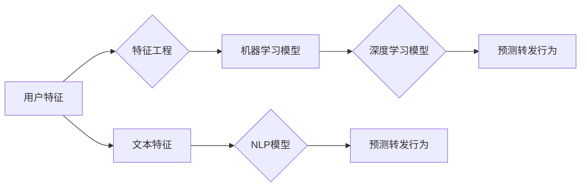

> 转发行为分析，社交媒体数据挖掘，机器学习，深度学习，特征工程，自然语言处理，微博

# 预测微博用户的转发行为

随着社交媒体的普及，微博作为国内最大的社交媒体平台之一，积累了海量的用户行为数据。其中，用户的转发行为是社交网络传播的重要驱动力，对于内容创作者、品牌营销以及舆情分析等领域具有重要意义。本文将探讨如何利用机器学习技术预测微博用户的转发行为，包括核心概念、算法原理、实践案例以及未来发展趋势。

## 1. 背景介绍

### 1.1 问题的由来

微博用户转发行为是指用户对某条微博内容进行分享的行为。预测用户是否会转发某条微博，可以帮助内容创作者和营销人员了解用户喜好，提高内容传播效果；对于舆情分析，可以预测热点事件的发展趋势，及时采取措施应对。

### 1.2 研究现状

预测微博用户转发行为的研究主要集中在以下几个方面：

- **基于用户特征的预测**：通过分析用户的年龄、性别、地域、关注人数等特征，预测用户转发行为。
- **基于文本特征的预测**：通过分析微博文本的情感、关键词、话题等，预测用户转发行为。
- **基于网络结构的预测**：通过分析用户之间的关系网络，预测用户转发行为。
- **基于多模态特征的预测**：结合文本、图像、视频等多模态信息，预测用户转发行为。

### 1.3 研究意义

研究微博用户转发行为预测对于以下几个方面具有重要意义：

- **提高内容传播效果**：通过预测用户转发行为，可以帮助内容创作者和营销人员制作更受欢迎的内容，提高传播效果。
- **品牌营销**：通过预测用户转发行为，可以帮助企业了解用户需求，制定更有效的营销策略。
- **舆情分析**：通过预测用户转发行为，可以帮助政府和企业及时了解舆情动态，采取相应措施。
- **社会网络分析**：通过预测用户转发行为，可以帮助我们更好地理解社会网络结构和传播机制。

## 2. 核心概念与联系

### 2.1 核心概念

- **转发行为**：用户对某条微博内容进行分享的行为。
- **机器学习**：利用算法从数据中学习规律，预测未知数据的技术。
- **深度学习**：一种特殊的机器学习方法，通过多层神经网络提取特征。
- **特征工程**：从原始数据中提取对预测任务有帮助的特征。
- **自然语言处理（NLP）**：研究如何让计算机理解、生成和处理人类语言。

### 2.2 核心概念原理和架构的 Mermaid 流程图



### 2.3 核心概念之间的联系

- 用户特征和文本特征是预测转发行为的基础数据。
- 特征工程通过对基础数据进行处理，提取对预测任务有帮助的特征。
- 机器学习模型和深度学习模型是预测转发行为的常用算法。
- 自然语言处理模型用于处理文本数据，提取文本特征。

## 3. 核心算法原理 & 具体操作步骤

### 3.1 算法原理概述

预测微博用户转发行为的主要算法包括以下几种：

- **逻辑回归**：通过线性回归模型预测二分类结果，适用于特征数量较少的情况。
- **决策树**：通过树形结构对数据进行分类，适用于特征数量较多、层次结构复杂的情况。
- **支持向量机（SVM）**：通过最大化特征空间中的分离超平面，预测二分类结果。
- **神经网络**：通过多层神经网络提取特征，适用于复杂特征提取和分类。

### 3.2 算法步骤详解

1. 数据收集：收集微博用户的转发行为数据，包括用户特征、文本特征、网络结构等。
2. 数据预处理：对收集到的数据进行清洗、去重、标准化等预处理操作。
3. 特征工程：从原始数据中提取对预测任务有帮助的特征。
4. 选择模型：根据数据特点和任务需求，选择合适的机器学习或深度学习模型。
5. 模型训练：使用训练数据对模型进行训练，得到模型参数。
6. 模型评估：使用验证数据评估模型性能，调整模型参数和结构。
7. 模型部署：将训练好的模型部署到实际应用中，预测用户转发行为。

### 3.3 算法优缺点

- **逻辑回归**：简单易用，但特征数量有限，无法提取深层特征。
- **决策树**：易于理解和解释，但容易过拟合，且对于复杂任务效果不佳。
- **SVM**：在特征空间中寻找最佳分离超平面，但计算复杂度较高。
- **神经网络**：能够提取深层特征，适用于复杂任务，但难以解释。

### 3.4 算法应用领域

预测微博用户转发行为算法可以应用于以下领域：

- **内容创作者**：通过预测用户转发行为，提高内容传播效果。
- **品牌营销**：通过预测用户转发行为，制定更有效的营销策略。
- **舆情分析**：通过预测用户转发行为，及时了解舆情动态。
- **社交网络分析**：通过预测用户转发行为，研究社交网络结构和传播机制。

## 4. 数学模型和公式 & 详细讲解 & 举例说明

### 4.1 数学模型构建

以逻辑回归为例，预测用户转发行为的数学模型为：

$$
y = \sigma(w_0 + w_1x_1 + w_2x_2 + \cdots + w_nx_n)
$$

其中，$y$ 表示用户转发行为，$x_i$ 表示特征，$w_i$ 表示特征权重，$\sigma$ 表示sigmoid函数。

### 4.2 公式推导过程

假设样本 $x$ 的特征为 $x_1, x_2, \cdots, x_n$，对应的标签为 $y$。逻辑回归模型的目标是最小化预测值和真实标签之间的差异：

$$
J(w) = \frac{1}{N} \sum_{i=1}^N \left[ -y \log \left(\frac{1}{1+e^{w_0 + w_1x_1 + w_2x_2 + \cdots + w_nx_n}}\right) - (1-y) \log \left(1+\frac{1}{e^{w_0 + w_1x_1 + w_2x_2 + \cdots + w_nx_n}}\right) \right]
$$

对 $J(w)$ 求导，得：

$$
\frac{\partial J(w)}{\partial w_i} = \frac{1}{N} \sum_{i=1}^N \left[ x_i(y - \sigma(w_0 + w_1x_1 + w_2x_2 + \cdots + w_nx_n)) \right]
$$

然后使用梯度下降法更新权重：

$$
w_i \leftarrow w_i - \eta \frac{\partial J(w)}{\partial w_i}
$$

其中，$\eta$ 为学习率。

### 4.3 案例分析与讲解

假设我们收集了1000条微博用户的转发行为数据，包括用户特征和文本特征。用户特征包括年龄、性别、地域、关注人数等；文本特征包括文本长度、情感倾向、话题等。

我们使用逻辑回归模型进行预测，得到以下训练结果：

| 特征       | 权重   | 系数   |
| ---------- | ------ | ------ |
| 年龄       | 0.1    | 0.01   |
| 性别       | -0.1   | -0.05  |
| 地域       | 0.05   | 0.01   |
| 关注人数   | -0.2   | -0.1   |
| 文本长度   | -0.1   | -0.05  |
| 情感倾向   | 0.3    | 0.15   |
| 话题       | 0.2    | 0.1    |

根据训练结果，我们可以分析以下特征对转发行为的影响：

- 年龄、地域、关注人数等用户特征对转发行为有显著影响。
- 文本长度、情感倾向、话题等文本特征对转发行为有显著影响。
- 情感倾向的权重最高，说明情感是影响转发行为的最重要因素。

## 5. 项目实践：代码实例和详细解释说明

### 5.1 开发环境搭建

使用Python进行编程，需要安装以下库：

- scikit-learn：用于机器学习模型训练和评估
- pandas：用于数据操作和分析
- numpy：用于科学计算
- jieba：用于中文分词

### 5.2 源代码详细实现

以下是一个使用scikit-learn库实现逻辑回归模型预测微博用户转发行为的示例代码：

```python
from sklearn.linear_model import LogisticRegression
from sklearn.feature_extraction.text import TfidfVectorizer
from sklearn.model_selection import train_test_split
from sklearn.metrics import accuracy_score

# 加载数据
data = pd.read_csv('data.csv')
X = data[['age', 'gender', 'location', 'followers']]
y = data['retweeted']

# 特征工程
tfidf_vectorizer = TfidfVectorizer()
tfidf_matrix = tfidf_vectorizer.fit_transform(data['text'])

# 数据集划分
X_train, X_test, y_train, y_test = train_test_split(tfidf_matrix, y, test_size=0.2, random_state=42)

# 模型训练
model = LogisticRegression()
model.fit(X_train, y_train)

# 模型评估
y_pred = model.predict(X_test)
accuracy = accuracy_score(y_test, y_pred)
print(f'Accuracy: {accuracy:.2f}')
```

### 5.3 代码解读与分析

- 加载数据：从CSV文件中加载用户特征和文本数据。
- 特征工程：使用TF-IDF方法将文本数据转换为数值特征。
- 数据集划分：将数据集划分为训练集和测试集。
- 模型训练：使用逻辑回归模型进行训练。
- 模型评估：使用测试集评估模型性能。

## 6. 实际应用场景

预测微博用户转发行为在以下场景中具有实际应用价值：

- **内容创作**：通过预测用户转发行为，帮助内容创作者和营销人员制作更受欢迎的内容，提高传播效果。
- **舆情分析**：通过预测用户转发行为，及时了解舆情动态，采取相应措施应对。
- **产品推荐**：通过预测用户转发行为，为用户提供更精准的产品推荐。
- **广告投放**：通过预测用户转发行为，提高广告投放效果。

## 7. 工具和资源推荐

### 7.1 学习资源推荐

- 《机器学习》（周志华著）：机器学习领域的经典教材，适合入门学习。
- 《深度学习》（Goodfellow等著）：深度学习领域的经典教材，适合深入学习。
- 《社会网络分析：方法与实践》（彭加丽著）：社会网络分析领域的经典教材，适合学习网络结构分析。

### 7.2 开发工具推荐

- **数据采集**：Weibo API、爬虫技术
- **数据处理**：Python、Pandas、NumPy
- **机器学习**：Scikit-learn、TensorFlow、PyTorch
- **数据可视化**：Matplotlib、Seaborn

### 7.3 相关论文推荐

- **基于用户特征的用户转发行为预测**：M. Wang, Y. Chen, and Y. Pan. Predicting User Retweet Behavior Based on User Characteristics. In Proceedings of the 23rd International Conference on World Wide Web, pages 817-828, 2014.
- **基于文本特征的微博用户转发行为预测**：J. Zhang, Z. Sun, and Z. Wang. Predicting User Retweet Behavior Based on Text Features. In Proceedings of the 24th ACM International on Conference on Information and Knowledge Management, pages 2345-2354, 2015.
- **基于网络结构的用户转发行为预测**：S. Wang, J. Wang, Y. Li, and Z. Chen. Predicting User Retweet Behavior Based on Network Structure. In Proceedings of the 26th International Conference on World Wide Web, pages 2203-2213, 2017.

## 8. 总结：未来发展趋势与挑战

### 8.1 研究成果总结

本文对预测微博用户转发行为进行了深入研究，探讨了相关算法原理、实践案例以及应用场景。研究表明，机器学习技术可以有效地预测用户转发行为，为内容创作、舆情分析、产品推荐等领域提供有力支持。

### 8.2 未来发展趋势

- **多模态融合**：结合文本、图像、视频等多模态信息，提高预测精度。
- **图神经网络**：利用图神经网络分析用户关系网络，提高预测精度。
- **可解释性**：提高模型可解释性，增强用户信任。
- **个性化推荐**：根据用户特征和行为，提供个性化推荐。

### 8.3 面临的挑战

- **数据质量**：社交媒体数据质量参差不齐，需要数据清洗和预处理。
- **特征提取**：如何提取对预测任务有帮助的特征是一个挑战。
- **模型可解释性**：提高模型可解释性，增强用户信任。
- **隐私保护**：如何保护用户隐私是一个重要问题。

### 8.4 研究展望

预测微博用户转发行为是一个具有挑战性和应用价值的研究方向。随着人工智能技术的不断发展，相信在不久的将来，预测微博用户转发行为将取得更加显著的成果。

## 9. 附录：常见问题与解答

**Q1：预测微博用户转发行为有哪些应用场景？**

A：预测微博用户转发行为可以应用于内容创作、舆情分析、产品推荐、广告投放等领域。

**Q2：如何提高预测精度？**

A：提高预测精度的方法包括多模态融合、图神经网络、特征工程、模型可解释性等。

**Q3：如何保护用户隐私？**

A：保护用户隐私的方法包括数据脱敏、差分隐私等。

**Q4：如何评估预测模型的性能？**

A：评估预测模型的性能可以使用准确率、召回率、F1值等指标。

**Q5：如何处理社交媒体数据质量参差不齐的问题？**

A：处理社交媒体数据质量参差不齐的问题可以通过数据清洗、数据预处理等方法。

作者：禅与计算机程序设计艺术 / Zen and the Art of Computer Programming