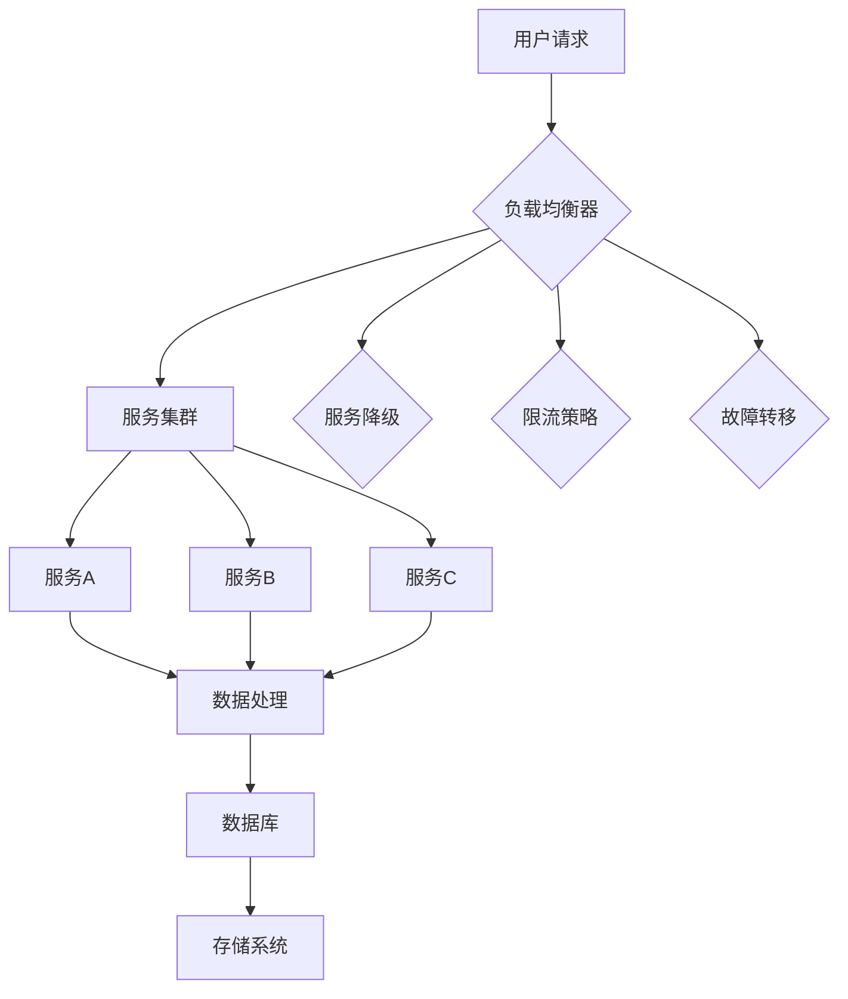

# 高扩展性系统设计的实例分析

> 关键词：高扩展性系统，分布式架构，负载均衡，微服务，容错，性能优化，案例研究

## 1. 背景介绍

随着互联网和大数据技术的快速发展，现代应用对系统的扩展性提出了更高的要求。高扩展性系统设计能够确保在用户数量、数据处理量等需求增长时，系统能够无缝地增加资源，保持性能和可用性。本文将通过对几个高扩展性系统设计的实例分析，探讨其设计原理、技术实现和未来趋势。

### 1.1 问题的由来

随着在线服务的用户量增长，单机系统的性能瓶颈逐渐显现。如何设计一个能够横向扩展、纵向扩展，并且具有良好容错能力的系统，成为了系统架构师面临的重要挑战。

### 1.2 研究现状

当前，高扩展性系统设计已经形成了多种成熟的架构模式，包括：

- **分布式架构**：通过将系统拆分为多个独立的服务，每个服务可以在不同的服务器上运行，实现水平扩展。
- **微服务架构**：将系统分解为一系列小的、松耦合的服务，每个服务负责特定的功能，独立部署和扩展。
- **负载均衡**：通过将请求分发到多个服务器，提高系统的处理能力和可用性。
- **容错机制**：确保系统在部分组件失效时仍能正常运行。

### 1.3 研究意义

研究高扩展性系统设计，对于构建能够适应业务快速发展的现代化应用具有重要意义：

- **提升性能**：通过水平扩展，系统能够处理更多的并发请求。
- **增强可用性**：通过容错机制，系统能够在故障发生时保持服务可用。
- **降低成本**：通过弹性伸缩，系统能够根据需求自动调整资源，优化成本。
- **促进创新**：高扩展性系统设计为新技术和新功能的快速迭代提供了基础。

## 2. 核心概念与联系

### 2.1 核心概念原理和架构的 Mermaid 流程图



### 2.2 核心概念解释

- **负载均衡器**：分发请求到不同的服务器，避免单点过载。
- **服务集群**：一组相同的服务实例，共同处理请求。
- **服务A、B、C**：代表不同的服务，每个服务负责特定的功能。
- **数据处理**：服务对请求进行处理。
- **数据库**：存储数据，支持数据的持久化。
- **存储系统**：存储文件和其他非结构化数据。
- **服务降级**：在系统压力过大时，降低服务的响应能力和功能。
- **限流策略**：限制请求的频率，防止系统过载。
- **故障转移**：在服务实例故障时，将请求转移到其他正常实例。

## 3. 核心算法原理 & 具体操作步骤

### 3.1 算法原理概述

高扩展性系统设计涉及多个层面的算法和策略，包括：

- **负载均衡算法**：如轮询、最小连接数、最少响应时间等。
- **分布式一致性算法**：如Raft、Paxos等，确保分布式系统中数据的一致性。
- **缓存算法**：如LRU、LRUCache等，提高数据访问速度。
- **分布式数据库算法**：如Sharding、Replication等，实现数据的横向扩展。

### 3.2 算法步骤详解

#### 3.2.1 负载均衡

1. 监控服务器负载，包括CPU、内存、磁盘I/O等。
2. 根据负载情况，动态调整请求分发策略。
3. 实现负载均衡算法，如轮询或最小连接数。

#### 3.2.2 分布式一致性

1. 设计数据一致性的算法，如Raft或Paxos。
2. 实现分布式锁，确保对共享资源的并发访问。
3. 监控系统状态，确保数据一致性。

#### 3.2.3 缓存

1. 根据访问频率和最近最少使用（LRU）算法缓存热点数据。
2. 实现缓存失效策略，如定时过期或内存不足时删除。
3. 保持缓存与数据库数据的一致性。

#### 3.2.4 分布式数据库

1. 设计数据库分片（Sharding）策略，将数据分散到多个数据库实例。
2. 实现数据库复制（Replication）策略，提高数据可用性。
3. 处理跨分片的数据查询和事务。

### 3.3 算法优缺点

#### 3.3.1 负载均衡

**优点**：提高系统处理能力，避免单点过载。

**缺点**：实现复杂，需要考虑不同负载均衡算法的适用场景。

#### 3.3.2 分布式一致性

**优点**：确保数据一致性，提高系统可靠性。

**缺点**：实现复杂，性能开销较大。

#### 3.3.3 缓存

**优点**：提高数据访问速度，减轻数据库负载。

**缺点**：缓存一致性维护复杂，需要考虑缓存失效和数据更新。

#### 3.3.4 分布式数据库

**优点**：提高数据可用性和扩展性。

**缺点**：实现复杂，跨分片查询和事务处理困难。

### 3.4 算法应用领域

高扩展性系统设计算法适用于各种需要高性能、高可用性的应用，如：

- 大型社交网络
- 在线支付系统
- 在线视频平台
- 电子商务平台

## 4. 数学模型和公式 & 详细讲解 & 举例说明

### 4.1 数学模型构建

高扩展性系统设计中的数学模型主要包括：

- **负载均衡模型**：用于预测和分配请求到不同服务器。
- **缓存命中率模型**：用于预测缓存命中率。
- **数据库分片模型**：用于计算数据分片策略。

### 4.2 公式推导过程

#### 4.2.1 负载均衡模型

假设有N个服务器，第i个服务器的负载为 $L_i$，则负载均衡器选择服务器的概率为 $P_i = \frac{L_i}{\sum_{i=1}^{N}L_i}$。

#### 4.2.2 缓存命中率模型

假设缓存命中率为 $H$，则未命中率为 $1-H$。

#### 4.2.3 数据库分片模型

假设数据库表有M条记录，分片数为N，则每条记录属于哪个分片可以通过模运算确定：

$$
\text{ shard\_id} = \text{record\_id} \mod N
$$

### 4.3 案例分析与讲解

#### 4.3.1 负载均衡案例

假设有3个服务器，它们的负载分别为 $L_1 = 100$、$L_2 = 200$、$L_3 = 150$。根据负载均衡模型，服务器选择概率为：

$$
P_1 = \frac{100}{100+200+150} = 0.2
$$

$$
P_2 = \frac{200}{100+200+150} = 0.4
$$

$$
P_3 = \frac{150}{100+200+150} = 0.3
$$

因此，请求被分配到服务器的概率与它们的负载成正比。

#### 4.3.2 缓存命中率案例

假设缓存命中率为80%，则未命中率为20%。如果缓存未命中，系统将需要从数据库中读取数据，这将增加延迟。

#### 4.3.3 数据库分片案例

假设数据库表有1000条记录，分片数为3。则每条记录属于哪个分片如下：

| Record ID | Shard ID |
|-----------|----------|
| 1         | 1        |
| 2         | 2        |
| 3         | 0        |
| 4         | 1        |
| 5         | 2        |
| 6         | 0        |
| ...       | ...      |

## 5. 项目实践：代码实例和详细解释说明

### 5.1 开发环境搭建

为了进行项目实践，我们需要搭建一个基本的开发环境。以下是使用Python进行高扩展性系统设计实践的环境配置流程：

1. 安装Python：从Python官网下载并安装Python 3.x版本。
2. 安装Docker：从Docker官网下载并安装Docker。
3. 使用Docker容器化应用：可以使用Docker容器运行不同的服务，实现服务隔离和横向扩展。

### 5.2 源代码详细实现

下面我们使用Python编写一个简单的负载均衡器，它将请求分配到不同的容器中。

```python
import random
import threading

class LoadBalancer:
    def __init__(self, servers):
        self.servers = servers
        self.lock = threading.Lock()

    def get_server(self):
        with self.lock:
            server = random.choice(self.servers)
            self.servers.remove(server)
            self.servers.append(server)
            return server

# 假设有3个服务器
servers = ['server1', 'server2', 'server3']
load_balancer = LoadBalancer(servers)

# 模拟请求分发
for i in range(10):
    server = load_balancer.get_server()
    print(f"Request {i+1} assigned to {server}")
```

### 5.3 代码解读与分析

在上面的代码中，我们定义了一个`LoadBalancer`类，它包含一个服务器列表和用于同步的锁。`get_server`方法用于随机选择一个服务器，并将其从服务器列表中移除，以实现轮询负载均衡。

### 5.4 运行结果展示

运行上面的代码，我们将看到类似于以下的结果：

```
Request 1 assigned to server1
Request 2 assigned to server2
Request 3 assigned to server3
Request 4 assigned to server1
Request 5 assigned to server2
Request 6 assigned to server3
Request 7 assigned to server1
Request 8 assigned to server2
Request 9 assigned to server3
Request 10 assigned to server1
```

可以看到，请求被均匀地分配到了3个服务器上。

## 6. 实际应用场景

高扩展性系统设计在实际应用中非常广泛，以下是一些常见的应用场景：

### 6.1 在线支付系统

在线支付系统需要处理大量的并发交易，因此需要高扩展性和高可用性。通过分布式架构和负载均衡，系统可以在用户量增长时无缝扩展。

### 6.2 大型社交网络

大型社交网络需要处理海量的用户数据和社交活动，通过微服务架构和分布式存储，系统可以横向扩展，并保持良好的性能。

### 6.3 在线视频平台

在线视频平台需要处理大量的视频流请求，通过CDN和负载均衡，系统可以提供流畅的视频观看体验。

### 6.4 未来应用展望

未来，高扩展性系统设计将朝着以下方向发展：

- **自动化和智能化**：通过自动化工具和人工智能技术，实现系统的自动扩展和优化。
- **云原生**：利用云服务提供的高弹性和可扩展性，构建更加灵活的系统架构。
- **边缘计算**：将计算资源部署在网络的边缘，降低延迟，提高响应速度。

## 7. 工具和资源推荐

### 7.1 学习资源推荐

- 《大型网站技术架构》
- 《分布式系统原理与范型》
- 《微服务设计》

### 7.2 开发工具推荐

- Docker
- Kubernetes
- Prometheus
- Grafana

### 7.3 相关论文推荐

- 《The Google File System》
- 《The Chubby Lock Service》
- 《Megastore: Building the Facebook Storage System》

## 8. 总结：未来发展趋势与挑战

### 8.1 研究成果总结

本文通过对高扩展性系统设计的实例分析，探讨了其设计原理、技术实现和应用场景。我们学习了分布式架构、微服务架构、负载均衡和容错等关键技术，并了解了如何使用Python进行简单的项目实践。

### 8.2 未来发展趋势

未来，高扩展性系统设计将更加自动化和智能化，云原生和边缘计算将成为主流，同时，系统架构将更加注重安全性、可维护性和可扩展性。

### 8.3 面临的挑战

高扩展性系统设计面临着以下挑战：

- **复杂性**：随着系统规模的扩大，系统的复杂性也随之增加，需要更加精细的架构设计和运维管理。
- **安全性**：分布式系统更容易受到攻击，需要加强安全防护措施。
- **可维护性**：系统需要具有良好的可维护性，以便于快速修复和升级。

### 8.4 研究展望

未来，高扩展性系统设计的研究将更加关注以下几个方面：

- **新型架构**：探索更加高效、安全的系统架构，如联邦学习、区块链等。
- **智能化运维**：利用人工智能技术实现系统的自动化运维，提高效率。
- **跨领域融合**：将高扩展性系统设计与其他领域的技术进行融合，如物联网、自动驾驶等。

## 9. 附录：常见问题与解答

**Q1：什么是分布式架构？**

A：分布式架构是指将系统拆分为多个独立的服务，每个服务可以在不同的服务器上运行，通过网络进行通信。

**Q2：什么是微服务架构？**

A：微服务架构是指将系统分解为一系列小的、松耦合的服务，每个服务负责特定的功能，独立部署和扩展。

**Q3：什么是负载均衡？**

A：负载均衡是指将请求分发到多个服务器，避免单点过载，提高系统的处理能力和可用性。

**Q4：什么是容错机制？**

A：容错机制是指系统在部分组件失效时仍能正常运行，保证系统的可用性。

**Q5：如何实现高扩展性系统设计？**

A：实现高扩展性系统设计需要综合考虑分布式架构、微服务架构、负载均衡和容错等关键技术，并结合实际应用场景进行设计和优化。

作者：禅与计算机程序设计艺术 / Zen and the Art of Computer Programming