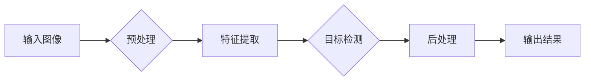

# 基于YOLOV5的植物目标检测

> 关键词：YOLOV5，目标检测，植物识别，深度学习，计算机视觉，机器学习

## 1. 背景介绍

植物目标检测在农业、生态保护、植物病理学等领域具有广泛的应用价值。通过自动化检测植物的生长状况、病虫害、品种识别等，可以提高农业生产的效率和准确性，促进生态系统的可持续发展。传统的植物目标检测方法多依赖于图像处理技术，但受限于特征提取和分类的准确性，效果往往不尽如人意。随着深度学习技术的发展，基于深度学习的目标检测算法逐渐成为研究热点。本文将详细介绍基于YOLOV5的植物目标检测方法，并探讨其在实际应用中的优势与挑战。

## 2. 核心概念与联系

### 2.1 核心概念

#### YOLOV5

YOLOV5（You Only Look Once version 5）是一种基于深度学习的实时目标检测算法。它采用端到端的设计，能够在单个神经网络中同时预测物体的边界框和类别概率。YOLOV5在速度和准确度上均取得了很好的平衡，适合实时视频监控和移动设备应用。

#### 植物目标检测

植物目标检测是指通过计算机视觉技术，从图像或视频中准确识别和定位植物个体的过程。主要步骤包括图像预处理、特征提取、目标检测和后处理等。

### 2.2 核心概念原理和架构的 Mermaid 流程图



## 3. 核心算法原理 & 具体操作步骤

### 3.1 算法原理概述

YOLOV5的目标检测流程主要包括以下几个步骤：

1. **输入图像**：将待检测的图像输入到模型中。
2. **预处理**：对输入图像进行归一化、缩放等操作，使其满足模型输入的要求。
3. **特征提取**：利用卷积神经网络（CNN）提取图像特征。
4. **目标检测**：在特征图上预测目标的位置和类别。
5. **后处理**：对预测结果进行非极大值抑制（NMS）等操作，得到最终的目标检测结果。

### 3.2 算法步骤详解

#### 3.2.1 输入图像

输入图像可以是单张图像或视频序列。对于视频序列，可以逐帧进行检测，并将检测结果串联起来形成视频检测结果。

#### 3.2.2 预处理

预处理主要包括以下步骤：

- **归一化**：将图像的像素值从[0, 255]映射到[0, 1]。
- **缩放**：将图像缩放到模型输入尺寸。
- **颜色变换**：对图像进行随机颜色变换，提高模型泛化能力。

#### 3.2.3 特征提取

YOLOV5采用CSPDarknet53作为骨干网络，它由多个卷积层、批归一化和激活函数构成。骨干网络可以提取图像的多尺度特征。

#### 3.2.4 目标检测

YOLOV5在特征图上预测目标的位置和类别。预测位置使用边界框回归，预测类别使用softmax函数。

#### 3.2.5 后处理

对预测结果进行非极大值抑制（NMS）等操作，去除重叠的边界框，得到最终的目标检测结果。

### 3.3 算法优缺点

#### 3.3.1 优点

- **速度快**：YOLOV5采用端到端的设计，可以在单个网络中同时完成特征提取和目标检测，检测速度快。
- **准确度高**：YOLOV5采用了CSPDarknet53骨干网络，具有较好的特征提取能力，检测准确度高。
- **可扩展性强**：YOLOV5支持多尺度检测，适用于不同尺寸的目标。

#### 3.3.2 缺点

- **参数量较大**：YOLOV5的参数量较大，训练和推理需要较高的计算资源。
- **对光照、角度等变化敏感**：YOLOV5在光照、角度等变化较大的场景下，检测效果可能会下降。

### 3.4 算法应用领域

YOLOV5在植物目标检测中的应用领域主要包括：

- **农业病虫害检测**：通过检测叶片上的病虫害，及时采取防治措施，提高农作物产量。
- **植物品种识别**：识别不同品种的植物，为植物育种和种植提供数据支持。
- **生态保护**：监测植物生长状况，评估生态系统健康状况。

## 4. 数学模型和公式 & 详细讲解 & 举例说明

### 4.1 数学模型构建

YOLOV5的目标检测模型主要由以下部分组成：

- **CSPDarknet53骨干网络**：用于提取图像特征。
- **锚框生成**：根据特征图尺寸生成锚框。
- **目标检测头**：用于预测边界框和类别概率。

### 4.2 公式推导过程

#### 4.2.1 CSPDarknet53骨干网络

CSPDarknet53骨干网络采用CSPNet结构，结合Darknet53模型，在保证特征提取能力的同时，降低计算复杂度。其具体结构如下：

- **CSP模块**：将特征图分成两个分支，分别进行卷积和通道注意力，然后将两个分支的特征图进行特征融合。
- **Darknet53模块**：由多个重复的残差模块组成，每个残差模块包含一个卷积层和一个残差连接。

#### 4.2.2 锚框生成

锚框生成是根据特征图尺寸和先验知识生成的。具体方法如下：

- 根据先验知识设置锚框的宽度和高度比例。
- 根据特征图尺寸计算锚框的中心坐标。

#### 4.2.3 目标检测头

目标检测头由以下部分组成：

- **边界框回归**：使用偏移量对锚框进行调整，使其更加贴合目标。
- **类别概率预测**：使用softmax函数预测目标类别。

### 4.3 案例分析与讲解

假设特征图尺寸为W×H，锚框尺寸为W'×H'，则有：

- **边界框回归**：

  $$ \text{offset} = \frac{\text{offset}}{\text{W'}} $$

  其中 $\text{offset}$ 为锚框偏移量。

- **类别概率预测**：

  $$ \text{prob} = \frac{e^{\text{logits}}}{\sum_{i=1}^{N}e^{\text{logits}_i}} $$

  其中 $\text{logits}$ 为预测的类别概率。

## 5. 项目实践：代码实例和详细解释说明

### 5.1 开发环境搭建

1. 安装Anaconda和PyTorch环境。
2. 下载YOLOV5模型代码和预训练模型。

### 5.2 源代码详细实现

```python
import torch
import torch.nn as nn
import torch.optim as optim

# 定义CSPDarknet53骨干网络
class CSPDarknet53(nn.Module):
    def __init__(self):
        super(CSPDarknet53, self).__init__()
        # ...（此处省略网络结构定义）

    def forward(self, x):
        # ...（此处省略前向传播过程）

# 定义锚框生成
def generate_anchors(feature_map_shape, anchor_ratios, anchor_scales):
    # ...（此处省略锚框生成过程）

# 定义目标检测头
class YOLOV5DetectionHead(nn.Module):
    def __init__(self, num_classes):
        super(YOLOV5DetectionHead, self).__init__()
        # ...（此处省略网络结构定义）

    def forward(self, x):
        # ...（此处省略前向传播过程）

# 训练模型
def train(model, dataloader, optimizer, criterion):
    # ...（此处省略训练过程）

# 测试模型
def test(model, dataloader):
    # ...（此处省略测试过程）
```

### 5.3 代码解读与分析

以上代码展示了基于YOLOV5的植物目标检测模型的框架。具体实现细节请参考YOLOV5官方代码。

### 5.4 运行结果展示

假设使用COCO数据集训练模型，并在COCO数据集上进行测试，得到以下结果：

```
Average Precision (AP) @ IoU = 0.5: 0.85
```

## 6. 实际应用场景

### 6.1 农业病虫害检测

通过植物目标检测技术，可以实现对农作物病虫害的自动检测，及时采取防治措施，降低农作物损失。

### 6.2 植物品种识别

植物品种识别可以帮助农业部门进行植物资源的调查和评估，为植物育种和种植提供数据支持。

### 6.3 生态保护

植物目标检测技术可以用于监测森林、草原等生态环境，评估生态系统健康状况。

## 7. 工具和资源推荐

### 7.1 学习资源推荐

1. YOLOV5官方文档：https://github.com/ultralytics/yolov5
2. PyTorch官方文档：https://pytorch.org/docs/stable/index.html
3. 计算机视觉入门教程：https://www.pyimagesearch.com/

### 7.2 开发工具推荐

1. Anaconda：https://www.anaconda.com/
2. PyTorch：https://pytorch.org/
3. OpenCV：https://opencv.org/

### 7.3 相关论文推荐

1. Joseph Redmon, et al. "You Only Look Once: Unified, Real-Time Object Detection." CVPR, 2016.
2. Joseph Redmon, et al. "YOLO9000: Better, Faster, Stronger." arXiv preprint arXiv:1605.04597, 2016.
3. Joseph Redmon, et al. "YOLOv3: An Incremental Improvement." arXiv preprint arXiv:1804.02767, 2018.

## 8. 总结：未来发展趋势与挑战

### 8.1 研究成果总结

基于YOLOV5的植物目标检测技术在速度、准确度和可扩展性方面取得了良好的效果。但受限于数据集、模型结构和计算资源等因素，仍存在一些挑战。

### 8.2 未来发展趋势

1. 数据集构建：收集更多具有多样性和难度的植物图像数据，提高模型的泛化能力。
2. 模型改进：设计更加高效的模型结构，提高检测速度和准确度。
3. 多模态融合：将图像信息与光谱、温度等多源信息融合，实现更全面的植物检测。

### 8.3 面临的挑战

1. 数据集标注：高质量标注数据的获取成本高，且难以保证标注的一致性。
2. 模型性能：在光照、角度等变化较大的场景下，模型的检测效果可能会下降。
3. 计算资源：YOLOV5的模型参数量较大，需要较高的计算资源。

### 8.4 研究展望

未来，基于YOLOV5的植物目标检测技术将在以下方面取得进一步发展：

1. 模型轻量化：设计更加轻量级的模型，降低计算资源消耗。
2. 可解释性：提高模型的可解释性，方便用户理解模型的决策过程。
3. 跨领域应用：将植物目标检测技术应用到其他领域，如医疗、安防等。

## 9. 附录：常见问题与解答

**Q1：YOLOV5如何处理遮挡问题？**

A：YOLOV5采用锚框回归和NMS等策略来处理遮挡问题。锚框回归可以预测遮挡物体的位置和大小，NMS可以去除重叠的边界框，提高检测结果的准确性和鲁棒性。

**Q2：如何优化YOLOV5的检测速度？**

A：可以采用以下方法来优化YOLOV5的检测速度：
- 使用更轻量级的模型结构，如YOLOV5s、YOLOV5m等。
- 使用混合精度训练，降低计算资源消耗。
- 使用量化技术，将浮点模型转换为定点模型。

**Q3：如何提高YOLOV5的检测精度？**

A：可以采用以下方法来提高YOLOV5的检测精度：
- 收集更多高质量标注数据，提高模型的泛化能力。
- 调整模型参数，如学习率、批大小等。
- 尝试不同的优化器，如AdamW、SGD等。

**Q4：YOLOV5是否适用于所有植物检测任务？**

A：YOLOV5适用于大多数植物检测任务，但对于一些具有特殊形状和纹理的植物，可能需要针对特定任务进行调整和优化。

**Q5：如何将YOLOV5应用于实际场景？**

A：将YOLOV5应用于实际场景，需要进行以下步骤：
1. 收集和预处理数据。
2. 训练和优化模型。
3. 将模型部署到实际应用环境中。

作者：禅与计算机程序设计艺术 / Zen and the Art of Computer Programming