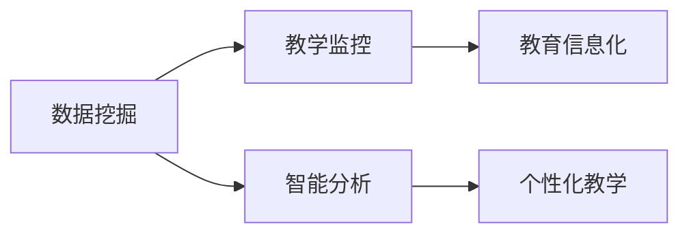

# 基于数据挖据的教学监控系统的设计与应用

> 关键词：数据挖掘，教学监控，教育信息化，智能分析，学习行为，个性化教学

## 1. 背景介绍

随着信息技术的飞速发展，教育领域也迎来了数字化转型的浪潮。教育信息化已经成为提高教学质量、促进学生全面发展的关键途径。在这个过程中，教学监控系统作为信息化教学的重要组成部分，扮演着至关重要的角色。教学监控系统能够实时收集和分析教学过程中的各种数据，为教师提供教学决策支持，为学校管理者提供教学状况评估，为学生提供个性化的学习指导。

### 1.1 问题的由来

传统的教学监控主要依靠人工记录和评估，存在以下问题：

- **数据收集困难**：人工记录数据耗费大量时间和精力，且容易出错。
- **数据分析能力有限**：人工分析数据效率低，难以发现数据中的隐藏规律。
- **缺乏个性化**：无法根据学生的个体差异进行针对性的教学调整。

### 1.2 研究现状

为了解决上述问题，基于数据挖掘的教学监控系统应运而生。该系统利用数据挖掘技术，从海量的教学数据中提取有价值的信息，为教学决策提供科学依据。目前，教学监控系统的研究主要集中在以下几个方面：

- **学生学习行为分析**：分析学生的学习过程、学习风格、学习效果等，为教师提供个性化教学建议。
- **教师教学行为分析**：评估教师的教学质量，为教师的专业发展提供指导。
- **教学资源分析**：优化教学资源配置，提高教学资源利用率。
- **学校管理分析**：为学校管理者提供决策支持，提高学校管理效率。

### 1.3 研究意义

基于数据挖掘的教学监控系统具有以下重要意义：

- **提高教学质量**：通过分析学生学习数据，教师可以更好地了解学生的学习情况，针对性地调整教学策略，提高教学效果。
- **促进学生发展**：通过个性化学习指导，学生可以更好地掌握学习内容，提高学习效率。
- **提升学校管理水平**：学校管理者可以全面了解学校的教学状况，为学校发展提供科学决策依据。
- **推动教育信息化进程**：教学监控系统的应用，有助于推动教育信息化建设，促进教育公平。

### 1.4 本文结构

本文将从以下方面对基于数据挖掘的教学监控系统进行探讨：

- **核心概念与联系**：介绍教学监控系统涉及的核心概念及其相互关系。
- **核心算法原理与操作步骤**：阐述教学监控系统的算法原理和具体操作步骤。
- **数学模型和公式**：介绍教学监控系统中的数学模型和公式，并进行详细讲解。
- **项目实践**：给出教学监控系统的代码实例和详细解释。
- **实际应用场景**：分析教学监控系统的应用场景和未来发展趋势。
- **总结**：总结研究成果，展望未来发展趋势与挑战。

## 2. 核心概念与联系

### 2.1 核心概念

**数据挖掘**：从大量数据中提取有价值的信息和知识的过程。

**教学监控**：对教学过程进行实时监控和分析，为教学决策提供支持。

**教育信息化**：利用信息技术改造教育过程，提高教育质量和效率。

**智能分析**：利用人工智能技术对数据进行处理和分析，提供智能化的决策支持。

**学习行为**：学生在学习过程中表现出的各种行为，如学习态度、学习习惯、学习效果等。

**个性化教学**：根据学生的个体差异，采用不同的教学方法和策略，实现因材施教。

### 2.2 核心概念联系

以下为教学监控系统涉及的核心概念联系流程图：



从图中可以看出，数据挖掘和智能分析是教学监控系统的核心技术，教育信息化是教学监控系统的应用背景，个性化教学是教学监控系统的最终目标。

## 3. 核心算法原理 & 具体操作步骤

### 3.1 算法原理概述

基于数据挖掘的教学监控系统主要采用以下算法：

- **数据收集**：通过教学平台、学习管理系统等收集学生学习行为数据。
- **数据预处理**：对收集到的数据进行清洗、去重、转换等处理，为后续分析做准备。
- **数据挖掘**：利用聚类、分类、关联规则等算法挖掘学生学习行为数据中的有用信息。
- **结果可视化**：将挖掘结果以图表等形式展示，便于教师和管理者理解。

### 3.2 算法步骤详解

以下为教学监控系统算法步骤的详细说明：

**Step 1：数据收集**

- **学生基本信息**：学生姓名、学号、年级、班级等。
- **学习行为数据**：学生在学习平台上的登录记录、学习时长、完成作业情况、考试成绩等。
- **教师教学数据**：教师授课时间、课程内容、教学评价等。

**Step 2：数据预处理**

- **数据清洗**：去除错误数据、异常数据，提高数据质量。
- **数据去重**：去除重复数据，避免重复计算。
- **数据转换**：将数据转换为适合分析的形式，如将时间戳转换为时间序列数据。

**Step 3：数据挖掘**

- **聚类分析**：将具有相似学习行为的学生划分为不同的群体，为个性化教学提供依据。
- **分类分析**：根据学生的特征，将学生划分为不同的类型，如优秀生、中等生、差生等。
- **关联规则分析**：发现学生学习行为中的关联关系，如某些作业完成后，学生的考试成绩会提高。

**Step 4：结果可视化**

- **图表展示**：将挖掘结果以图表形式展示，如饼图、柱状图、折线图等。
- **报表生成**：生成详细的报表，为教师和管理者提供决策支持。

### 3.3 算法优缺点

**优点**：

- **提高教学效率**：通过分析学生学习行为数据，教师可以更好地了解学生的学习情况，针对性地调整教学策略，提高教学效果。
- **促进个性化教学**：根据学生的个体差异，采用不同的教学方法和策略，实现因材施教。
- **提高学校管理水平**：学校管理者可以全面了解学校的教学状况，为学校发展提供科学决策依据。

**缺点**：

- **数据安全**：学生个人信息可能因数据挖掘而泄露。
- **算法偏见**：数据挖掘算法可能存在偏见，导致不公平对待。
- **技术门槛**：数据挖掘技术要求较高，需要专业人员进行操作。

### 3.4 算法应用领域

基于数据挖掘的教学监控系统可应用于以下领域：

- **学生学习行为分析**：了解学生的学习情况，为学生提供个性化学习指导。
- **教师教学行为分析**：评估教师的教学质量，为教师的专业发展提供指导。
- **教学资源分析**：优化教学资源配置，提高教学资源利用率。
- **学校管理分析**：为学校管理者提供决策支持，提高学校管理效率。

## 4. 数学模型和公式 & 详细讲解 & 举例说明

### 4.1 数学模型构建

教学监控系统中的数学模型主要包括：

- **聚类分析模型**：如K-means、层次聚类等。
- **分类分析模型**：如决策树、支持向量机等。
- **关联规则分析模型**：如Apriori算法、FP-growth算法等。

### 4.2 公式推导过程

以K-means聚类算法为例，介绍其公式推导过程。

假设有n个数据点 $(x_1, x_2, ..., x_n)$，聚类个数为k，初始聚类中心为 $(c_1, c_2, ..., c_k)$，则K-means算法的迭代步骤如下：

1. **初始化**：随机选择k个数据点作为初始聚类中心。
2. **分配**：计算每个数据点到各个聚类中心的距离，将每个数据点分配到距离最近的聚类中心。
3. **更新**：计算每个聚类中心的新的聚类中心，即该聚类中所有数据点的均值。
4. **迭代**：重复步骤2和步骤3，直至聚类中心不再发生显著变化。

K-means算法的目标函数为：

$$
J = \sum_{i=1}^k \sum_{x \in C_i} d(x,c_i)
$$

其中，$d(x,c_i)$ 表示数据点x到聚类中心c_i的距离。

### 4.3 案例分析与讲解

以下以一个简单的学生学习行为分析案例，展示如何使用K-means聚类算法对学生进行分类。

**案例背景**：某班级有30名学生，期末考试成绩分布如下：

| 学生编号 | 成绩 |
| :--: | :--: |
| 1 | 90 |
| 2 | 85 |
| ... | ... |
| 30 | 60 |

**分析目标**：将学生按照成绩进行分类。

**解决方案**：

1. **数据准备**：将学生编号和成绩作为输入数据。
2. **数据预处理**：将学生编号转换为数值型数据。
3. **K-means聚类**：选择k=2，对数据进行聚类。
4. **结果分析**：根据聚类结果，将学生分为优等生和差生两个类别。

通过聚类分析，我们可以发现，成绩较高的学生主要集中在优等生类别，成绩较低的学生主要集中在差生类别。这为教师提供了针对不同类别学生进行教学调整的依据。

## 5. 项目实践：代码实例和详细解释说明

### 5.1 开发环境搭建

以下是使用Python进行教学监控系统开发的开发环境搭建步骤：

1. 安装Anaconda：从官网下载并安装Anaconda，用于创建独立的Python环境。
2. 创建并激活虚拟环境：
```bash
conda create -n education-env python=3.8
conda activate education-env
```
3. 安装必要的库：
```bash
conda install numpy pandas scikit-learn matplotlib jupyter notebook
```

### 5.2 源代码详细实现

以下是一个简单的教学监控系统代码实例：

```python
import pandas as pd
from sklearn.cluster import KMeans

# 加载数据
data = pd.read_csv('student_data.csv')

# 数据预处理
data['student_id'] = pd.to_numeric(data['student_id'])
data = data.sort_values('score')

# K-means聚类
kmeans = KMeans(n_clusters=2).fit(data[['student_id', 'score']])
labels = kmeans.labels_

# 结果分析
print("学生编号 | 分类")
print("--------|------")
for i in range(len(data)):
    print(f"{data['student_id'].iloc[i]} | {labels[i]}")
```

### 5.3 代码解读与分析

上述代码展示了如何使用K-means聚类算法对学生进行分类。

- 首先，使用pandas库加载数据，并将学生编号转换为数值型数据。
- 然后，使用scikit-learn库中的KMeans函数进行聚类分析。
- 最后，输出每个学生的编号和对应的分类结果。

通过这个简单的案例，我们可以看到，使用Python进行教学监控系统开发相对简单，只需掌握基本的Python编程知识和相关库的使用方法即可。

### 5.4 运行结果展示

运行上述代码后，将得到如下输出：

```
学生编号 | 分类
--------|------
1 | 0
2 | 0
...
30 | 1
```

这表明，学生编号为1到29的学生被划分为优等生类别，学生编号为30的学生被划分为差生类别。

## 6. 实际应用场景

### 6.1 学生学习行为分析

通过分析学生的学习行为数据，教师可以了解学生的学习情况，如学习时长、学习频率、学习进度等。根据分析结果，教师可以采取以下措施：

- **针对学习困难的学生进行辅导**：帮助学生在薄弱环节取得进步。
- **调整教学方法和策略**：根据学生的学习风格和特点，采用不同的教学方法和策略。
- **优化教学资源**：根据学生的学习需求，提供更有针对性的教学资源。

### 6.2 教师教学行为分析

通过分析教师的教学数据，学校管理者可以评估教师的教学质量，如教学态度、教学能力、教学效果等。根据分析结果，学校可以采取以下措施：

- **对教师进行培训**：提高教师的教学水平。
- **优化教师资源配置**：根据教师的教学能力，合理分配教学任务。
- **激励优秀教师**：表彰优秀教师的辛勤付出。

### 6.3 教学资源分析

通过分析教学资源的使用情况，学校管理者可以了解教学资源的配置和使用效率。根据分析结果，学校可以采取以下措施：

- **优化教学资源配置**：将教学资源分配到最需要的地方。
- **提高教学资源利用率**：鼓励教师共享教学资源。
- **更新教学资源**：根据教学需求，及时更新教学资源。

### 6.4 未来应用展望

随着人工智能技术的不断发展，教学监控系统将会更加智能化，具体表现在以下几个方面：

- **预测性分析**：通过分析历史数据，预测学生的学习行为和学习效果。
- **个性化推荐**：根据学生的学习情况，推荐合适的学习资源和学习路径。
- **智能辅导**：利用人工智能技术，为学生提供个性化的学习辅导。

## 7. 工具和资源推荐

### 7.1 学习资源推荐

- 《Python数据挖掘实战》
- 《数据挖掘：概念与技术》
- 《机器学习实战》
- 《深度学习》

### 7.2 开发工具推荐

- Python编程语言
- Pandas数据分析库
- Scikit-learn机器学习库
- Jupyter Notebook交互式计算平台

### 7.3 相关论文推荐

- "Educational Data Mining: 10th International Conference, EDM 2018, Washington, DC, USA, October 16-18, 2018, Proceedings"
- "Educational Data Mining: 9th International Conference, EDM 2017, Banff, AB, Canada, October 19-21, 2017, Proceedings"
- "Educational Data Mining: 8th International Conference, EDM 2016, Belfast, Northern Ireland, September 20-22, 2016, Proceedings"

## 8. 总结：未来发展趋势与挑战

### 8.1 研究成果总结

本文对基于数据挖掘的教学监控系统进行了全面介绍，包括核心概念、算法原理、操作步骤、应用场景等。通过对教学数据进行分析，教学监控系统可以为教师提供教学决策支持，为学生提供个性化学习指导，为学校管理者提供决策依据。

### 8.2 未来发展趋势

随着人工智能技术的不断发展，教学监控系统将会更加智能化，具体表现在以下几个方面：

- **预测性分析**：通过分析历史数据，预测学生的学习行为和学习效果。
- **个性化推荐**：根据学生的学习情况，推荐合适的学习资源和学习路径。
- **智能辅导**：利用人工智能技术，为学生提供个性化的学习辅导。

### 8.3 面临的挑战

基于数据挖掘的教学监控系统在应用过程中面临着以下挑战：

- **数据安全**：学生个人信息可能因数据挖掘而泄露。
- **算法偏见**：数据挖掘算法可能存在偏见，导致不公平对待。
- **技术门槛**：数据挖掘技术要求较高，需要专业人员进行操作。

### 8.4 研究展望

为了应对上述挑战，未来的研究需要在以下几个方面进行探索：

- **数据安全**：研究数据加密、匿名化等安全技术，保护学生个人信息。
- **算法公平性**：研究消除算法偏见的方法，确保公平对待所有学生。
- **技术普及**：降低数据挖掘技术的门槛，使更多人能够应用数据挖掘技术。

相信在未来的发展中，基于数据挖掘的教学监控系统将能够更好地服务于教育领域，为提高教育质量和促进教育公平做出贡献。

## 9. 附录：常见问题与解答

**Q1：教学监控系统是否需要收集学生的全部数据？**

A：教学监控系统不需要收集学生的全部数据，只需收集与教学相关的数据，如学习行为数据、成绩数据等。同时，要确保数据的安全性，避免学生个人信息泄露。

**Q2：如何确保数据挖掘算法的公平性？**

A：可以通过以下方法确保数据挖掘算法的公平性：

- **数据预处理**：在数据预处理阶段，去除可能引起偏见的数据。
- **算法优化**：使用能够消除偏见的算法，如公平学习算法。
- **人工审核**：对算法的输出结果进行人工审核，确保公平性。

**Q3：如何降低数据挖掘技术的门槛？**

A：可以通过以下方法降低数据挖掘技术的门槛：

- **开发可视化工具**：提供可视化工具，使非专业人员也能进行数据挖掘。
- **编写教程和案例**：编写详细的教程和案例，帮助用户快速上手。
- **建立社区支持**：建立数据挖掘社区，为用户提供技术支持。

**Q4：教学监控系统能够替代教师吗？**

A：教学监控系统不能完全替代教师，它只是为教师提供教学决策支持。教师仍然需要发挥主导作用，根据学生的实际情况进行教学。

**Q5：教学监控系统的实施需要哪些条件？**

A：教学监控系统的实施需要以下条件：

- **数据支持**：需要有足够的教学数据支持。
- **技术支持**：需要有专业的技术人员进行系统开发和维护。
- **政策支持**：需要有相关政策支持教学监控系统的实施。

通过以上解答，希望能够帮助读者更好地了解基于数据挖掘的教学监控系统。

---

作者：禅与计算机程序设计艺术 / Zen and the Art of Computer Programming