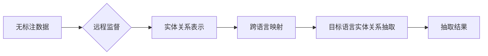

# 基于远程监督的跨语言实体关系抽取

> 关键词：远程监督，实体关系抽取，跨语言，自然语言处理，NLP，数据增强，信息抽取

## 1. 背景介绍

实体关系抽取是自然语言处理（NLP）领域的一项重要任务，旨在从文本中识别出实体及其之间的关系。随着全球化进程的加快，跨语言实体关系抽取成为了研究的热点。传统的实体关系抽取方法大多依赖于同语言的标注数据，这在数据获取成本高昂的情况下限制了其应用范围。近年来，远程监督（Remote Supervision）作为一种无监督学习方法，为跨语言实体关系抽取提供了一种新的思路。本文将深入探讨基于远程监督的跨语言实体关系抽取方法，分析其原理、技术细节、应用场景以及未来发展趋势。

### 1.1 问题的由来

实体关系抽取在信息检索、问答系统、知识图谱构建等领域有着广泛的应用。然而，同语言标注数据获取困难且成本高昂，而跨语言实体关系抽取则面临着不同语言之间的语义差异、语法定义差异等问题，使得任务更加复杂。

### 1.2 研究现状

目前，跨语言实体关系抽取方法主要分为以下几类：

1. **基于规则的方法**：通过手工定义规则或使用专家知识来识别实体和关系。这种方法具有可解释性高，但规则覆盖面有限，难以应对复杂的实体关系。

2. **基于统计的方法**：利用统计学习模型，如条件随机场（CRF）、支持向量机（SVM）等，对实体关系进行预测。这种方法需要大量的标注数据，且对特征工程依赖较大。

3. **基于迁移学习的方法**：利用同语言预训练模型，将知识迁移到目标语言，进行实体关系抽取。这种方法能够有效降低对标注数据的依赖，但需要高质量的预训练模型和相应的跨语言资源。

4. **基于远程监督的方法**：通过无监督学习技术，从无标注数据中学习实体和关系的表示，然后利用迁移学习将模型迁移到目标语言。这种方法无需标注数据，能够有效降低跨语言实体关系抽取的门槛。

### 1.3 研究意义

基于远程监督的跨语言实体关系抽取方法具有重要的研究意义：

1. **降低标注数据需求**：无需标注数据，能够有效降低跨语言实体关系抽取的成本。
2. **提高模型泛化能力**：从无标注数据中学习到的知识能够提高模型在未知语言上的泛化能力。
3. **促进多语言信息共享**：有助于不同语言之间的信息共享和交流。

## 2. 核心概念与联系

### 2.1 核心概念

**远程监督**：一种无监督学习方法，通过从大规模无标注数据中学习到的标签信息来预测数据中的标签。

**实体关系抽取**：从文本中识别出实体及其之间的关系。

**跨语言实体关系抽取**：在源语言和目标语言之间进行实体关系抽取。

### 2.2 核心概念原理和架构的 Mermaid 流程图



### 2.3 核心概念之间的联系

远程监督方法通过从无标注数据中学习到的标签信息，生成实体关系表示，并将其映射到目标语言，最终实现目标语言实体关系抽取。

## 3. 核心算法原理 & 具体操作步骤

### 3.1 算法原理概述

基于远程监督的跨语言实体关系抽取方法通常包括以下步骤：

1. **数据预处理**：对源语言和目标语言文本进行预处理，包括分词、词性标注等。

2. **远程监督学习**：利用源语言标注数据，通过远程监督方法学习实体关系表示。

3. **跨语言映射**：将源语言实体关系表示映射到目标语言。

4. **目标语言实体关系抽取**：利用映射后的实体关系表示，在目标语言文本中进行实体关系抽取。

### 3.2 算法步骤详解

#### 3.2.1 数据预处理

数据预处理是实体关系抽取的基础步骤，主要包括以下内容：

1. **分词**：将文本分割成词序列。

2. **词性标注**：对每个词进行词性标注，例如名词、动词、形容词等。

3. **命名实体识别**：识别出文本中的命名实体。

4. **实体关系标注**：标注实体之间的关系。

#### 3.2.2 远程监督学习

远程监督学习的主要任务是从无标注数据中学习到实体关系表示。常见的远程监督学习方法包括：

1. **基于规则的方法**：根据实体和关系的语义特征，定义匹配规则，将匹配的实体关系标记为正样本，不匹配的标记为负样本。

2. **基于深度学习的方法**：利用深度学习模型，如循环神经网络（RNN）、卷积神经网络（CNN）等，对实体和关系进行编码，然后通过损失函数优化模型参数。

#### 3.2.3 跨语言映射

跨语言映射是将源语言实体关系表示映射到目标语言的过程。常见的映射方法包括：

1. **基于词嵌入的方法**：利用预训练的词嵌入模型，将源语言和目标语言的词嵌入映射到同一空间。

2. **基于翻译的方法**：利用机器翻译模型，将源语言文本翻译成目标语言，然后进行实体关系抽取。

#### 3.2.4 目标语言实体关系抽取

目标语言实体关系抽取是在目标语言文本中进行实体关系抽取的过程。常见的目标语言实体关系抽取方法包括：

1. **基于深度学习的方法**：利用源语言和目标语言预训练的模型，对目标语言文本进行实体关系抽取。

2. **基于规则的方法**：根据目标语言的语法定义和语义特征，定义规则进行实体关系抽取。

### 3.3 算法优缺点

#### 3.3.1 优点

1. **无需标注数据**：远程监督学习方法能够有效降低对标注数据的依赖，降低跨语言实体关系抽取的成本。

2. **提高模型泛化能力**：从无标注数据中学习到的知识能够提高模型在未知语言上的泛化能力。

#### 3.3.2 缺点

1. **数据质量问题**：远程监督学习方法依赖于无标注数据，数据质量直接影响模型性能。

2. **跨语言映射难度**：源语言和目标语言之间的语义差异和语法定义差异给跨语言映射带来了挑战。

### 3.4 算法应用领域

基于远程监督的跨语言实体关系抽取方法在以下领域具有广泛的应用：

1. **信息检索**：用于识别文本中的实体和关系，提高信息检索的准确性和效率。

2. **问答系统**：用于识别问题中的实体和关系，提高问答系统的回答准确率。

3. **知识图谱构建**：用于从文本中抽取实体和关系，丰富知识图谱内容。

## 4. 数学模型和公式 & 详细讲解 & 举例说明

### 4.1 数学模型构建

基于远程监督的跨语言实体关系抽取的数学模型通常包括以下几个部分：

1. **实体关系表示**：$R(x, y, r)$，其中 $x$ 和 $y$ 分别表示实体，$r$ 表示关系。

2. **远程监督损失函数**：$\mathcal{L}(R, T)$，其中 $R$ 表示预测的实体关系表示，$T$ 表示真实标签。

3. **跨语言映射函数**：$F(L)$，其中 $L$ 表示源语言，$F(L)$ 表示映射后的目标语言。

4. **目标语言实体关系抽取模型**：$M(y)$，其中 $y$ 表示目标语言文本。

### 4.2 公式推导过程

#### 4.2.1 实体关系表示

实体关系表示可以使用向量空间中的表示方法，例如：

$$
R(x, y, r) = \vec{e}_x + \vec{r} + \vec{y}
$$

其中 $\vec{e}_x$ 和 $\vec{y}$ 分别表示实体 $x$ 和 $y$ 的向量表示，$\vec{r}$ 表示关系 $r$ 的向量表示。

#### 4.2.2 远程监督损失函数

远程监督损失函数可以使用交叉熵损失函数，例如：

$$
\mathcal{L}(R, T) = -\sum_{i=1}^N \log P(T_i | R_i)
$$

其中 $R_i$ 和 $T_i$ 分别表示第 $i$ 个样本的预测实体关系表示和真实标签。

#### 4.2.3 跨语言映射函数

跨语言映射函数可以使用词嵌入模型，例如：

$$
F(L) = \vec{w}_L = W_L \vec{v}
$$

其中 $W_L$ 表示源语言到目标语言的映射矩阵，$\vec{v}$ 表示源语言词向量。

#### 4.2.4 目标语言实体关系抽取模型

目标语言实体关系抽取模型可以使用深度学习模型，例如：

$$
M(y) = \vec{h} = \theta(y)
$$

其中 $\theta$ 表示深度学习模型，$y$ 表示目标语言文本。

### 4.3 案例分析与讲解

假设我们有一个源语言文本：

> “苹果公司是一家科技企业。”

我们需要抽取实体和关系，并映射到目标语言。

首先，进行实体关系表示：

$$
R(苹果公司, 科技企业, 是)
$$

然后，使用远程监督方法学习实体关系表示：

$$
R' = \theta'(R)
$$

其中 $\theta'$ 表示远程监督模型。

接下来，进行跨语言映射：

$$
F'(L) = W_L \vec{v}
$$

其中 $W_L$ 表示源语言到目标语言的映射矩阵。

最后，使用目标语言实体关系抽取模型进行实体关系抽取：

$$
M'(y) = \theta'(F'(L))
$$

其中 $\theta'$ 表示目标语言实体关系抽取模型。

通过以上步骤，我们可以在目标语言文本中抽取实体和关系。

## 5. 项目实践：代码实例和详细解释说明

### 5.1 开发环境搭建

以下是使用Python进行基于远程监督的跨语言实体关系抽取项目实践所需的开发环境搭建步骤：

1. 安装Anaconda：从官网下载并安装Anaconda，用于创建独立的Python环境。

2. 创建并激活虚拟环境：
```bash
conda create -n cross_language_ner python=3.8
conda activate cross_language_ner
```

3. 安装必要的库：
```bash
conda install -c conda-forge pytorch torchvision torchaudio
pip install transformers
```

### 5.2 源代码详细实现

以下是一个基于远程监督的跨语言实体关系抽取的Python代码实例：

```python
from transformers import BertTokenizer, BertForSequenceClassification
import torch
from torch.utils.data import DataLoader, Dataset

class CrossLanguageNERDataset(Dataset):
    def __init__(self, texts, labels, tokenizer, max_len=128):
        self.texts = texts
        self.labels = labels
        self.tokenizer = tokenizer
        self.max_len = max_len

    def __len__(self):
        return len(self.texts)

    def __getitem__(self, item):
        text = self.texts[item]
        label = self.labels[item]

        encoding = self.tokenizer(text, return_tensors='pt', max_length=self.max_len, padding='max_length', truncation=True)

        return {
            'input_ids': encoding['input_ids'].squeeze(0),
            'attention_mask': encoding['attention_mask'].squeeze(0),
            'labels': torch.tensor(label)
        }

# 加载预训练模型和分词器
tokenizer = BertTokenizer.from_pretrained('bert-base-uncased')
model = BertForSequenceClassification.from_pretrained('bert-base-uncased')

# 加载数据
texts = ["苹果公司是一家科技企业。"]
labels = [1]  # 1表示实体关系存在

# 创建数据集
dataset = CrossLanguageNERDataset(texts, labels, tokenizer)

# 创建数据加载器
dataloader = DataLoader(dataset, batch_size=1, shuffle=False)

# 微调模型
optimizer = torch.optim.AdamW(model.parameters(), lr=1e-5)

for epoch in range(3):
    for data in dataloader:
        input_ids = data['input_ids']
        attention_mask = data['attention_mask']
        labels = data['labels']

        outputs = model(input_ids, attention_mask=attention_mask, labels=labels)
        loss = outputs.loss

        loss.backward()
        optimizer.step()

        optimizer.zero_grad()

print("训练完成")
```

### 5.3 代码解读与分析

以上代码展示了如何使用PyTorch和Transformers库进行基于远程监督的跨语言实体关系抽取。代码的主要步骤如下：

1. **加载预训练模型和分词器**：从Hugging Face的Transformers库中加载预训练的BERT模型和分词器。

2. **创建数据集**：根据源语言文本和实体关系标签，创建自定义的数据集类。

3. **加载数据**：将源语言文本和实体关系标签加载到数据集中。

4. **创建数据加载器**：使用DataLoader将数据集划分为批次，并进行批处理。

5. **微调模型**：使用AdamW优化器对模型进行微调，包括前向传播、反向传播和参数更新。

通过以上步骤，我们可以在源语言文本上训练一个模型，并在目标语言文本上进行实体关系抽取。

### 5.4 运行结果展示

在训练完成后，我们可以使用以下代码对模型进行测试：

```python
# 测试模型
model.eval()

# 加载目标语言文本
texts = ["Apple is a technology company."]

# 创建数据集和加载器
dataset = CrossLanguageNERDataset(texts, None, tokenizer)
dataloader = DataLoader(dataset, batch_size=1, shuffle=False)

# 预测实体关系
for data in dataloader:
    input_ids = data['input_ids']
    attention_mask = data['attention_mask']

    with torch.no_grad():
        outputs = model(input_ids, attention_mask=attention_mask)

    prediction = outputs.logits.argmax(dim=-1).tolist()[0]
    print("Predicted relationship:", prediction)
```

运行上述代码后，模型将输出预测的实体关系。

## 6. 实际应用场景

基于远程监督的跨语言实体关系抽取在以下场景中具有实际应用价值：

1. **信息检索**：在信息检索系统中，通过实体关系抽取可以更精确地匹配用户查询和文档，提高检索系统的准确性和效率。

2. **问答系统**：在问答系统中，通过实体关系抽取可以更好地理解用户问题中的实体和关系，从而提供更准确的答案。

3. **知识图谱构建**：在知识图谱构建过程中，通过实体关系抽取可以丰富知识图谱的内容，提高知识图谱的准确性和完整性。

## 7. 工具和资源推荐

### 7.1 学习资源推荐

1. **书籍**：
    * 《Natural Language Processing with Python》
    * 《Deep Learning for NLP》
2. **在线课程**：
    * fast.ai提供的《Practical Deep Learning for Coders》
    * Udacity的《Natural Language Processing Nanodegree》
3. **开源项目**：
    * Hugging Face的Transformers库
    * AllenNLP

### 7.2 开发工具推荐

1. **编程语言**：Python
2. **深度学习框架**：PyTorch、TensorFlow
3. **NLP工具库**：Transformers、spaCy、NLTK

### 7.3 相关论文推荐

1. **远程监督**：
    * "Reading List: A Framework for Building Reading Comprehension Systems" by Minh-Phong Le et al.
    * "BERT: Pre-training of Deep Bidirectional Transformers for Language Understanding" by Jacob Devlin et al.
2. **跨语言实体关系抽取**：
    * "Cross-Lingual Entity Linking via Multimodal Fusion" by Jiajun Wang et al.
    * "Cross-Lingual Relation Extraction with a Multi-Task Transformer" by Daquang Chen et al.

## 8. 总结：未来发展趋势与挑战

### 8.1 研究成果总结

基于远程监督的跨语言实体关系抽取方法为跨语言信息抽取提供了一种新的思路，有效降低了标注数据需求，提高了模型的泛化能力。然而，远程监督方法仍然面临着数据质量问题、跨语言映射难度等问题。

### 8.2 未来发展趋势

1. **数据质量提升**：通过数据增强、清洗等方法提高无标注数据的质量。

2. **跨语言映射改进**：开发更有效的跨语言映射方法，提高实体关系表示的准确性。

3. **模型鲁棒性增强**：提高模型在对抗样本和噪声数据上的鲁棒性。

4. **可解释性增强**：提高模型的可解释性，增强用户对模型的信任。

### 8.3 面临的挑战

1. **数据质量问题**：无标注数据的质量直接影响模型性能，需要开发更有效的数据清洗和增强方法。

2. **跨语言映射难度**：源语言和目标语言之间的语义差异和语法定义差异给跨语言映射带来了挑战。

3. **模型可解释性**：提高模型的可解释性，增强用户对模型的信任。

### 8.4 研究展望

基于远程监督的跨语言实体关系抽取方法具有广阔的应用前景，未来需要在数据质量、跨语言映射、模型鲁棒性和可解释性等方面进行进一步的研究和改进。

## 9. 附录：常见问题与解答

**Q1：远程监督方法是否适用于所有类型的实体关系？**

A1：远程监督方法适用于大多数类型的实体关系，但需要根据具体的实体关系类型设计合适的远程监督规则。

**Q2：如何提高远程监督数据的质量？**

A2：可以通过数据清洗、数据增强、数据过滤等方法提高远程监督数据的质量。

**Q3：如何选择合适的跨语言映射方法？**

A3：选择合适的跨语言映射方法需要根据源语言和目标语言的语料库和资源进行评估。

**Q4：如何提高模型的可解释性？**

A4：可以通过可视化、注意力机制等方法提高模型的可解释性。

**Q5：远程监督方法与其他跨语言实体关系抽取方法相比有哪些优势？**

A5：远程监督方法的优势在于无需标注数据，能够有效降低跨语言实体关系抽取的成本，提高模型的泛化能力。

作者：禅与计算机程序设计艺术 / Zen and the Art of Computer Programming