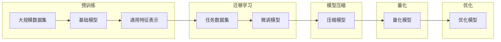

# 基础模型的技术架构与实现

> 关键词：基础模型，技术架构，深度学习，神经网络，预训练，迁移学习，模型压缩，量化，优化

## 1. 背景介绍

在人工智能领域，基础模型（Fundamental Models）是一种经过大规模预训练的神经网络模型，它在自然语言处理（NLP）、计算机视觉（CV）和音频处理等领域发挥着越来越重要的作用。基础模型通过在庞大的数据集上学习，获得了丰富的知识和泛化能力，能够迁移到各种不同的任务中，显著提高任务性能。

本文将深入探讨基础模型的技术架构与实现，涵盖其核心概念、算法原理、具体操作步骤、数学模型、项目实践、实际应用场景以及未来发展趋势。

## 2. 核心概念与联系

### 2.1 核心概念

#### 基础模型
基础模型是一种经过大规模数据预训练的神经网络模型，它能够从大量数据中学习到通用的特征表示，并能够将这些知识迁移到下游任务中。

#### 预训练
预训练是指在大量无标签数据上训练模型，以学习通用的特征表示和知识。

#### 迁移学习
迁移学习是一种利用在源域学习到的知识来解决目标域问题的学习方法。

#### 模型压缩
模型压缩是指减小模型大小或降低模型复杂度的技术，以提高模型在资源受限设备上的部署效率。

#### 量化
量化是一种将模型中的浮点数参数转换为低精度定点数的技术，以减少模型大小和计算量。

#### 优化
优化是指改进模型性能、效率和资源占用等方面的技术。

### 2.2 架构的 Mermaid 流程图



## 3. 核心算法原理 & 具体操作步骤

### 3.1 算法原理概述

基础模型的算法原理主要包括以下步骤：

1. **数据收集与预处理**：收集大规模数据集，并进行清洗、去重、格式化等预处理操作。
2. **预训练**：在无标签数据上训练模型，学习通用的特征表示。
3. **迁移学习**：在特定任务数据上微调模型，将预训练知识迁移到下游任务。
4. **模型压缩**：对模型进行压缩，以减小模型大小或降低模型复杂度。
5. **量化**：对模型参数进行量化，以减少模型大小和计算量。
6. **优化**：改进模型性能、效率和资源占用等方面的技术。

### 3.2 算法步骤详解

#### 3.2.1 数据收集与预处理

数据收集是指从各种来源获取数据，如互联网、数据库、传感器等。预处理操作包括数据清洗、去重、格式化等，以提高数据质量。

#### 3.2.2 预训练

预训练过程通常包括以下步骤：

1. **词嵌入**：将文本数据转换为词嵌入向量。
2. **编码器**：使用编码器网络（如Transformer、RNN等）对词嵌入进行编码，提取文本的深层特征。
3. **解码器**：使用解码器网络将编码后的特征解码为文本输出。
4. **损失函数**：使用适当的损失函数（如交叉熵损失、自回归损失等）训练模型。

#### 3.2.3 迁移学习

迁移学习过程通常包括以下步骤：

1. **选择预训练模型**：根据下游任务选择合适的预训练模型。
2. **微调**：在特定任务数据上微调预训练模型，调整模型参数以适应下游任务。
3. **评估**：在测试集上评估微调模型的性能。

#### 3.2.4 模型压缩

模型压缩技术包括以下几种：

1. **剪枝**：去除模型中的冗余参数。
2. **量化**：将模型中的浮点数参数转换为低精度定点数。
3. **知识蒸馏**：将知识从大模型迁移到小模型。

#### 3.2.5 量化

量化过程通常包括以下步骤：

1. **选择量化方法**：选择合适的量化方法，如均匀量化、对称量化等。
2. **量化参数**：将模型参数从浮点数转换为定点数。
3. **量化模型**：使用量化模型进行推理。

#### 3.2.6 优化

优化技术包括以下几种：

1. **模型剪枝**：去除模型中的冗余参数。
2. **量化**：将模型中的浮点数参数转换为低精度定点数。
3. **知识蒸馏**：将知识从大模型迁移到小模型。
4. **模型蒸馏**：将知识从预训练模型迁移到下游任务模型。

### 3.3 算法优缺点

#### 优点

1. **高性能**：基础模型能够从大量数据中学习到丰富的知识，从而在下游任务中取得高性能。
2. **泛化能力强**：基础模型能够迁移到各种不同的任务中，具有很好的泛化能力。
3. **易于部署**：基础模型经过压缩和量化，可以方便地在资源受限的设备上进行部署。

#### 缺点

1. **数据依赖性**：基础模型的效果很大程度上依赖于预训练数据的质量和数量。
2. **计算成本高**：预训练基础模型需要大量的计算资源和时间。
3. **模型复杂度高**：基础模型的参数量通常很大，需要大量的内存和计算资源。

### 3.4 算法应用领域

基础模型在以下领域得到了广泛应用：

1. **自然语言处理**：文本分类、情感分析、机器翻译、问答系统等。
2. **计算机视觉**：图像分类、目标检测、图像分割等。
3. **音频处理**：语音识别、音乐生成等。

## 4. 数学模型和公式 & 详细讲解 & 举例说明

### 4.1 数学模型构建

基础模型的数学模型通常由以下部分组成：

1. **词嵌入层**：将文本转换为词嵌入向量。
2. **编码器层**：对词嵌入进行编码，提取文本的深层特征。
3. **解码器层**：将编码后的特征解码为文本输出。
4. **损失函数**：用于评估模型性能的函数。

### 4.2 公式推导过程

以下以BERT模型为例，说明数学模型的推导过程。

#### BERT模型

BERT模型是一种基于Transformer的预训练语言模型，它通过掩码语言模型（Masked Language Model，MLM）和下一句预测（Next Sentence Prediction，NSP）两个预训练任务来学习语言表示。

#### 掩码语言模型

MLM任务的目标是预测被掩码的词。假设输入文本为 $ \text{input} = [w_1, w_2, \ldots, w_n] $，其中 $ w_i $ 为第 $ i $ 个词的索引，掩码后的文本为 $ \text{masked_input} = [w_1, \text{[MASK]}, \text{[PAD]}, \ldots, w_n] $，其中 $ [MASK] $ 表示被掩码的词。

模型的输入为 $ \text{masked_input} $ 的词嵌入向量，输出为 $ \text{masked_input} $ 中每个词的预测概率。损失函数为交叉熵损失：

$$
\mathcal{L} = -\sum_{i=1}^n \log p(w_i)
$$

其中 $ p(w_i) $ 为模型预测的 $ w_i $ 的概率。

#### 下一句预测

NSP任务的目标是预测两个句子之间的关系。假设输入文本为 $ \text{input} = [s_1, s_2, \ldots, s_k] $，其中 $ s_i $ 为第 $ i $ 个句子的索引。

模型的输入为 $ \text{input} $ 的词嵌入向量，输出为两个句子之间的关系的概率。损失函数为二元交叉熵损失：

$$
\mathcal{L} = -\sum_{i=1}^k \log p(s_i \text{ is next sentence})
$$

其中 $ p(s_i \text{ is next sentence}) $ 为模型预测的句子 $ s_i $ 是下一句的概率。

### 4.3 案例分析与讲解

以下以BERT模型为例，分析其在文本分类任务中的应用。

#### 数据集

假设我们有以下文本分类数据集：

```
样本  标签
1. 我非常喜欢这本书。  喜欢程度：高
2. 这本书很一般。  喜欢程度：中
3. 我一点也不喜欢这本书。  喜欢程度：低
...
```

#### 模型构建

使用BERT模型进行文本分类，需要在BERT模型的顶层添加一个分类器。分类器可以是全连接层或线性层，用于将编码后的文本特征映射到标签空间。

#### 训练过程

使用训练数据训练BERT模型，优化模型参数，以最小化损失函数。

#### 评估过程

使用测试数据评估模型的性能，计算准确率、召回率等指标。

## 5. 项目实践：代码实例和详细解释说明

### 5.1 开发环境搭建

以下是使用TensorFlow和Transformers库构建BERT文本分类模型的步骤：

1. 安装TensorFlow和Transformers库：

```bash
pip install tensorflow transformers
```

2. 下载预训练的BERT模型：

```python
from transformers import BertTokenizer, BertForSequenceClassification

tokenizer = BertTokenizer.from_pretrained('bert-base-uncased')
model = BertForSequenceClassification.from_pretrained('bert-base-uncased')
```

3. 准备数据集：

```python
train_texts = [...]
train_labels = [...]
test_texts = [...]
test_labels = [...]
```

4. 编码数据集：

```python
def encode_data(texts, labels, tokenizer, max_len=128):
    encodings = tokenizer(texts, truncation=True, padding=True, max_length=max_len)
    dataset = []
    for i in range(len(texts)):
        dataset.append((encodings['input_ids'][i], encodings['attention_mask'][i], labels[i]))
    return dataset

train_dataset = encode_data(train_texts, train_labels, tokenizer)
test_dataset = encode_data(test_texts, test_labels, tokenizer)
```

5. 训练模型：

```python
from transformers import AdamW
from tensorflow.keras.optimizers import Adam

optimizer = AdamW(model.parameters(), lr=2e-5)

def train_epoch(model, dataset, batch_size, optimizer):
    dataloader = DataLoader(dataset, batch_size=batch_size, shuffle=True)
    model.train()
    total_loss = 0
    for batch in dataloader:
        input_ids, attention_mask, labels = [t.to(device) for t in batch]
        model.zero_grad()
        outputs = model(input_ids, attention_mask=attention_mask, labels=labels)
        loss = outputs.loss
        total_loss += loss.item()
        loss.backward()
        optimizer.step()
    return total_loss / len(dataloader)

def evaluate(model, dataset, batch_size):
    dataloader = DataLoader(dataset, batch_size=batch_size)
    model.eval()
    preds, labels = [], []
    with torch.no_grad():
        for batch in dataloader:
            input_ids, attention_mask, labels = [t.to(device) for t in batch]
            outputs = model(input_ids, attention_mask=attention_mask)
            preds.extend(outputs.logits.argmax(dim=1).tolist())
            labels.extend(labels.tolist())
    return accuracy_score(labels, preds)

epochs = 3
batch_size = 16

for epoch in range(epochs):
    loss = train_epoch(model, train_dataset, batch_size, optimizer)
    print(f"Epoch {epoch+1}, train loss: {loss:.3f}")

    acc = evaluate(model, test_dataset, batch_size)
    print(f"Epoch {epoch+1}, test acc: {acc:.3f}")
```

### 5.3 代码解读与分析

以上代码展示了使用TensorFlow和Transformers库构建BERT文本分类模型的步骤。首先，我们加载预训练的BERT模型和分词器。然后，将数据集编码为BERT模型的输入格式。接下来，定义训练和评估函数。最后，启动训练和评估流程。

代码中的关键步骤如下：

1. 加载预训练的BERT模型和分词器。
2. 编码数据集，将文本转换为BERT模型的输入格式。
3. 定义训练和评估函数，使用AdamW优化器和Adam优化器进行模型训练和评估。
4. 启动训练和评估流程，输出训练集和测试集的损失和准确率。

通过以上步骤，我们可以构建一个基于BERT的文本分类模型，并在实际应用中进行部署。

## 6. 实际应用场景

基础模型在以下场景中得到了广泛应用：

1. **智能客服**：使用基础模型进行对话生成、意图识别等任务，构建智能客服系统。
2. **智能推荐**：使用基础模型进行用户画像、内容推荐等任务，构建智能推荐系统。
3. **图像识别**：使用基础模型进行图像分类、目标检测等任务，构建智能图像识别系统。
4. **语音识别**：使用基础模型进行语音识别、语音合成等任务，构建智能语音交互系统。
5. **自然语言处理**：使用基础模型进行文本分类、情感分析、机器翻译等任务，构建智能文本处理系统。

## 7. 工具和资源推荐

### 7.1 学习资源推荐

1. 《深度学习》[Goodfellow, Bengio, Courville]：这是一本深度学习的经典教材，详细介绍了深度学习的理论基础、算法和实现。
2. 《自然语言处理综合》[Daniel Jurafsky, James H. Martin]：这是一本自然语言处理的经典教材，详细介绍了自然语言处理的基本概念、技术和应用。
3. 《计算机视觉：算法与应用》[Richard Szeliski]：这是一本计算机视觉的经典教材，详细介绍了计算机视觉的基本概念、算法和应用。

### 7.2 开发工具推荐

1. TensorFlow：这是一个开源的深度学习框架，支持多种深度学习模型和算法。
2. PyTorch：这是一个开源的深度学习框架，具有动态计算图，易于使用和调试。
3. Hugging Face Transformers：这是一个开源的NLP库，提供了预训练的NLP模型和工具。

### 7.3 相关论文推荐

1. "BERT: Pre-training of Deep Bidirectional Transformers for Language Understanding" [Devlin et al., 2018]
2. "Attention Is All You Need" [Vaswani et al., 2017]
3. "Generative Adversarial Text to Image Synthesis" [Karras et al., 2017]

## 8. 总结：未来发展趋势与挑战

### 8.1 研究成果总结

本文介绍了基础模型的技术架构与实现，涵盖了其核心概念、算法原理、具体操作步骤、数学模型、项目实践、实际应用场景以及未来发展趋势。基础模型作为一种强大的学习工具，在各个领域都取得了显著的成果。

### 8.2 未来发展趋势

未来，基础模型将呈现以下发展趋势：

1. **模型规模将进一步扩大**：随着计算能力的提升，模型规模将进一步扩大，以学习更丰富的知识。
2. **模型结构将更加复杂**：为了更好地学习复杂任务，模型结构将更加复杂，如混合模型、多模态模型等。
3. **训练和推理效率将进一步提高**：通过模型压缩、量化、优化等技术，训练和推理效率将进一步提高。
4. **可解释性和安全性将得到加强**：通过可解释性研究、安全性研究等技术，提高基础模型的可解释性和安全性。

### 8.3 面临的挑战

基础模型在发展过程中也面临着以下挑战：

1. **计算资源消耗大**：基础模型的训练和推理需要大量的计算资源。
2. **数据依赖性**：基础模型的效果很大程度上依赖于预训练数据的质量和数量。
3. **模型可解释性不足**：基础模型的决策过程难以解释，可能导致误解和滥用。
4. **模型安全性**：基础模型可能被用于恶意目的，如虚假新闻、网络攻击等。

### 8.4 研究展望

未来，基础模型的研究将朝着以下方向发展：

1. **探索新的模型结构**：探索更加高效的模型结构，以降低计算资源消耗。
2. **开发新的训练方法**：开发更加高效、鲁棒的训练方法，以降低训练难度。
3. **提高模型可解释性和安全性**：提高基础模型的可解释性和安全性，以增强人们对模型的信任。
4. **探索基础模型在更多领域的应用**：将基础模型应用于更多领域，如医疗、金融、教育等，为人类社会创造更多价值。

## 9. 附录：常见问题与解答

**Q1：基础模型与深度学习模型有什么区别？**

A：深度学习模型是一种学习数据特征表示的模型，而基础模型是在大规模数据集上预训练的深度学习模型，它能够学习到更丰富的知识。

**Q2：基础模型的训练需要多少数据？**

A：基础模型的训练需要大量的数据，通常需要数百万甚至数十亿个样本。

**Q3：基础模型的训练需要多少时间？**

A：基础模型的训练需要大量的时间，通常需要几天甚至几个月的时间。

**Q4：如何提高基础模型的可解释性？**

A：提高基础模型的可解释性需要从多个方面进行，如特征可视化、模型蒸馏等。

**Q5：如何提高基础模型的安全性？**

A：提高基础模型的安全性需要从多个方面进行，如数据清洗、模型安全设计等。

---

作者：禅与计算机程序设计艺术 / Zen and the Art of Computer Programming