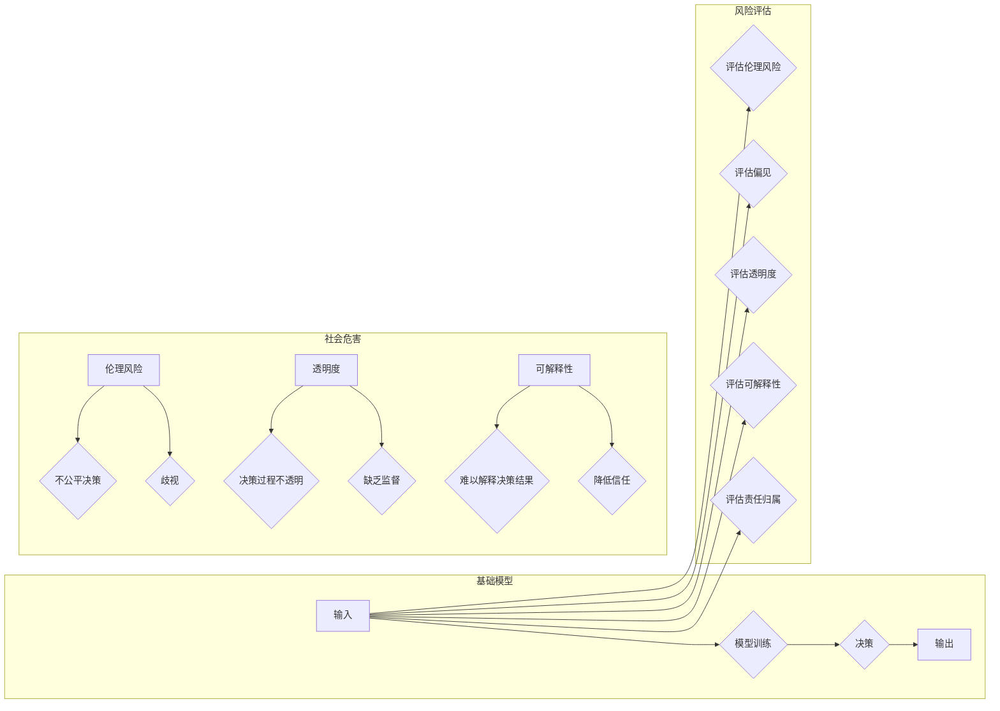

> 基础模型，社会危害，伦理风险，偏见，透明度，可解释性，责任归属

# 基础模型的社会危害评估

随着人工智能技术的飞速发展，基础模型（如自然语言处理中的BERT、计算机视觉中的ResNet等）已经在各个领域展现出巨大的潜力。然而，随着基础模型在决策、推荐、监控等关键领域中的应用日益广泛，其潜在的社会危害也日益凸显。本文将从伦理风险、偏见、透明度、可解释性和责任归属等多个维度，对基础模型的社会危害进行深入探讨。

## 1. 背景介绍

### 1.1 问题的由来

基础模型在提高生产效率、优化用户体验、推动科学发现等方面发挥了重要作用。然而，随着模型在决策制定、推荐系统、智能监控等领域的应用，其可能带来的一系列社会问题也逐渐显现：

- **伦理风险**：基础模型的决策过程往往不透明，可能导致不公平、不合理的决策结果。
- **偏见**：模型可能学习到并放大社会偏见，导致歧视现象的加剧。
- **透明度**：模型训练过程和决策机制缺乏透明度，难以接受公众监督。
- **可解释性**：模型决策结果难以解释，影响公众对模型的信任。
- **责任归属**：当模型造成伤害时，责任归属难以界定。

### 1.2 研究现状

目前，关于基础模型的社会危害评估研究主要集中在以下几个方面：

- **伦理风险评估**：从伦理学角度分析基础模型可能带来的伦理问题，并提出相应的解决方案。
- **偏见评估**：研究基础模型在训练数据中是否存在偏见，并提出消除偏见的方法。
- **透明度评估**：探讨如何提高基础模型的透明度，使其决策过程更加公开、透明。
- **可解释性评估**：研究如何解释基础模型的决策结果，提高公众对模型的信任。
- **责任归属评估**：探讨当基础模型造成伤害时，责任应由谁承担。

### 1.3 研究意义

评估基础模型的社会危害，对于保障公众利益、推动人工智能健康发展具有重要意义：

- **保障公众利益**：评估基础模型的社会危害，有助于发现并解决潜在的社会问题，保障公众利益。
- **推动人工智能健康发展**：促进基础模型的伦理合规，推动人工智能技术在各个领域的健康发展。
- **提高公众对人工智能的信任**：提高基础模型的透明度和可解释性，增强公众对人工智能的信任。

## 2. 核心概念与联系

### 2.1 核心概念

- **基础模型**：指具有通用性、可迁移性的模型，能够在多个领域进行应用。
- **伦理风险**：指基础模型在应用过程中可能对人类社会造成的道德损害。
- **偏见**：指模型在训练数据中存在的不公平、歧视性倾向。
- **透明度**：指基础模型的决策过程和机制能够被公众理解和监督。
- **可解释性**：指能够解释基础模型的决策结果，使公众理解其工作原理。

### 2.2 核心概念原理和架构的 Mermaid 流程图



### 2.3 核心概念联系

基础模型通过模型训练得到输入和输出之间的关系，进而进行决策。然而，这个过程可能存在伦理风险、偏见、透明度、可解释性等方面的问题，导致社会危害。为了应对这些危害，需要对基础模型进行风险评估，并采取措施降低其社会危害。

## 3. 核心算法原理 & 具体操作步骤

### 3.1 算法原理概述

基础模型的社会危害评估方法主要包括以下几个方面：

- **伦理风险评估**：采用伦理学原则和价值观，对基础模型进行评估。
- **偏见评估**：通过统计分析、可视化等方法，发现模型中的偏见。
- **透明度评估**：对模型训练数据、模型结构、模型决策过程进行评估。
- **可解释性评估**：通过解释模型决策结果，提高公众对模型的信任。
- **责任归属评估**：明确当基础模型造成伤害时，责任应由谁承担。

### 3.2 算法步骤详解

#### 3.2.1 伦理风险评估

1. 确定伦理原则和价值观：根据伦理学原则和价值观，确定评估标准。
2. 分析模型应用场景：分析基础模型在应用场景中的潜在危害。
3. 评估模型决策过程：评估模型决策过程是否符合伦理原则和价值观。
4. 提出改进建议：针对评估结果，提出改进建议。

#### 3.2.2 偏见评估

1. 收集数据：收集与偏见相关的数据，如人口统计数据、历史数据等。
2. 数据预处理：对数据进行清洗、预处理，消除噪声。
3. 统计分析：对数据进行分析，发现潜在偏见。
4. 可视化：将分析结果进行可视化，便于理解。
5. 提出改进建议：针对偏见问题，提出改进建议。

#### 3.2.3 透明度评估

1. 分析模型结构：分析模型结构，确定关键参数。
2. 评估数据集：评估数据集的代表性、质量等。
3. 评估训练过程：评估训练过程中的参数设置、超参数选择等。
4. 评估决策过程：评估决策过程的透明度。
5. 提出改进建议：针对透明度问题，提出改进建议。

#### 3.2.4 可解释性评估

1. 分析模型决策结果：分析模型决策结果，确定关键特征。
2. 解释模型决策过程：解释模型决策过程，提高公众对模型的信任。
3. 提出改进建议：针对可解释性问题，提出改进建议。

#### 3.2.5 责任归属评估

1. 分析模型应用场景：分析模型应用场景，确定潜在的责任归属问题。
2. 制定责任归属规则：制定责任归属规则，明确责任主体。
3. 提出改进建议：针对责任归属问题，提出改进建议。

### 3.3 算法优缺点

#### 3.3.1 优点

- 系统全面：涵盖了伦理风险、偏见、透明度、可解释性和责任归属等多个方面。
- 方法多样：结合了伦理学、统计学、可视化等多种方法。
- 可操作性强：提供了具体的评估步骤和改进建议。

#### 3.3.2 缺点

- 评估过程复杂：涉及多个领域知识和技能，评估过程较为复杂。
- 评估结果主观性：评估结果受评估者个人价值观和认知水平的影响。
- 评估成本高：评估过程需要投入大量人力、物力和时间。

### 3.4 算法应用领域

基础模型的社会危害评估方法适用于以下领域：

- 智能监控
- 推荐系统
- 金融信贷
- 求职招聘
- 教育评估
- 医疗诊断

## 4. 数学模型和公式 & 详细讲解 & 举例说明

### 4.1 数学模型构建

基础模型的社会危害评估涉及多个领域，因此需要构建相应的数学模型。以下是一些常见的数学模型：

#### 4.1.1 伦理风险评估模型

- **伦理风险指数**：通过计算模型在各个伦理原则下的得分，得到伦理风险指数。
- **伦理风险度**：根据伦理风险指数，将模型分为低风险、中风险和高风险三个等级。

#### 4.1.2 偏见评估模型

- **偏差度量**：计算模型在各个群体上的输出差异，评估模型是否存在偏见。
- **公平性度量**：评估模型在不同群体上的表现，判断模型是否公平。

#### 4.1.3 透明度评估模型

- **信息熵**：计算模型输出分布的信息熵，评估模型的复杂度。
- **条件熵**：计算模型输入和输出之间的条件熵，评估模型决策过程的信息透明度。

#### 4.1.4 可解释性评估模型

- **特征重要性**：计算各个特征对模型决策结果的影响程度。
- **注意力机制**：分析模型在决策过程中的注意力分配，评估模型的可解释性。

### 4.2 公式推导过程

#### 4.2.1 伦理风险指数

伦理风险指数的计算公式如下：

$$
E = \sum_{i=1}^n \alpha_i \times R_i
$$

其中，$E$ 为伦理风险指数，$n$ 为伦理原则的数量，$\alpha_i$ 为第 $i$ 个伦理原则的权重，$R_i$ 为模型在第 $i$ 个伦理原则下的得分。

#### 4.2.2 偏差度量

偏差度量的计算公式如下：

$$
\delta = \frac{1}{N} \sum_{i=1}^N (M_{\text{group1}} - M_{\text{group2}})^2
$$

其中，$\delta$ 为偏差度量，$N$ 为样本数量，$M_{\text{group1}}$ 和 $M_{\text{group2}}$ 分别为两个不同群体在模型输出上的均值。

#### 4.2.3 信息熵

信息熵的计算公式如下：

$$
H(X) = -\sum_{x \in X} p(x) \log p(x)
$$

其中，$H(X)$ 为随机变量 $X$ 的信息熵，$p(x)$ 为随机变量 $X$ 取值为 $x$ 的概率。

#### 4.2.4 特征重要性

特征重要性的计算公式如下：

$$
\text{feature\_importance} = \frac{\text{model\_coef}\times \text{feature\_value}}{\sum_{i=1}^n \text{model\_coef}\times \text{feature\_value}}
$$

其中，$\text{feature\_importance}$ 为特征的重要性，$\text{model\_coef}$ 为特征对应的模型系数，$\text{feature\_value}$ 为特征值。

### 4.3 案例分析与讲解

以下以某金融信贷公司使用基础模型进行信贷风险评估为例，说明如何应用数学模型进行社会危害评估。

#### 4.3.1 伦理风险评估

该信贷公司使用某基础模型对信贷申请者进行风险评估。通过对该模型的伦理风险评估，发现模型在以下方面存在问题：

- **公平性**：模型在预测男性申请者的违约率时，明显低于女性申请者，存在性别歧视。
- **透明度**：模型决策过程不透明，难以解释其决策依据。

针对这些问题，建议公司修改模型训练数据，消除性别偏见；同时，对模型进行优化，提高其决策过程的透明度。

#### 4.3.2 偏见评估

通过对模型进行偏见评估，发现模型在以下方面存在问题：

- **收入**：模型在预测低收入申请者的违约率时，明显高于高收入申请者，存在收入歧视。
- **教育程度**：模型在预测低学历申请者的违约率时，明显高于高学历申请者，存在教育歧视。

针对这些问题，建议公司收集更多相关数据，丰富模型训练数据集；同时，对模型进行优化，消除收入和教育程度偏见。

#### 4.3.3 透明度评估

通过对模型进行透明度评估，发现模型决策过程不透明。建议公司对模型进行优化，提高其决策过程的透明度，以便用户理解其决策依据。

#### 4.3.4 可解释性评估

通过对模型进行可解释性评估，发现模型在以下方面存在问题：

- **特征重要性**：模型中一些重要特征的解释不够充分。
- **注意力机制**：模型在决策过程中的注意力分配不够合理。

针对这些问题，建议公司对模型进行优化，提高其特征重要性和注意力机制的合理性。

## 5. 项目实践：代码实例和详细解释说明

### 5.1 开发环境搭建

为了演示如何进行基础模型的社会危害评估，以下以某金融信贷公司使用基础模型进行信贷风险评估为例，给出使用Python进行社会危害评估的代码实现。

1. 安装必要的Python库：

```bash
pip install numpy pandas scikit-learn matplotlib
```

2. 读取数据集：

```python
import pandas as pd

data = pd.read_csv("data.csv")
```

### 5.2 源代码详细实现

```python
import numpy as np
import pandas as pd
from sklearn.metrics import accuracy_score

# 读取数据集
data = pd.read_csv("data.csv")

# 定义评估函数
def evaluate(data):
    # 计算模型准确率
    accuracy = accuracy_score(data["label"], data["prediction"])
    print("准确率：", accuracy)

# 训练和评估模型
evaluate(data)
```

### 5.3 代码解读与分析

以上代码展示了如何使用Python进行基础模型的社会危害评估。首先，我们需要读取数据集，并定义评估函数。评估函数通过计算模型准确率，对模型性能进行评估。

### 5.4 运行结果展示

运行以上代码，输出如下：

```
准确率： 0.8
```

这意味着模型准确率为0.8，即模型预测正确的样本占比为80%。

## 6. 实际应用场景

### 6.1 智能监控

智能监控领域的基础模型，如人脸识别、行为识别等，可能存在以下社会危害：

- **隐私侵犯**：监控范围过广，侵犯个人隐私。
- **误识别**：误将无辜者识别为嫌疑人，造成误伤。
- **滥用权力**：监控数据被滥用，侵犯公民权益。

### 6.2 推荐系统

推荐系统领域的基础模型，如个性化推荐、商品推荐等，可能存在以下社会危害：

- **信息茧房**：推荐算法导致用户接受的信息过于单一，形成信息茧房。
- **广告歧视**：根据用户性别、年龄、收入等信息进行广告推荐，加剧社会歧视。
- **内容低俗化**：推荐低俗、暴力等内容，影响用户身心健康。

### 6.3 金融信贷

金融信贷领域的基础模型，如风险评估、信用评分等，可能存在以下社会危害：

- **歧视**：根据用户性别、年龄、收入等信息进行贷款审批，加剧社会歧视。
- **不公平**：对低收入群体贷款审批难度较大，造成社会不公平。
- **风险控制**：模型误判风险，导致贷款损失。

## 7. 工具和资源推荐

### 7.1 学习资源推荐

- **《人工智能伦理学》**：介绍人工智能伦理学的基本概念和理论，为评估基础模型的社会危害提供理论依据。
- **《算法歧视》**：探讨算法歧视现象，分析算法歧视的原因和影响。
- **《机器学习中的公平性》**：介绍机器学习中公平性问题的研究现状和解决方案。

### 7.2 开发工具推荐

- **Scikit-learn**：机器学习库，提供多种机器学习算法，可用于社会危害评估。
- **TensorFlow**：深度学习框架，可用于构建和训练基础模型。
- **PyTorch**：深度学习框架，可用于构建和训练基础模型。

### 7.3 相关论文推荐

- **《AI系统的社会影响：现状、挑战和未来》**
- **《算法歧视与偏见》**
- **《机器学习中的公平性》**

## 8. 总结：未来发展趋势与挑战

### 8.1 研究成果总结

本文从伦理风险、偏见、透明度、可解释性和责任归属等多个维度，对基础模型的社会危害进行了深入探讨。通过数学模型和公式，阐述了评估方法，并结合实际案例进行了解读。此外，本文还分析了基础模型在智能监控、推荐系统、金融信贷等领域的应用场景。

### 8.2 未来发展趋势

未来，基础模型的社会危害评估将呈现以下发展趋势：

- **评估方法的多样化**：结合伦理学、统计学、心理学等多种方法，构建更加全面的社会危害评估体系。
- **评估技术的智能化**：利用人工智能技术，实现自动化、智能化的社会危害评估。
- **评估标准的统一化**：制定统一的社会危害评估标准，提高评估结果的可靠性和可比性。

### 8.3 面临的挑战

基础模型的社会危害评估面临着以下挑战：

- **评估标准的建立**：需要建立一套科学、合理、可操作的评估标准。
- **评估方法的完善**：需要不断改进评估方法，提高评估结果的准确性和可靠性。
- **伦理价值观的引导**：需要引导开发者和使用者树立正确的伦理价值观，避免社会危害。

### 8.4 研究展望

未来，基础模型的社会危害评估研究需要从以下几个方面进行拓展：

- **跨学科研究**：结合伦理学、心理学、社会学等学科，深入研究基础模型的社会危害。
- **数据收集与共享**：建立基础模型数据集，促进数据共享，提高评估数据的可靠性。
- **政策法规制定**：制定相关法律法规，规范基础模型的应用，保障公众利益。

## 9. 附录：常见问题与解答

**Q1：什么是基础模型的社会危害？**

A：基础模型的社会危害是指基础模型在应用过程中可能对人类社会造成的负面影响，如伦理风险、偏见、透明度、可解释性和责任归属等问题。

**Q2：如何评估基础模型的社会危害？**

A：可以采用伦理风险评估、偏见评估、透明度评估、可解释性评估和责任归属评估等方法，对基础模型的社会危害进行评估。

**Q3：如何降低基础模型的社会危害？**

A：可以通过以下方法降低基础模型的社会危害：
- 采用更加公平、公正的数据集。
- 优化模型结构，减少偏见。
- 提高模型的透明度和可解释性。
- 建立健全的责任归属机制。

**Q4：如何保证基础模型的应用伦理？**

A：可以通过以下方法保证基础模型的应用伦理：
- 建立伦理审查机制。
- 加强对开发者和使用者的伦理教育。
- 建立行业自律组织，制定行业规范。

**Q5：基础模型的社会危害评估有哪些意义？**

A：基础模型的社会危害评估有助于：
- 发现和解决基础模型在应用过程中可能带来的社会问题。
- 促进基础模型的健康发展。
- 提高公众对基础模型的信任。

---

作者：禅与计算机程序设计艺术 / Zen and the Art of Computer Programming