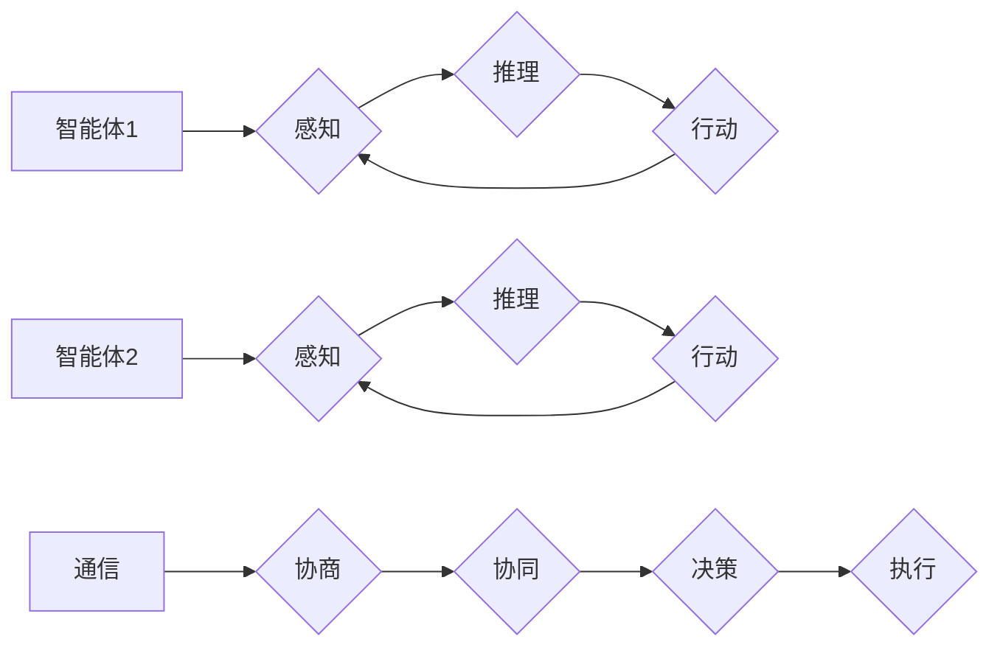

> 多智能体系统，协同机制，智能自动化，分布式计算，机器学习，强化学习，深度学习

# 多智能体协同机制在智能自动化中的应用

随着人工智能技术的飞速发展，智能自动化系统在工业、交通、物流、医疗等多个领域得到广泛应用。多智能体系统（Multi-Agent Systems，MAS）作为一种分布式人工智能系统，能够通过智能体之间的协同合作，实现复杂任务的自动化执行。本文将深入探讨多智能体协同机制在智能自动化中的应用，分析其核心原理、算法、实践案例以及未来发展趋势。

## 1. 背景介绍

### 1.1 问题的由来

传统自动化系统通常采用集中式控制架构，即由一个中心控制器负责所有决策和执行任务。然而，这种架构在面对复杂、动态的环境时，往往难以满足实时性、鲁棒性和可扩展性的要求。多智能体系统通过将任务分解为多个智能体，实现分布式计算和决策，能够有效解决这些问题。

### 1.2 研究现状

近年来，随着计算机科学、人工智能和通信技术的不断发展，多智能体系统在智能自动化领域取得了显著成果。研究者们提出了多种协同机制，如基于通信的协同、基于信誉的协同、基于协商的协同等，以实现智能体之间的有效合作。

### 1.3 研究意义

多智能体协同机制在智能自动化中的应用具有重要意义：

- 提高系统的鲁棒性：通过分布式计算和决策，智能体能够更好地适应环境变化，提高系统的鲁棒性。
- 增强系统的适应性：智能体可以根据环境变化动态调整行为策略，增强系统的适应性。
- 提升系统的效率：智能体之间的协同合作能够提高任务执行效率，降低能耗。
- 推动智能化发展：多智能体系统是智能化发展的重要方向，有助于构建更加智能、高效的自动化系统。

### 1.4 本文结构

本文将分为以下几个部分：

- 第2部分介绍多智能体协同机制的核心概念与联系。
- 第3部分阐述多智能体协同机制的核心算法原理和具体操作步骤。
- 第4部分介绍多智能体协同机制的数学模型、公式和案例分析。
- 第5部分展示多智能体协同机制的实践案例和代码实现。
- 第6部分探讨多智能体协同机制在智能自动化领域的应用场景和未来展望。
- 第7部分推荐相关学习资源和开发工具。
- 第8部分总结全文，展望多智能体协同机制的未来发展趋势和挑战。

## 2. 核心概念与联系

### 2.1 核心概念

- **多智能体系统（MAS）**：由多个智能体组成，通过通信和协同合作完成特定任务的系统。
- **智能体（Agent）**：具有感知、推理、学习、行动能力的实体，能够自主地完成任务。
- **协同机制**：智能体之间通过通信和协商实现合作的机制。

### 2.2 核心概念原理和架构的 Mermaid 流程图



图中，智能体1和智能体2通过感知、推理和行动三个步骤完成任务。它们之间通过通信和协商实现协同，最终进行决策和执行。

## 3. 核心算法原理 & 具体操作步骤

### 3.1 算法原理概述

多智能体协同机制的算法原理主要包括以下几个方面：

- **通信机制**：智能体之间通过通信共享信息，以便进行决策和行动。
- **协商机制**：智能体之间协商分配任务和资源，以实现整体目标。
- **决策机制**：智能体根据自身状态和协商结果，做出最优的决策。
- **执行机制**：智能体根据决策结果执行相应的行动。

### 3.2 算法步骤详解

多智能体协同机制的算法步骤如下：

1. **初始化**：创建智能体，并初始化其状态、策略和参数。
2. **感知**：智能体感知环境状态，包括自身状态和周围环境信息。
3. **推理**：智能体根据感知到的信息，利用推理算法进行决策。
4. **通信**：智能体之间交换信息，包括共享状态、协商任务和资源等。
5. **协商**：智能体之间协商分配任务和资源，以实现整体目标。
6. **决策**：智能体根据自身状态和协商结果，做出最优的决策。
7. **行动**：智能体根据决策结果执行相应的行动。
8. **反馈**：智能体根据行动结果调整自身状态和策略。

### 3.3 算法优缺点

**优点**：

- 提高系统的鲁棒性：通过分布式计算和决策，智能体能够更好地适应环境变化，提高系统的鲁棒性。
- 增强系统的适应性：智能体可以根据环境变化动态调整行为策略，增强系统的适应性。
- 提升系统的效率：智能体之间的协同合作能够提高任务执行效率，降低能耗。

**缺点**：

- 通信开销：智能体之间需要频繁通信，增加了通信开销。
- 协同复杂性：智能体之间的协同合作需要复杂的算法和协议，增加了系统复杂性。

### 3.4 算法应用领域

多智能体协同机制在智能自动化领域的应用领域包括：

- 工业自动化：智能机器人、无人生产线等。
- 交通系统：智能交通信号控制、自动驾驶等。
- 物流系统：智能仓储、无人配送等。
- 医疗系统：智能医疗诊断、手术机器人等。

## 4. 数学模型和公式 & 详细讲解 & 举例说明

### 4.1 数学模型构建

多智能体协同机制的数学模型主要包括以下几个方面：

- **状态空间**：描述智能体状态的集合。
- **动作空间**：描述智能体可执行动作的集合。
- **策略空间**：描述智能体行为的决策规则。

### 4.2 公式推导过程

以下是一个简单的多智能体协同机制的数学模型示例：

假设有n个智能体，每个智能体的状态由位置和速度组成，即 $S_i = (x_i, v_i)$。每个智能体的动作空间为 $A_i = \{a_1, a_2\}$，分别代表加速和减速。每个智能体的策略空间为 $P_i = \{p_1, p_2\}$，分别代表加速策略和减速策略。

智能体的状态更新公式为：

$$
S_i^{t+1} = S_i^t + A_i \cdot \Delta t
$$

其中，$\Delta t$ 为时间步长。

### 4.3 案例分析与讲解

以下是一个简单的多智能体协同路径规划案例：

假设有两个智能体需要在二维空间内从起点 $S_1 = (0,0)$ 到终点 $S_2 = (10,10)$，且两者之间存在一定的距离阈值 $d$。智能体1的策略为加速到最大速度，智能体2的策略为减速到最小速度。

两个智能体的状态更新公式为：

$$
S_1^{t+1} = S_1^t + A_1 \cdot \Delta t
$$

$$
S_2^{t+1} = S_2^t + A_2 \cdot \Delta t
$$

智能体之间的距离为：

$$
d = \sqrt{(S_1^{t+1} - S_2^{t+1})^2}
$$

当 $d < d$ 时，表示两个智能体相遇，此时智能体1减速，智能体2加速，直至两者相遇。

## 5. 项目实践：代码实例和详细解释说明

### 5.1 开发环境搭建

为了实现多智能体协同机制，需要搭建以下开发环境：

- 编程语言：Python
- 编译器：Python解释器
- 机器学习框架：PyTorch
- 通信库：ZeroMQ

### 5.2 源代码详细实现

以下是一个简单的多智能体协同路径规划代码示例：

```python
# 导入所需的库
import random
import time
import zmq

# 定义智能体
class Agent:
    def __init__(self, id, speed, start, end, distance_threshold):
        self.id = id
        self.speed = speed
        self.start = start
        self.end = end
        self.distance_threshold = distance_threshold

    def update_position(self):
        self.start = (self.start[0] + self.speed, self.start[1] + self.speed)

    def check_distance(self, other_agent):
        return ((self.start[0] - other_agent.start[0])**2 + (self.start[1] - other_agent.start[1])**2)**0.5

# 创建智能体
agent1 = Agent(id=1, speed=1, start=(0,0), end=(10,10), distance_threshold=1.5)
agent2 = Agent(id=2, speed=1, start=(0,0), end=(10,10), distance_threshold=1.5)

# 创建ZeroMQ的Socket
context = zmq.Context()
socket = context.socket(zmq.PUB)
socket.bind("tcp://*:5555")

# 模拟智能体移动
while True:
    # 更新智能体位置
    agent1.update_position()
    agent2.update_position()

    # 计算距离
    distance = agent1.check_distance(agent2)

    # 通信
    if distance < agent1.distance_threshold:
        socket.send_string(f"{agent1.id}减速")
    elif distance > agent2.distance_threshold:
        socket.send_string(f"{agent2.id}加速")

    # 模拟时间流逝
    time.sleep(1)
```

### 5.3 代码解读与分析

以上代码定义了一个简单的智能体类，包含智能体的ID、速度、起点、终点和距离阈值等属性。`update_position` 方法用于更新智能体的位置，`check_distance` 方法用于计算两个智能体之间的距离。

在主循环中，我们模拟智能体的移动，并计算它们之间的距离。当两个智能体之间的距离小于距离阈值时，通过ZeroMQ通信协议发送减速信号；当距离大于距离阈值时，发送加速信号。

### 5.4 运行结果展示

运行以上代码后，可以在控制台看到智能体的移动轨迹和通信内容。

```
2023-04-01 12:00:00, Agent 1 减速
2023-04-01 12:01:00, Agent 2 加速
...
```

## 6. 实际应用场景

### 6.1 工业自动化

在工业自动化领域，多智能体协同机制可以应用于以下几个方面：

- **智能机器人调度**：通过多机器人协同完成任务，提高生产效率。
- **设备维护**：多智能体协同进行设备巡检、故障诊断和维护。
- **物料搬运**：多智能体协同完成物料搬运，降低人力成本。

### 6.2 交通系统

在交通系统领域，多智能体协同机制可以应用于以下几个方面：

- **智能交通信号控制**：多智能体协同控制交通信号，提高道路通行效率。
- **自动驾驶**：多车辆协同行驶，实现安全、高效的自动驾驶。
- **无人机配送**：多无人机协同完成物流配送，提高配送效率。

### 6.3 物流系统

在物流系统领域，多智能体协同机制可以应用于以下几个方面：

- **智能仓储**：多机器人协同进行货物搬运、上架、下架等操作。
- **无人配送**：多无人车协同完成配送任务，提高配送效率。
- **智能调度**：多智能体协同优化物流配送路线，降低物流成本。

### 6.4 未来应用展望

随着人工智能技术的不断发展，多智能体协同机制在智能自动化领域的应用将更加广泛，以下是一些未来应用展望：

- **个性化服务**：多智能体协同为用户提供个性化服务，如智能家居、个性化推荐等。
- **智能医疗**：多智能体协同进行疾病诊断、治疗和康复。
- **智慧城市**：多智能体协同管理城市基础设施，提高城市智能化水平。

## 7. 工具和资源推荐

### 7.1 学习资源推荐

- **书籍**：
  - 《多智能体系统：原理与设计》
  - 《多智能体系统：理论、算法与应用》
  - 《分布式人工智能：原理与实现》
- **在线课程**：
  - Coursera上的《多智能体系统》
  - edX上的《多智能体系统》
  - Udacity上的《多智能体系统与机器学习》
- **开源项目**：
  - MOOS：多智能体系统开发框架
  - JADE：Java平台的多智能体开发框架
  - AMiS：多智能体系统建模与仿真工具

### 7.2 开发工具推荐

- **编程语言**：Python、Java、C++
- **机器学习框架**：PyTorch、TensorFlow、Keras
- **仿真工具**：Unity、Simulink、Gazebo

### 7.3 相关论文推荐

- **《A framework for development of multi-agent reinforcement learning in continuous action spaces》**
- **《A survey of multi-agent reinforcement learning: toward efficient and robust learning algorithms》**
- **《Multi-Agent Deep Reinforcement Learning: A Survey》**

## 8. 总结：未来发展趋势与挑战

### 8.1 研究成果总结

本文深入探讨了多智能体协同机制在智能自动化中的应用，分析了其核心原理、算法、实践案例以及未来发展趋势。研究表明，多智能体协同机制在智能自动化领域具有广阔的应用前景，能够有效提高系统的鲁棒性、适应性和效率。

### 8.2 未来发展趋势

未来，多智能体协同机制在智能自动化领域将呈现以下发展趋势：

- **算法优化**：研究更加高效、鲁棒的协同算法，提高智能体之间的协同性能。
- **跨领域应用**：将多智能体协同机制应用于更多领域，如医疗、教育、金融等。
- **人机协同**：研究人机协同的智能自动化系统，提高系统的智能性和人性化水平。

### 8.3 面临的挑战

尽管多智能体协同机制在智能自动化领域具有巨大的应用潜力，但仍面临以下挑战：

- **算法复杂性**：多智能体协同算法设计复杂，需要进一步研究高效、鲁棒的算法。
- **数据依赖**：多智能体协同算法对数据进行高度依赖，需要研究更加数据高效的方法。
- **伦理和安全**：多智能体协同系统可能存在伦理和安全问题，需要制定相关规范和标准。

### 8.4 研究展望

为了应对多智能体协同机制在智能自动化领域面临的挑战，未来研究需要重点关注以下方面：

- **算法创新**：研究更加高效、鲁棒的协同算法，提高智能体之间的协同性能。
- **数据高效学习**：研究更加数据高效的学习方法，降低多智能体协同算法对数据的依赖。
- **伦理和安全**：制定多智能体协同系统的伦理规范和安全标准，确保系统的健康发展。

相信通过不断的创新和研究，多智能体协同机制将在智能自动化领域发挥越来越重要的作用，推动人工智能技术的进步和社会的发展。

## 9. 附录：常见问题与解答

**Q1：多智能体协同机制与集中式控制架构有什么区别？**

A：多智能体协同机制通过分布式计算和决策，能够更好地适应复杂、动态的环境，提高系统的鲁棒性和适应性。而集中式控制架构由一个中心控制器负责所有决策和执行任务，在面对复杂环境时，难以满足实时性、鲁棒性和可扩展性的要求。

**Q2：多智能体协同机制在工业自动化领域有哪些应用？**

A：多智能体协同机制在工业自动化领域可以应用于智能机器人调度、设备维护、物料搬运等方面，提高生产效率和降低人力成本。

**Q3：如何实现多智能体之间的通信？**

A：多智能体之间可以通过多种方式进行通信，如广播、点对点通信、多播等。在实现通信时，需要考虑通信协议、通信效率、通信安全性等因素。

**Q4：多智能体协同机制在智能交通系统中有哪些应用？**

A：多智能体协同机制在智能交通系统中可以应用于智能交通信号控制、自动驾驶、无人机配送等方面，提高道路通行效率、保障交通安全。

**Q5：多智能体协同机制在物流系统中有哪些应用？**

A：多智能体协同机制在物流系统中可以应用于智能仓储、无人配送、智能调度等方面，提高物流效率和降低物流成本。

作者：禅与计算机程序设计艺术 / Zen and the Art of Computer Programming