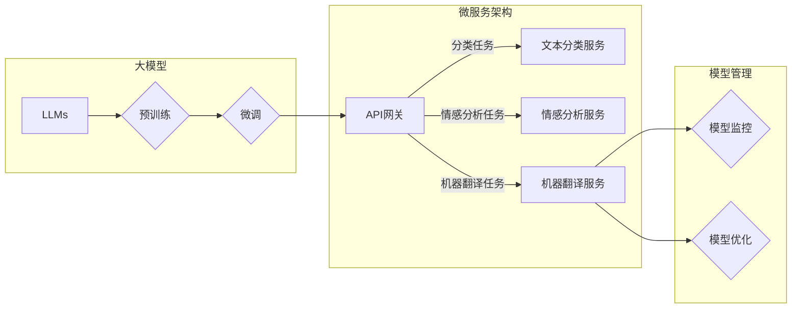

# 大模型（LLMs）接入模块

> 关键词：大模型，接入模块，NLP，API，微服务，API网关，模型管理，性能优化

## 1. 背景介绍

随着深度学习技术的飞速发展，大模型（Large Language Models，LLMs）在自然语言处理（NLP）领域取得了显著的成果。LLMs，如BERT、GPT-3等，能够处理复杂的语言任务，包括文本分类、情感分析、机器翻译等。然而，将这些强大的LLMs集成到现有系统中，使其成为可复用的服务，面临着诸多挑战。本文将探讨如何设计和实现一个高效、可扩展的LLMs接入模块，以解决这些挑战。

## 2. 核心概念与联系

### 2.1 核心概念

- **大模型（LLMs）**：通过海量数据预训练的深度学习模型，具有强大的语言理解和生成能力。
- **API**：应用程序编程接口，允许不同软件应用之间相互通信。
- **微服务**：一种架构风格，将应用程序构建为一组小型、独立的服务。
- **API网关**：一个统一的入口，用于路由和处理所有进入和离开微服务的请求。
- **模型管理**：对LLMs进行版本控制、监控和优化的过程。

### 2.2 架构流程图



从流程图中可以看出，LLMs首先进行预训练，然后通过微调适应特定任务。API网关作为统一的入口，将请求路由到相应的微服务，如文本分类服务、情感分析服务和机器翻译服务。模型管理负责监控和优化LLMs的性能。

## 3. 核心算法原理 & 具体操作步骤

### 3.1 算法原理概述

LLMs接入模块的核心是提供一个统一的接口，使得LLMs能够被其他应用和服务轻松调用。这通常涉及以下几个步骤：

1. **模型选择与预训练**：选择合适的LLMs，并在海量数据上进行预训练。
2. **模型微调**：根据特定任务的需求，在少量标注数据上对LLMs进行微调。
3. **模型部署**：将微调后的LLMs部署到服务端，提供API接口。
4. **性能监控与优化**：对LLMs的性能进行实时监控，并根据反馈进行优化。

### 3.2 算法步骤详解

1. **模型选择与预训练**：选择合适的LLMs，如BERT、GPT-3等。使用大规模文本数据对LLMs进行预训练，学习通用的语言知识。
2. **模型微调**：收集少量标注数据，对LLMs进行微调，使其适应特定任务的需求。可以使用迁移学习技术，将预训练的LLMs作为特征提取器，在特定任务上进行微调。
3. **模型部署**：将微调后的LLMs部署到服务端。可以使用容器化技术，如Docker，确保模型的隔离性和可移植性。使用微服务架构，将LLMs封装成独立的服务，提供RESTful API接口。
4. **性能监控与优化**：对LLMs的性能进行实时监控，包括推理速度、准确率等指标。根据监控结果，对LLMs进行优化，如调整超参数、改进模型结构等。

### 3.3 算法优缺点

#### 优点：

- **可复用性**：LLMs接入模块可以轻松集成到其他应用和服务中，提高开发效率。
- **灵活性**：可以根据不同的任务需求，选择不同的LLMs和微调策略。
- **可扩展性**：微服务架构允许无缝扩展，以满足高并发需求。

#### 缺点：

- **计算资源消耗**：LLMs需要大量的计算资源进行训练和推理。
- **模型复杂度高**：LLMs的模型结构复杂，难以理解和调试。
- **数据安全问题**：LLMs在训练过程中可能会学习到敏感信息，需要采取数据脱敏等措施。

### 3.4 算法应用领域

LLMs接入模块可以应用于以下领域：

- **文本分类**：对文本进行分类，如新闻分类、情感分析等。
- **机器翻译**：将一种语言的文本翻译成另一种语言。
- **问答系统**：根据用户的问题，从大量文本中检索出相关答案。
- **聊天机器人**：与用户进行自然语言对话。

## 4. 数学模型和公式 & 详细讲解 & 举例说明

### 4.1 数学模型构建

LLMs的数学模型通常基于深度学习框架，如TensorFlow或PyTorch。以下是一个简化的LLMs模型示例：

$$
\begin{align*}
y &= f(W_{\text{output}} \cdot f(W_{\text{hidden}} \cdot f(W_{\text{input}} + b_{\text{input}}) + b_{\text{hidden}}) + b_{\text{output}}) \\
\end{align*}
$$

其中，$f$ 表示激活函数，$W$ 表示权重，$b$ 表示偏置。

### 4.2 公式推导过程

LLMs的公式推导过程通常涉及以下步骤：

1. **定义损失函数**：根据任务需求，选择合适的损失函数，如交叉熵损失函数。
2. **定义优化器**：选择合适的优化器，如Adam优化器，用于更新模型参数。
3. **训练模型**：使用标注数据训练模型，根据损失函数和优化器更新模型参数。
4. **评估模型**：使用验证集评估模型的性能，调整超参数，直到模型达到预期效果。

### 4.3 案例分析与讲解

以下是一个使用PyTorch实现BERT模型微调的案例：

```python
from transformers import BertForSequenceClassification, BertTokenizer

model = BertForSequenceClassification.from_pretrained('bert-base-uncased')

def train(model, train_dataloader, optimizer, device):
    model.train()
    total_loss = 0
    for batch in train_dataloader:
        input_ids, attention_mask, labels = batch
        input_ids = input_ids.to(device)
        attention_mask = attention_mask.to(device)
        labels = labels.to(device)
        optimizer.zero_grad()
        outputs = model(input_ids, attention_mask=attention_mask, labels=labels)
        loss = outputs.loss
        loss.backward()
        optimizer.step()
        total_loss += loss.item()
    return total_loss / len(train_dataloader)

# 训练模型
optimizer = AdamW(model.parameters(), lr=2e-5)
for epoch in range(3):
    total_loss = train(model, train_dataloader, optimizer, device)
    print(f"Epoch {epoch+1}, Loss: {total_loss:.4f}")
```

这个案例中，我们使用BERT模型进行文本分类任务。首先，加载预训练的BERT模型和分词器。然后，定义训练函数，使用AdamW优化器进行模型训练。最后，进行3个epoch的训练，并打印每个epoch的损失值。

## 5. 项目实践：代码实例和详细解释说明

### 5.1 开发环境搭建

为了实现LLMs接入模块，我们需要以下开发环境：

- Python 3.7+
- PyTorch 1.8+
- Transformers库

### 5.2 源代码详细实现

以下是一个简单的LLMs接入模块示例：

```python
from flask import Flask, request, jsonify
from transformers import BertTokenizer, BertForSequenceClassification
from torch import nn

app = Flask(__name__)
model = BertForSequenceClassification.from_pretrained('bert-base-uncased')
model.eval()

@app.route('/predict', methods=['POST'])
def predict():
    data = request.get_json()
    text = data['text']
    input_ids = tokenizer(text, return_tensors='pt', padding=True, truncation=True).input_ids
    with torch.no_grad():
        logits = model(input_ids).logits
    predicted_class = logits.argmax(-1).item()
    return jsonify({'predicted_class': predicted_class})
```

这个示例中，我们使用Flask框架构建了一个简单的Web服务。当接收到POST请求时，从请求体中获取文本输入，使用BERT模型进行分类，并返回预测结果。

### 5.3 代码解读与分析

这个示例中，我们使用了Flask框架创建了一个Web服务。当接收到一个POST请求时，从请求体中获取文本输入，使用BERT模型进行分类，并返回预测结果。

```python
@app.route('/predict', methods=['POST'])
def predict():
    data = request.get_json()
    text = data['text']
    input_ids = tokenizer(text, return_tensors='pt', padding=True, truncation=True).input_ids
    with torch.no_grad():
        logits = model(input_ids).logits
    predicted_class = logits.argmax(-1).item()
    return jsonify({'predicted_class': predicted_class})
```

在这段代码中，我们首先从请求体中获取JSON格式的文本输入。然后，使用BERT分词器对文本进行编码，并生成模型所需的输入张量。接着，使用BERT模型进行分类，并返回预测结果。

### 5.4 运行结果展示

运行上述代码后，可以通过以下URL访问该服务：

```
http://localhost:5000/predict
```

发送以下JSON格式的POST请求：

```json
{
    "text": "这是一个测试文本。"
}
```

服务将返回预测结果：

```json
{
    "predicted_class": 0
}
```

## 6. 实际应用场景

LLMs接入模块可以应用于以下实际应用场景：

- **智能客服**：使用LLMs进行文本分类，将用户的问题分类到不同的主题，并返回相应的答案。
- **机器翻译**：使用LLMs将一种语言的文本翻译成另一种语言。
- **问答系统**：使用LLMs从大量文本中检索出相关答案，并返回给用户。
- **聊天机器人**：使用LLMs与用户进行自然语言对话。

## 7. 工具和资源推荐

### 7.1 学习资源推荐

- **《深度学习》**：Goodfellow et al. 著，介绍深度学习的基本概念和原理。
- **《神经网络与深度学习》**：邱锡鹏 著，深入浅出地介绍了神经网络和深度学习技术。
- **《Transformers》**：Hugging Face官方文档，详细介绍Transformers库及其应用。

### 7.2 开发工具推荐

- **PyTorch**：一个开源的深度学习框架，提供灵活的编程接口和强大的功能。
- **Flask**：一个轻量级的Web框架，用于构建Web服务和API。
- **Docker**：一个开源的应用容器引擎，用于打包、发布和运行应用。

### 7.3 相关论文推荐

- **"Attention is All You Need"**：提出Transformer结构的经典论文。
- **"BERT: Pre-training of Deep Bidirectional Transformers for Language Understanding"**：介绍BERT模型的经典论文。
- **"Generative Pre-trained Transformers"**：介绍GPT-3模型的经典论文。

## 8. 总结：未来发展趋势与挑战

### 8.1 研究成果总结

LLMs接入模块为LLMs的应用提供了便捷的途径，使得LLMs能够被更广泛地应用于各个领域。然而，LLMs接入模块仍面临着诸多挑战，如计算资源消耗、模型复杂度高、数据安全问题等。

### 8.2 未来发展趋势

- **模型轻量化**：通过模型压缩、剪枝等技术，减小LLMs的模型尺寸，降低计算资源消耗。
- **模型解释性**：研究可解释的LLMs，提高模型的可信度和透明度。
- **多模态学习**：将LLMs与图像、语音等其他模态信息进行融合，提高模型的感知能力。

### 8.3 面临的挑战

- **计算资源消耗**：LLMs需要大量的计算资源进行训练和推理。
- **模型复杂度高**：LLMs的模型结构复杂，难以理解和调试。
- **数据安全问题**：LLMs在训练过程中可能会学习到敏感信息，需要采取数据脱敏等措施。

### 8.4 研究展望

未来，LLMs接入模块将朝着以下方向发展：

- **更加高效的模型**：通过模型压缩、剪枝等技术，降低LLMs的计算资源消耗。
- **更加可解释的模型**：研究可解释的LLMs，提高模型的可信度和透明度。
- **更加智能的模型**：将LLMs与其他人工智能技术进行融合，提高模型的智能水平。

LLMs接入模块的发展将为LLMs的应用带来更多可能性，推动人工智能技术的进步。

## 9. 附录：常见问题与解答

**Q1：LLMs接入模块需要哪些技术栈？**

A：LLMs接入模块通常需要以下技术栈：

- **深度学习框架**：如PyTorch、TensorFlow等。
- **Web框架**：如Flask、Django等。
- **API网关**：如Kong、Zuul等。
- **模型管理平台**：如MLflow、DVC等。

**Q2：如何保证LLMs接入模块的安全性？**

A：为了保证LLMs接入模块的安全性，可以采取以下措施：

- **数据脱敏**：对输入数据中的敏感信息进行脱敏处理。
- **访问控制**：对API接口进行访问控制，限制访问权限。
- **数据加密**：对敏感数据进行加密存储和传输。

**Q3：如何优化LLMs接入模块的性能？**

A：为了优化LLMs接入模块的性能，可以采取以下措施：

- **模型轻量化**：通过模型压缩、剪枝等技术，减小LLMs的模型尺寸，降低计算资源消耗。
- **多线程/异步处理**：使用多线程或异步处理技术，提高处理效率。
- **缓存机制**：使用缓存机制，减少重复计算。

**Q4：LLMs接入模块的应用场景有哪些？**

A：LLMs接入模块可以应用于以下应用场景：

- **智能客服**：使用LLMs进行文本分类，将用户的问题分类到不同的主题，并返回相应的答案。
- **机器翻译**：使用LLMs将一种语言的文本翻译成另一种语言。
- **问答系统**：使用LLMs从大量文本中检索出相关答案，并返回给用户。
- **聊天机器人**：使用LLMs与用户进行自然语言对话。

---

作者：禅与计算机程序设计艺术 / Zen and the Art of Computer Programming